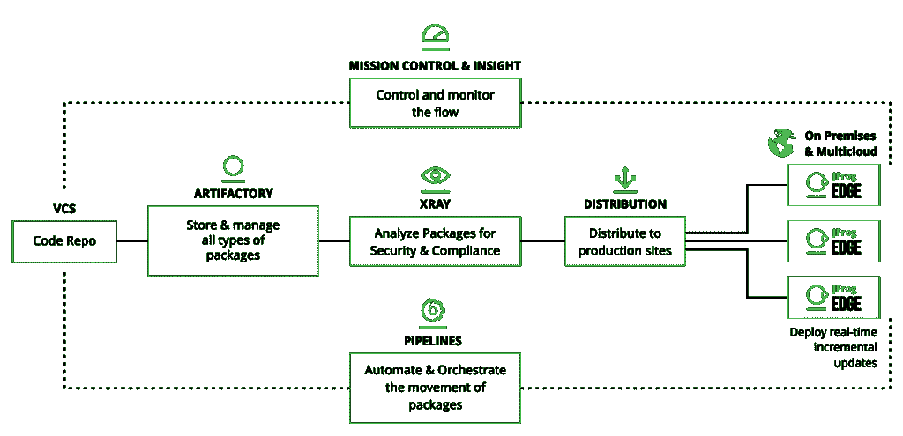

# 选择多云策略的理由

> 原文：<https://thenewstack.io/reasons-to-opt-for-a-multicloud-strategy/>

 [帕万贝拉加蒂

帕万是印度增长黑客领域的先驱，是 DevOps 的影响者和谷歌认证的数字营销人员。他写了 100 多篇关于 DevOps 的文章。他通常写 DevOps，营销和增长黑客。他是世界上一些顶级网站的客座撰稿人。](https://www.linkedin.com/in/pavan-belagatti-growthmarketer/) 

随着对 [DevOps](https://jfrog.com/devops-tools/what-is-devops/) 和快速发布软件的需求不断增加，支持这种方法的策略也有很高的需求。Docker 和 Kubernetes 等技术彻底改变了软件的构建和发布方式。今天的企业有创新的方法来简化他们的业务，减少影响他们发展的噪音和干扰。主要云提供任何组织需要的许多资源和支持。

但是伴随着 DevOps 的好处而来的是挑战，例如供应商锁定、没有定制的僵化系统等等。为了应对这种情况，组织有意寻求一种包含多云方法的策略。

让我们来了解一下多云的深层含义。

## 云进化

云计算随着时间的推移不断发展，如今组织有许多云提供商可供选择。让我们看看云是如何一步步从内部发展到多云的:

*   **内部部署**:内部部署应用，由公司拥有并完全管理。
*   **云**:由外部或第三方供应商托管的服务和产品。
*   **混合云**:混合公共云或私有云以及内部应用程序。
*   **多云**:有目的地利用多个云提供商的 IT 和架构战略。多云和混合多云通常可以互换使用。
*   **混合多云**:混合多云中使用的单词 Hybrid 表示跨多个云的本地应用程序的持续关联和使用。

多云利用两个或更多的公共云提供商来服务于组织的 IT 服务、基础设施和围绕计算能力资源、虚拟数据存储等的各种任务。多云策略提供了更大的灵活性，并减少了对一家云提供商的依赖。

根据年度 [RightScale“云状态”](https://info.flexerasoftware.com/SLO-WP-State-of-the-Cloud-2019)报告，在企业中使用多种云是一种新兴模式。调查显示，92%的企业已经实施了多云战略。它也是福布斯分享的[五大云计算趋势](https://www.forbes.com/sites/bernardmarr/2020/11/02/the-5-biggest-cloud-computing-trends-in-2021/?sh=230e867c12d9)之一。

## 多云策略

假设你是一个像网飞这样的大组织，你所有的数据都由像[亚马逊网络服务](https://aws.amazon.com/?utm_content=inline-mention)这样的云供应商处理。这就像把所有的关键钥匙都给了一个人。你知道这会产生依赖性和期望吗？巨大的。如果你从不同的云提供商那里精心挑选最好的服务会怎么样？这看起来是一个可行的解决方案，这就是多云策略的工作方式。

多云战略支持并升级公司的 IT 系统、性能、[开发运维部署](https://thenewstack.io/deployment-strategies/)、云成本优化等。多云方法为企业提供了许多选择。例如，某些服务在规模上由一个提供商提供比由其他提供商提供更具成本效益。Multicloud 不仅仅依赖于一家云提供商，而是帮助公司从不同的提供商那里为应用程序工作负载选择最佳的云服务，从而避免了供应商锁定。多云模式提供了系统冗余，减少了停机风险。多云战略将通过选择最佳的 DevSecOps 解决方案来帮助公司提高安全性。实施多云战略的组织可以提高安全性、灾难恢复能力和正常运行时间。

## 混合云和多云

混合云方法将工作负载分布在云和内部，但多云方法包括在多个云提供商上运行工作负载。

图像鸣谢:vmware

通过考虑非云资源所在的位置，很容易区分多云和混合云架构。通常，混合云使用现有的内部资源，如存储、安全、监控和数据库，而多云使用来自同一家或另一家提供商的驻留在云中的资源。

## 何时选择多云策略？

当正常运行时间对您的业务至关重要，而您甚至无法承受最轻微的停机时间时，选择多云就成了必须。通过在多个云提供商之间共享数据，公司可以开发高可用性，因为当一个系统停机时，类似的冗余系统会变得活跃。它还有助于在不改变服务质量的情况下保持应用程序的弹性。

一个这样的例子是 [MongoDB Atlas](https://www.mongodb.com/cloud/atlas/?utm_content=inline-mention) ，它已经扩展到近 80 个地区，允许用户从主要云提供商——AWS、Azure 和谷歌云——的任何位置进行选择。当你的领导层具有长远眼光，并认为今天投资多云肯定有助于明天收获收益时，多云就变得非常重要。

当企业希望拥有灵活性并创造相对于竞争对手的竞争优势时，以及当关键业务数据变得重要时，多云成为一个不错的选择，因为多云方法将具有更好的备份和恢复功能。企业希望避免供应商锁定和对单一云提供商的依赖，而多云成为了一个很好的选择。

多云是企业[云开发](https://jfrog.com/infographic/accelerate-devops-in-the-cloud/)转型需要考虑的关键因素之一。虽然一些公司可能认为只有一个云提供商就足够了，但选择一个能够满足所有主要云服务的供应商始终是一个更好的选择。选择多云策略可以轻松避免供应商锁定。

图片由 JFrog 提供。

[JFrog](https://jfrog.com/?utm_content=inline-mention) ，因其二进制库管理器 Artifactory 而闻名的公司最近推出了[多云 DevOps 平台](https://jfrog.com/press/jfrog-launches-worlds-first-hybrid-end-to-end-universal-devops-platform/)，以帮助企业选择最佳的解决方案，包括二进制库、CI/CD、DevSecOps、软件分发等。

JFrog 的大多数企业客户在涉及单一提供商时都有一个明显的策略:他们不会冒险只在一个源上托管 DevOps 和 it 工作负载。

多云的概念是提供增强的能力、自由度、更低的 IT 成本以及移动和访问数据的灵活性。此外，这有助于企业利用优势，并根据要求在公共云提供商之间转换。当然，像任何其他方法一样，这也有一些缺点，但多云的优点肯定会超过缺点。

在选择多云方法之前，您应该首先深入了解技术堆栈以及最适合您的技术，并了解现代云原生最佳实践。虽然现在多云已经成为一种有意为之的事情，但它不仅仅是在多个地方托管。在考虑成本、风险和收益时，您还应该考虑开发的所有阶段以及支持您的旅程的供应商。

<svg xmlns:xlink="http://www.w3.org/1999/xlink" viewBox="0 0 68 31" version="1.1"><title>Group</title> <desc>Created with Sketch.</desc></svg>