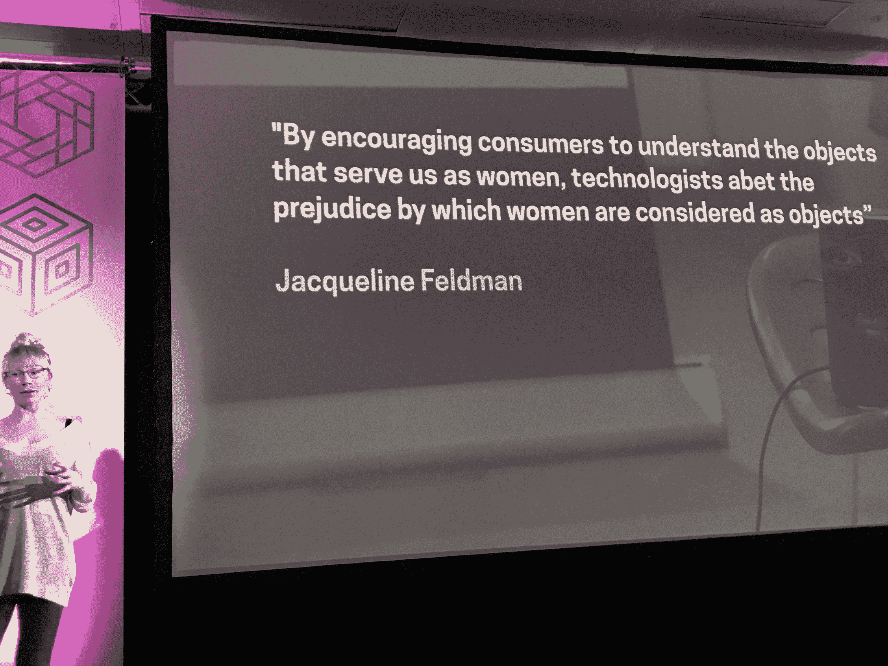

# 向女权主义者 Alexa 重建 AI

> 原文：<https://thenewstack.io/rebuilding-ai-toward-a-feminist-alexa/>

雷根赞助了这个播客。

[重建艾走向女权主义](https://thenewstack.simplecast.com/episodes/rebuilding-ai-toward-a-feminist-alexa)

为什么每次我对着自助结账台大喊大叫或者对着基于任务的人工智能翻白眼的时候，总是默认有个女声让我心烦？这是我内心对女性同胞的偏见吗？或者只是我对科技的开端感到沮丧，但所有那些人工智能初学者似乎都是“女性化的”这些是我在聆听[夏洛特·韦伯](https://twitter.com/otheragent)博士在[伦敦技术会议](https://skillsmatter.com/conferences/11735-beyondtech-2019#program)上的演讲“设计一个女权主义者 Alexa:一个女权主义者对话设计的实验”时闪过我脑海的想法。这也是我们在她的演讲之后，在这一集《新堆栈制作人》中所探讨的内容。

韦伯是女性主义互联网的联合创始人，这是一个非营利性组织，旨在通过创造性和批判性的实践来促进女性和其他边缘群体的互联网平等。女权主义互联网将艺术和设计实践、批判性思维、创造性技术开发与试点项目以及即将到来的人工智能咨询融合在一起。

那么，当你添加女权主义决策来创建人工智能和聊天机器人时，会发生什么？

虽然这个演讲的标题是“女权主义者 Alexa”，但它代表了我们每天互动或试图互动的以女性为主的第一代人工智能个人助理——Alexa、Cortana、Siri、Viv、Mitsuku，你知道的，聊天机器人辣妹。(所以告诉我你想要什么，你真正真正想要什么……)官方的理由是，它们都是默认的女性，通常人们会觉得与舒缓的女声交谈更舒服。根深蒂固的性别歧视原因是，我们目前对人工智能的使用非常行政化和家庭化——设置定时器和闹钟，制作清单，搜索和购物——这在历史上被归为女性物种。

另外，这可能是谁在制造人工智能技术的结果。根据[AI Now Institute 2019 年关于人工智能中性别、种族和权力的研究](https://ainowinstitute.org/discriminatingsystems.pdf)，人工智能会议上只有 18%的作者是女性，超过 80%的人工智能教授是男性。女性仅占脸书人工智能的 15%，谷歌人工智能的 10%。脸书和微软的员工中只有 4%是黑人，而谷歌只有 2%。

缺乏多样性会导致偏见。

如果我们要继续依赖聊天机器人和人工智能并与之互动，随着它们的使用迅速转移到销售代表、客户支持以及技术和业务流程，我们必须了解它们的任何偏见——或者我们对它们的回应——并努力克服它。

为了克服人工智能设计中的这种偏见，Webb 的团队和一群多元化的大学工程和设计学生决定在很大程度上遵循 [Josie Swords](https://twitter.com/swordstoyoung) 的流程来设计女权主义聊天机器人，该流程基于并借鉴了 Judy Wajcman 2004 年的技术女权主义框架。它专注于专注和自省的五个领域:

*   我们聊天机器人的目的是什么？我们的聊天机器人处于什么样的生态系统中？技术从来都不是孤立的，它周围有什么相互作用？
*   我们是如何处理和消除数据偏见的？
*   我们作为个人和团队的偏见是如何嵌入到我们的设计中的？
*   什么样的边缘化用户可以从中受益，而不是试图为每个人设计一个聊天机器人？
*   我们打算如何向用户描述我们的聊天机器人？

就这样，在三天的时间里，八个女权主义聊天机器人的原型诞生了。观看下面的视频以了解项目的背景，并聆听这一集的新堆栈制作人，以了解女权主义人工智能背后的精神以及如何将其应用到您作为开发人员或架构师的工作中。然后，[看看 F'xa，](https://f-xa.co/)这个聊天机器人实际上正在帮助人们了解人工智能偏见。

[https://www.youtube.com/embed/t9HA1ZOBrZk?feature=oembed](https://www.youtube.com/embed/t9HA1ZOBrZk?feature=oembed)

视频

### 在这个版本中:

[1:27:](https://thenewstack.simplecast.com/episodes/rebuilding-ai-toward-a-feminist-alexa?t=1:27) 什么是女权主义互联网，为什么现在需要它？
[2:16:](https://thenewstack.simplecast.com/episodes/rebuilding-ai-toward-a-feminist-alexa?t=2:16) 是什么让你想专门关注人工智能？
[9:52:](https://thenewstack.simplecast.com/episodes/rebuilding-ai-toward-a-feminist-alexa?t=9:52) 多元化程度较低的公司如何改善这种局面？
[16:57:](https://thenewstack.simplecast.com/episodes/rebuilding-ai-toward-a-feminist-alexa?t=16:57) 这些都是开源的吗？人们可以在这些项目上进行建设吗？

[24:14:](https://thenewstack.simplecast.com/episodes/rebuilding-ai-toward-a-feminist-alexa?t=24:14) 商家如何评价他们的聊天机器人技术，看它是女权主义的还是有偏见的，某处有指南吗？你如何测试它？

来自 Pixabay 的 Ales Krivec 的特写图片。

<svg xmlns:xlink="http://www.w3.org/1999/xlink" viewBox="0 0 68 31" version="1.1"><title>Group</title> <desc>Created with Sketch.</desc></svg>