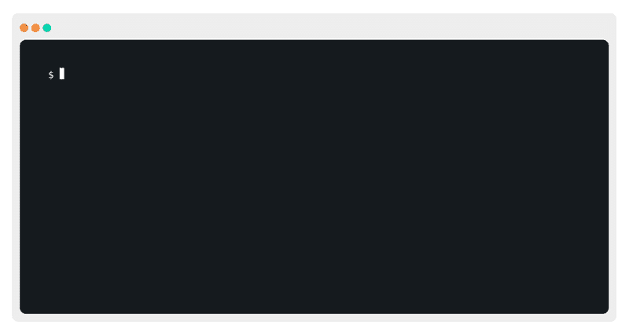
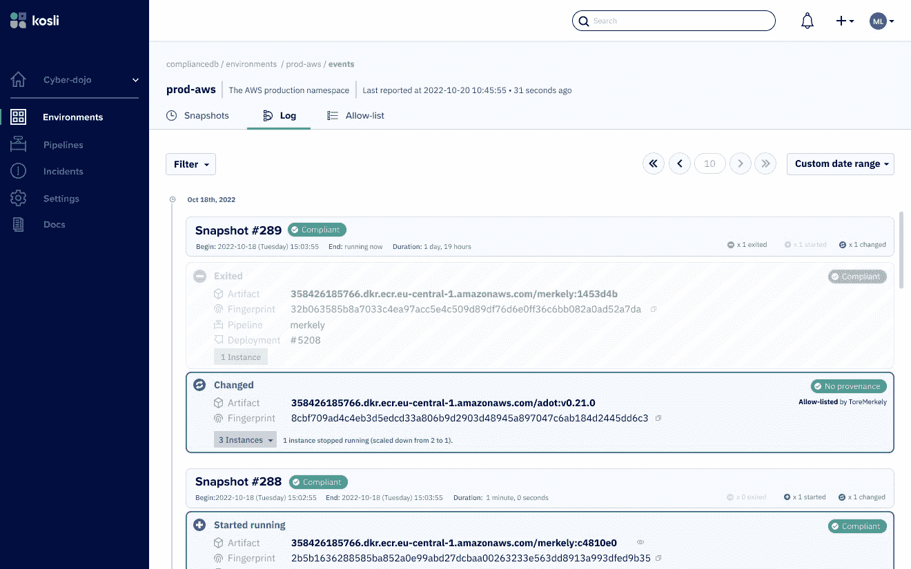
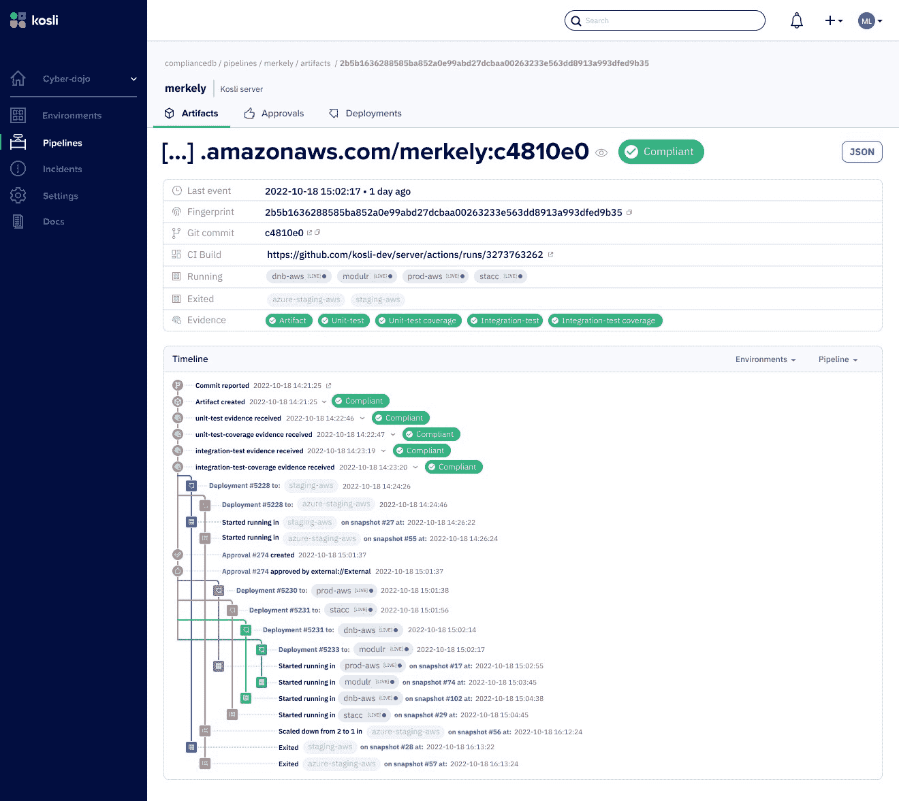
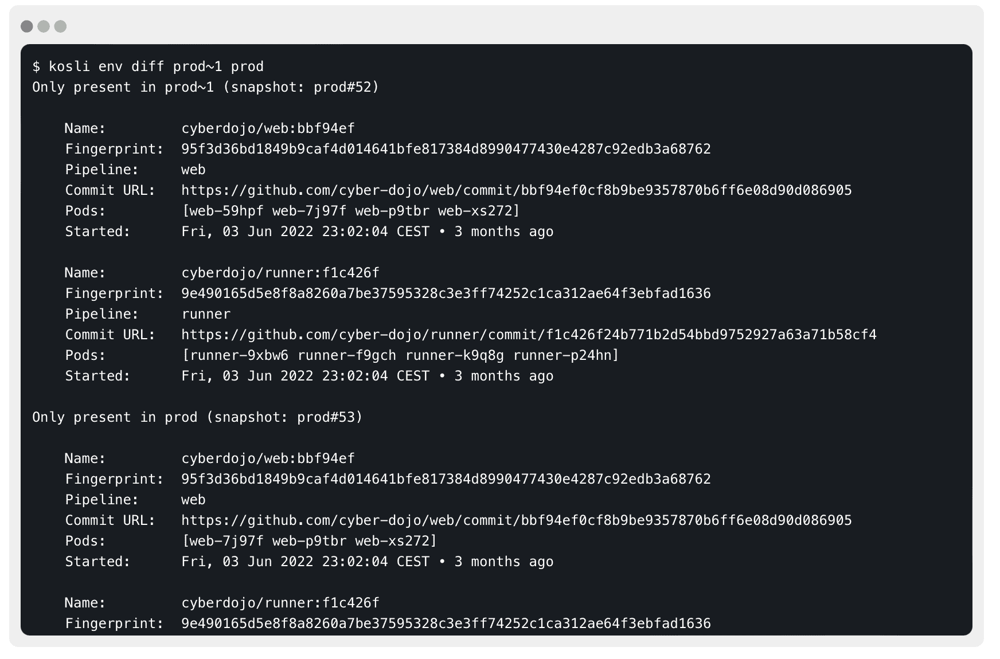
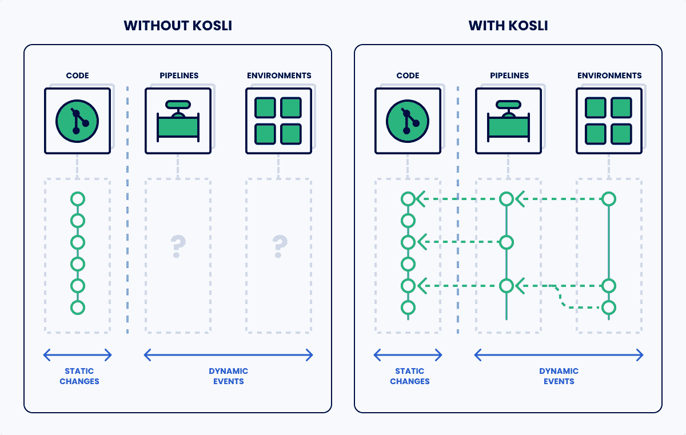

# 使用 Kosli 记录、连接和搜索 DevOps 变更

> 原文：<https://thenewstack.io/record-connect-and-search-devops-changes-with-kosli/>

试着想象一下在你的机器上，没有软件变更历史记录的一天会是什么样子。

你不会知道谁改变了你的软件或者他们为什么要改变它。比较任何两个版本的软件都是一件非常痛苦的事情。你也不会有一个简单的方法来分享变化。你如何跟踪变化？或者找到什么吗？

听起来像个噩梦，对吧？但是如果我告诉你这就是我们正在用 DevOps 做的事情呢？例如，我们并不总是知道过去在给定的环境中运行了什么，或者特定的服务是如何改变的，或者在部署中引入了什么提交。就好像我们回到了一个没有版本控制的世界。

这就是为什么我们创造了 [Kosli](https://www.kosli.com/) ，一个记录、连接和搜索你所有 DevOps 的工具。它像一个版本控制系统一样工作，但有很大的不同，这将使您在管道和基础设施的动态世界中有效。

## DevOps 信息是短暂的、孤立的并且难以找到

不可否认，DevOps 改变了世界。我们正在交付越来越多的变革，取得了前所未有的巨大成功。

我们发现，从开发人员到首席技术官，这是每个人都面临的问题。随着团队进行得越来越快，团队正在丢失他们的系统实际上是如何变化的真实记录。开发者不知道自己的代码在哪里。现场可靠性工程师(sre)必须挖掘 repos，以找出引发火灾警报的原因。

这给我们与之交谈的团队带来了很多挫折和猜测，如果你在一个快节奏的分布式架构中工作，我猜你可能有类似的经历。

当您考虑到 70%的生产事故都是由变更引起时，了解变更的原因非常重要。这是 DevOps 文化的粘合剂。我们与 DevOps 组织中的许多人交谈过，并确定了许多学科中阻碍日常工作的常见问题:

*   **开发者:**我的代码在哪里？每个环境中运行了哪些提交？我的依赖服务有什么变化？上次部署中添加了哪些提交？
*   站点可靠性工程师:警报正在发出，但是实际上发生了什么变化？如何将监控图中的竖条连接到一个组？
*   **安全团队:**我面临的威胁是什么？有哪些控制措施？我该找谁来修复这个基础映像？这个漏洞是什么时候在生产中出现的？我的供应链有多安全？
*   **审计和合规:**我们是否遵循了我们的流程？审计有多徒劳？

当我们谈论 DevOps 文化时，在这些利益相关者和学科之间建立桥梁是我们必须解决的核心长期冲突。

## 代码只是故事的一半

直到现在，这些问题的答案都是把一切都变成代码。“把所有的事情自动化！”一直是我们的战斗口号。如果我们对我们的需求和欲望进行编码，我们就有了一个自动实现这些需求的平台。我们还可以使用熟悉的编码过程，如拉请求，来共享反馈和批准变更。

一切如代码当然有助于我们自动化过程，但是在代码的静态世界和这些事情的动态执行之间有很大的差距。代码是流程的静态定义。但是这段代码在某个时间的某个地方运行是基于某个触发器的。例如:

我们把一切都定义为名词(事物)，没有为记录动词(动作)留出空间。如果我们的 DevOps 中没有动态流程的记录，我们将会丢失关于正在发生的事情的关键信息:

*   我们并不总是知道这些过程何时运行。
*   我们并不总是有他们结果的记录(我们不知道他们什么时候失败)。
*   我们并不总是有他们产品的记录(二进制工件，测试结果，系统变更)。
*   流程步骤彼此之间(以及代码之间)没有联系。
*   现代动态运行时的变化与代码变化无关。
*   人们仍然会悄悄进行手动更改——即使是“仅仅是测试”

因此，如果没有与定义(名词)相关的变化(动词)的记录，您就陷入了一个信息不完整的混乱世界，每次出现环境破坏或配置漂移时都在追逐幽灵。

DevOps 的一个棘手的方面是如何引入利益相关者。当糟糕的事情变得更糟时，不是每个人都想通过 CI 日志、操作仪表板和 git 日志来找出系统如何变化。跨领域的合作和沟通减轻了这种辛劳，结果是更快乐的开发人员和更好的软件。

## 记录环境

开发人员告诉我们，他们已经受够了探索 git 提交、管道日志和云控制台，试图对正在发生的事情进行逆向工程。他们想要一种简单的方法来记录连通图中的变化，可以在任何地方进行搜索。这就是我们在 Kosli 要解决的问题。

Kosli 存储了一份可证明的记录，记录了您的运营环境如何变化，无论是 Kubernetes 名称空间、 [Amazon Web Services](https://aws.amazon.com/?utm_content=inline-mention) ECS 集群、S3 存储桶、Lambda 函数、T2 Docker 主机还是普通的旧服务器目录，Kosli 都会对运行的组件进行指纹识别，并在检测到变化时在数据库中进行新的提交。

当你准备好记录环境的实际变化时，Kosli 非常简单。例如，要开始记录对 Kubernetes 环境的更改，您可以简单地在您的集群中安装我们的客户端:

```
# helm install kosli-reporter . -f values.yaml

```

现在，您已经自动记录了名称空间实际上是如何变化的。不需要 [GitOps](https://thenewstack.io/gitops-git-push-all-the-things/) ，配置回购，胶水脚本或其他工具。您还可以从您的持续集成(CI)系统、lambda 函数或您自己的 cron 作业中运行 reporter。

最好的事？您可以直接从命令行访问生产中的内容及其完整历史:



或者在网上浏览和浏览您的变化:



## 连接您的管道

跟踪环境变化为您提供了可以与所有利益相关者共享的操作记录。现在，每个人都知道在任何时间点、任何环境中都在运行什么。

下一步是将运营中发生的事情与开发世界的变化联系起来。Kosli 记录您的构建并收集供应链证据，如 [SBOMs](https://thenewstack.io/sboms-are-great-for-supply-chain-security-but-buyers-beware/) 、提交、测试结果、安全扫描和任何其他数据。这允许您自动记录您的软件供应链，也增加了控制供应链完整性的自动化。因此，无论您有特定的合规性或审计要求，或者您只是想增加额外的安全性，Kosli 都能准确了解任何环境中运行的内容。

这里的起点是报告工件的创建。使用这一个命令，您可以证明构建工件的形状、它的源 git 提交(和历史)以及任何 CI 构建信息。

```
#  kosli pipeline artifact report creation $IMAGE_NAME

```

现在是真正精彩的部分。将运行中的工件与代码变更连接起来后，您可以看到上一个版本中的提交、两个环境中服务的 git 差异以及更多——只需简单的命令！

我们还可以从管道事件中添加我们想要的任何其他证据或证明，无论您是否希望跟踪拉取请求、代码覆盖率、部署或安全步骤，您都可以自动轻松地存储结果。这一切都进入了一个时间线，将孤立的、不可搜索的 DevOps 工具连接起来。它甚至向您展示了何时发现一个特定的工件在环境中运行或从环境中退出。



## 搜索

最后一步是使用这个连接的记录。Kosli 提供了强大的工具来区分、记录和浏览变更，从提交到生产(反之亦然)。这可以通过浏览器、命令行和 API 来完成。

```
brew install kosli-dev/tap/kosli

```



通过两个简单的命令，我们记录了我们的环境变化，并连接了从提交到生产的一切。我们已经将所有这些丰富的信息提供给每一个利益相关者。



## Kosli 全新的免费层

我们看到如此多的团队和开发人员在他们的开发工作中努力保持领先。随着软件变得越来越分散和自治，知道什么改变了，什么时候改变了，以及为什么改变变得越来越困难。

为了实现这一使命，我们很高兴地宣布 Kosli 已经完成了由 [Heavybit Industries](https://heavybit.com/) 领导的 310 万美元的种子投资轮，这是一家风险投资公司，投资于 stripe、[page duty](https://www.pagerduty.com/?utm_content=inline-mention)、[launch ryly](https://launchdarkly.com/?utm_content=inline-mention)、Netlify 和 [Snyk](https://snyk.io/?utm_content=inline-mention) 等类别定义公司。

我们相信，像 Kosli 这样的记录、连接和搜索系统将成为每个人的重要基础。这就是我们推出免费等级的原因，以使团队能够在这个快速变化的世界中取得成功。[试试看！](http://www.kosli.com)

<svg xmlns:xlink="http://www.w3.org/1999/xlink" viewBox="0 0 68 31" version="1.1"><title>Group</title> <desc>Created with Sketch.</desc></svg>