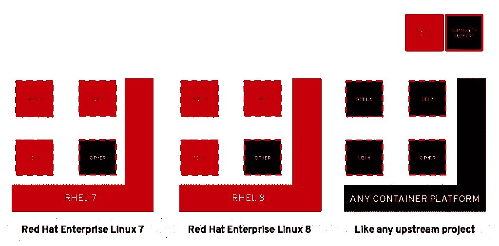
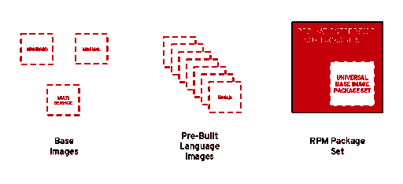

# Red Hat Enterprise Linux 更新了应用程序流、通用基本映像

> 原文：<https://thenewstack.io/red-hat-enterprise-linux-updated-with-application-streams-universal-base-image/>

本周在波士顿举行的[红帽峰会](https://www.redhat.com/en/summit/2019)上，红帽正在推动一致性的理念，不仅是在混合和多云环境中，也是为使用其[红帽企业 Linux (RHEL)](https://www.redhat.com/en/technologies/linux-platforms/enterprise-linux) 系统的开发者。随着今天 RHEL 8 的首次亮相，红帽为开发者推出了几个新功能，它表示，这些功能将提供一个更现代的环境，而不会损害它所说的 RHEL 闻名的稳定性和安全性。

RHEL 8 引入了应用流，对[红帽容器工具包](https://developers.redhat.com/products/cdk/overview/)的完全支持，并且与红帽通用基础映像的普遍可用性相一致。

在与新堆栈的采访中，Red Hat 产品管理总监 Gunnar Hellekson 解释说，应用流为开发人员提供了 Red Hat 一贯提供的稳定性承诺，但与他们使用的语言和框架的速度更接近。

“RHEL 以承诺 10 年的稳定性而闻名，除非你是一名应用程序开发人员，否则这很好，因为如果可以的话，没有人想要 10 年前的 Node.js 版本，也没有人想要两年前的 Ruby 版本，”Hellekson 说。“[应用程序流]是对人们使用操作系统订阅来获得支持和软件的默认。人们要求我们发布 Nginx 之类的东西，不是因为 Nginx 是核心操作系统功能，而是因为在过去的 15 年里，人们已经习惯于使用 RHEL 作为可信软件的来源。”

Hellekson 继续解释说，容器的 Red Hat Universal Base 映像的优点是，开发人员可以在任何他们想要的地方使用容器进行开发，并且这些容器仍然受他们的 RHEL 协议的支持。

“过去，应用程序停止的地方和操作系统启动的地方之间是一条清晰的界线，但是容器把水搅浑了。现在，每个容器都包含一点操作系统，这使得软件分发变得更加复杂。如果你希望有人支持你的容器中的操作系统，你会处于一种尴尬的境地，特别是如果你在上游开发，你必须在一些免费的操作系统上构建你的容器，”Hellekson 说。“然后，如果您想部署它并让它得到完全支持，您必须将其重新建立在商业产品的基础上。”

这就是为什么红帽创造了通用基础形象。“这在生态系统中创造了良好的一致性，”Hellekson 说。你的容器中的 RHEL 操作系统的各个部分得到了 Red Hat 的完全支持。使用 Fedora 的开发人员可以一次构建一个应用程序，无需做任何更改，将它从 Fedora world 转移到 RHEL，并能够在商业环境中运行该应用程序。

根据 Red Hat 容器子系统团队的技术产品经理 Scott McCarty 的博客文章，通用基础映像允许开发者“在任何地方利用官方 Red Hat 容器映像的可靠性、安全性和性能——无论你是否是客户”,并且“在 UBI 上构建一个容器化的应用程序，将其推送到你选择的注册服务器，并与世界共享”

McCarty 写道，Red Hat UBI“还不到一个完整的操作系统”，但包含一组三个基本映像(UBI、ubi-minimal、ubi-init)，一组语言运行时映像(nodejs、ruby、python、php、perl 等)。)，以及 YUM 存储库中的一组相关包，它们满足常见的应用程序依赖关系。

McCarty 还写道，“UBI 中的所有包都来自 RHEL 渠道，当运行在像 OpenShift 和 RHEL 这样的红帽支持的平台上时，就像 RHEL 一样得到支持。”此外，UBI 提供了包含许多语言运行时的预构建映像，RHEL 7 UBI 来自 Red Hat 软件集合，而 RHEL 8 UBI 来自新引入的应用程序流。两者都可以在 RHEL 7 或 RHEL 8 上运行，并且每年更新四次。

红帽将在本周举行的公司年度用户大会[红帽峰会](https://www.redhat.com/en/summit/2019?sc_cid=701f2000001D8QoAAK&gclid=EAIaIQobChMIkr3izbaH4gIVGJSzCh25rwojEAAYASAAEgKdPfD_BwE&gclsrc=aw.ds)上讨论这些 RHEL 8 的更新。

红帽是新堆栈的赞助商。

来自 Pixabay 的 LEEROY 机构的专题图片。

<svg xmlns:xlink="http://www.w3.org/1999/xlink" viewBox="0 0 68 31" version="1.1"><title>Group</title> <desc>Created with Sketch.</desc></svg>