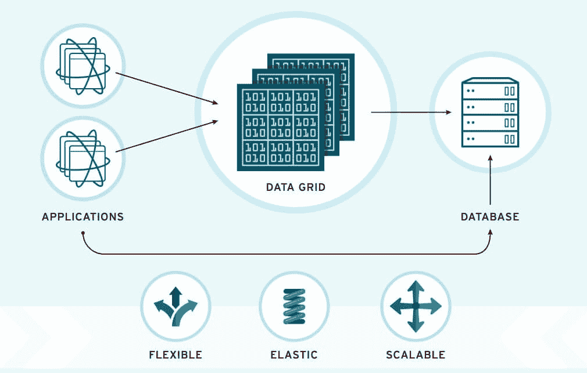

# Red Hat JBoss 数据网格不再仅仅用于缓存 Java 对象

> 原文：<https://thenewstack.io/red-hat-jboss-data-grid-not-just-storing-java-objects-anymore/>

突然之间，如果你是潜伏在数据中心周围的软件基础设施的一个组件，你想要成为一个持久的数据存储。一个容器或虚拟机可以像它希望的那样是无状态和短暂的，就像总统竞选承诺一样；同时，你是每个人都可以依赖的有状态部分。没有插件，没有隧道，没有虚拟化所需的网络功能。一直以来真的这么容易吗？

所以毫不奇怪，Red Hat 扩展了它的 [Red Hat JBoss 数据网格](https://www.redhat.com/en/technologies/jboss-middleware/data-grid)，允许一次性 Java 缓存软件作为通用分布式缓存、NoSQL 数据库或事件代理。

早在 2004 年，JBoss 开发人员社区开发了 JBoss Cache——一种在集群中的各种服务器上运行的 Java 程序在复制的缓存中共享状态的方法。该项目最终产生了一种叫做 Infinispan 的东西，这是一种缓存，其 API 使其能够被用作联网的、高度可用的键/值存储。

## 卵

2011 年，红帽开始生产 Infinispan 的商业版本，被称为 JBoss 企业数据网格。此时，它是一个高度可伸缩的数据层，具有高弹性和事务性数据访问。它被吹捧为 Infinispan 的“官方”版本。当时它的主要贡献者之一， [Manik Surtani](https://github.com/maniksurtani) ，[将这两个产品背后的概念描述为对金融服务有吸引力，特别是作为一种设计风险引擎的方法，而不会引入典型数据库会引入的延迟水平。](https://www.youtube.com/watch?v=r0oxBjwRp24)

Surtani 当时说，虽然 JBoss Cache 的最初目的是为数据库提供一个方便的、后来可扩展的内存存储，但结果是客户在没有数据库的情况下使用它，作为一个数据网格——而且根本没有提到 Java。这不是 JBoss Cache 的本意，他指出，与 JBoss 相关的人让他们的用户知道他们使用它是错误的。

“但这就是问题所在，”他继续说道，“我们需要一个数据网格，人们显然想要它，他们正在使用他们拥有的任何东西，尽管他们拥有的任何东西都是不合适的。”

不管 2011 年是否合适，JBoss Data Grid 6 现在是这个项目的高潮，这个项目最初只是一个小小的数据库缓存。Red Hat 现在完全接受产品的内存方面，将其作为自己的人生目标。

“无论您是使用磁盘作为数据管理存储层，还是想要使用 RAM……因为您的应用程序是在 RAM 中加载的，猜猜会发生什么？Red Hat 的中间件解决方案营销总监 Syed Rasheed 在与新堆栈的一次讨论中说:“你的应用程序将要处理的数据也应该在 RAM 中。

“数据网格基本上为您提供了一种在内存中管理应用程序数据的方法。传统上，分布式缓存是一种非常流行的用例。然而，人们很好地使用了不符合关系模型的大数据。他们开发了 NoSQL 数据库。但是，数据网格也是一个 NoSQL 数据库，它允许您存储任何类型的数据，而不受首先应用模式或与数据一致性的限制。”

## 文化

几十年来，系统设计人员就已经知道，与从磁盘读取数据相比，内存中的高速缓存可以带来几个数量级的性能提升。但是对于大型(以及后来的大型)表格或管制数据集，RAM 曾经是一种珍贵的商品，因此任何时候都只能将一小部分加载到内存中。检索满足一组标准的多条记录通常需要在内存中生成一个数据集，然后获取几十或一百条记录，并依次遍历每一条记录。这就是 Java 和 Visual Basic 应用程序在 20 世纪 90 年代和 21 世纪初与数据库合作的方式。如果您的客户机/服务器应用程序的版权日期在这个范围内，那么它今天可能仍然是这样工作的。

当虚拟化第一次使内存数据库变得可行时，很少有人愿意接受这样的消息:巨大的内存缓存和第一批数据网格将性能提高了五六个数量级，超过了面向 JDBC 或 ODBC 的同类产品。

但是内存概念对面向缓存的数据检索模型的持续可行性提出了质疑。当应用程序绑定到关系数据库时，内存中的好处对每个应用程序的制作和工作方式提出了质疑。显然，在这个问题被供应商和软件生产商解决之前，用户已经做出了明确的决定:从技术上来说，数据网格是可行的。

“一旦数据发生变化，人们希望立即采取行动，”红帽公司的拉希德解释道。“我们的一个客户正在使用 Data Grid，因为他们希望监控其目录价格的实时变化，并且他们希望将该事件与在过去五分钟内查看过该商品的人相关联，以便他们可以实时提醒他们。啊，五分钟前你在上一个时段刚刚看的那个项目有价格下降。你想买吗？这就是那种事件代理。"

请记住，我们在本文开始时讨论了数据的临时存储单元，它是从关系数据库或数据仓库到显示小工具(如屏幕输入表单)的途中。现在它是一个*事件代理*，或者至少是一个可以实时进行复杂数据评估的平台。不仅仅是 Java，任何语言都可以使用 API。

有了数据网格，“你可以使用几乎任何语言的客户端——我们支持 Java、C#、C++、Python、Ruby on Rails，”Rasheed 说。他补充说，有一些 API 风格受到支持，其中一种显然是 REST，但另一种是 **memcache** API，这是一种使用更像方法的语法来处理数据存储的方法，这种语法是从面向对象处理的全盛时期收集来的。

## 传播

正是在这里，建筑又向前迈进了一步。它已经成为了一个事件代理，这意味着它被赋予了[曾经赋予整个数据仓库](http://www.ibm.com/support/knowledgecenter/SSSPFK_6.1.1.4/com.ibm.tivoli.itbsm.doc/installguide/bsmi_agent_ref_attributes_eventbroker.html)的角色。但从这里开始，它就成为了新的应用程序类别的持久数据存储平台。

Red Hat 中间件产品管理高级主管 Rich Sharples 表示:“传统关系数据库的一个问题是，单记录数据存储是微服务架构的终极整体。“这就是我们所说的反模式。您可以将服务分解成更小的原子片段。但是，如果它们都与同一个数据库进行对话，并且该数据库有一个很大的模式，那么您就破坏了一切。你还不如回到整体架构。”

现在，Red Hat 要求开发人员考虑 Data Grid——上个月发布了第 7 版——作为持久数据存储的候选。作为一个基于容器的商店，它可以在无状态服务的同时提供一个有状态层，在 Apache Mesos 宣布其 1.0 版本之后，将 JBoss Data Grid 与 Mesosphere for DC/OS 所宣传的[关键特性之一直接竞争。](https://thenewstack.io/mesospheres-container-2-0-unites-stateless-stateful-workloads/)

“这个想法是，数据网格成为你的存储层，”拉希德建议道。“数据网格还将管理如何以及何时将数据写回磁盘，或者在内存中保持数据活动。它处理持久性。所以当一个开发人员[*想到*，'哦，我需要把数据写回磁盘，'你为什么要关心呢？这提供了一定程度的吸引力，使这一过程变得容易得多。”

<svg xmlns:xlink="http://www.w3.org/1999/xlink" viewBox="0 0 68 31" version="1.1"><title>Group</title> <desc>Created with Sketch.</desc></svg>