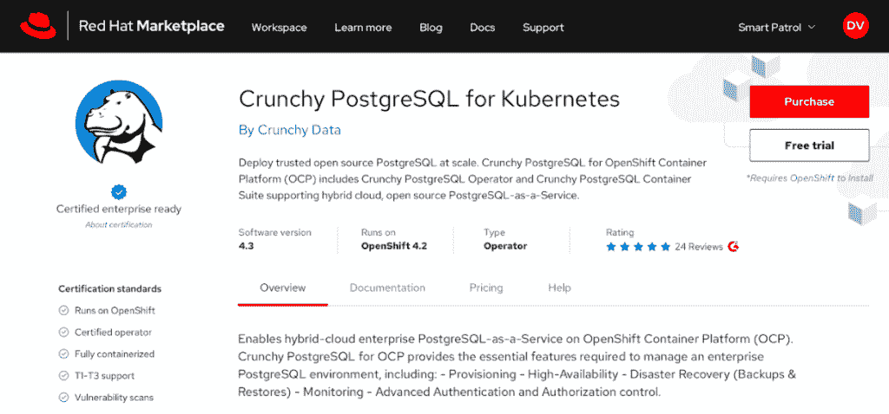

# Red Hat 推出了一个基于 OpenShift 的市场，以帮助实现多云便携性

> 原文：<https://thenewstack.io/red-hat-launches-an-openshift-based-marketplace-to-aid-multicloud-portability/>

据该公司称，Red Hat 的 Marketplace 已经为企业开放，允许组织为多云环境提供广泛的审查软件和平台选择。

虽然 Marketplace 表面上是为了在组织改变或添加新的应用程序和平台以在多云环境中进行管理时促进其发展而构建的，但它在许多方面都类似于[苹果的应用商店](https://www.apple.com/ios/app-store/)，因为客户采用了供应商的平台，同时受益于有助于确保软件质量的过滤器。

通过 Marketplace，客户使用 OpenShift 作为访问 Red Hat 所描述的大量精选(总共 60 种)和预先批准的软件产品的门户。[红帽](https://www.redhat.com/en)表示，它认证所有在[市场](https://marketplace.redhat.com/en-us)上可用的软件可以在红帽 OpenShift 上运行，同时提供商业支持。Red Hat 表示，基于开放的 Kubernetes 运营商框架和 IBM 支持和管理的基础设施，为自动安装、升级、备份和存储以及灾难恢复服务提供商业支持。

选择采用 Marketplace Select 的组织能够跟踪在 OpenShift 保护伞下运行的所有云环境(包括多云和混合云环境)中独立租户或组织部门的软件使用和支出情况。

该项目主要是为了支持 DevOps 团队在运行 OpenShift 的云原生平台上的投资。虽然组织经常转向公共云服务，以加快软件开发和部署的节奏，但随着组织扩展其多云运营(通常跨越不同的地理位置)，平台之间的交叉兼容性经常会带来问题。

“开发运维团队转向公共云来提高速度。Red Hat Marketplace 的产品管理总监 Jeoff Wilks 告诉 New Stack:“云管理服务和现收现付的定价帮助他们更快地从试验阶段进入生产阶段。“现在假设公司正在全球扩张——为[亚马逊网络服务(AWS)](https://aws.amazon.com/) 开发的应用程序现在需要在阿里巴巴上运行。突然间，他们陷入了痛苦的世界，因为他们所依赖的服务是不可移植的。”

因此，一个云提供商可能提供的功能往往会在未来寻求跨多云环境扩展平台和应用时带来问题。“所有前期的便利造成了下游的负债。或者假设他们在 [Azure](https://azure.microsoft.com/en-us/) 上构建了一个 DevOps 架构，然后该业务收购了一家运行 AWS 的公司，”Wilks 说。“他们针对一家云提供商进行了优化，复杂的全球业务根本不会以这种方式运作。”

Wilks 说，Marketplace 帮助 DevOps 团队解决的主要问题包括与可移植性相关的挑战。威尔克斯说，Kubernetes 运营商框架从 Marketplace 进行管理，并在 OpenShift 下允许软件供应商提供内置管理逻辑的产品，包括自动部署、升级、备份和故障恢复以及已经包含的扩展。

“运营商适合 CI/CD 集成管道并进行自我管理，就像 DevOps 团队对 SaaS 服务的期望一样——但可以跨云移植，”Wilks 说。“Red Hat Marketplace 增加了一个不断增长的生态系统，其中包含经过 OpenShift 认证的可移植托管软件，具有基于使用情况的定价和成本可见性，并且是跨供应商支持的起点。所以现在，DevOps 可以快速移动，不会在以后弄坏东西。”

目前在 Marketplace 下提供的容器化软件产品列表涵盖 12 个类别，包括来自 Anchore、蟑螂实验室、CognitiveScale、Couchbase、Dynatrace、KubeMQ、MemSQL、MongoDB 和 StorageOS 的 AI/ML、数据库、监控、安全、存储和开发工具。

亚马逊网络服务、Dynatrace 和 Red Hat 是新堆栈的赞助商。

来自 Pixabay 的特征图像。

<svg xmlns:xlink="http://www.w3.org/1999/xlink" viewBox="0 0 68 31" version="1.1"><title>Group</title> <desc>Created with Sketch.</desc></svg>