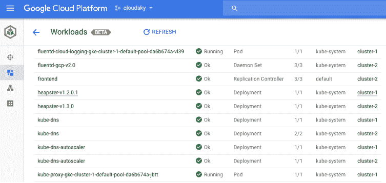

# Red Hat OpenShift Online 现在提供多租户功能

> 原文：<https://thenewstack.io/red-hat-openshift-online-now-offers-multi-tenancy/>

Red Hat 在其 [OpenShift Online](https://www.openshift.com/features/index.html) 平台上增加了一个 Pro tier，旨在帮助开发人员构建基于容器的云原生应用，而不必担心供应和扩展等问题。

OpenShift 在线服务实际上是在 2011 年推出的，自那以来已经托管了超过 300 万个应用程序。上个月在 T2 举行的红帽峰会上，该公司宣布了一个免费的“入门”版本，包括 1GB 内存和 1GB 存储空间。现在，专业版增加了每月每 GB 内存或存储 25 美元的额外资源和基本支持包。

Red Hat 的 OpenShift Online 主管 [Sathish Balakrishnan](https://www.linkedin.com/in/saascloud/) 说:“我们现在有一个基于多租户的 Docker 和 Kubernetes 的生产质量托管环境。Kubernetes 是一个流行的开源容器编排引擎，由 Google 开发，现在由云本地计算基金会托管。

该服务现在包括:

*   一个“git push”命令来简化应用程序配置和部署
*   自动应用扩展
*   [源到图像](https://github.com/openshift/source-to-image) (S2I)构建
*   与流行的集成开发环境(ide)集成，包括 Eclipse、Red Hat JBoss Developer Studio 和 Titanium Studio
*   在云中交付的 JBoss 产品组合的中间件服务

Balakrishnan 解释说，[源到图像](https://github.com/openshift/source-to-image) (S2I)框架是一个开源项目，是 OpenShift 的一部分。基本上，开发人员不需要了解任何关于 Docker 的知识或者学习任何关于 Docker 的知识就可以使用它。他们只需将想要构建 Docker 映像的源代码指向源映像构建器，它就会自动构建。

他说，竞争对手，如谷歌容器引擎和亚马逊 EC2 容器服务都是单租户环境，类似于红帽的 OpenShift 产品。

多租户意味着不同开发人员的容器可以共存并运行在同一个应用程序节点上，而不会互相干扰或从一个容器向另一个容器泄漏信息。他解释说，它还支持开发团队之间的资源共享，pro 层提供了协作等功能。

多租户产品通过第二个托管产品、专用选项和客户自行管理的 [OpenShift 容器平台](https://www.openshift.com/container-platform/index.html)完善了 OpenShift 产品组合。

[open shift 容器平台](https://docs.openshift.com/container-platform/3.5/release_notes/ocp_3_5_release_notes.html)的 3.5 版本于 4 月发布，支持 Kubernetes 1.5、扩展的应用程序支持以及安全性和网络增强。

OpenShift 支持多种语言，包括 Java，Node.js，。NET，Ruby，Python，PHP 等。它支持各种框架上的配置和部署，包括 Spring Boot、Eclipse Vert.x、Node.js 和 JBoss 中间件。

他说，该公司专注于使开发者能够将他们的应用程序从一个移植到另一个，并帮助他们建立一个多云或混合云解决方案。

同样在 5 月的波士顿峰会上，红帽宣布了 [OpenShift.io](https://openshift.io/) ，这是一个用于创建和部署混合云服务的[在线开发环境](https://thenewstack.io/red-hat-summit-serves-openstack-io-saas-containerized-java-microservices/)。It [收购了 Codenvy](https://thenewstack.io/red-hat-acquire-codenvy-integrate-ide-openshift-io/) ，该公司称之为“世界上第一个微服务 IDE”的提供商，Red Hat 宣布它将被集成到 OpenShift.io 中。

它还展示了 OpenShift 中的[本地 Amazon Web Services 功能](https://thenewstack.io/red-hat-embeds-amazon-web-services-openshift/)，包括一系列将在 OpenShift 平台上本地打包的 Amazon 服务，无论它们运行在哪里。

随着公司越来越重视 OpenShift，Red Hat 大会包括了 80 多个与该平台相关的会议，以及 180 多个演讲人讨论 OpenShift。

首席执行官吉姆·怀特赫斯特在电话会议上告诉分析师，OpenShift 占 2016 年最后一个季度总收入的 20%，并补充说这可能是该公司未来三年最大的收入来源。

云本地计算基金会和 T2 红帽是新堆栈的赞助商。

通过 Pixabay 的特征图像。

<svg xmlns:xlink="http://www.w3.org/1999/xlink" viewBox="0 0 68 31" version="1.1"><title>Group</title> <desc>Created with Sketch.</desc></svg>