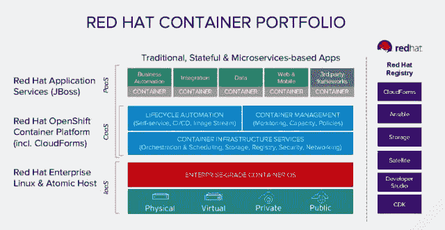

# 红帽:“争夺集装箱市场的竞赛开始了”

> 原文：<https://thenewstack.io/red-hat-race-container-market/>

红帽的产品和技术总裁保罗·科尔米耶在本周举行的红帽峰会的新闻发布会上说，红帽的平台即服务(PaaS)软件现在正式成为一个容器化平台。每一个生产集装箱化平台的公司现在都是红帽的竞争对手，包括 [Docker Inc.](https://www.mirantis.com/software/docker/kubernetes/) ，因为它在集装箱行业的先驱股份；以及 Pivotal 在云计算领域的领导地位。

“容器是一个 Linux 操作系统，”科尔米耶说，并把容器领域的其他公司描述为“定制 Linux 提供商”

科尔米耶展示了一张幻灯片，上面有 Docker 和 CoreOS 的标志，还有 HPE、微软 Azure、亚马逊 AWS 和谷歌云，他承认所有这些公司都致力于帮助企业构建混合环境。“但为了让所有这些都做到这一点，他们真的必须做一个定制的 Linux 发行版，”他说。

“现在有趣的事情之一是，如果我们不小心，我们可能会有许多这样的定制 Linux 发行版到处乱飞。我们采取了非常不同的策略。如果容器是 Linux——它们 T10 是 Linux——你必须是一个商业 Linux 供应商，才能做容器分发，我们正在建立我们与 RHEL 14 年来建立的东西。”

在科尔米耶发表声明的过程中，一张幻灯片的一角弹出了这样一句话:“争夺集装箱市场的竞赛开始了。”

## OpenShift 关闭队列

Red Hat 周二的声明与其说是一次技术或产品发布，不如说是该公司 PaaS 平台 OpenShift 的一个新的营销和分销立场——尽管该公司确实宣布了一些重要的增量内容，以填补一些平台空白。无论如何，Red Hat 现在希望你将 OpenShift 视为 Docker 的直接竞争对手，以及一个新兴的容器平台空间，科尔米耶也在其中投入了[云铸造](https://www.cloudfoundry.org/)。

上周在西雅图的 DockerCon 上，Docker 进行了平台整合，将 Docker Swarm orchestrator 与 Docker Engine 1.12 更紧密地联系在一起。红帽周二的回应也填补了 OpenShift 方面的一些平台空白。最重要的是，该公司正在开发 g luster Storage——其多租户、软件定义的存储阵列——以永久存储容器的形式提供服务。

通过这种方式，维护应用程序状态的数据库和数据存储(最明显的例子是网站)可以保持一致性，即使微服务容器被淘汰，应用程序被缩减。去年，Docker[开始与 ClusterHQ](https://thenewstack.io/clusterhq-lets-move-docker-like-cattle-but-make-the-data-special/) (注意拼写，是“C”，不是“G”)等数据库服务提供商合作，使用 Docker 新兴的插件模型实现持久存储。

Red Hat 今天明确表示，Gluster 存储容器不需要这种型号。更重要的是，根据 Red Hat 的新闻稿，Gluster 将使存储管理员和开发人员能够“通过 Red Hat OpenShift 容器平台中的 Kubernetes，使用单个控制平面来控制存储和应用程序容器。”

“我们正在使用 Kubernetes 主机网络(Docker 主机网络)来实现我们的容器融合解决方案，”红帽首席大数据架构师 [Stephen Watt](https://twitter.com/wattsteve) 告诉新堆栈。“这意味着作为该解决方案一部分的存储容器将获得与其运行所在主机相同的 IP 地址，而不是来自容器覆盖网络(在我们的案例中是 OpenShift SDN)的 IP 地址。我们发现这是最具性能的网络配置，并且没有阻碍 SDN 上的应用容器与存储容器提供的卷进行通信。不需要 Docker 插件。这是 Docker 和 Kubernetes 提供的标准网络功能。”

Watt 的评论清楚地表明，OpenShift 并没有重新发明，甚至没有更新这个众所周知的轮子——它利用了与 Docker 平台相同的 Kubernetes 编排架构，只是不依赖 Docker 引擎。

“存储完全成熟，可以通过开源来商品化，”科尔米耶说，“就像我们商品化计算层一样。但是我们在存储方面的目标是真正专注于开放式混合云使用情形。现在，通过容器将存储集成到 OpenShift 中，真正允许我们的客户现在将存储作为关键服务构建到他们的平台中，并从实验室开发、开发和测试[*阶段*]一直到生产环境中管理它。它将使用 Kubernetes 为应用程序存储提供统一的编排；对开发人员更好的控制和易用性；由于这种融合，将通过单一供应商支持降低总体拥有成本[*总拥有成本*。”

这最后一击是在某个不知名的竞争对手的弓上射出的，该竞争对手的持久存储选项是通过合作方式打造的。

## 安全齐射

在安全部门，OpenShift 集装箱平台正式推出集装箱扫描功能，该平台由去年年底与黑鸭合作的[红帽公司打造。具体来说，内容扫描将与 RHEL 7 原子主机集成，该主机最初于去年发布。这一增加使得 OpenShift 现在与 Docker 更加势均力敌，Docker 的](https://thenewstack.io/red-hat-enlists-black-duck-fortify-container-security/) [Docker 安全扫描功能于去年 10 月推出](https://thenewstack.io/3-new-security-features-docker/)。

“我们现在让合作伙伴能够连接进来，并扫描集装箱的安全漏洞，”科尔米耶说。“随着您转向企业，您需要企业级安全性、工具和合作伙伴。这是我们现在将引入合作伙伴的领域，为我们的容器平台增加更多价值，因为客户真正开始在他们的企业中引入它，并在实际生产中使用它。”

在周二的问答环节中，红帽高管被要求将他们的黑鸭供电产品与 Docker 和 CoreOS 的集装箱扫描产品区分开来。红帽公司 RHEL 和集装箱总经理 Lars Herrmann 回应道:“集装箱扫描归结为两件事。这是执行扫描的机制，这是我们通过开放框架实现的，其中可以插入许多解决方案。但是实际的洞察是通过将数据与后端数据源进行比较而产生的。黑鸭对各种技术都有非常全面的见解。我们正在推动 SCAP[安全内容自动化协议，发音为“ess cahp”]，它推动了我们所管理技术的安全视角。

“最终，”Herrmann 继续说道，“我们必须与大量不同的数据集进行非常全面的集成，这样客户才能得出正确的结论，解决问题，并做出基于策略的决策。因此，据我所知，没有人像 Red Hat 那样对管理洞察驱动的容器扫描有如此全面的看法，并将其与工作流结合起来。”

科尔米耶回忆起去年二月在标准 C 库**glibc**中发现的一个漏洞，这个漏洞存在于包含它的容器中。“它几乎存在于地球上的每一个集装箱里，”科尔米耶说。"现在必须识别、撤回、重新编译和重新部署."

科尔米耶的言外之意是，Linux 用户空间中常用库中的任何漏洞都可能使几乎每个容器成为开放的目标。在这种情况下，扫描工具将是容器平台的第一道防线。但未必是长久之计。对于容器化破坏了 Linux 内核整洁有序的组织，科尔米耶表现出一种持续的挫折感，他向一个提问者解释说，容器有效地将 Linux 沿着内核和用户空间的分界线分开。他说，现在内核扮演着容器主机的角色，以管理的角色栖息在硬件之上；而用户空间“现在变得拥挤”并广泛分布在各种容器中。

因此，正如公司总裁所描述的，任何单一的安全漏洞都可以看到其攻击面被放大到全球规模，这呼应了红帽关于不可信容器图像的论点，即[可以追溯到几年前](http://developers.redhat.com/blog/2014/11/03/are-docker-containers-really-secure-opensource-com/)，并且[不时出现](https://access.redhat.com/blogs/766093/posts/1976463)。

## 舞台剧

显然，Red Hat 正在努力将 Docker 社区从 Docker 公司剥离出来，将 Cloud Foundry 社区从 Pivotal 剥离出来，并将 Kubernetes 的“项目”与 Kubernetes 的“产品”分开。保罗·科尔米耶周二不止一次解释说，在所有三个项目中，社区不应该被误认为是商业提供商。

“你有 Cloud Foundry，这个社区，主要由一家公司控制,”科尔米耶告诉一个提问者，“所以它不完全是一个社区。

“你也有 IBM 版的 Cloud Foundry 你有 Pivotal 版本的 Cloud Foundry 你有惠普版本的云代工厂，”他继续说道。“因此，现在您有 IBM Linux、Pivotal Linux 和 HP Linux，它们都在底层推动这些云代工厂，这意味着您有 IBM containers、Pivotal containers、Linux containers 和 HP……希望我继续下去吗？”

当 Docker Inc. [去年向 OCI 展示其容器格式时，毫无疑问，它必须意识到它是在为任何想要建立另一个王国的人复制其王国的钥匙。集装箱化领域不再只有一个生态系统。](https://thenewstack.io/oci-reveals-governance-structure-amid-debate-focus/)

[云代工厂](https://www.cloudfoundry.org/)、[码头工人](https://www.mirantis.com/software/docker/kubernetes/)、 [CoreOS](https://coreos.com/) 、 [HPE](https://www8.hp.com/us/en/solutions/business-solutions.html) 、 [IBM](https://www.ibm.com/cloud) 、[红帽](https://www.openshift.com/)是新栈的赞助商。

宾夕法尼亚州菲尼克斯维尔同性恋街桥的拆除的标题图片，由 J Clear 拍摄，获得知识共享许可。

<svg xmlns:xlink="http://www.w3.org/1999/xlink" viewBox="0 0 68 31" version="1.1"><title>Group</title> <desc>Created with Sketch.</desc></svg>