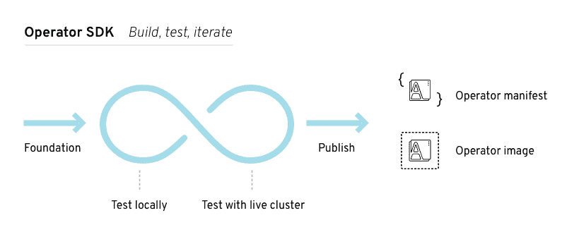

# Red Hat 发布了一个框架来轻松打包 Kubernetes 的应用程序

> 原文：<https://thenewstack.io/red-hat-releases-a-framework-to-easily-package-applications-for-kubernetes/>

开源企业软件提供商 [Red Hat](https://www.openshift.com/) 发布了一个工具包，可以轻松构建可由 Kubernetes 管理的应用程序。被称为[操作符框架](https://github.com/operator-framework)，它利用了[操作符构造](https://coreos.com/operators/)，这是由 CoreOS 首先开发的 Kubernetes 特性，CoreOS 是今年早些时候收购的一家公司红帽。

CoreOS 首席技术官 Brandon Philips 说:“对于开发者来说，我们简化了很多 Kubernetes 的抽象概念。

该公司将操作符设计为打包、部署和管理应用程序的一种方式，以便它可以由 Kubernetes 开源容器编排软件以编程方式控制。这个框架是使用操作符来定义许多广泛使用的应用程序(如 ectd 密钥库)的结果。

有运营商的应用程序和没有运营商的应用程序之间的区别就像提供专用云服务(如数据库)的云提供商和仅提供封装在虚拟机中的数据库软件的云提供商之间的区别。换句话说，您通过操作符获得完整的 API 控制和管理。

“Kubernetes 是所有云提供商达成一致的第一件事。运营商让你在云提供商中加入新的服务，因为 Kubernetes 就在那里。如果你的提供商没有 etcd 服务，你可以安装一个可部署的 etcd 服务的 etcd 运营商，”飞利浦说。

也许运营商力量的最好例子是 Ticketmaster 最近对它的使用。这家票务公司是 CoreOS 商业发行 Kubernetes 的早期采用者。虽然最初，票务公司没有使用 [Prometheus 监控工具](https://prometheus.io/)，这可能是一项繁琐的设置，但 CoreOS 已经为该公司提供了一个 Prometheus 监控工具操作员。不久，该公司的 IT 人员发现不同的开发人员在内部使用了超过 300 个 Prometheus 实例，因此操作人员简化了设置软件的过程。

目前，大约有 20 家运营商填补了 Kubernetes 基本计算和存储服务的空白，比如 etcd。对于开发者和独立软件供应商来说，建立他们自己的操作程序来简化他们应用程序的使用仍然是困难的。因此有了框架。

[操作员框架](https://coreos.com/blog/introducing-operator-framework)有三个组件，一个软件开发工具包、生命周期管理软件和计量功能，将在未来几个月推出。

SDK 提供了一套工具，允许开发人员在没有 Kubernetes API 专业知识的情况下构建、测试和打包操作符。【T2

运营商生命周期管理组件监督运营商的更新和持续管理，并且，通过扩展，监督它们所代表的服务。最终，运营商生命周期管理组件将为 IT 人员提供编制应用程序目录、其版本号以及使用位置的能力。

发布后，计量功能将涵盖 CPU 和内存使用情况，it 部门可以使用它来规划预算和分配。例如，通过计量，Ticketmaster 可以了解他们的 Prometheus 实例运行了多少，甚至他们在云提供商或数据中心运行的成本是多少。

Operator 框架最适合复杂的应用程序，如监控系统、数据库管理系统或 Java 应用服务器，其部署和升级步骤无法在 Helm 规范文件中捕获。

*飞利浦将于本周在哥本哈根举行的 KubeCon + CloudNativeCon 欧洲大会上，在周四上午的主题演讲中更详细地讨论运营商框架。*

[红帽](https://www.openshift.com/)是新栈的赞助商。

<svg xmlns:xlink="http://www.w3.org/1999/xlink" viewBox="0 0 68 31" version="1.1"><title>Group</title> <desc>Created with Sketch.</desc></svg>