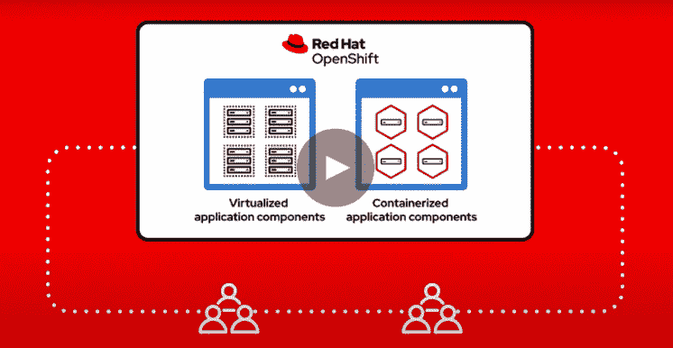
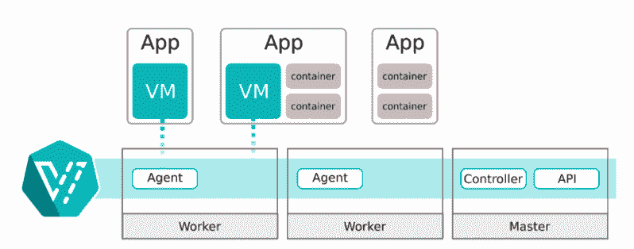

# Red Hat 表示，在 OpenShift 中，虚拟机不是“二等公民”

> 原文：<https://thenewstack.io/red-hat-says-vms-are-no-second-class-citizens-in-openshift/>

任何已经向云原生计算转移的组织几乎都会谈到他们在将遗留应用程序移植到 Kubernetes 时遇到的困难。不否认容器化环境在交付速度、灵活性和资源节约方面的巨大优势，大多数遗留应用程序和平台并不是为在 Kubernetes 上运行而设计的。

另一个事实是，大多数拥有现有数据中心的企业并没有完全依赖于容器化和 Kubernetes 环境。例如，根据 Gartner 最近的一项研究, 2019 年只有 30%的全球组织环境运行在容器上——尽管预计到 2022 年底这一比例将增加一倍以上，达到 75%。

虚拟化和虚拟机就是一个重要的例子。[Brian gracey](https://www.linkedin.com/in/briangracely/)， [Red Hat 的](https://www.redhat.com/en)混合云产品战略高级主管告诉新的堆栈，许多 OpenShift 客户曾问“是否会有一天，Kubernetes 的东西与我在虚拟机中运行的应用程序相关联，”gracey 告诉新的堆栈。

格雷斯利说:“客户说‘如果我们不必有两套独立的系统，不必学会用两种不同的方式做事，那肯定会很好。他们一直要求我们能够在 Kubernetes 世界中添加虚拟机，“用于数据库、排队系统或其他应用程序。

随着 OpenShift 虚拟化的全面发布，Red Hat 表示，组织现在可以将其虚拟机移植到其 OpenShift Kubernetes 环境中，从而消除了分别管理虚拟机和容器中的应用程序的需要。

Gracely 说，通过能够将 Windows 应用程序移植到传统上以 Linux 为中心的世界，OpenShift 虚拟化提供了直接的好处，即能够通过将现有应用程序带到 Kubernetes 环境来节省资源，如上所述。这也意味着以前在虚拟机中运行的应用程序，如数据库、存储和其他不适合容器化环境的打包应用程序，现在可以在 OpenShift 上与容器化应用程序一起运行。

格雷斯利说:“通常有一些流行的打包软件，供应商并没有把它们放入容器中。他说，开发者现在可以选择以相对无缝的方式将这些通常是遗留的虚拟机应用移植到 Kubernetes 环境中。

此外，Gracely 说，现在虚拟机已经成为“一等公民”，DevOps 团队现在可以利用 OpenShift 上的自助服务模式按需访问和使用虚拟机。“以前，向基础架构团队索要虚拟机需要很长时间。在某些情况下，我们会与银行和保险公司交谈，他们会说需要三个月才能获得一台虚拟机，”Gracely 说。“会发生的情况是，开发人员知道存在这种滞后，所以他们会要求一台比他们需要的大得多的机器，并将其保留很长一段时间。因此，我们让虚拟机像容器一样实现自助服务和按需服务。”

Gracely 说，本质上，这个想法是允许虚拟机和容器在 OpenShift 下成为“全自助服务”。“我们从开发人员那里得到了很多反馈，他们说，‘这太好了，因为我不再需要分两部分来考虑我的应用程序’——从第一天起，这一切都是自助服务，”Gracely 说。“没有滞后和摩擦——听到开发人员生产力的角度已经上升到最前沿，这是一件很有趣的事情。”

OpenShift 虚拟化基于 [KubeVir](https://github.com/kubevirt/kubevirt) 开源项目，代表了 OpenShift 现在可用的软件的企业特性。此外，OpenShift 容器平台免费提供了它。

红帽公司称它是 KubeVir 的主要贡献者，kube vir 现在是[云本地计算基金会](https://www.cncf.io/)的一个沙盒项目。据 Red Hat 称，它的贡献包括创建状态集、基于角色的访问控制(RBAC)和网络策略。

在上周的 KubeCon+Cloud NativeCon Europe 虚拟会议期间发布 OpenShift 虚拟化的同时，Red Hat 推出了一款用于 OpenShift 4.5 的自动化工具，允许 OpenShift 部署自动移植到 VMware vSphere 环境。相反，VMware 去年发布了 [VMware 推出了 Project Pacific](https://thenewstack.io/vmwares-project-pacific-integrates-vsphere-with-kubernetes/) ，该产品支持将容器化环境移植到其 vSphere 虚拟化平台。

云计算原生计算基金会、Red Hat 和 VMware 是新体系的赞助商。

来自 Pixabay 的特征图像。

<svg xmlns:xlink="http://www.w3.org/1999/xlink" viewBox="0 0 68 31" version="1.1"><title>Group</title> <desc>Created with Sketch.</desc></svg>