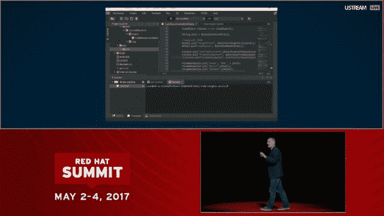
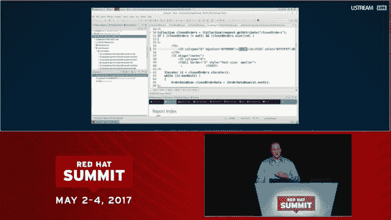

# 红帽峰会服务 OpenShift.io，一个容器化 Java 微服务的云服务

> 原文：<https://thenewstack.io/red-hat-summit-serves-openstack-io-saas-containerized-java-microservices/>

在仍被称为“容器革命”的初期，Red Hat 对该技术的内在安全性表达了非常强烈的怀疑——在 2014 年的某个时候，[建议 Docker 映像永远不要被广泛分发](https://access.redhat.com/blogs/766093/posts/1976463)，并归入它们打算运行的特定系统。但是现在，Red Hat 公司的主要产品是一个分发和运行容器化软件的平台，包括它自己的中间件框架，众所周知的鞋子和它相关的众所周知的脚显然交换了位置。

周二上午，为了启动[红帽峰会](https://www.redhat.com/en/summit/2017)的第一天，并通过推出其名为 [OpenShift.io](https://openshift.io/) 、[的全 SaaS 版容器平台，该公司总裁兼首席执行官吉姆·怀特赫斯特](https://twitter.com/JWhitehurst)告诉与会者，他们组织的首要任务应该是将所有应用程序(包括传统应用程序)迁移到真正可移植的、以云为中心的部署模式。与此同时，对比去年和今年的客户反馈，表明在渴望迁移到原生云的组织中，安全性是一个日益减少的问题。

“我们一直在问我们的客户，‘你们面临的最大挑战是什么？’“相关怀特赫斯特。”去年，我们的客户告诉我们，他们面临的最大挑战是削减成本、安全性和自动化。虽然这些需求已经发生了很大变化，但我们仍然需要担心。我们仍然需要担心成本、安全性和自动化。但是还有更多；还有很多。对于 2017 年，随着人们进一步部署他们的混合云，他们的首要任务实际上是如何将应用程序纳入他们的云战略，以及如何优化他们已经拥有的现代 IT 基础架构。"

尽管怀特赫斯特没有引用多少硬数据来支持他的说法，但他确实表示，今年大约 84%的红帽客户告诉公司，他们已经制定了某种云部署战略。尽管他利用这一绝大多数数字作为证据，证明红帽应该支持和鼓励客户选择，但这一引用导致了对选择应该是什么的断言:扩展的 [OpenShift](https://www.openshift.com/) 平台。

带有顶级域名的 OpenShift.io 将成为 Red Hat 的新门户，面向寻求立即构建和部署应用程序的开发人员和团队，而无需首先将他们自己的任何基础架构带到桌面上。

“构建推动未来业务发展的应用……将围绕云原生开发展开，”这位首席执行官表示。“但为了构建这些应用，你不必解决技术难题。你需要授权给你的开发团队。”

## “一切从一个空格开始”

首席开发工具产品经理 [Todd Mancini](https://www.linkedin.com/in/toddmancini/) 演示了 OpenShift.io 作为一个基于 Web 的控制台，通过它可以管理应用程序的整个生命周期，从提出想法，到开发、部署、调试和重新迭代。在这个时代，Slack 作为一个聊天驱动的协作平台已经取得了相当大的突破，Mancini 将 OpenShift.io 定位为一个协作中心，在不使用 Slack 的情况下，将 Red Hat 工具和服务——包括该公司新的用于构建微服务的 [OpenShift 应用程序运行时](http://middlewareblog.redhat.com/category/openshift-application-runtimes/)(RHOAR)——带到离开发者更近的地方。

“只需一个浏览器和一个互联网连接，一个开发人员——事实上，整个团队——就可以立即开始工作，”Mancini 说，但没有提到调制解调器或 CompuServe 帐户。

“一切都从一个空格开始，”他继续说道。“就像在物理世界一样，空间是一个团队可以聚在一起协作的地方。”他为演示选择的协作空间包括一个创建 scrum 的模板，表明该平台也支持团队管理。(相比之下，使用 Visual Studio 的 Azure 开发者[依赖 IDE 进行 scrum 类型的工作流管理](https://www.visualstudio.com/en-us/docs/work/guidance/scrum-process-workflow)，而不是 Azure 本身托管的任何服务。)

根据 RHOAR 的选择，Mancini 继续为调用 [Vert.x framework](https://developers.redhat.com/promotions/vertx-cheatsheet/) 的 Java 应用程序创建空间，这是 Red Hat 使用反应模型构建分布式系统的方法之一。他在这里提出了一个令人信服的观点，指出这种模型通常需要开发人员关注基础设施的细节，这在这种情况下是不必要的，因为所有的基础设施都由 SaaS 主机管理。

Mancini 的演示是在一个典型的混合云平台上使用 RHOAR 之前进行的。(“OpenStack”这个词现在越来越少被使用了。)Red Hat 高级应用程序技术布道者 [James Falkner](https://www.linkedin.com/in/jamesfalkner0/) 向峰会与会者展示了 OpenShift 如何解决在容器包装器中包装单一的遗留应用程序并立即部署它们的问题。

任务所需的[Red Hat Application Migration Toolkit](https://access.redhat.com/documentation/en/red-hat-application-migration-toolkit/)提供了一个分析引擎，该引擎查看应用的源代码并确定需要迁移的内容，将结果反馈给 Web 报告引擎，以显示它发现的迁移问题。

Falkner 的演示展示了 RHOAR 组件——第一个是几周前在 OpenShift 3.5 中发布的[——如何取代 JBoss EAP 应用中常见的中间件组件。通过这种方式，围绕 JBoss 编写的遗留应用程序可以被容器化，可以与扮演中间件角色的容器进行通信，还可以以一种它们的客户机/服务器对应物不可能完成的方式被放大或缩小。](https://thenewstack.io/openshift-3-5-introduces-cloud-native-java/)

不可避免的是，Red Hat 的方法会被拿来与 Docker 时任首席执行官 Ben Golub 两周前在 DockerCon 上公布的新方法进行比较。在那里，Golub 建议大多数遗留应用程序的容器化可以“不改变一行代码”地进行周二，Falkner 展示了一个过程，该过程涉及控制台和开发人员之间显著增加的交互，包括就哪些旧代码仍需要更改以及为什么更改提出建议。Red Hat 今天透露，它正在应用一个分析引擎来帮助确定哪些源代码可以收紧，哪些核心组件可以用新的组件替换——包括长期被忽视的概念安全性。

Falkner 继续说道:“最棒的是，在我们的 IDE 中集成了原生 OpenShift，我可以简单地将我新迁移的项目拖放到运行在 OpenShift 上的 Linux 容器中，现在我已经为云做好了准备。OpenShift 将获取源代码，将其与基本 JBoss EAP 映像相结合，将其转换为 Linux 容器，并放入我的 OpenShift 集群中。”

## 亚马逊输液

在周二下午的峰会新闻发布会上，红帽官员透露了与亚马逊网络服务的扩展关系，这将使 RHOAR 组件能够在 AWS 的 OpenShift 上运行，反过来，这将使一些亚马逊组件能够在客户场所的 OpenShift 平台上运行。

正如 Red Hat 负责技术业务开发的副总裁 Mike Ferris 所说，这一举措有效地为 OpenShift 注入了亚马逊的成分，正如他所描述的，“实际上能够将核心的亚马逊网络服务能力带入 OpenShift，而不管客户在哪里运行 OpenShift。”AWS 服务，如[亚马逊的 RDS](https://aws.amazon.com/rds/) 或 [Route 53](https://aws.amazon.com/route53/) 将直接在 OpenShift 中提供。

这里的含义是，一旦 OpenShift 平台被部署到其他主机上，AWS 服务将继续在这些平台上运行，包括 Azure 和 Google 云平台。在这一点上，这似乎是极不可能的，尽管费里斯的用词似乎明确而有意地留下了这个选项。

红帽是新堆栈的赞助商。

<svg xmlns:xlink="http://www.w3.org/1999/xlink" viewBox="0 0 68 31" version="1.1"><title>Group</title> <desc>Created with Sketch.</desc></svg>