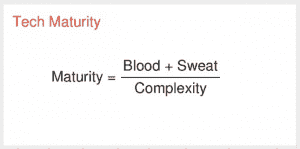
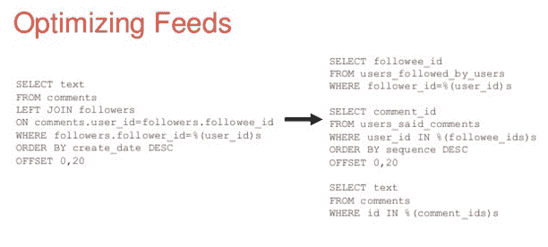

# Reddit 首席技术官:创业时坚持使用无聊的技术

> 原文：<https://thenewstack.io/reddit-cto-sxsw-stick-boring-tech-building-start/>

所以你对下一个伟大的创业有一个伟大的想法。你用什么技术和过程来尽可能无痛地实现它？更重要的是，您将如何确保它随着您的业务起飞而扩展？

有些技术可以帮助您的系统快速扩展，有些技术虽然不能很好地扩展，但更易于部署，因此它们可以帮助您更快地启动业务。

Reddit 首席技术官马丁·韦纳建议说，这两样你都需要。Pinterest 推出这项服务时，韦纳也是其技术负责人之一，因此在本月于得克萨斯州奥斯汀举行的 [SXSW Interactive](http://www.sxsw.com) 会议上，他提供了许多[实用建议](http://www.slideshare.net/dianachow/marty-weiner-reddit-cto-sxswi-2016-everythings-harder-at-scale/1)。

他说，任何新创业公司的第一年都将是“可扩展性地狱”。“这是每个科技创业公司都面临的问题。”

许多设计师可能采取的一种方法是使用所有最新的嗡嗡声产生技术。设计师有一个干净的石板，所以为什么不在采用曲线之前开始呢？韦纳警告说，考虑到这些新的、可能还不成熟的技术的需求量，这可能是一个错误。

事实是，你的需求与过去几年里成立的其他初创公司不会有太大不同，因此一个更成熟的产品可能是你的最佳选择。

如何判断软件是否成熟？作为一个极客，他给出了一个公式:

你可以通过软件创建者在软件上所做的工作量，除以使用软件本身固有的复杂性来判断软件的成熟度。

例如，像 Redis 这样的缓存系统是一个相当简单的单线程软件，由 Twitter 和 Pinterest 等公司的大量贡献者整合而成。因此，Redis 在成熟度等式中的排名将高于，比如说， [HBase](https://thenewstack.io/a-look-at-hbase/) ，它有许多贡献者，但基于一些非常复杂的想法，很难维护。

基本上，只要有可能，你就要使用成熟的技术，因为它会帮助你尽可能平稳地运行你的操作。如果它没有扩展到维持 Pinterest 规模的业务的水平，那么当你自己的业务达到 Pinterest 水平的受欢迎程度时，这将是一个问题。

成熟的技术提供了更广泛的人才和支持。对于像 MySQL 这样的成熟技术来说，“如果是凌晨 3 点，你的网站坏了，因为它会坏，无论 MySQL 有什么问题，答案都会在谷歌上找到；不仅如此，它还会出现在[堆栈溢出](http://stackoverflow.com/)上，有人会称你为[新手](http://www.urbandictionary.com/define.php?term=newb)。这是对成熟的真正考验，”韦纳说。

韦纳说，性能和稳定性也是不成熟技术的常见问题，“你想要的是可预测性”。一项不成熟的技术可能运行得非常好，但由于某种原因，其延迟将会一飞冲天。文档和调试可能也不会支持你。

“很可能你在很长一段时间内都不需要不成熟的技术，”他说。

成熟技术带来的另一个优势是，它可以轻松地调整业务，专注于正在工作的运营的某些方面。

“有很多工具可能无法与你一起扩展，但它们会让你走得更快，”他说。选择众所周知的技术，如 NGINX、Ubuntu、GitHub 和 Python。“Python 是一项非常成熟的技术。每个人都知道如何使用它，你可以为此付费，”他说。

对于大多数常见的数据捕获任务，比如存储用户评论或登录凭证，MySQL 是最佳选择。AWS 通过 [RDS](https://aws.amazon.com/rds/mysql/) 提供托管 MySQL 服务。AWS 通过自动故障转移和配置等功能管理服务，随着公司的发展，您可以将责任移交给自己的员工。

“无聊的科技革命来了，”他说。不要担心优化您的查询。“除非万不得已，否则不要在后端优化任何东西，”他说。

事实上，对于创业公司来说，AWS 是一个很好的资源。他说:“这很管用，而且它会随着你的成长而发展壮大。”。它的价格很有竞争力，并且有很多工具可以使用它。基本的搜索能力可以由 AWS [CloudSearch](https://aws.amazon.com/cloudsearch) 提供。对于存储，请选择 AWS 的[简单存储服务](https://aws.amazon.com/s3/) (S3)。“它超级耐用，”韦纳说。“它有四个 9 的可用性。“对于域名服务，看看另一个 AWS 服务， [Route 53](https://aws.amazon.com/route53/) 。

另一个你不必担心的工具是 Apache Zookeeper，它非常适合管理大量的服务。然而，一家刚刚起步的公司可以只使用 [AWS 配置](https://aws.amazon.com/config/)。

## **万物皆破**

如果你的创业成功了，你就必须开始考虑如何扩大经营规模。您可以放弃一些基础技术，因为现在您可能有更多的 IT 员工来帮助您保持正常运行。

统计数据在这里很重要。“如果你开始成长，你就会开始崩溃，”他说。仪器一切！在这里，Weiner 推荐了 [Statsd](https://github.com/etsy/statsd) ，这是一个由 Etsy 开发的 Node.js 程序，它可以定期 ping 不同组件的接口点:数据库调用、API、对其他服务的调用，甚至后台任务，如备份。

还有，做日志。服务呼叫，页面浏览，用户注册，任何你以后可以查询的东西都应该被记录下来。“总有一天它会救你的命。总有一天你会破解你的数据库。我保证。而[伐木]会拯救你，”他说。

只有当工作负载增加时，您才应该考虑优化。如果使用 RDS，扩展数据库应该很容易。现在是时候分析 SQL 查询，并对它们进行优化，以便可以缓存更多的查询。规范化数据，删除连接并添加索引。“你实际上会拿走 MySQL 的相关概念，”他说。

寻找缓存可以帮助经常调用的静态材料的地方:Redis，Memcache，[AWS elastic cache](https://aws.amazon.com/elasticache/)，Varnish。

随着时间的推移，CTO 不应该考虑技术，而应该考虑服务。韦纳将服务比作乐高积木，这种塑料积木可以用来制造更大的物体，比如玩具车。“乐高不是塑料原料，也不是成品汽车。他们正好介于两者之间，”韦纳说。

韦纳说:“像乐高这样的优质服务可以激发创造力。服务让开发人员可以用他们喜欢的语言工作。只有接口必须在同一个模式中。例如，一家游戏公司可以使用一系列预先构建的服务(如游戏杆控制软件)快速构建一款新游戏。

这就是 ZooKeeper 在服务发现方面派上用场的地方。“动物园管理员是一个奇特的东西。这很痛苦，但很值得，”韦纳说。每次推出新服务，都可以放在 ZooKeeper 里。

通过这种方式，服务可以跨多个产品重用，例如电子邮件服务，并且可以轻松地添加新功能。

“工程师现在对他们的服务负责。这是他们的孩子。如果它在半夜坏了，他们会醒来修好它，”韦纳说。

<svg xmlns:xlink="http://www.w3.org/1999/xlink" viewBox="0 0 68 31" version="1.1"><title>Group</title> <desc>Created with Sketch.</desc></svg>