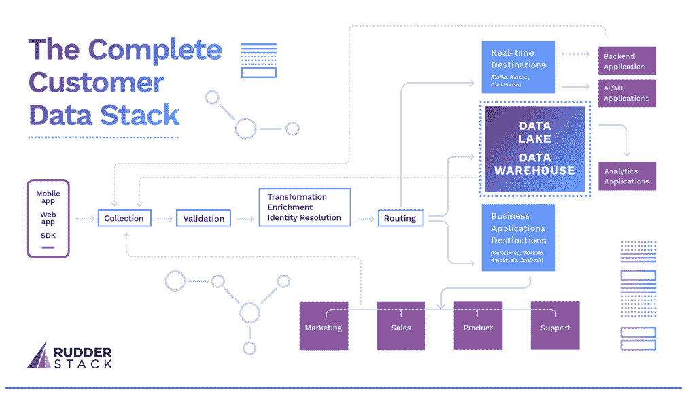

# 使用开源堆栈重新定义客户数据分析

> 原文：<https://thenewstack.io/redefine-customer-data-analytics-using-an-open-source-stack/>

 [开发者倡导者

Nica Fee 帮助团队采用无服务器，优化他们在 AWS 上的成本。她是 New Relic 的无服务器开发者倡导者。](https://www.linkedin.com/in/serverlessmom/) 

在本帖中，我们将讨论如何使用开源工具构建您的整个客户堆栈，而不必牺牲数据的安全性或从客户数据中提取有效分析所需的时间。

如今，数据是推动组织关键运营决策的燃料。然而，随着数据量的增长，管理数据变得越来越棘手。从所有进来的数据中检索洞察力也变得同样具有挑战性，并且只有一部分数据被分析，导致不完整的分析。拥有一个强大的数据基础架构，并配备能够让您轻松管理大规模数据并利用数据进行高效分析的工具，这一点现在比以往任何时候都更加重要。这也是越来越多的公司转向使用分析堆栈的原因。

数据分析堆栈使组织中的团队能够查看重要指标并做出数据驱动的决策。它集成了高效收集、存储、转换和分析数据所需的不同技术，以便从中获得重要见解。

当谈到使用分析堆栈时，企业经常面临两种选择——购买专有工具，或者从头开始构建开源分析堆栈。虽然专有工具提供了同类最佳的分析和数据管理服务，但它们也有一些主要缺点，包括溢价定价计划、供应商锁定和有限的灵活性。

出于这些原因，许多公司更喜欢构建开源分析堆栈来满足他们特定的业务需求。

## 为什么选择开源分析堆栈？

与使用专有分析工具相比，开源分析堆栈提供了一些非常重要的优势。

企业经常面临预算挑战，开源解决方案允许他们从小规模起步，同时探索其他开源解决方案。与专有解决方案相比，这些开源产品的企业版价格也相当合理。

就您用来构建堆栈的工具而言，开源产品提供了更好的灵活性。这鼓励了团队的创新，并给予他们充分利用更好特性的自由，否则这些特性将在企业版中得到补偿。此外，由于您的开源产品运行在您的云和本地环境中，您可以完全控制您的数据。您可以实现一组协议来决定谁可以在何时访问这些数据。

专有工具使我们在更新、错误修复等方面严重依赖供应商。另一方面，开源开发者社区管理分析堆栈中的开源产品，因此更新和错误修复可以更快地推出，而不需要依赖个人或一组开发人员。

我们已经看到了选择开源分析如何更好地处理您的客户数据，从而让工程团队专注于构建更好的产品。

一个伟大的开源分析栈是什么样子的？

一个优秀的分析堆栈应该能够:

*   集成多个平台中的数据(不同格式)
*   将数据接收到存储系统(数据仓库)中
*   为不同的用例清理和转换数据
*   将转换后的数据用于可视化或机器学习等分析

理想的开源分析堆栈应该是这样的:

我们的目标是帮助您了解如何用完全开源的解决方案取代您的整个数据分析体系，从而帮助您的企业以最低的成本和高度的安全性进行扩展。

## 开源分析堆栈是由什么组成的？

几乎所有数据分析系统都遵循相同的基本方法来设置其分析堆栈:数据收集、数据处理和数据分析。用于执行这些方法的工具构成了分析堆栈。开源分析栈没有什么不同，只是它使用开源工具来获得与专有工具相同的结果，甚至具有更好的功能。

让我们详细了解每个过程，以及开源工具如何为开源分析堆栈中的每个过程做出贡献。

### 数据接收和转换

收集用于分析的数据的首要步骤是从所有来源获取数据，包括您的内部应用程序、SaaS 工具、来自物联网设备的数据以及所有其他来源。有各种工具可以使这个过程成为无缝体验。

**ETL vs ELT**

直到最近，数据接收都遵循一个简单的 ETL(提取、转换和加载)过程，在该过程中，从源收集数据，重新调整以适应目标系统的属性或业务需求，然后加载到该系统。创建内部 ETL 工具将意味着让开发人员远离面向用户的产品，这会将分析环境的准确性、可用性和一致性置于风险之中。虽然商业打包的 ETL 解决方案是可用的，但是开源替代方案是一个很好的选择。Singer 就是这样一个例子，它是一个开源的 ETL 工具，用于编程连接器，以便在任何定制源和目标(如 web APIs 和文件)之间发送数据。

由于基于云的数据仓库的兴起，企业可以直接将所有原始数据加载到数据仓库中，而无需事先转换。这一过程被称为 ELT(提取、加载、转换),它让数据和分析团队能够根据自己的特定需求自由开发临时转换。随着云的处理能力和规模可以用来转换数据，ELT 变得流行起来。DBT 是 ELT 推荐的一个流行的开源工具，允许企业更有效地转换仓库中的数据。

### **实时数据流**

随着实时数据流和事件流的增加，某些使用情形(如金融服务风险报告或检测信用卡欺诈)需要访问实时数据。使用像 [Apache Kafka](https://kafka.apache.org/) 这样的流处理框架可以获得实时流。重点是将来自不同来源的数据流引导到可靠的队列中，在队列中可以同时自动转换、存储、分析和报告数据。

### 客户数据平台(CDP)

谈到成功的数据摄取工具，大多数企业越来越依赖不同的客户数据平台(CDP ),这些平台从多个来源和系统跟踪、收集数据并将其摄取到单个平台中，以获得统一的客户视图。Apache Unomi 是一个开源 CDP 的完美例子，它在一个地方接收和收集数据。

然而，传统的 CDP 已经发生了革命性的变化，现在是为满足当今营销人员的需求而设计的。现代 CDP，如 [Snowplow](https://snowplowanalytics.com/) 和 [RudderStack](https://rudderstack.com/about/) 从多个来源获取数据，并将它们发送到数据库或您的首选目的地，以供您激活使用。

### 数据仓库

这是分析堆栈的下一个重要部分。数据仓库就像是公司存储从不同来源收集的数据的公共存储库，在这里可以针对不同的用例对数据进行转换或组合。数据仓库存储原始数据和转换后的数据，组织中的所有员工都可以轻松访问。传统数据库旨在存储基于特定领域(如财务、人力资源等)的数据，这导致了数据仓库中巨大的数据孤岛和互不关联的数据。这些年来，随着云数据仓库的扎根，越来越多的公司正在从内部迁移到现代数据仓库。

此外，使用开源仓库工具可以以更低的成本实时从您的数据中释放更多的洞察力。PostgreSQL 是一个高效低成本数据仓库解决方案的流行例子。另一个例子是 [ClickHouse](https://github.com/ClickHouse/ClickHouse) ，它允许根据数据实时生成分析报告。

### 数据消费者

在您的数据被接收和转换后，它将被发送到不同的平台，以利用尖端的分析并从您的数据中获得更多。有各种工具可以满足您不同的分析需求。专有工具不允许您在不购买其企业版的情况下充分利用您的数据。我们已经策划了一些开源工具，将适合不同的数据分析。

[Matomo](https://matomo.org/) 是一款开源网络分析工具，自称是谷歌分析的替代品。Matomo 让你对你的网站的访问者，营销活动等有价值的见解。，轻松优化您的策略和访问者的在线体验。

自托管的 [PostHog](https://posthog.com/) 是一个优秀的开源产品分析替代方案，可以轻松集成到您的基础设施中。你可以很容易地分析客户如何与你的产品互动，用户流量，以及提高你的用户保留率的方法。

Countly 也是一个开源产品分析平台，主要面向营销组织。它有助于营销人员跟踪网站信息(网站交易、活动和引导访问者访问网站的来源等)。).Countly 还收集实时移动分析指标，如活跃用户、在应用中花费的时间、客户位置等。在仪表板上的统一视图中。

### 商业智能

商业智能已经在几乎每个组织中流行，以便对他们的业务操作进行定期健康检查。BI 为企业提供了分析历史数据、将知识应用于当前运营以及为未来做出更明智的业务决策的绝佳方式。每个企业都有不同的目标，因此选择一个完全符合用例的 BI 工具至关重要。

借助自助式仪表盘，业务领导可以充分利用 BI 工具来了解他们的决策对业务的影响。BI 工具还提供具有可定制功能的特别分析，如数据过滤器和分组数据，以发现有趣的趋势。开源 BI 平台，如 [Apache SuperSet](https://superset.apache.org/) 和 [Metabase](https://www.metabase.com/) 易于部署，无需 IT 人员参与。Metabase 允许您询问有关数据的问题，并将数据可视化作为输出共享。同样，Apache SuperSet 帮助企业探索和可视化从简单的折线图到详细的地理空间图的数据。企业可以轻松地将这些工具与数据仓库中任何一组转换后的数据联系起来，以获得想要的结果。

### 使用机器学习进行分析

许多数据公司可能没有完全实施这套高级分析，但如果加以利用，它们可以为您的数据增加价值。机器学习(ML)允许您将转换或建模的数据输入到部署在 R、Python 等开源工具上的 KNIME 等平台，以训练、评估和部署模型。这些模型与公司现有的面向客户的产品相集成，如推荐引擎和其他 ML/AI 用例。

## 结论

从您使用过的工具迁移到一个完全开放的源代码堆栈可能是一个挑战。然而，随着数据的发展，业务也在发展，需求也在变化。你将不得不寻找一种新的工具来扩展和增长。我们建议您尝试实现开源工具，因为它们非常可靠，并且具有额外的优势。

大卫·马克·德·皮沙贝特写

<svg xmlns:xlink="http://www.w3.org/1999/xlink" viewBox="0 0 68 31" version="1.1"><title>Group</title> <desc>Created with Sketch.</desc></svg>