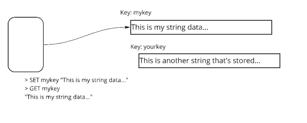
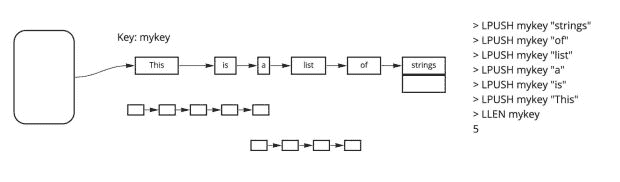
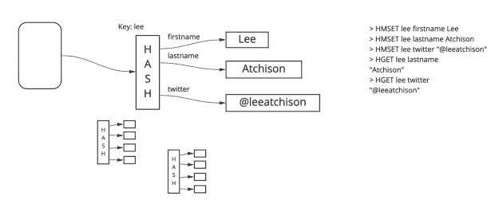
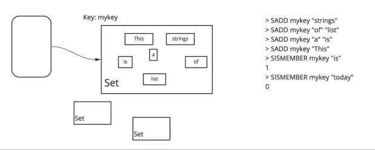
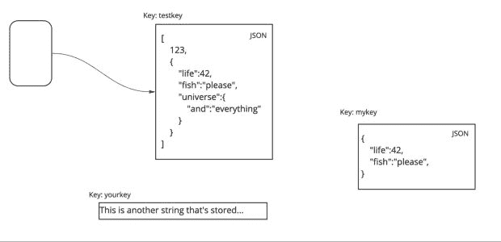

# Redis 数据类型:基础知识

> 原文：<https://thenewstack.io/redis-data-types-the-basics/>

Redis 通常被称为键值存储，因为存储在数据库中的每个值都被附加到一个键上，该键用于查找该值。

然而，这个定义并没有公平对待 Redis。Redis 中存储的值不一定是简单类型。它可以是复杂的结构化数据类型。

在本文中，我们将向您介绍 Redis 中最常用的数据类型。

## Redis 键

Redis 关键字是存储在 Redis 中的数据的索引。Redis 键是字符串，一个唯一的字符串代表 Redis 中的一个对象。字符串是二进制安全的，这意味着密钥可以是任何二进制数据。

命名键的一个好习惯是创建并坚持一个特定的模式。例如，识别对象的一个常见方案是使用一个`object-type:id`模式。因此，代表用户 id#1000 的对象将被附加到键名`user:1000`上。一个表示订单号为 1234 的采购订单的对象可能被附加到一个名为`order:1234`的键上。

此外，与基本对象相关的键可以在键上使用后缀。例如，当用户 id#1000 可以使用密钥`user:1000`时，与该用户相关联的队列可以使用密钥`user:1000:queue`。

在一个 Redis 数据库中，一个键被附加到一个值上。每个值都附加到一个键上，并且所有的键名都必须是唯一的。

虽然键名可能非常大(最长可达 512MB)，但出于性能原因，应该保持键名非常小，通常小于 100 字节。为了保持合理的性能，只需避免使用非常长的键(长度为几千字节或几兆字节)。没有理由让键名尽可能小(例如，使用`u1000`而不是`user:1000`或者`o1234`而不是`order:1234`)，因为 5 字节键名相对于 10 字节键名的性能影响微乎其微。

## 一些 Redis 数据类型

Redis 中有五种常用的数据类型。它们构成了基本 Redis 实例中大多数数据访问的基础，包括:

*   **字符串:**最基本的数据类型。在 Redis 中，字符串是多用途的。它们可以存储像整数一样简单的数据，也可以存储像 JPEG 图像文件一样复杂的数据。
*   **列表:**一个简单的字符串列表。在列表中的位置是重要的并且被保持。
*   **集合:**字符串的简单集合。字符串的集合是无序的，在集合中的位置并不重要。
*   **排序集:**字符串的有序集合。有序集合就像常规集合一样，除了位置是确定的和重要的。集合中的位置由分配给集合中每个字符串的优先级分数决定。
*   **Hash:** 表示字段和值之间映射的对象。除了字符串之外，这可能是最重要的数据类型。哈希可以存储相对复杂的数据，比如带有命名属性的对象。

以下是这些核心数据类型的概述。

### 线

字符串数据类型是 Redis 中最基本的数据类型。可以使用 SET 命令将字符串附加到一个键上进行存储:

```
redis>  SET mykey  "This is a string"
OK

```

可以使用 GET 命令读回字符串:

```
redis>  GET mykey
"This is a string"

```

字符串作为本地 Redis 对象附加到一个键上存储。图 1 展示了字符串是如何存储和分配给键的。左边的用户操作分配给键`mykey`的字符串。



图一。基本字符串数据类型

一个字符串可以包含任何原始数据值，包括二进制文件，最大为 512 MB。这意味着您可以使用 Redis 的字符串类型来存储二进制数据，如 JPEG 图像文件。

### 使用字符串作为数字

字符串也可以存储数字。很自然，Redis 提供了操作数字的命令。

例如，让我们假设您创建了以下键:

存储数字零的字符串表示。Redis 提供了可以将该字符串作为数字进行操作的命令:

```
redis>  INCR numkey
1
redis>  INCR numkey
2
redis>  INCR numkey
3
redis>  GET numkey
"3"

```

可以增加任意数量:

```
redis>  GET numkey
"3"
redis>  INCRBY numkey  20
23
redis>  INCRBY numkey  100
123
redis>  GET numkey
"123"

```

等价地，有一个`DECR`和`DECRBY`命令。

负数按预期工作:

```
redis>  SET numkey  "24"
"24"
redis>  DECRBY numkey  100
-76
redis>  GET numkey
"-76"

```

注意，只支持整数。浮点数、分数和其他非数字不能以这种方式操作。

```
redis>  SET numkey  "12 monkeys"
redis>  INCR numkey
(error)  ERR value is not an integer or out of range

```

### 目录

列表数据类型允许您以有序的方式存储字符串集合。一个重要的概念是:这些字符串是按照它们被插入列表的顺序存储的。

图 2 显示了一个分配给字符串列表的键。在这种情况下，字符串列表是单词列表，但是列表的元素可以是字符串类型的任何东西，如上所述。



图二。基本列表数据类型

列表通常被实现为简单的链表。在列表的前面或后面添加、删除或读取元素是一种快速、廉价的操作。但是，读取列表中任意位置的元素的开销要大得多，速度也慢得多。

较小的列表可以使用更省时的 ziplist 编码模型进行编码，该模型使用双向链表，从而降低了成本。但是，鉴于 ziplist 只用于较小的列表，这种效率不适用于较大的列表，较大的列表更容易出现性能问题。如果性能是一个重要因素，那么可以研究 ziplist 和 listpack 等选项。

要将元素添加到列表的左端，使用`LPUSH`命令；用`RPUSH`命令在右端添加元素。您可以使用`LPOP`和`RPOP`命令从任意一端读取和删除字符串。

假设我们使用以下命令创建了一个列表:

```
redis>  LPUSH mylist  "first"
redis>  LPUSH mylist  "second"
redis>  LPUSH mylist  "third"
redis>  LPUSH mylist  "fourth"

```

列表包含四个元素(`LLEN`给出列表中字符串的数量):

您可以使用`LRANGE`命令:
随时检索列表的所有内容

```
redis>  LRANGE mylist  0  -1
"fourth"
"third"
"second"
"first"

```

最后，你可以从列表的任意一端读取和移除元素:

```
redis>  LPOP mylist
"fourth"
redis>  RPOP mylist
"first"

redis>  LRANGE mylist  0  -1
"third"
"second"

```

这只是一个开始。还有其他方法来操作列表和许多命令。列表非常适合实现队列，尤其是基于先进先出(FIFO)的队列。FIFO 队列很常见，例如处理客户请求、打印作业和技术支持队列的队列。

### 混杂

哈希数据类型非常强大。从表面上看，可以把散列数据类型看作是另一个键值内部的一组封闭的键/值对。嵌入的键被称为**字段**。因此，一个字符串被存储在一个**键**和该键中一个特定的**字段**中。它们的构建方式基本上允许创建带有指定属性的复杂对象。

图 3 展示了如何存储散列的基础知识。该键与一个散列对象相关联。该散列对象可以具有与各个字符串相关联的多个字段(即，子项)。这允许您存储更复杂的数据类型。



图 3。基本散列数据类型

散列的用途和重要性最好用一个例子来说明。假设我们想要存储一个代表`User`的对象。下面是如何将一个名为`lee`的`User`存储为一个散列:

```
redis>  HMSET lee firstname Lee
redis>  HMSET lee lastname Atchison
redis>  HMSET lee twitter  "@leeatchison"

```

这些命令创建一个散列类型的对象，用关键字`lee`命名。该对象分配有三个属性，与三个唯一的字段相关联。第一个是存储在字段`firstname`中的名字(Lee)。用户的姓氏(Atchison)存储在字段`lastname`中。最后，字段`twitter`存储他们的 Twitter 句柄(@leeatchison)。

`HMGET`命令返回给定用户的属性。例如，要返回用户 lee 的姓氏，可以使用:

```
redis>  HMGET lee lastname
"Atchison"

```

如果您有另一个名为`beth`的用户，存储为一个单独的哈希对象，您可以使用:
获得他们的 Twitter 句柄

```
redis>  HMGET beth twitter
"@heartsdeesire"

```

由于散列可以存储复杂的对象，散列是 Redis 中除基本字符串之外最重要的数据类型之一。

### 一组

set 数据类型允许您在容器中存储无序的字符串。您可以向集合中添加字符串实例，也可以从集合中移除字符串实例。每个字符串在集合中最多只能出现一次。您可以查询该集合以查看其中是否包含字符串，或者可以列出其内容。

图 4 显示了一个包含几个字符串的基本集合。



图 4。基本集合数据类型

我们来构造一个集合:

```
redis>  SADD my_set  "first"
redis>  SADD my_set  "second"
redis>  SADD my_set  "last"

```

我们可以查询集合，看看里面有什么:

```
redis>  SISMEMBER my_set  "first"
1
redis>  SISMEMBER my_set  "third"
0
redis>  SISMEMBER my_set  "last"
1

```

使用`SISMEMBER`，我们确认“第一个”和“最后一个”在集合中，但“第三个”不在。

我们还可以使用`SMEMBERS` :
来查看集合中包含的内容

```
redis>  SMEMBERS my_set
"first"
"second"
"last"

```

我们可以向集合中添加更多成员:

```
redis>  SADD my_set  "third"
redis>  SADD my_set  "second"

```

这样做可以将值“third”添加到集合中。但是，值“秒”已经存在于集合中，因此不会重新添加。

```
redis>  SMEMBERS my_set
"first"
"second"
"last"
"third"

```

可以对器械包进行多种操作。例如，您可以合并两个或多个器械包:

```
redis>  SADD set1  a
redis>  SADD set1  b
redis>  SADD set1  d

redis>  SADD set2  c
redis>  SADD set2  d
redis>  SADD set2  e

```

给定这两个集合，我们可以返回包含这两个集合的并集:

```
redis>  SMEMBERS set1
"a"
"b"
"d"
redis>  SMEMBERS set2
"c"
"d"
"e"

redis>  SUNION set1 set2
"a"
"b"
"c"
"d"
"e"

```

您也可以存储该联合操作的结果:

```
redis>  SUNION sets1_2 set1 set2
redis>  SMEMBERS sets1_2
"a"
"b"
"c"
"d"
"e"

```

您可以执行交集运算，也可以执行差集运算:

```
redis>  SINTER set1 set2
"d"
redis>  SDIFF set1 set2
"a"
"b"

```

可以在器械组上执行许多其他操作。

### 排序集合

排序集数据类型类似于常规集，只是每个字符串都有一个优先级顺序号。该数字指定了它在集合中的有序位置。

```
redis>  ZADD thesset  1  "first"
redis>  ZADD thesset  5  "second"
redis>  ZADD thesset  3  "last"

```

您现在可以获得集合中的对象列表，按照优先级编号排序:

```
redis>  ZRANGE thesset  0  -1
"first"
"last"
"second"

```

如果有序集合中的所有元素具有相同的分数，则使用[字典顺序](https://redis.com/redis-best-practices/indexing-patterns/lexicographical-encoding/)。

这个`ZRANGE`命令指示按照优先级顺序返回存储在`thesset`中的值，从第一个(0)开始，一直到集合中的所有字符串(-1)。

您可以将元素添加到集合中，并将其插入到适当的位置:

```
redis>  ZADD thesset  4  "third"
redis>  ZRANGE thesset  0  -1
"first"
"last"
"third"
"second"

```

与其他集合相关的命令一样，有一些命令允许你返回部分已排序的集合，并颠倒顺序。所有相同的交集、并集和差运算也可用。

排序后的集合对于某些任务非常有价值，例如[创建排行榜和高分列表](https://redis.com/blog/leaderboards-ranked/)。

### 字符串的其他用途:位图

我们已经讨论了使用简单字符串作为数字的特殊情况，以及可以将字符串作为数字操作的命令(如`INCR`和`INCRBY`)。但是还有更多。

您还可以像处理二进制位数组一样处理简单的字符串。在 Redis 中，这被称为**位图**。本质上，字符串中每个字节的每一位都代表数组中的二进制值 0 或 1。这非常适合在非常大的数组中操作简单的是/否或开/关对象，因为它使用少量的内存。

例如，您可以使用如下命令设置或重置数组中的位:

```
redis>  SETBIT myarray  15  1
redis>  SETBIT myarray  23  0
redis>  SETBIT myarray  1203  1

```

然后，可以得到数组中的任意元素:

```
redis>  GETBIT myarray  4
"0"
redis>  GETBIT myarray  15
"1"
redis>  GETBIT myarray  23
"0"
redis>  GETBIT myarray  1000
"0"
redis>  GETBIT myarray  1203
"1"

```

这个基本数组被有效地存储在一个字符串中。在这个例子中，这个数组有 1204 个值(0-1203)，它可以存储在一个仅包含 151 字节内存的简单字符串中。

位图不是不同的数据类型，而是操作字符串数据类型的不同方式，很像`INCR`和`DECR`将字符串数据类型作为整数操作。

## 使用 JSON 的结构化数据

本文主要关注 Redis 开发人员最常用的数据类型。但是不要认为“基本要素”和“Redis 提供的一切”是一样的。一旦熟悉了这些基础知识，就可以用真正强大的方式扩展 Redis 了。

例如，Redis 最强大的数据结构之一是 JSON 模块。Redis 可以在单个 Redis 键中存储任意 JSON 文档，如图 5 所示。您使用 Redis `SET/GET`命令的特殊 JSON 版本将这些 JSON 文档存储在 Redis 中。然而，一旦 JSON 被存储在一个键中，就可以用有趣的、潜在的强大方式来操纵数据。



图 5。Redis 中的结构化 JSON 被分配给一个键

所有这些都是通过加载 RedisJSON 模块实现的。这个模块允许您在 Redis 中存储任何类型的数据，包括定制数据类型，其格式可以很容易地重构为可用的数据。

一旦加载了模块，在 Redis 中创建 JSON 文档就很容易了。下面是在一个名为`testkey` :
的 Redis 键内创建和操作 JSON 文档的示例

```
redis>  JSON.SET testkey  .  '[ 123, { "life": 42, "fish":"please"} ]'
OK
redis>  JSON.GET testkey
"[123,{\"life\":42},{\"fish\":\"please\"}]"

```

创建后，您可以操作 JSON 文档的单个元素:

```
redis>  JSON.SET testkey  .  '[ 123, { "life":42, "fish":"please"} ]'
OK
redis>  JSON.GET testkey  [1].life
"42"
redis>  JSON.GET testkey  [1].fish
"please"

```

你可以返回部分 JSON 树:

```
redis>  JSON.SET testkey  .  '[ 123, { "life":42, "fish":"please", "universe":{ "and":"everything" } } ]'
OK
redis>  JSON.GET testkey  [1].universe
"{\"and\":\"everything\"}"

```

或者你可以遍历更深的树:

```
redis>  JSON.SET testkey  .  '[ 123, { "life":42, "fish":"please", "universe":{ "and":"everything" } } ]'
OK
redis>  JSON.GET testkey  [1].universe.and
"everything"

```

## 复杂的操作

除了存储和检索 JSON 文档的全部或部分，您还可以用有趣和高级的方式操作 JSON 文档。例如，如果我们像这样创建一个 JSON 文档:

```
redis>  JSON.SET testkey  .  '[123,{"life":42,"fish":1}]'

```

我们可以用以下任何一种方式来阅读

```
redis>  JSON.GET testkey
"[123,{\"life\":42,\"fish\":1}]"

redis>  JSON.GET testkey  [1].life
42

```

现在让我们试着改变 JSON 文档的内容:

```
redis>  JSON.NUMINCRBY testkey  [1].life  1

redis>  JSON.GET testkey
"[123,{\"life\":43,\"fish\":1}]"

redis>  JSON.NUMINCRBY testkey  [1].fish  123

redis>  JSON.GET testkey
"[123,{\"life\":43,\"fish\":124}]"

redis JSON.GET testkey  [1].life
43
redis JSON.GET testkey  [1].fish
124

```

还有许多其他方式来操作 JSON 文档，包括向文档添加信息(`SET`、`STRAPPEND`、`ARRAPPEND`、`ARRINSERT`)、从文档中移除信息(`DEL`、`ARRPOP`、`ARRTRIM`)、操作文档中的对象(`NUMINCRBY`、`STRAPPEND`)以及检查单个对象(`GET`、`MGET`、`TYPE`)。

Redis 还使您能够对存储在 JSON 文档中的数据进行索引、查询和全文搜索。

## 高级数据类型

这里描述的数据类型是开始构建 Redis 的基础。Redis 支持许多其他数据类型，您也可以创建自己的数据类型。

Redis 提供的一些高级数据模型和引擎包括:

*   **搜索:**实现 Redis 的查询、二次索引和全文搜索。深入 Redis 数据库以超快的速度检索信息，支持精确短语匹配、地理过滤和向量相似性。如果您有一个客户或产品数据库，需要近乎即时的响应，这是显而易见的。
*   **布隆:**允许存储概率数据结构，包括[布隆过滤器](https://redis.com/blog/bloom-filter/)。
*   **图形:**允许存储复杂的相关数据。它对于社交图操作、欺诈检测和实时推荐算法非常有用。
*   **时间序列:**允许存储随时间变化的数据并对数据进行分析。典型的例子是股票价格、温度探头测量和遥测。

Redis 有各种各样的数据类型、模型和引擎，允许以有趣和有用的方式存储和操作数据。如果使用得当，它们可以用来存储复杂的数据结构，并使数据可以快速有效地访问。

准备好探索了吗？你可以[用 Redis 栈](https://redis.io/docs/stack/)开始构建或者利用 [Redis 的开发者资源](https://developer.redis.com/)。

<svg xmlns:xlink="http://www.w3.org/1999/xlink" viewBox="0 0 68 31" version="1.1"><title>Group</title> <desc>Created with Sketch.</desc></svg>