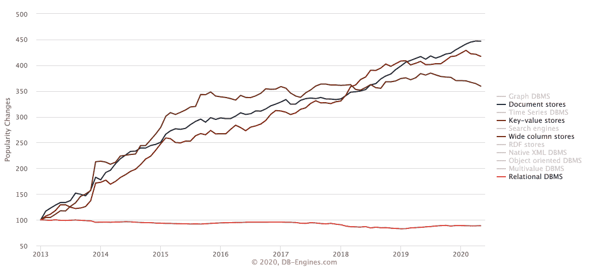

# 人工智能时代的 Redis

> 原文：<https://thenewstack.io/redis-in-the-age-of-ai/>

关系数据库仍然是世界上使用最多的数据库类别，但是它的流行趋势线已经持续了几年。与此同时，其他更具云原生性的数据库系统类型也呈上升趋势。这在各种风格的 NoSQL 数据库系统中尤其明显，比如文档存储( [MongoDB](https://www.mongodb.com/) )、键值存储( [Redis](https://redis.io/) )和宽列( [Cassandra](https://cassandra.apache.org/) )。

来自 DB-Engines 的下图[清楚地显示了这一趋势:](https://db-engines.com/en/ranking_categories)

NoSQL 数据库系统增长如此之快的部分原因是它们与所谓的“大数据”的兼容性，如人工智能(AI)和机器学习(ML)。因为 NoSQL 数据库比关系数据库更少结构化，所以它们更灵活，可以更好地扩展——对于需要由 AI 和 ML 系统处理的大量数据来说，这两个属性都很重要，通常是实时的。

 [理查德·麦克马努斯

Richard 是 New Stack 的高级编辑，每周撰写一篇专栏文章，探讨云计算原生互联网的未来。此前，他在 2003 年创立了读写网，并将其打造为全球最具影响力的科技新闻和分析网站之一。](https://twitter.com/ricmac) 

为了更好地理解为什么 NoSQL 现在如此受欢迎，以及这些系统如何处理人工智能和人工智能，我采访了 NoSQL 最受欢迎的数据库公司之一的创始人 [Redis Labs](https://redis.com/) 。 [Yiftach Shoolman](https://www.linkedin.com/in/yiftachshoolman/) 自 2011 年以来一直是该公司的首席技术官，最近监督了 Redis 实验室新模块 RedisAI 的发布。

“我认为今天，人们更加开放地看待新的数据模型，”Shoolman 告诉我。他说，企业寻找关系数据库的替代品有两个主要动机。第一个是可伸缩性，第二个是当关系数据库本身不支持应用程序所需的数据模型时。后者的一个例子是电子商务网站上的实时推荐，这需要一个可以快速将大量不同数据连接在一起的数据库(这方面的一个选项是图形 DBMS 产品，[如 Neo4j](https://neo4j.com/use-cases/real-time-recommendation-engine/) )。

Redis 是一个键-值数据库系统，这意味着它存储成对的键和值，但像 Neo4j 一样，它也是为实时 web 优化的。事实上，它是为实时网络而发明的。当 [Salvatore Sanfilippo](https://twitter.com/antirez) 于 2009 年[开始开发 Redis】时，那是因为他当时正在开发一个实时分析引擎，并努力使其与关系数据库一起扩展。所以他做了任何聪明的开发者都会做的事情:他构建了自己的解决方案。这变成了开源的 Redis，现在是世界上第八受欢迎的数据库](https://thenewstack.io/open-source-builders-how-redis-upended-the-database-market/)(在键值类别中排名第一)。

Redis 有一个[内存](https://www.techopedia.com/definition/28539/in-memory-computing)数据结构，这意味着它使用随机存取存储器(RAM)存储数据。这使得它比传统数据库快得多；并且非常适合用作缓存系统。这就是 Redis 与关系数据库及其 NoSQL 竞争对手(如 MongoDB 和 Cassandra)的区别。根据 Shoolman 的说法，由于其内存结构，Redis“非常非常适合实时应用[并具有]亚毫秒级延迟。”

内存中的一个缺点是，特别是对人工智能来说，它没有其他数据库系统那样的容量。鉴于人工智能依赖于尽可能多的数据，这可能是一个大问题。查询数据也不容易，这是关系数据库的优势，如 [Oracle](https://www.oracle.com/) 和 [MySQL](https://www.mysql.com/) (以及新兴的云原生 SQL 数据库，如[cocroach db](https://www.cockroachlabs.com/))。

虽然 Shoolman 承认 Redis“在许多情况下仍被用作缓存系统”，但他说 Redis 实验室(该公司)的目标是帮助企业“不仅仅将它用作缓存”该公司主要通过 Redis Enterprise 来实现这一点，Redis Enterprise 是建立在开源 Redis 数据库之上的商业平台。

Redis 实验室将 Redis 的核心功能扩展为一个完整的“数据库平台”的方式是通过模块，其中 [RedisAI](https://redis.com/redis-enterprise/redis-ai/) 就是其中之一。RedisAI 是与人工智能软件专家 [Tenserwerk](https://tensorwerk.com/) 合作开发的，它使你能够在 Redis 数据库中运行人工智能推理引擎。这太复杂了，无法进入这里，但是 Shoolman 写了一篇关于它的信息丰富的博客文章，如果你想知道真相的话。

Shoolman 在我们的电话中告诉我的一个关键点是，RedisAI 模块不会**而不是**训练你的数据——为此，你需要一个像 [TensorFlow](https://www.tensorflow.org/) 或 [PyTorch](https://pytorch.org/) 这样的工具(两个用于机器学习的开源平台)。RedisAI 的用武之地是应用层，此时需要对数据应用逻辑(推理)，然后将数据提供给用户。

“我们认为你需要在云端的某个地方训练你的(人工智能)模型，”Shoolman 解释道。"一旦你想做服务或推理，Redis 是合适的数据库."

Shoolman 举了一个信用卡交易评分的例子。最终，系统必须决定交易是通过还是失败。“为了做到这一点，”舒尔曼说，“你需要添加用户资料、商家资料、教育资料、活跃交易数据本身，[然后]将一切矢量化，并将其发送给人工智能。”

RedisAI 是人工智能软件和数据之间的一种渠道。速度是游戏的名字，至少在 Redis 看来是这样。当然，准确性部分也很关键，但这可能是人工智能训练平台的责任。

Shoolman 认为，企业未来面临的主要挑战之一是，他们是否希望坚持传统的(关系数据库的)孤岛方法，或者他们是否将采用多模型方法来支持针对单个后端的多个数据模型。Redis Enterprise 是后者的一个例子，它的每个模块都支持不同的数据模型。

Shoolman 说这取决于你想要达到的目标。与多模型方法相比，有些事情关系数据库是做不到的。

“如果你考虑需要结合多种数据模型的事务，”Shoolman 说，“并且仍然需要实现亚毫秒级延迟，那么在孤岛式方法中就没有办法做到这一点。”

在接下来的专栏中，我将研究其他数据库公司如何适应人工智能时代——包括关系数据库供应商。

Redis 实验室、MongoDB 和蟑螂实验室是新堆栈的赞助商。

通过 Pixabay 的特征图像。

<svg xmlns:xlink="http://www.w3.org/1999/xlink" viewBox="0 0 68 31" version="1.1"><title>Group</title> <desc>Created with Sketch.</desc></svg>