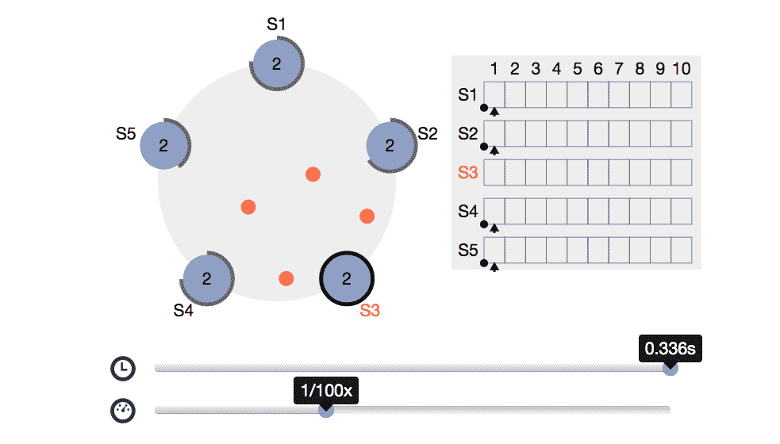

# Redis 实验室的 RedisRaft 旨在提高数据库的一致性

> 原文：<https://thenewstack.io/redis-labs-redisraft-aims-to-improve-database-consistency/>

开源数据库提供商 [Redis Labs](https://redis.com/) 继续扩展其产品，因为它进一步拉开了自己与众所周知的可靠的 [NoSQL](https://en.wikipedia.org/wiki/NoSQL) 缓存提供商的距离。为此，Red Labs 最近发布了[redscript](https://github.com/RedisLabs/redisraft)，这是一个开源项目，旨在帮助培养更多的数据库复制选项。其目标是通过使用 RedisRaft，更好地使最终用户组织从 Redis 服务器和平台的强一致性部署中受益。

相比之下，Redis 实验室说 Raft 提供了同样高标准的一致性和稳定性 [Apache ZooKeeper](https://zookeeper.apache.org/) 和 [Etcd](https://etcd.io/) ，Redis 坚持说，Redis 实验室的首席架构师 Yossi Gottlieb 告诉新堆栈。

对于 IT 操作，这个想法是依靠 Raft 来增加运行在 Redis 上的数据库基础设施的稳定性和一致性。一个典型的用例场景可能是一个使用 Redis 管理事务性数据的元数据实例的组织。

“你可以通过简单地将模块插入 Redis 来实现这么多，而不是以一种安全的方式对 Redis 本身进行更改，”Gottlieb 说。"这就是我创建 RedisRaft 的初衷."

戈特利布还说，再草稿提供:

*   高度一致的确认写入，“保证被提交且永不丢失”
*   返回最新提交写入的读取。

An example of a Raft cluster running in a browser. (Photo: Redis Labs)

然而，Redis 实验室表示，它仍然对 RedisRaft 的局限性保持透明。Gottlieb 说，这些限制来自众所周知的“ [CAP 定理](https://en.wikipedia.org/wiki/CAP_theorem)”，该定理表明分布式系统要么更可用，要么更一致。例如，通过该模块管理的集群依赖于大多数 Redis 服务器节点的运行和连接。

Gottlieb 说，在 Redis 4 中引入了 Redis API 模块以支持实现新数据类型和命令的模块后，Redis 实验室在 2018 年发布 [Redis 5](https://redis.com/blog/redis-5-0-is-here/) 前不久首次开始了 RedisRaft 的工作。RedisRaft 是一项努力的一部分，目的是看看“扩展 API”的可能性有多大，并创建模块来实现这一点。Gottlieb 说，这些模块旨在支持新类型的命令，这些命令可以扩展到所有 Redis 服务器，就像上面提到的那样，它们作为单个集群运行。

在其最近在 GitHub 上可用之前，在 5 月份的 [RedisConf 2020](https://redisconf.com/) 虚拟会议期间推出了 RedisRaft。Raft consensus 算法及其与用于复制重发服务器的开源 C 库的实现将为数据一致性提供净改进。

随着 [Redis 7.0](https://redis.io/download) 的发布，RedisRaft 将在明年进入全面可用阶段。

与此同时，Gottlieb 表示，Redis 实验室正在开源贡献者的帮助下增加 RedisRaft 测试的节奏，同时也在创建新的测试流程。

戈特利布说，虽然 RedisRaft 的“关键功能”已经到位，某些里程碑应该在“未来几周内宣布”。

Redis 实验室是新堆栈的赞助商。

由[朱莉·桑顿](https://unsplash.com/@raftnjules?utm_source=unsplash&utm_medium=referral&utm_content=creditCopyText)在 [Unsplash](https://unsplash.com/s/photos/west-virginia-rafting?utm_source=unsplash&utm_medium=referral&utm_content=creditCopyText) 上拍摄的特写图片。

<svg xmlns:xlink="http://www.w3.org/1999/xlink" viewBox="0 0 68 31" version="1.1"><title>Group</title> <desc>Created with Sketch.</desc></svg>