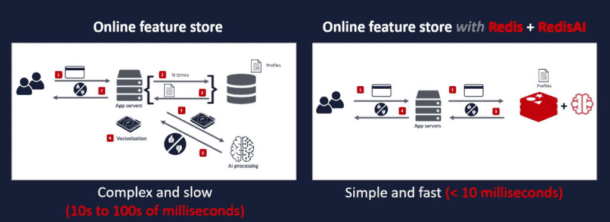
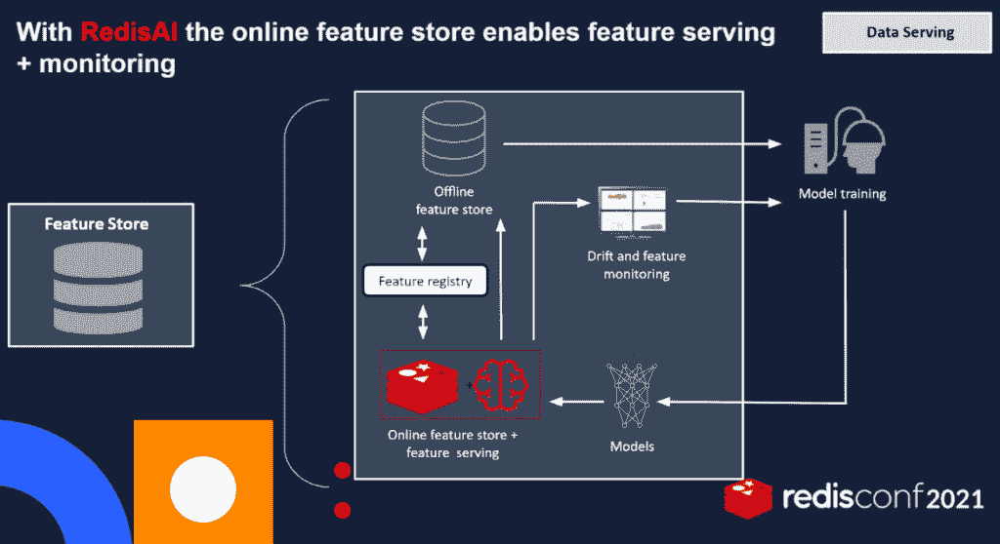
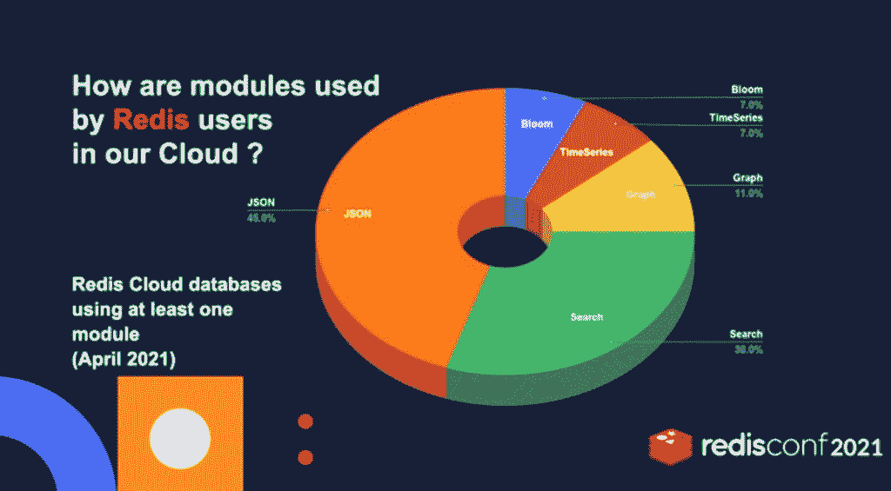
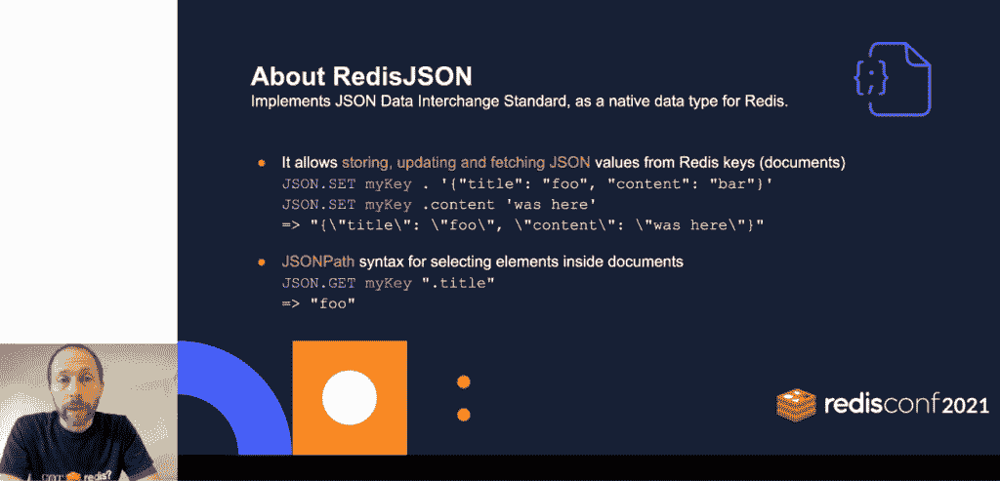

# Redis 实验室:为什么在人工智能时代，延迟不应该是一个问题

> 原文：<https://thenewstack.io/redis-labs-why-latency-shouldnt-be-an-issue-in-the-age-of-ai/>

在其年度 RedisConf 2021 用户大会期间，展示了其扩展其同名缓存内存数据库系统的路线图，以轻松适应微服务和基于人工智能的工作负载。

其新的 Redis 7.0 功能和其他版本——其中大部分将在今年上半年正式上市——应继续建立在 NoSQL 数据库的核心功能之上。提高数据库一致性和扩展能力，同时在多云和内部环境中的多个节点之间保持超低延迟，也仍然是其主要任务。在 Redis 框架下，人工智能也将成为越来越重要的能力。

[T2 企业管理协会(EMA)](https://www.linkedin.com/in/torstenvolk) 的分析师 Torsten Volk 表示:“Redis 从其原始的‘实时’角度出发，有能力解决我们在混合环境中运行微服务应用时遇到的性能挑战，在混合环境中，企业往往难以确保一致的性能。”

“在公共云、数据中心或边缘位置的 Kubernetes 集群上运行这些分布式应用程序会显著增加运营风险，这取决于应用程序代码对突发延迟的鲁棒性，也受企业 IT 提供智能部署和配置策略的能力的影响，”Volk 告诉 New Stack。“Redis 可以通过提供一个联合数据平台来简化这种混乱局面，该平台可以跨应用架构和部署模型带来一致的性能。的确是一出非常有趣的戏。”

在他的演讲[“Redis 7.0 及以后”，](https://redisconf.com/redisconf21/modules/85405/agenda/session/265311) [中，Redis 实验室的首席架构师 Yossi Gottlieb](https://redis.com/team/yossi-gottlieb-chief-architect/) 告诉 New Stack，虽然 Redis 实验室的大部分主要任务是“开发其核心项目”，以及“授权社区并让所有个人贡献者积极参与”，但 Redis“实际上不仅仅是核心项目”

“我相信，扩展 Redis 的部分使命也是扩展生态系统，让生态系统的不同部分更好地互补和兼容，基本上能够实现更多，”Gottlieb 说。

## 人工智能方程式

Redis 已经通过 [RedisAI](http://redisai.io/) 增加了对[特征库](https://towardsdatascience.com/what-are-feature-stores-and-why-are-they-critical-for-scaling-data-science-3f9156f7ab4)——预打包的可重用数据转换——的人工智能支持。它现在可用于内部部署，并将于 2021 年下半年用于 Redis 企业云。

作为一个案例，Redis 7.0 可以用作功能存储，而 RedisAI 将 ML 应用于推理功能，同时确保数据延迟，而 RedisGears 也可以用于与离线功能存储同步，同时保持低延迟。

Redis 实验室首席业务发展官 tai mur Rashid 在 Redis conf 主题演讲中表示:“借助 Redis AI，您可以将推理更贴近功能商店，并有效地获得更低延迟的功能服务和监控。"最后，如果你愿意，可以使用 RedisGears 与离线商店同步."

## Redis 和 JSON 的婚姻

今年早些时候，Redis 实验室发布了 RediSearch 内存索引的 2.0 版本，该公司声称与上一版本相比，该版本提供了两倍多的数据吞吐量。它还提供了额外的方法，使开发人员更容易创建和利用索引。在它的功能中， [RediSearch](https://oss.redis.com/redisearch/) 作为 Redis 之上的二级索引，消除了内部数据结构。这有助于提高响应能力，并使开发人员更容易利用高级任务，如多字段查询、聚合和全文搜索功能，如精确短语匹配和文本查询的数字过滤。

在 RedisConf 期间，该公司描述了 RediSearch 现在如何集成 [RedisJSON](https://oss.redis.com/redisjson/) ，一种 [JSON (JavaScript 对象表示法)](https://www.json.org/)数据交换格式，该公司称这是 Redis 实验室最受欢迎的两个 Redis 模块。在“RedisJSON +作为实时文档数据库的 redis search”的演讲中，redis search 和 RedisJSON 的产品经理 [Emmanuel Keller](https://www.linkedin.com/in/emmanuelkeller/?locale=fr_FR) 描述了 redis search 现在如何利用 JSON API，从而使用它来索引 JSON 文档。在重新搜索一个 JSON 文档的值时关联一个键之后，也可以用 [JSONPath](https://github.com/json-path/JsonPath) 搜索 JSON 文档。

“你有聚合管道，可以让你转换 JSON 文档中的数据，”Keller 说。

<svg xmlns:xlink="http://www.w3.org/1999/xlink" viewBox="0 0 68 31" version="1.1"><title>Group</title> <desc>Created with Sketch.</desc></svg>