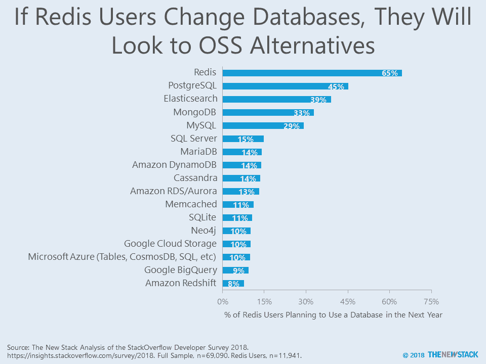
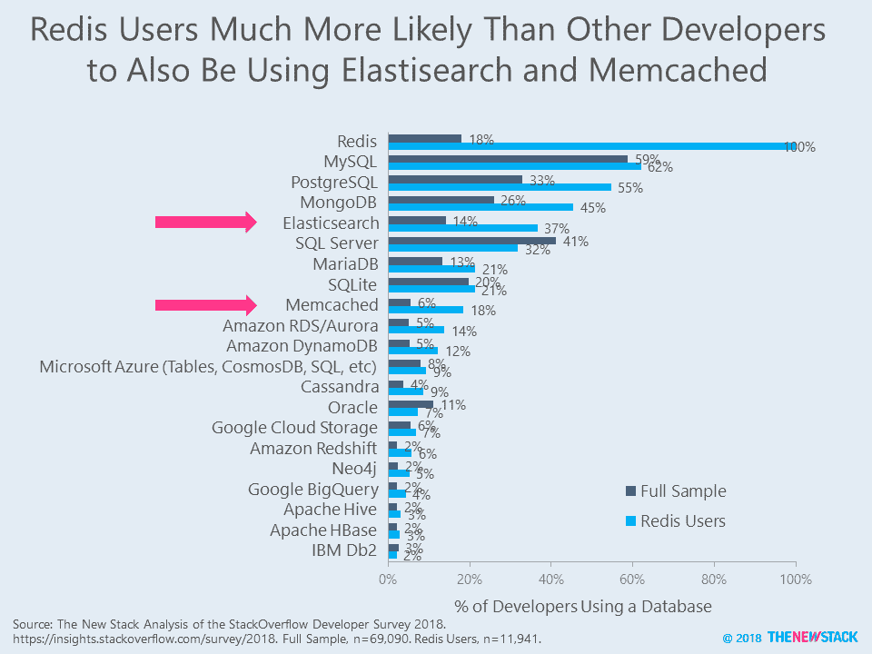

# Redis 撤回开源许可，理由是吝啬的云服务

> 原文：<https://thenewstack.io/redis-pulls-back-on-open-source-licensing-citing-stingy-cloud-services/>

Redis 实验室以缺乏大型云提供商的支持为由，撤回了一些围绕其广受欢迎的 [Redis](https://redis.io/) NoSQL 内存数据存储的开源许可。

虽然 Redis 本身的核心仍然处于许可的 BSD 许可之下，但该公司已经重新措辞了其一些附加模块的许可，实际上阻止了提供基于 Redis 的商业服务的第三方使用它们——最主要的是云提供商。Redis Labs 之所以能够做出这样的改变，是因为它保留了开源代码的版权。

今天的云提供商一再利用“成功的开源项目，并将它们重新包装成有竞争力的专有服务”， [Redis 实验室](https://redis.com/)在[本周早些时候发布的网页](https://redis.com/community/licenses/)中断言。“云提供商对这些开源项目贡献很少(如果有的话)。相反，他们利用其垄断性质从中获取数亿美元的收入。这种行为已经损害了开源社区，并让一些支持开源社区的公司破产。”

亚马逊网络服务、谷歌云平台、IBM 和微软 Azure 都提供 Redis 作为托管服务。AWS 的 [ElasticCache](https://aws.amazon.com/elasticache/) 服务基于 Redis，Azure Redis 缓存[也是如此。然而，Redis 实验室本身资助了开源 Redis 的开发，因此，“理应享受这些努力的成果”，该公司断言。该公司还通过 Redis 企业云在大多数主要云提供商上提供托管 Redis 服务。](https://azure.microsoft.com/en-us/services/cache/)

讨论中的模块用于帮助在 Redis 之上创建托管服务，即 RediSearch、Redis Graph、ReJSON、Redis-ML 和 Rebloom。在修改了 [Commons 子句](http://commonsclause.com/)的 Apache 2.0 下许可，这些仍然可以在任何应用程序中自由使用，尽管它们不能在基于 Redis 的商业产品中使用。为此，你必须打电话给 Redis 实验室，并制定一个付费的许可协议。

## 混合反应

在将于周五晚些时候发布的最新 [TNS Context](https://thenewstack.io/podcasts/context) 播客中，谷歌开发者倡导者[凯尔西·海托华](https://twitter.com/kelseyhightower)对最近的新闻进行了即兴发言，指出“我认为他们做出了一个商业决定。我认为付费用户会更好地理解这些事情:大多数公司的业务都不是为了赚零美元。”

行业观察家，MongoDB 资深人士，[马特·阿萨伊](https://twitter.com/mjasay?lang=en)有点愤世嫉俗，他[也在推特](https://twitter.com/mjasay/status/1032264699658690560)上指出，这一举措对公司来说可能不是一个有效的举措。“大多数对 Redis 实验室许可证变更的指责是错误的、愚蠢的，或者两者兼而有之。但[Redis Labs]决定背后的目的也是如此。[Redis Labs]似乎认为 AWS 等人会为许可证付费。让我戴上我的旧 MongoDB 帽子一分钟，给一些建议:他们不会，”他写道。

虽然许多人在理论上同意 Redis 正在做的事情，但他们确实想知道这些变化会对 Redis 社区本身产生什么影响。正如早期 MongoDB 贡献者和现任 VMware 产品经理 Jared Rosoff [在 Twitter 上指出的](https://twitter.com/forjared/status/1032279727552122885)“我认为许多人只是觉得规则从他们下面改变了。即使改变的结果没有争议，也很难相信一个会因一时兴起而改变的平台。”

其他人认为专业的 Redis 用户应该预料到这种可能性。Chef 首席技术官 Adam Jacob [在 Twitter 帖子中写道](https://twitter.com/adamhjk/status/1032285514508972032)“在任何时候，如果你在衍生作品中使用该软件，你就冒着这样的风险，即单一版权所有者决定，为了获得未来的作品，你必须遵守他们规定的任何条款。作为一个企业主，如果你不知道，你会感到羞耻。”

## 对 Redis 有危险？

根据 2018 年 StackOverflow 开发者调查，数据库 Redis 非常受欢迎。StackOverflow 的研究报告称，Redis 是所有数据库中“最受欢迎的”,这意味着根据未来计划，它预计明年将保留最大比例的用户。在使用 Redis 的 18%的开发人员中，65%的人希望将来使用该数据库。此外，许多最大的 Web 和移动服务都依赖 Redis 来快速交付缓存内容，包括 Pinterest、Tumblr、Instagram、GitHub、Docker Hub 和 Stack Overflow。

然而，随着营利性实体利用“开放核心”商业模式，哪些用户将停止使用数据库，因为他们希望使用许可更宽松的东西，这仍有待观察。如果有反抗，用户可能会分叉现有的项目，并创建一个基础来治理其管理。或者，也许人们会转向另一个开源数据库。

如果人们决定只使用一个纯粹的开源解决方案，他们路线图上的领先替代品——PostgreSQL、Elastisearch、MongoDB 和 MySQL——在某种程度上都是开源的。Elastisearch 和 MongoDB 都有公司母公司来指导他们的未来，这意味着如果 Redis 用户希望避免他们的堆栈所依赖的数据库的商业控制，他们没有太多的选择。

Chef、谷歌和微软是新堆栈的赞助商。

通过 Pixabay 的特征图像。

<svg xmlns:xlink="http://www.w3.org/1999/xlink" viewBox="0 0 68 31" version="1.1"><title>Group</title> <desc>Created with Sketch.</desc></svg>