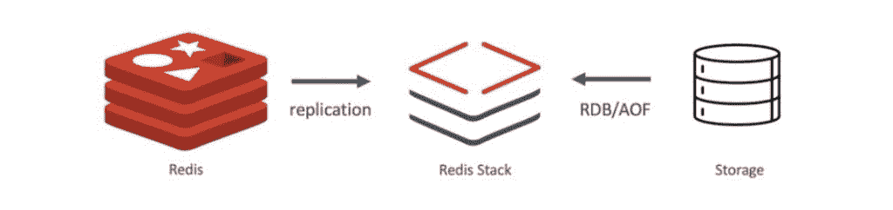
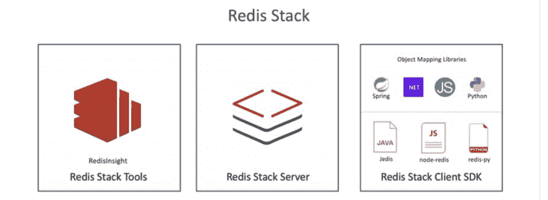

# Redis 将(几乎)所有东西都放在一个模块下

> 原文：<https://thenewstack.io/redis-puts-almost-everything-under-a-single-module/>

在过去的几年里，Redis 积极地寻求在其主要用于数据缓存的堆栈上进行构建。在推出了 [RediSearch](https://oss.redis.com/redisearch/) 、 [RedisRaft](https://github.com/RedisLabs/redisraft) 、 [RedisAI](http://redisai.io/) 及其最新发布的同名版本 Redis 7.0 之后，它现在正在进一步远离其之前作为数据缓存提供商的声誉。这体现在 Redis Stack 的发布上:一个旨在通过在一个界面中重组多个组件来帮助 NoSQL 开发者的单一模块。

[Enterprise Management Associates(EMA)](https://www.enterprisemanagement.com/)的分析师 [Torsten Volk](https://www.linkedin.com/in/torstenvolk) 告诉新的 Stack:“Redis Stack 将 Redis 从一个数据服务的构建工具包转变为一个企业数据平台，通过 SDK 提供高级对象模型来简化数据驱动的应用程序的创建。这使得任何开发人员都可以用很少的代码实现标准用例，而不必使用较低级别的 Redis 库。让任何人都能更容易地访问 Redis 的所有数据，这在我看来是一个有趣的价值主张。”

## 都在一个模块中

Redis 堆栈将 Redis 在过去几年中开发的数据结构功能集成在一个模块中。它们包括全文搜索、时序数据、消息传递和排队、文档和其他功能。例如，据该公司称，数据库系统功能还演变为以有利于高度分布式微服务数据的方式处理动态和快速移动的数据集。

作为 Redis 模块实现，“我们使用与开源 Redis 相同的设计原则从头开始构建这些引擎，具有内存架构和高效的代码库，”该公司的首席技术官 Yiftach Shoolman 说。

“我们的愿景是让开发者和用户能够在一个 Redis 模块中获得所有实时数据用例，”Shoolman 说。“我们希望从用户开始使用 Redis 的那一刻起就为他们提供这种体验，这样他们的体验也很容易。

Redis 通信的 Redis 堆栈的三个组件包括:

1.  Redis Stack Server 结合开源 Redis 与 [RediSearch](http://redisearch.io/) 、[Redis son](http://redisjson.io/)、 [RedisGraph](http://redisgraph.io/) 、 [RedisTimeSeries](http://redistimeseries.io/) 和 [RedisBloom](http://redisbloom.io/) 。
2.  Shoolman 说，RedisInsight 是一种可视化和优化 Redis 数据的工具，使实时应用程序开发变得更容易，“比以往任何时候都更有趣”。
3.  Redis Stack Client SDK:包括 Java、JavaScript 和 Python 中领先的官方 Redis 客户端。Shoolman 说，客户端还包括我们新的对象映射库套件，它提供了“开发人员友好的抽象，只需几行代码就能让您高效工作”。因[被称为 Redis OM。NET](https://github.com/redis/redis-om-dotnet) 、 [Node.js](https://github.com/redis/redis-om-node) 、 [Java](https://github.com/redis/redis-om-spring) 和 [Python](https://github.com/redis/redis-om-python) ，这些库也旨在支持与流行应用框架的集成，如 Spring、ASP.NET 核心、FastAPI 和 Express。

Redis Stack 适用于 Redis 6.2，是 Redis 7.0 的候选版本。

## 专为开发人员设计

在我与 Shoolman 的访谈中，他强调了 Redis Stack 在很大程度上是为开发人员设计的。为此，Redis 表示 Redis 堆栈允许开发人员:

*   索引和查询 Redis 数据，运行聚合，执行全文搜索。
*   运行高级向量相似性搜索(KNN)。
*   高效地存储和操作嵌套的 JSON 文档。
*   将关系构建和建模为属性图。
*   存储、查询和聚合时间序列数据。
*   访问概率数据结构。
*   使用 RedisInsight 可视化、调试和分析 Redis 数据。

Volk 说，从单个模块中实现 Redis 功能的消费和管理简化了 Redis 数据服务在复杂微服务应用程序及其相应的 DevOps 自动化管道中的嵌入。“这表明 Redis 的目标是成为云和边缘的通用高性能数据结构，”Volk 说。

<svg xmlns:xlink="http://www.w3.org/1999/xlink" viewBox="0 0 68 31" version="1.1"><title>Group</title> <desc>Created with Sketch.</desc></svg>