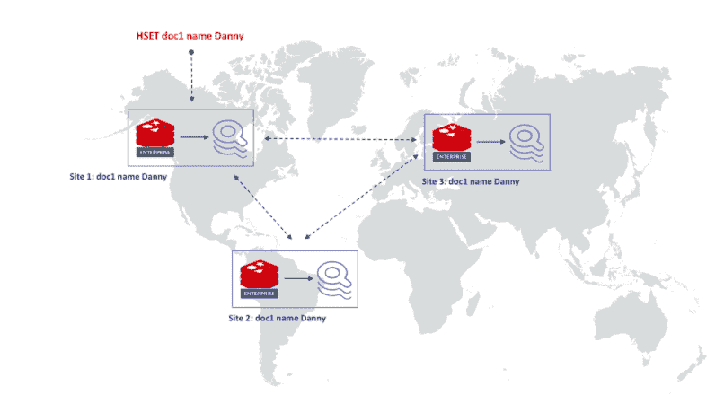
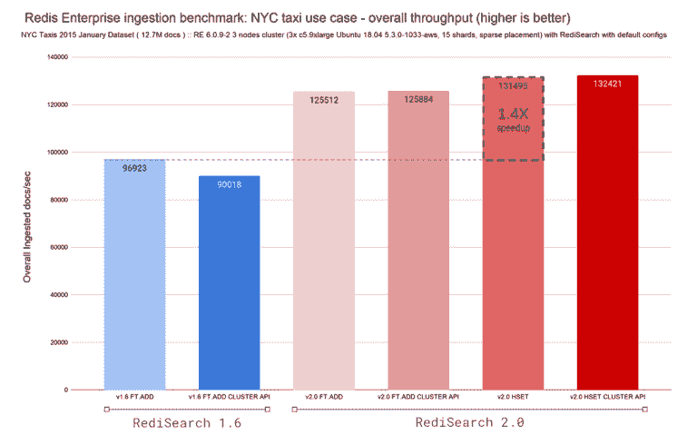

# Redis 的再搜索二级索引响应更快，简化了索引

> 原文：<https://thenewstack.io/redis-redisearch-secondary-index-responds-faster-streamlines-indexing/>

随着 2.0 版本的推出，Redis 的 RediSearch 内存索引比前一版本快了两倍多，并提供了更多的方法，使开发人员更容易创建和利用索引。

由 Redis 实验室构建的[Redis search](https://oss.redis.com/redisearch/)是 Redis 之上的二级索引，它消除了内部数据结构以提高响应速度，并使开发人员更容易利用高级任务，如多字段查询、聚合和全文搜索功能，如精确短语匹配和文本查询的数字过滤。

除了据称与 RediSearch 1.6 相比速度提高了 2.4 倍之外，RediSearch 2.0 还支持 Redis Labs 的[主动-主动地理分布](https://redis.com/redis-enterprise/technology/active-active-geo-distribution/)技术，是[可扩展的](https://redis.com/redis-enterprise/technology/linear-scaling-redis-enterprise/)而无需停机，并包括对在闪存驱动器上运行的支持， [Redis on Flash](https://redis.com/redis-enterprise/technology/redis-on-flash/) (目前处于私有预览模式)。

Redis Labs 产品总监 [Pieter Cailliau](https://uk.linkedin.com/in/pietercailliau) 告诉新堆栈:“将 RediSearch 添加到您的技术堆栈中简化了数据基础架构，扩展了具有丰富搜索体验的应用程序，并释放了 Redis 内部的分析能力。

Cailliau 说，改变 RediSearch 2.0 的架构是为了实现两个主要目标:改善开发人员的体验，并使 redsearch 能够支持几乎所有的 Redis 企业功能。

“现在创建索引比以前更容易了——你只需要在现有数据的基础上定义索引的模式，然后就可以开始搜索了，”Cailliau 说。"不需要移动数据，不需要重启 Redis，也不需要更新你的代码."

为了实现支持尽可能多的 Redis 企业功能的目标，RediSearch 2.0 现在支持，例如，Cailliau 说的[Flash 上的 Redis](https://redis.com/redis-enterprise/technology/redis-on-flash/)“是运行 Redis 的一种更具成本效益的方式。”

## 永远在线

Cailliau 说，RediSearch 还可以“通过利用 Redis Enterprise 的主动-主动技术在多个地理分布的副本之间提供五个九(99.999%)的可用性，以全球分布的方式进行部署”。Cailliau 说，这种能力支持读取操作，如查询和聚合，以及写入操作，如索引，可以以本地重新搜索部署的速度执行，而不用担心冲突解决。

Cailliau 说，RediSearch 还为关键字的值部分提供了几种索引策略，包括全文、地理位置、数字和标签，从而为 Redis 带来了更复杂的数据建模。

Cailliau 说:“如果没有索引，Redis 必须对每个查询执行扫描操作，这可能会非常缓慢和低效。手动创建和维护这些索引既复杂又容易出错。RediSearch 为用户维护这些索引，并允许您跨集群数据库中的数据结构进行查询。

Cailliau 将再搜索描述为建立在内存数据库之上的内存索引。Cailliau 说:“它们不仅为读写提供了低延迟响应时间，还提供了同步操作。这两个功能对于实时应用程序是必需的，在这些应用程序中，您需要能够频繁、即时地更新数据

## 基准

为了支持 RediSearch 2.0 的索引速度和摄取性能提高 2.4 倍的说法，Cailliau 在一篇[博客文章](https://redis.com/blog/introducing-redisearch-2-0/)中描述了 Redis Labs 如何使用其[全文搜索基准(FTSB)](https://github.com/RediSearch/ftsb/blob/master/docs/enwiki-pages-benchmark/description.md) 来测试关于纽约市出租车的公开数据。这个数据集包括文本、标签、地理和数字数据，以及“大量的文档”

在这些结果中，与 RediSearch 1.6 每秒 96K 文档的索引速度相比，RediSearch 能够以 0.4 毫秒的总体 p50 接收延迟每秒索引 132K 文档。

“你不仅会受益于吞吐量的提高，而且每次摄入也会变得更快，”Cailliau 说。除了由于体系结构的变化而带来的总体接收改进之外，您现在还可以依靠开源 Redis 群集 API 功能来线性扩展搜索数据库的接收

通过 Pixabay 的特征图像。

<svg xmlns:xlink="http://www.w3.org/1999/xlink" viewBox="0 0 68 31" version="1.1"><title>Group</title> <desc>Created with Sketch.</desc></svg>