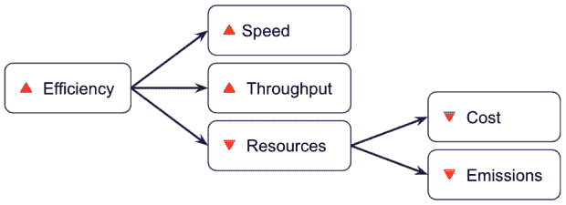
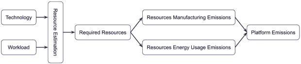
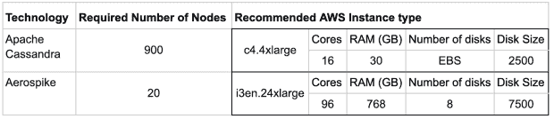
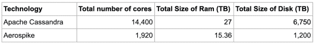
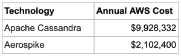
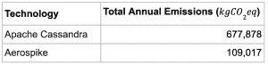

# 通过提高软件效率减少二氧化碳排放和成本

> 原文：<https://thenewstack.io/reduce-co2-emissions-and-cost-by-increasing-software-efficiency/>

到 2030 年，IT 系统预计将占到全球能源需求的 20%。从长远来看，运输业(喷气发动机、轮船、油轮、卡车等。)目前占[全球能源需求的 25%](https://maritime-executive.com/article/transport-uses-25-percent-of-world-energy) 。由于能源生产是二氧化碳排放的主要来源，IT 行业必须开始采取更加负责任的行动。

对于许多行业来说，转向更高效、更可持续的选择往往会导致更高的成本或不太令人满意的体验。相比之下，高效的软件平台更便宜，并提供更好的体验。因此，通过采用更高效的技术，IT 决策者可以为他们的企业和地球做正确的事情。

最近在电气和电子工程师协会( [IEEE](https://www.ieee.org/) ) Xplore 上发表的一篇[文章](https://ieeexplore.ieee.org/document/9881520)提出了一个估算软件平台一年产生的二氧化碳排放量的框架。使用这一框架，对两种名义上相似的技术进行了相互比较，结果显示更高效的平台降低了 79%的成本，减少了 84%的二氧化碳排放量。

由于一些读者可能会发现科学格式难以理解，这份白皮书提供了一个更容易阅读的过程版本。

## 软件效率

提高软件效率可以提高单位资源(计算机、虚拟机、容器或节点)的处理速度和吞吐量。因此，高效的软件平台需要较少的单元来处理特定的工作负载/需求。资源单位越少，成本和排放就越低。这对企业和地球来说是一个双赢的局面。

## 二氧化碳排放估算框架

尽管测量由软件引起的二氧化碳排放量是一个相对较新的课题，研究人员已经取得了令人印象深刻的进展。2021 年，研究人员[展示了](https://ieeexplore.ieee.org/document/9170668)一些编程语言[产生更少的排放](https://thenewstack.io/which-programming-languages-use-the-least-electricity/)。

虽然这是一个很好的见解，但使用更有效的编程语言并不能保证减少排放，因为应用程序的效率也是一个决定因素。

这一领域的新研究试图更加务实地解决这个问题。软件平台需要最少量的资源来处理给定的工作负载。通过估计工作负载所需的最小资源量，计算 CO [2] 排放相对简单。

硬件组件以两种方式产生二氧化碳排放:通过制造过程和运行它们所需的能量。这两个数量的总和就是一个软件平台产生的估计排放量。

## 行动中的框架

研究小组比较了两种著名且广泛使用的数据库技术， [Apache Cassandra](https://cassandra.apache.org/) 和 [Aerospike](https://aerospike.com/) ，以显示该发现的重要性。这是一个有趣的选择，因为其中一种技术的效率比另一种高一个数量级。因此，它有望减少资源使用、成本和排放。

一个经过良好调优的 Apache Cassandra 集群以一位数的毫秒延迟(实际上是 5 到 10 毫秒)为请求提供服务。相比之下，Aerospike 以处理不到一毫秒延迟的请求而闻名，这是一个数量级的改进。

为这次比较选择的工作负载是 1pb。由于这两种技术都是线性可扩展的，因此结果可以很容易地转换为更小或更大的工作负载。

使用每种技术的最佳实践，估计了在 AWS 上运行每种技术的最小资源量。详细的计算记录在 IEEE 文章中。

Apache Cassandra 使用大量相对较小的实例，而 Aerospike 使用少量相对较大的实例。然而，从使用的资源总数来看，效率更高的系统使用的资源要少得多:

根据 AWS 资源价格，每项技术的年度总运行成本如下，这与预期相符。效率更高的技术价格便宜 79%:

要使用 CO [2] 排放估算框架，需要对 AWS 硬件的制造和能源使用量进行估算。 [Teads](https://www.teads.com/) Media 的工程团队完成了出色的工程工作，估算了不同 AWS 资源的[排放量。他们把他们的发现结果放在一个易于使用的碳足迹计算器中。](https://medium.com/teads-engineering/estimating-aws-ec2-instances-power-consumption-c9745e347959)

该研究主要使用来自该计算器的排放数据来估计每个平台的排放量。结果符合预期。更高效的技术产生的二氧化碳排放量减少了 84%:

差额是每年 569 公吨二氧化碳，这是 57 公顷树木一年吸收的二氧化碳量！

## 最后一句话

对于软件专业人员来说，效率一直是一个重要的主题，但现在有了一个新的理由来更加关注它。正如预期的那样，提高软件效率会带来更好的性能、更低的资源消耗、更低的成本和更低的排放。

社会各阶层都关注二氧化碳的排放:

*   减少温室气体被列入联合国 2030 年可持续发展目标议程( [SDGs](https://sdgs.un.org/goals) )。
*   [192](https://www.un.org/en/climatechange/paris-agreement#:~:text=Today%2C%20193%20Parties%20(192%20countries,strengthen%20their%20commitments%20over%20time.) 国家签署了巴黎协议来限制他们的排放。
*   几乎三分之二的《金融时报》股票交易所 100 指数(FTSE100)公司自愿承诺零净目标。
*   三大云提供商( [AWS](https://aws.amazon.com/blogs/aws/new-customer-carbon-footprint-tool/) 、 [Azure](https://appsource.microsoft.com/en-us/product/power-bi/coi-sustainability.emissions_impact_dashboard) 和 [GCP](https://cloud.google.com/carbon-footprint) )已经开始报告客户消耗其资源所产生的二氧化碳排放量。

有理由期待软件行业的专业人士开始重新审视效率。毕竟，高效的软件不仅对企业有好处，对地球也有好处。

<svg xmlns:xlink="http://www.w3.org/1999/xlink" viewBox="0 0 68 31" version="1.1"><title>Group</title> <desc>Created with Sketch.</desc></svg>