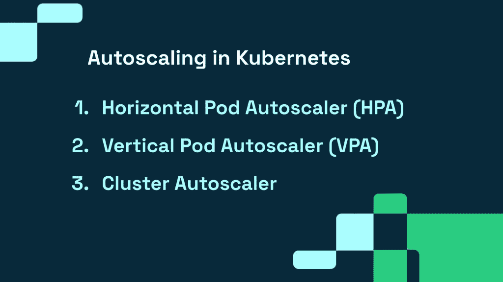
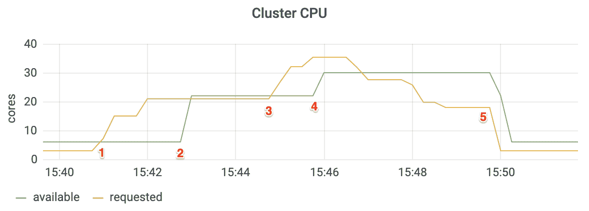

# 使用自动缩放机制降低 Kubernetes 成本

> 原文：<https://thenewstack.io/reduce-kubernetes-costs-using-autoscaling-mechanisms/>

 [劳伦特吉尔

劳伦特是 CAST AI 的联合创始人兼首席工艺官。](https://www.linkedin.com/in/laurentgil/) 

从技术上讲，默认情况下，集装箱化应该更具成本效益，但 Kubernetes 充满了[昂贵的成本陷阱](https://thenewstack.io/5-expensive-kubernetes-cost-traps-and-how-to-deal-with-them/)，可能会导致您超出预算。幸运的是，您有一些控制云成本的策略，自动扩展就是其中之一。Kubernetes 提供了三个内置的自动缩放机制来帮助你做到这一点。它们配置得越紧密，运行应用程序的成本就越低。

请继续阅读，了解这些自动缩放机制如何帮助[减少您在 Kubernetes](https://cast.ai/blog/8-best-practices-to-reduce-your-aws-bill-for-kubernetes/) 上的 AWS 账单。

## 1.水平 Pod 自动缩放器(HPA)

许多应用程序会经历使用量的波动，这意味着添加或删除 pod 副本最符合您的利益。这就是水平 Pod 自动缩放器(HPA)通过自动执行来提供帮助的地方。

### 什么时候用 HPA？

它非常适合于扩展无状态应用程序，但也非常适合于有状态集。为了在需求定期变化的工作负载中获得最高的成本节约，请将 HPA 与集群自动扩展结合使用。当 pod 数量减少时，这将减少活动节点的数量。

### HPA 是如何工作的？

HPA 监视 pod，以了解 pod 副本的数量是否需要更改。为了确定这一点，它取每个 pod 指标值的平均值，并检查删除或添加副本是否会使该值更接近目标值。

例如，如果您的部署的目标 CPU 利用率是 50%,而现在您有五个单元在那里运行，那么您的平均 CPU 利用率是 75%。为了使 pod 平均值更接近您的目标，HPA 控制器将添加三个副本。

### HPA 最佳实践

*   **为 HPA 提供每 pod 资源指标的来源**:您需要在 Kubernetes 集群中安装 metrics-server。
*   **为每个容器配置值:** HPA 根据观察到的 pod 的 CPU 利用率值、来自各个 pod 的资源请求的百分比来做出扩展决策。如果没有包括某些容器的值，计算将会不准确，并导致糟糕的缩放决定。因此，为通过 HPA 扩展的控制器的每个 pod 部分中的每个容器配置这些值。
*   **使用定制指标:**HPA 扩展决策的另一个来源是定制指标。HPA 支持两种类型的自定义指标:pod 指标和对象指标。确保使用正确的目标类型。您也可以使用来自第三方监控系统的外部指标。(注意，保护外部指标 API 可能更具挑战性。)

## 2.垂直 Pod 自动缩放器(VPA)

这种自动伸缩机制会增加和减少 pod 容器的 CPU 和内存资源请求，以便根据实际使用情况调整分配的集群资源。VPA 还需要访问 Kubernetes metrics 服务器，因为它只替换由复制控制器管理的 pod。

**提示:**如果您的 HPA 配置不使用 CPU 或内存来设置其扩展目标，请同时使用 VPA 和 HPA。

### 何时使用 VPA？

一个工作负载可能在某个时候经历高利用率，但是永久地增加它的请求限制不是一个好主意。您可能会浪费 CPU 或内存资源，并限制运行它们的节点。将工作负载分散到多个应用程序实例是很棘手的；这就是垂直吊舱自动缩放的帮助。

### VPA 是如何工作的？

VPA 部署由三部分组成:

*   **推荐器**:监控资源利用率并计算目标值
*   **更新器**:检查 pods 资源限制是否需要更新
*   **准入控制器**:当 pod 被创建时覆盖它们的资源请求

由于 Kubernetes 不允许改变正在运行的 pod 的资源限制，VPA 首先使用过时的限制终止 pod，然后将更新的值注入到新的 pod 规范中。

### VPA 最佳实践

*   **避免将 VPA 与早于 1.11 的 Kubernetes 版本一起使用**或使用 VPA 的 0.3 版本。
*   **使用** ***updateMode 运行 VPA:“Off”***以了解您要自动缩放的窗格的资源使用情况。这将为您提供推荐的 CPU 和内存请求，为以后的调整打下良好的基础。
*   如果一个工作负载经历高使用率和低使用率的定期高峰，VPA 可能会过于激进，因为它可能会一次又一次地更换 pod。HPA 在这种情况下工作得更好。

## 3.集群自动缩放器

Cluster Autoscaler 在支持的平台上改变集群中的节点数量。由于 autoscaler 控制器在基础架构级别上工作，因此它需要添加和删除基础架构的权限，您应该安全地管理这些凭证(例如，遵循最小特权原则)。

### 何时使用集群自动缩放？

如果您希望通过动态扩展节点数量来适应当前的集群利用率，从而优化成本，那么这种自动扩展机制非常有效。对于旨在扩展和满足动态需求的工作负载来说，这是一个非常好的工具。

### 集群自动缩放是如何工作的？

它检查不可调度的 pod，然后计算是否有可能整合当前部署的所有 pod，以便在更少的节点上运行它们。如果 Cluster Autoscaler 识别出某个节点具有可以重新安排给群集中其他节点的 pod，它会驱逐这些 pod 并移除备用节点。

### 集群自动缩放最佳实践

*   部署 Cluster Autoscaler 时，将其与推荐的 Kubernetes 版本一起使用。(这里有一个方便的[兼容列表](https://github.com/kubernetes/autoscaler/tree/master/cluster-autoscaler#releases))。
*   **检查集群节点是否具有相同的 CPU 和内存容量**:否则集群自动缩放无法工作，因为它假设组中的每个节点都具有相同的容量。
*   确保所有计划在节点或实例组中运行的用于自动伸缩的 pod 都有**指定的资源请求**。

## 为什么自动化 Kubernetes 扩展是一个好主意

这些本机自动扩展机制对于控制云成本非常有价值，但它们需要大量的手动配置:

*   **防止 HPA 和 VPA 冲突:**你需要检查你的 HPA 和 VPA 政策最终是否会发生冲突。密切关注成本，防止成本失控。
*   **多元化分配和现货实例一起:**采用多元化分配策略和使用[现货实例](https://cast.ai/blog/how-to-reduce-cloud-costs-by-90-spot-instances-and-how-to-use-them/)是两个强大的成本节约活动，很难人工协调。
*   **平衡所有三种机制:**您需要所有三种机制的平衡组合，以确保工作负载支持峰值负载，并在需求较低时将成本保持在最低水平。

您可能会明白为什么在运行 Kubernetes 集群的这一方面实现自动化是一个明智之举。仅举一个例子，CAST AI 等工具可以在需求增加期间自动添加新节点，然后立即缩减规模以减少浪费。

下面是一个自动缩放流程的示例:

1.  当应用程序遇到流量激增时，水平单元自动缩放会创建新的单元。但是没有地方运行它们，所以我们需要 15.5 个新的 CPU 核心。
2.  CAST AI 两分钟内自动添加一个新的 16 核节点。
3.  但是看看 15:45 发生了什么:更多的流量访问了应用程序。
4.  为了让它工作，CAST AI 在一分钟内增加了一个额外的八核节点。
5.  一旦流量没有了，平台立即让两个节点退役，有助于避免资源浪费。CAST AI 以 70%的折扣为额外的工作选择了 spot 实例，以进一步降低成本。

如果你在亚马逊网络服务、T2、EKS 上运行你的 Kubernetes 集群，这里有一些东西可以帮助你迈出第一步:生成一份免费的可用节省报告，然后[开始优化你的云成本](https://cast.ai/eks-optimizer/)。

<svg xmlns:xlink="http://www.w3.org/1999/xlink" viewBox="0 0 68 31" version="1.1"><title>Group</title> <desc>Created with Sketch.</desc></svg>