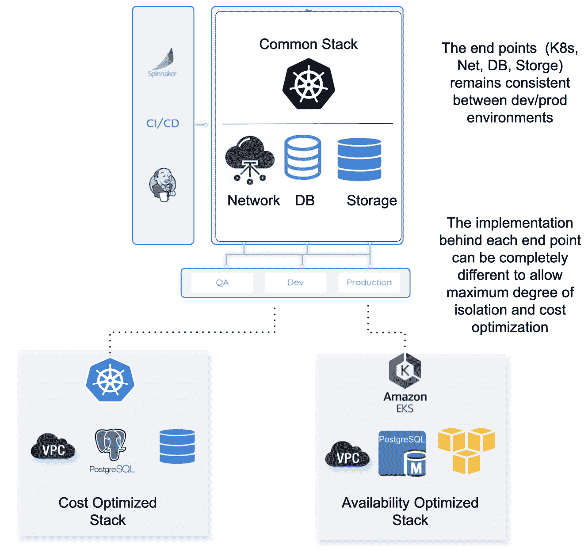

# 减少云支出不一定是一个悖论

> 原文：<https://thenewstack.io/reducing-cloud-spend-need-not-be-a-paradox/>

很少有人从 Martin Casado 的角度了解云转型。最近，他和王予柔在风险投资公司安德森·霍洛维茨(Andreessen Horowitz)的博客网站上发表了一篇名为《[云的成本，一万亿美元的悖论](https://a16z.com/2021/05/27/cost-of-cloud-paradox-market-cap-cloud-lifecycle-scale-growth-repatriation-optimization/)》的分析文章。这篇文章挑战了围绕云转型和云迁移狂热的传统思维，它呼吁我们思考云基础设施成本的影响(以及这反过来对公司估值的影响)。

 [Nati Shalom

Nati Shalom 是 Cloudify 的首席技术官和创始人。他是一位连续创业者，也是开源、多云协调、网络虚拟化、DevOps 和边缘计算领域的思想领袖和演讲者。Nati 获得了包括 YCombinator 在内的多项认可，是 cloud native 和 DevOps Israel 团队的领导者之一。](http://cloudify.co) 

悖论指出，云在公司发展的早期更便宜，随着公司规模的扩大，它变得更加昂贵。他们简单地陈述道:**“如果你不从云开始，那你就是疯了，如果你一直呆在云上，那你就是疯了。”**矛盾的是，云基础设施使您的业务模式在较小规模上成为可能，但它在较大规模上转变为价值破坏的来源，这只有在您深深投身于云之后才会显现出来。总体而言，这相当于数千亿美元的股票价值蒸发。

Casado 和 Wang 强调，将工作负载从纯云模式带回私有或混合基础架构是优化基础架构成本的主要策略。他们讲述了一家价值十亿美元的私有软件公司的故事，该公司的公共云支出占公司收入成本(COR)的 81%。在最大的 50 家上市软件公司中，云账单总额超过 80 亿美元(在披露云支出的公司中)。

很奇怪，云遣返并没有比现在更受欢迎。遣返可以大幅减少云支出，一个经常被引用的数字是节省 50%。为了说明这一点，在 Casado 和 Wang 引用的例子中，遣返将导致收回的利润节省 40 亿美元。考虑一下利用公共云基础设施的大规模软件公司，您很快就会发现这 40 亿美元的未实现利润可能会高得多。

a16z 的帖子就如何克服万亿美元悖论提供了一系列有用的建议，包括将云支出作为 KPI，激励工程师优化资源消耗，选择资源密集型工作负载的子集作为起点，并在惯性和锁定剥夺您的遣返选项之前提前考虑遣返。

## 我的看法

基础设施成本的增长并不总是与收入增长成正比。随着公司规模的扩大，这可能会导致盈利能力下降，因此，随着软件公司规模的扩大，云基础架构不断增长的成本相当于数千亿美元的股权价值。

让我们深入研究一下:根据 Casado 和王的分析，云支出对市值的影响可能是 25 倍。应用这一点，人们很快就会发现，仅在这 50 家公司中，40 亿美元的额外毛利润就可以产生 1000 亿美元的额外市场资本总额。

监测服务提供商 [Datadog](https://www.datadoghq.com/) 是一家上市公司，最近的交易价格接近 2021 年预期毛利的 40 倍，并在其 S-1 中披露了对[亚马逊网络服务](https://www.diagrid.io/?utm_content=inline-mention)的三年承诺总计 2.25 亿美元。

让我们将年度承诺支出计算为 7500 万美元的年度 AWS 成本，并进一步假设其中的 50%或 3750 万美元可以通过云遣返收回。这相当于该公司增加了约 15 亿美元的市值，仅在承诺的支出削减方面！如果我们扩展到更广泛的企业软件和消费互联网公司，这个数字可能超过 5000 亿美元，假设总云支出的 50%被大规模技术公司消费，这些公司将从云回归中受益。

考虑这个效率可能对公司估值产生影响的例子。 [MongoDB](https://www.mongodb.com/cloud/atlas/?utm_content=inline-mention) 和 Elastic 都报告了几乎相同的 2021 财年年收入(分别为 5.9 亿美元和 6.08 亿美元)。为什么 MongoDB 的市值是 Elastic 的近两倍(分别为 234 亿美元和 136 亿美元)？一个线索可能是 Mongo 的基础设施使用效率的差异，Mongo 为其 SaaS 产品使用细粒度多租户，而 Elastic 为每个租户使用单独的集群。资源消耗的差异是巨大的。

> 通过将服务从基础架构中分离出来，我们可以创建预定义的基础架构区域，这些区域经过高度优化，可为每个工作负载提供服务。

在准备这篇文章的过程中，我和 Casado 聊了聊，他向我指出，这里可能的不同是 SaaS 模式的力量。“市场对云收入的估价大约是开源内部资源的三倍，原因主要是净收入留存，”他观察到。内部开源基础设施往往有很高的流失率(通常为 18%)。除了 Elastic 和 MongoDB，Confluent 等人也感受到了这种效果。Elastic 是一家在将大部分股票转移到 SaaS 方面并不十分成功的公司。Mongo 和 Confluent 完成了这一点，Databricks 和 Snowflake 在云中起步。

Casado 还列举了 Atlassian 的例子，Atlassian 将其服务转移到 AWS 的多租户云模型，并在这样做的同时将成本降低了三分之一。然而，这并不是因为 AWS 更便宜。不是的。这是因为重新架构的多租户模型使得服务更加轻量级。

### 关注服务，而不是基础设施

这里要做的工作是优化云支出。因此，我们需要考虑云优化实用术语。优化很难。为了成功，我们需要停止考虑功能开发的速度和效率。相反，我们应该将效率视为另一个头等公民功能，需要在我们的待办事项中优先考虑，并像任何其他功能一样得到正确的管理关注。

### 用自动化来解决问题会让事情变得更糟

使用自动化作为效率工具来降低成本听起来微不足道。如果是这样的话，为什么如此多的云实施仍然如此低效——通常是几个数量级？自动化操作得当可以显著降低成本。然而，自动化的副作用经常是，它使得开发人员可以轻松地旋转云资源，即使在不需要它们的时候也让它们运行。在[是否存在企业利润危机？](https://a16z.com/2019/12/13/is-there-an-enterprise-margin-crisis/)、卡萨多指出…

*   **自动化并不神奇**:许多公司试图通过自动化人工流程来提高利润。这在技术上很有挑战性，而且增长的驱动力使得优先排序变得很困难。
*   **未优化的云**:私人市场推动增长，因此云实施的效率可能会低很多。等待增长放缓来纠正这一点——当利润率变得更重要时——很少是微不足道的。

我遇到过许多将他们的整体应用程序迁移到 Kubernetes 的公司，在那个阶段他们体验到了效率的提高。然而，很快，他们的云基础架构的成本开始飙升。开发人员开始构建实例并不一定是出于正确的原因:他们这么做只是因为这样更容易。

### 掌控你的工作

在自动化领域，人们往往过于强调基础设施自动化，而几乎没有关注服务本身的自动化。根据我的经验，服务层比基础设施层有更大的优化空间。

### 将工作负载与基础架构选择分离开来

为了在服务层实现优化，我们需要能够将服务从基础设施的选择中分离出来。通过这种方式，我们可以更灵活地为工作选择合适的基础架构或云，并且随着我们的发展，我们还可以为未来的增量优化留出足够的空间。

### Kubernetes、Terraform 和 Ansible 是不够的

Kubernetes、Terraform 和 Ansible 都是很棒的工具。它们有助于抽象和简化基础架构管理。但是它们还不够:

*   管理基础设施和基础设施上的服务是两回事。当您考虑持续更新之类的第 2 天操作时，尤其如此。
*   管理分布式服务、多 Kubernetes 集群、多数据中心或多云仍然相当复杂，这些工具提供的帮助有限。
*   当您有大量的模板和脚本来管理您的基础设施，而没有任何东西将所有这些映射回您的服务时，很容易迷失方向。

重新控制我们的服务:超越 IaC 和 Kubernetes

我认为，克服这些问题并重新控制我们自己的应用程序的最大潜力是向上移动堆栈，思考我们如何管理我们的服务，而不仅仅是运行这些服务的基础架构。通过将服务从基础架构中分离出来，我们可以创建预定义的基础架构区域，这些区域经过高度优化以服务于每个工作负载(测试、生产、ML、网络等)。这些优化区域不一定要位于云之外，因为即使在同一个云中也有足够的优化空间，显然在云之间也是如此。在这种情况下，脱离云成为这些优化基础架构区域的另一个私有案例。我称之为**环境即服务** (EaaS)。

下面的[例子](https://docs.cloudify.co/latest/trial_getting_started/examples/eaas/)说明了如何将这些想法映射到现实世界的例子中。在这种情况下，我们看到了如何在两个不同的基础设施堆栈上运行相同的工作负载:一个针对生产进行了优化，另一个针对开发进行了优化。这个想法同样可以应用到其他领域。

受挫？你并不孤单。但是还有希望。

对成功的软件公司来说，万亿美元悖论不一定是一个破坏价值的陷阱。通过进一步关注堆栈，将服务与正确的基础架构选择相匹配，激励优化行为，深思熟虑地自动化(而不是条件反射)，并在达到规模之前制定回收战略，您可以更好地控制成本并为股东保留价值。

云迁移、自动化和成本优化的循环是持续的过程，需要持续的迭代、克服失败并从中学习，最重要的是团队合作。有许多工具可以帮助你实现这个目标，但最终，如果没有正确的纪律和合作伙伴，他们可能会反对你。正如历史学家[尤瓦尔·诺亚·哈拉里](https://en.wikipedia.org/wiki/Yuval_Noah_Harari)所说，“刀子可以用来切菜和制作美食，但也可以用来杀人:这完全取决于你如何使用它。”

首先，我们需要重新设定我们的期望来解决这个悖论。如上所述，今天有一些选择可以让你简化你的旅程。我们必须从更高的层次、更高的价值链开始思考，关注服务本身而不是基础设施，看看我们如何将合适的基础设施与服务相匹配，而不是相反。

<svg xmlns:xlink="http://www.w3.org/1999/xlink" viewBox="0 0 68 31" version="1.1"><title>Group</title> <desc>Created with Sketch.</desc></svg>