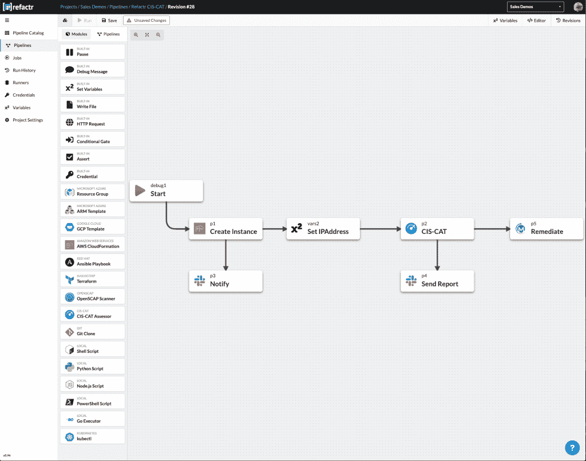

# Refactr 为 DevSecOps 带来了更简单的自动化

> 原文：<https://thenewstack.io/refactr-brings-easier-automation-to-devsecops/>

在创建其平台时，总部位于西雅图的 Refactr 专注于如何将更广泛的人群纳入 DevSecOps 流程，以及如何以可视化的方式将安全自动化添加到 DevOps 中。

“大多数围绕 DevOps 的自动化组织都被一个非常小的团队紧紧控制着。如果你和那个团队交谈，几乎他们每个人都会告诉你，比如，“是的，我们是瓶颈。”联合创始人兼首席执行官 [Michael Fraser](https://twitter.com/itascode?lang=en) 说:“我们需要能够利用我们所构建的东西，并能够让更多的人、技术人员和组织能够使用它。

与此同时，网络安全人员希望在现有的 DevOps 工作流中提供价值，但在大多数企业中仍然非常孤立。所以问题就变成了，当他们可能理解也可能不理解这一切的时候，他们怎么能成为这个过程的一部分呢？

“他们必须有一种方式，能够成为每个人都试图实现数字化转型的一部分，这实际上是为了提高组织的敏捷性。[这]要求业务和技术方面的每个人都有办法成为敏捷型过程的一部分，这不再仅仅是关于软件交付。这是关于提高公司试图实现的任何结果的整体灵活性，利用他们需要的技术来实现业务成果，”他说。

他指出，[持续的网络安全人才短缺](https://www.cpomagazine.com/cyber-security/study-reveals-that-cybersecurity-skills-gap-affects-about-three-quarters-of-organizations-and-still-worsening/)以及组织内部需要在团队内部培养技能是让安全工具在开发人员使用的软件构建工具中可视化的原因之一。

## 可视化构建安全性

自动化一直被认为是解决网络安全漏洞的关键，也是更早地将安全引入软件开发过程的关键。

正如亚马逊网络服务高级解决方案架构师 Margo Cronin 在欧洲 DevOps 企业峰会上告诉人们的:

“如果安全是您最重要的工作，您应该首先考虑自动化这些任务和故事，然后再做其他事情。”

根据 GitLab [关于 DevSecOps 前景的报告](https://about.gitlab.com/developer-survey/),越来越多的组织正在将安全性引入开发运维流程。在其调查中，65%的安全专家报告说，他们的组织正在更早地将安全引入流程，近 28%的人说他们是专注于安全的跨职能团队的一部分。然而，只有 20%的人将他们组织的安全措施评为“强”

“所以我们真的发现，这个领域需要创造一种东西，它是 SOAR ( [安全编排、自动化和响应](https://searchsecurity.techtarget.com/definition/SOAR))之类的东西的结合，人们可以进来进行可视化构建，就像开源对剧本所做的那样。而是在一个更像 CI/CD(持续集成，持续交付)的过程中更加主动，而不是被动。

这个问题本质上为网络安全团队带来了创建自动化内容的能力，开发人员也希望能够使用这些内容。

## 熟悉的工具

该公司最初构建了一个平台，用于在公共云中构建云安全解决方案。它从客户反馈中发现，用户确实希望使用他们已经使用过的工具，尽管许多人正在部署到公共云，但这并不是他们希望运行的唯一环境。

该公司于 2019 年 11 月推出了当前的 Refactr 平台。它作为一个层运行在受支持的第三方工具之上，如 Ansible、Terraform、Git、Kubernetes API、Shell、PowerShell、Python、Node.js 脚本等。

一切都是软件定义的，无论是云中的基础架构即代码、配置即代码还是围绕策略的安全即代码。它的映射与 CI/CD 世界的映射相似。将不同工具的功能结合在一起提供了一种在一个地方集中和标准化管道的方法。

弗雷泽说:“因此，这不仅仅是一个小小的 DevOps 团队，能够创建这种类型的内容，而且能够让网络安全和运营人员也加入进来，这样每个人，无论他们的技能水平如何，都可以至少运行这些内容，而且还可以开始提升自己的技能，以便他们也可以开始更新他们所需的技能，以便能够进入这种一切都变成代码的现代方法。”

网络安全解决方案公司 [MindPoint Group](https://www.mindpointgroup.com/) 的主管 [Justin Nemmers](https://www.linkedin.com/in/justinnemmers/) 说:“我们正在使用 Refactr 为我们的安全自动化产品 Lockdown Enterprise 构建测试管道。“虽然在 Refactr 之前我们已经有了自动化测试流程，但是它们非常脆弱，需要花费大量精力来维护。我们能够轻松地将 Refactr 集成到我们现有的工具中，现在它已经实现了，我们已经大大减少了开发新的测试管道所需的时间。因为我们花更多的时间开发产品，花更少的时间调整测试工具和流程，所以我们可以在更短的时间内向客户提供更多的功能。”

[https://www.youtube.com/embed/Xg8SI4Bq70M?feature=oembed](https://www.youtube.com/embed/Xg8SI4Bq70M?feature=oembed)

视频

Refactr 使用一个低代码/无代码的图形化拖放构建器来创建管道，管道决定工具的执行顺序。其内置的表达式引擎有助于将数据从一个步骤传递到另一个步骤

底层内容可以直接上传到应用程序，也可以从版本控制中提取。管道也可以直接从 API 或内置的 YAML 编辑器中修改。多个工具可以链接在一起，将一个工具的输出传递给后续工具的输入。流水线步骤可以并行执行。

后端的独立容器为每次运行提供了隔离，并且能够运行任何一次运行

基于 Linux 的工具，如自动安全扫描和合规性基准测试工具。

4 月，该公司获得了美国空军授予的一期小型企业创新研究(SBIR)合同。与海军和陆军的联合项目使创新型小企业能够在国防部展示他们的技术潜力。它已经提交了第二阶段的投标，承诺 750，000 美元，以及筹集风险资本的额外资金匹配，用于建设适用于政府和商业用途的所需新功能。

客户包括总部位于纽约的 IT 服务提供商 RFA、MindPoint Group、Netskope 和互联网安全中心。

最新版本增加了几个开源安全和遵从工具和功能。它们包括互联网安全中心的 CIS-CAT 合规性评估工具，该工具可直接引入管道，用于远程扫描和报告功能；支持 OpenSCAP，一个开源的合规性评估工具；和 Kubectl 来控制 Kubernetes 集群。

它还包括运行在定制基础设施或私有网络内部的自动化管道。

随着 7 月份的发布，该公司宣布它集成了 13 个工具:AWS Cloud Formation、Azure Resource Manager、Git、Google Deployment Manager、Hashicorp Terraform、Kubernetes API、Node、Powershell、Python 和 shell 脚本、Red Hat Ansible、OpenSCAP 和 CIS-CAT。另外 35 个工具正在路线图上，包括 HashiCorp Vault、OWASP Zed 攻击代理、SonarQube 等。

它还与 CI/CD 平台如 Github 和 Gitlab 合作；像 Morpheus Data 和网络安全厂商 CIS、Fortinet、Checkmarx、Aqua Security、Netskope、Tufin 等云管理平台。

亚马逊网络服务和 GitLab 是新堆栈的赞助商。

通过 Pixabay 的特征图像。

<svg xmlns:xlink="http://www.w3.org/1999/xlink" viewBox="0 0 68 31" version="1.1"><title>Group</title> <desc>Created with Sketch.</desc></svg>