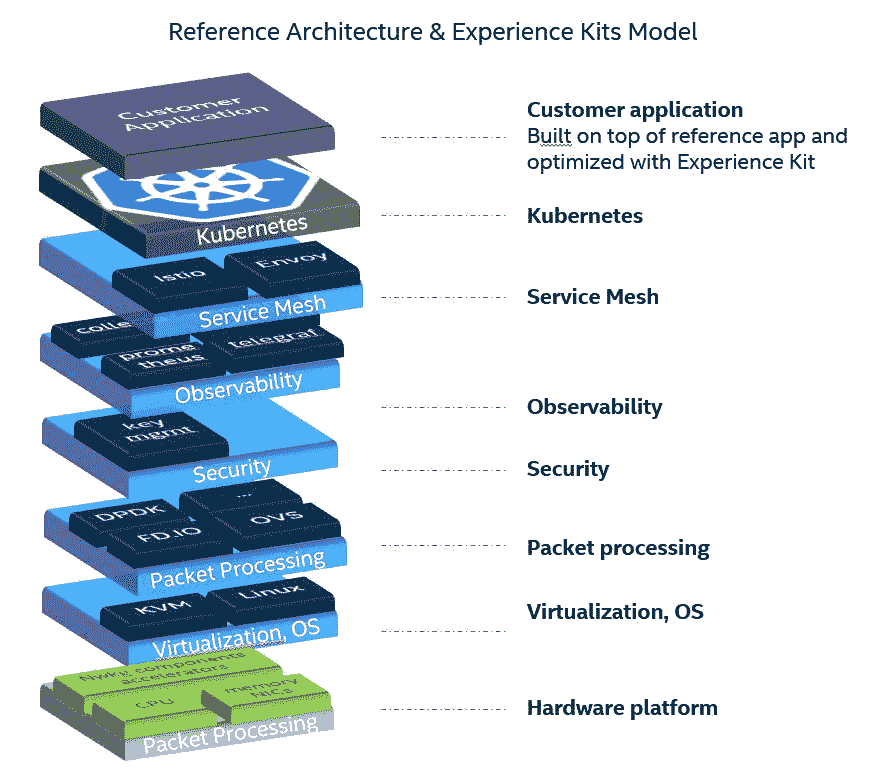

# 面向原生云的参考体系结构和体验套件

> 原文：<https://thenewstack.io/reference-architectures-and-experience-kits-for-cloud-native/>

[Dana ne HAMA](https://www.linkedin.com/in/dananehama/)

[Dana 是英特尔网络和云边缘产品管理总监。她在无线和电信网络领域拥有深厚的技术和商业头脑，并在 SDN/NFV、cloud native、5G、LTE、WiMAX、DOCSIS、VoIP 等技术项目上与社区合作。](https://www.linkedin.com/in/dananehama/)

随着核心网络基础设施通过云原生实践快速实现完全虚拟化，系统开发人员能够从大量软件、网络和硬件组件中高效地设计、生产和部署可靠的应用和服务至关重要。

我的大部分职业生涯都在为电信部门开发网络产品，从以色列开始，然后在二十年前移民到美国。我一直有一个系统工程的观点，并热衷于帮助服务提供商更好地了解他们如何更容易地使用最新的技术来构建他们的应用程序和服务。

在我最近的职位上，我面临着如何帮助通信服务提供商(CoSPs)加速设计和部署应用和服务的挑战，这些应用和服务运行在为其独特的操作环境量身定制的虚拟化、多供应商解决方案上。这些服务提供商希望利用最新一代的平台和开源软件创新。

## **与 CNCF 社区合作**

我的团队参与了 CNCF 电信集团、CNF 测试平台以及各种 Kubernetes 工作组和资源管理、网络、节点调度和仪器仪表特别兴趣小组(SIG ),这极大地帮助了我们的思考。

解决方案在于参考体系结构(RAs)和体验套件，本质上是网络部署的蓝图和指南。这些 RAs 由以最佳方式配置的开源软件组件组成，有许多旋钮(配置选项)使 CoSP 的服务或应用程序运行良好。RA 的目标是成为跨环境和用例大规模部署新技术的前瞻性蓝图。

RAs 随后由经验工具包补充，这些经验工具包提供了最佳实践指南，指导如何针对云原生软件技术(如 Kubernetes、服务网格、安全性、数据包处理、遥测/可观测性和可持续性)设计、自动化、优化和调整网络平台。

## **满足网络应用和服务的特定需求**

我们着手专门解决从内部到核心网络再到云的网络应用和服务。根据应用程序的运行环境，可能会有不同的需求和不同的软件项目。例如:

1.  优化电源管理以提高性能或能效。
2.  边缘的保证性能和延迟要求(数据平面开发套件或 DPDK)。
3.  网络健康可见性和服务保证的可观察性(CollectD，Telegraf，OpenTelemetry)。
4.  整合的 Kubernetes 集群，可在网络中的任何位置安排和协调工作负载。
5.  Helm charts 和 Kubespray 便于部署(K8S operators、Helm、Ansible)。

参考架构和体验套件汇集了一个合作伙伴生态系统，为行业协作和创新提供了一个全面开放的平台。

有关参考架构和体验套件的示例，请访问[英特尔网络构建者网站](https://networkbuilders.intel.com/intel-technologies/3rd-gen-intel-xeon-scalable-processors-experience-kits)。

*要了解更多关于网络和其他云原生技术的信息，请考虑参加 10 月 11 日至 15 日举行的 [KubeCon+CloudNativeCon 北美 2021](https://events.linuxfoundation.org/kubecon-cloudnativecon-north-america/) 。*

<svg xmlns:xlink="http://www.w3.org/1999/xlink" viewBox="0 0 68 31" version="1.1"><title>Group</title> <desc>Created with Sketch.</desc></svg>