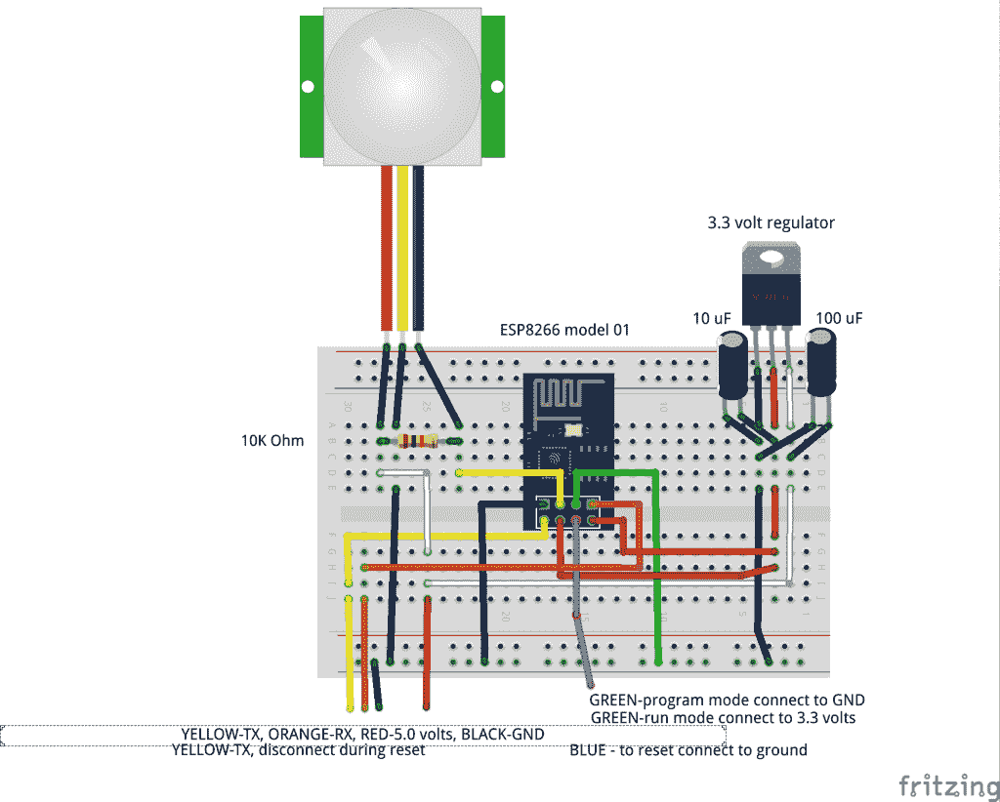
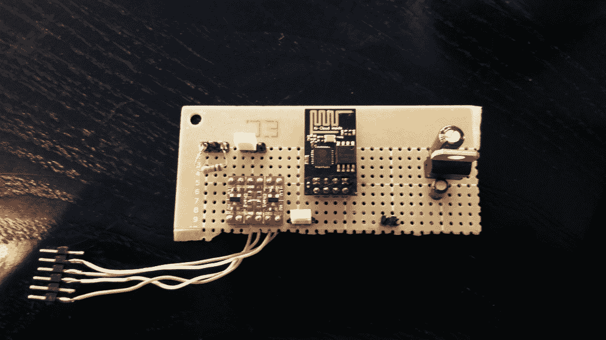
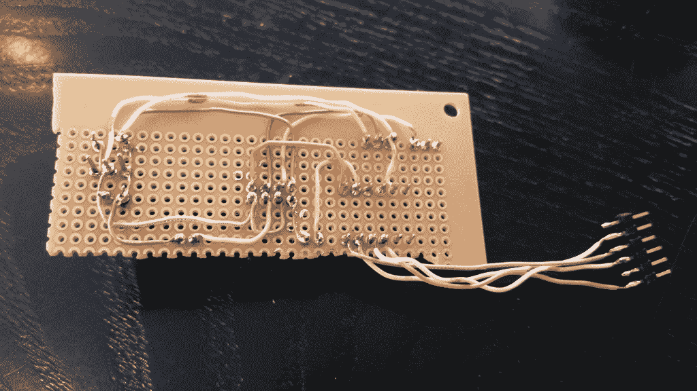
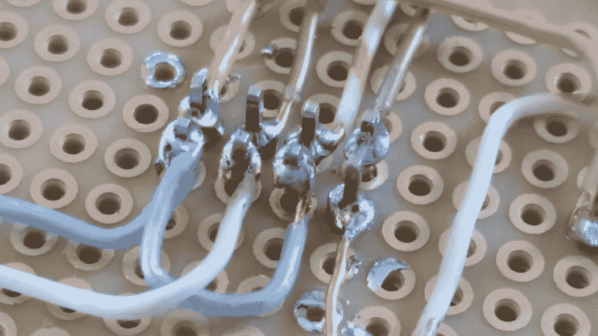

# 现成的黑客:改进庭院守卫传感器原型

> 原文：<https://thenewstack.io/refining-pir-yard-sensor-prototype/>

制作物理计算硬件的原型是劳动密集型的。你从一张白纸开始，添加部件，试验设计，直到你得到一个可以工作的设备。其中一些是受过教育的尝试和错误。其他时候，它看起来像是纯粹的魔法，尤其是对外行人来说。破解最初的未知，“会有用吗？”staging 需要耐心、毅力和很强的故障排除技能。

即使是一个简单的项目，如基于 ESP8266 的被动红外传感器(PIR)码传感器，我在过去的一个月里一直在做的，也需要时间来开发。

我首先使用一个 ESP8266-07 模块，在无处不在的实验板上破解了电路。一旦电路工作，我把它转移到简化的 ESP8266-01 模型，与适当的布线模块。一路上，我还在 [Fritzing](http://fritzing.org/home/) 中记录了电路和零件清单。记录你已经做了什么和你计划做什么都是游戏的一部分。在得到一个可行的设计之前，你经常要经历几次迭代。

今天，我们将走出“临时”试验阶段，进入“实用”原型领域。这里的“实用”是指该设备或多或少已准备好进行实际测试，并且很可能被用作演示件。换句话说，它实际上功能可靠，可用于会议演讲、融资推介、向粉丝/朋友/家人演示等等。

## 从临时到实用

读者可能还记得上周“[现成黑客:用被动红外传感器](https://thenewstack.io/off-shelf-hacker-guard-yard-esp8266-01-pir-sensor/)守卫院子”故事顶部杂乱的电线和组件。虽然我最初认为“电线和零件”的方法会节省时间，但它被证明是有问题的故障排除。

请注意，这是一个非常简单的电路。我咬紧牙关，转向传统的试验板(带孔的空白板)和[点对点布线技术](https://en.wikipedia.org/wiki/Point-to-point_construction)。最好把所有东西都整齐地摆放出来，让它变得简单。点到点布线花了大约两个小时，我只省略了一个跳线，当我第一次通电时，很容易发现并修复它。

以下是对实验者版本的描述:

ESP8266-01–PIR 实验板

这里是传统点对点布线试验板布局的前视图和后视图:

传统点对点试验板正面，带组件。

传统点对点试验板的背面，显示连接。

我从 Radio Shack 当地购买了 4.5 英寸 x 6.5 英寸的酚醛试验板。你可以用细齿钢锯、带切割轮的 Dremel 切割出你需要的形状，或者直接刻痕，用锋利的边缘折断。猜猜我用了哪种手法？

点对点比自由形式的将组件硬连接在一起要干净得多。对于自由形式的硬布线，很难跟踪布线和连接。将器件固定在电路板上也使电路更加稳定。您需要坚实的硬件来进行严格的测试和可靠的演示。你可能见过 20 世纪 40 年代和 50 年代使用“接线板”的电子产品现在那些是结实的！电线被物理地连接到端子上，然后被焊接。点对点仍然是原型制作、一对一和一次性或快速周转项目的一种有价值的构建技术，尤其是在使用廉价的[酚醛](http://www.wisegeek.com/what-is-phenolic.htm)试验板时。

## 向电路板添加元件

我还决定省略 4 x 2 插座，这一次，因为我是在这个故事的最后期限。我必须快速构建东西，然后每周写下来，所以做出妥协是生活的现实。将 8 针 ESP8266-01 接头针穿过电路板，然后[焊接](https://thenewstack.io/off-shelf-hacker-learn-solder/)电线，既快速又牢固。

这是 8266 及其电线的特写:

8266 连接的特写。

一旦这个项目完成，我完成了测试/分析，我可能会设计一个复制传感器的印刷电路板(PCB ),并作为 ESP8266-01 编程器回收该板。这样的话，我就把现在的 8266 换成商用 4 x 2 插座。

读者还会注意到，试验板上有一个 5 伏到 3.3 伏的电平转换器。8266 运行在 3.3 伏，我目前用于编程和供电的 USB-TTL 电缆是 5 伏版本。我可能应该投资 20 美元买一个 3.3 伏的型号。[电平转换器](https://www.sparkfun.com/products/12009)将我的 5 伏电缆引脚降低到 ESP8266s 所需的 3.3 电平。我只需要一个 USB 到 8266 串行通信的通道。一旦原型敲定，生产 8266/PIR 码传感器板，不需要电平转换器，因为您只需在编程板上对 ESP8266-01 编程，然后将其焊接到成品印刷电路板上。

还有一直存在的 3.3 伏稳压电源为 8266 提供电力。PIR 传感器本身需要 9-12 伏电压才能可靠触发。如果我使用 12 伏的重新设计的家庭景观照明电源或壁式电源，3.3 伏的小稳压器可以让 8266 满意，而主 12 伏输入可以为 PIR 传感器供电。每个人都赢了。

我使用的另一个技巧是“头球攻门”在对 8266 进行编程时，您需要断开 TX 线，然后将“Reset”引脚接地，以便在固件上传前重置电路板。我在 8266 上从电平转换器到 TX 引脚的 RX 线路中使用了一个 2 引脚接头。8266 复位引脚和地之间还有一个 2 引脚接头。

然后，很容易拉起 RX 线上的白色小跳线，暂时将跳线插入“Reset”接头并拔出，观察蓝色 LED 快速闪烁以指示成功复位，然后更换 RX 线上的跳线。然后，您可以在 Arduino IDE 中点击“上传”,将固件从您的 Linux 笔记本移动到 8266 主板。

我还使用了一个 3 针接头(带有一个 2 针跳线)，以便能够选择将 GPIO 00 引脚连接到地(用于编程)或+3.3 伏(用于常规操作)。只需根据需要来回移动跳线。

新的电路板工作正常，尽管我仍然需要测试从 9-12 伏输入供电，而不仅仅是通过 USB 电缆提供的 5 伏。PIR 传感器在 5 伏电压下工作，尽管在 9 至 12 伏电压下触发更加可靠。

## 包裹

对于下周的 ESP8266-PIR 庭院传感器文章，我将扣上设备外壳，介绍庭院中的设备部署，并讨论如何收集数据进行分析。几周后，我会带着一份传感器日志报告回来，并记录下我在凌晨 3:15 在外面看到的任何有趣或神秘的活动。

<svg xmlns:xlink="http://www.w3.org/1999/xlink" viewBox="0 0 68 31" version="1.1"><title>Group</title> <desc>Created with Sketch.</desc></svg>