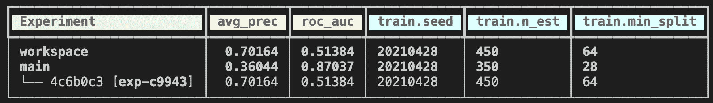
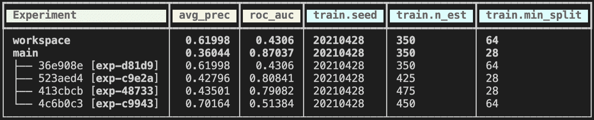
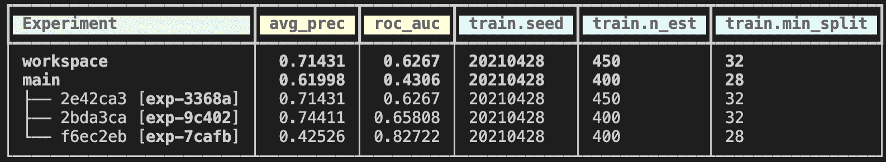
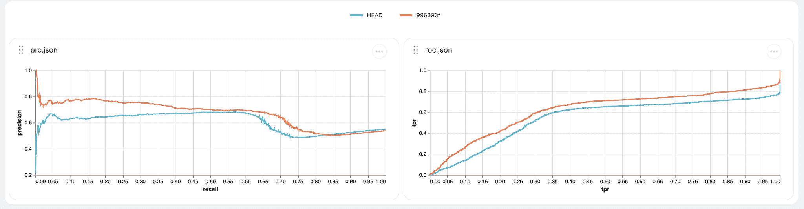

# 用 DVC 更新你陈旧的机器学习模型

> 原文：<https://thenewstack.io/refresh-your-stale-machine-learning-models-with-dvc/>

 [米莉西娅·麦格雷戈

米莉西娅·麦格雷戈是一名高级软件工程师、国际技术演讲家，也是一名从事硬件和软件工作的疯狂科学家。她会先尝试用 JavaScript 做任何东西。](https://twitter.com/flippedcoding) 

当你辛辛苦苦投入生产的[机器学习](https://thenewstack.io/category/machine-learning/)模型变得陈旧时会发生什么？机器学习工程师和数据科学家一直面临这个问题。您通常必须找出数据漂移是从哪里开始的，这样您就可以确定哪些输入数据发生了变化。然后，您需要用这个新数据集重新训练模型。

再训练可能涉及跨多个数据集的大量实验，并且能够跟踪所有这些实验将是有帮助的。在本教程中，我们将介绍如何使用 [DVC](https://dvc.org/) ，一个用于机器学习项目的开源版本控制系统，来帮助您跟踪这些实验，以及这将如何加快新模型投入生产的时间，防止陈旧模型逗留太久。

## 设置项目

显然，我们将与来自 [的一个项目一起工作。ai](https://evidentlyai.com/blog/tutorial-1-model-analytics-in-production) 展示了与一个经历数据随时间漂移的生产模型一起工作的情况。我们将通过 DVC 管道增加一些自动化，并与使用 DVC 工作室的其他人分享结果，从而将这一点提升到一个新的水平。

所以我们先从克隆 [这个回购项目开始](https://github.com/iterative/stale-model-example) 。这个项目显然是基于由 [创建的项目。ai](https://github.com/evidentlyai/evidently/blob/main/examples/data_stories/bicycle_demand_monitoring.ipynb) 做了一些修改以处理 DVC 和不同的数据集。

我们在这个项目中加入 DVC 和工作室的原因是为了自动化我们的模型评估管道的运行方式，并在我们获得新数据时对数据进行版本化。我们将能够分享和回顾每次实验的结果。机器学习中的一个大问题是协作，因此让共享模型、数据和结果变得更容易可以为您的团队节省大量时间和挫折。

## 设置数据漂移报告

当生产中的数据开始看起来与您的模型的训练数据不同时，这称为数据漂移。显然，有许多开源工具可以帮助监控数据漂移，如[. ai](https://docs.evidentlyai.com/)或 [Neptune](https://neptune.ai/) 。

因为我们使用的是 appeally . ai，所以当你运行他们最初项目的笔记本时，你可以看到目标漂移报告。这是它的样子。

所以我们看到在第三周结束时，模型的状态很差。这就是我们可以引入 DVC 来帮助我们更快地让这种陈旧的模型停产的地方。

## 运行培训实验，使生产跟上时代

我们将从一年的数据开始，创建一个新的模型。这可能会给我们一个比使用每周数据更准确的模型来推向生产。因此，我们将采用 2011 年的所有数据(因为这是我们必须使用的数据集)，并制作我们的训练和测试数据集。然后，我们将把这些数据输入 DVC，这样它就可以对其进行版本控制。

我们加上*。dvc* 文件，以确保我们只签入数据集的元数据，而不是整个数据集文件。现在我们可以用 [这个命令](https://dvc.org/doc/command-reference/exp/run) 运行整个 MLOps 流水线。

这将执行我们在 *dvc.yaml* 中定义的命令，并为我们提供评估模型好坏的指标。让我们用下面的命令来看看目前为止的指标:

`$ dvc exp show --no-timestamp`

这个模型没有最好的度量，所以在将这个模型部署到生产环境之前，我们可以运行更多的实验来看看调整超参数是否有帮助。让我们更改 *train.n_est* 和 *train.n_est* 超参数的值。我们将 [用不同的值运行几个实验](https://dvc.org/doc/user-guide/experiment-management) ，它将生成一个类似如下的表格:

我们每次都用不同的超参数值进行了一些实验，根据平均精度和 ROC-AUC 值，看起来 *exp-63459* 是其中最好的一个。因此，我们将把这个实验应用到我们的工作区，并选择这个模型作为将要投入生产的模型。为了应用该实验，我们将运行以下命令:

`$ dvc exp apply exp-c85c3`

这将使用该特定实验中使用的确切代码、数据和超参数来更新工作空间。因此，我们可以将这些更改提交给 Git，这样我们就有了这个精确模型所需的所有内容的引用。现在，假设我们已经将它部署到生产中，并且它已经成为一个很好的模型将近一年了，然后我们又开始注意到数据漂移。

## 使用新数据运行更多训练实验

这意味着是时候用生产中的最新数据更新我们的数据集了，这将包括所有关于自行车共享的最新数据。DVC 将记录数据中的更改，并自动为更新的数据创建新的版本记录。

接下来，我们将使用以下命令在项目中运行一个新的实验:

`$ dvc exp run`

然后，我们可以使用以下命令来查看指标:

`$ dvc exp show`

由于我们通过将更改推送到 Git 来清空工作区，我们将有一个新的表要查看。现在，您应该会看到类似如下的表格:

拥有更新的数据集在指标上产生了巨大的差异，看起来这个模型有一组不同的表现良好的超参数。现在，我们已经对新旧数据集进行了所有的实验，这是一个与同事分享结果并获得一些反馈的好时机。

## 在 Iterative Studio 中查看实验结果

因为我们已经在这个项目中设置了 DVC，我们可以根据需要运行尽可能多的实验，它将跟踪我们正在处理的数据集，我们所做的代码更改，它将让我们在 Studio 中查看每个实验的所有结果。

如果你去 [迭代工作室](https://studio.iterative.ai/) 【开源】，会提示你连接到你的 GitHub/ [GitLab](https://about.gitlab.com/?utm_content=inline-mention) 账号，你就可以选择这个项目的回购了。一旦您连接上了，您应该能够看到您已经推送到您的 Git 历史中的所有实验。

你可以让你团队中的其他人访问这个，他们将能够运行新的实验，并在浏览器中看到结果。这是一个很好的工具，可以用来在准备部署之前讨论模型培训中的下一个最佳步骤。

## 将新模型部署到生产中

我们训练阶段的输出是用于 *model.pt* 的文件。现在我们需要做的就是将它应用到我们的生产环境中。这可能是一个实时返回结果的 web API，或者您可以进行某种批量预测。无论您如何部署到生产环境中，您现在都有一个已经更新的模型，以解决之前的数据漂移问题。

## 结论

现在你只需要关注这个新模型，确保它不会偏离你期望的结果太远。这是您可以用来防止您的生产模型过时的过程之一。如果你知道你的阈值，你甚至可以自动化这个过程的某些部分！

<svg xmlns:xlink="http://www.w3.org/1999/xlink" viewBox="0 0 68 31" version="1.1"><title>Group</title> <desc>Created with Sketch.</desc></svg>