# 正则表达式和解决食物品尝者困境

> 原文：<https://thenewstack.io/regular-expressions-and-solving-the-food-taster-dilemma/>

在我之前的 regex 文章中，我们介绍了简单的**正则表达式**，它适用于大多数代码库，以及许多编辑器中的搜索功能。事情很容易理解，一切都很好。所以现在我要毁了这一切。

只是提醒我们为什么应该重视正则表达式。通过了解一种以计算方式搜索文本的方法(甚至是一种 70 年前的方法)，我们不仅可以用不同的工具解决问题，还可以更好地理解搜索本身的问题。

这一次，我要进行难度更高的下一步:T4 环视功能。但首先，我们必须了解消费。你很快就会明白为什么我没有在第一篇文章中讨论这个问题。

## 消费

当 regex 过程匹配成功时，它将匹配的字符包含在结果中，然后继续下一个字符。这听起来像是应该做的事情，但是这确实意味着在你承诺之前你不能检查行动。这就是为什么偏执的国王和皇帝雇佣食物品尝师；在你发现苹果被下毒后，你不能不吃它。

但是如果你记得，当我们看到**主播**时，我们注意到他们不消费。它们用于将搜索限制在一行的开头或结尾。我们用这个找到了莎士比亚文本中的第一个词:


这里有一个例子详细展示了食物品尝者的困境。如何找到打破“I 在 e 之前，c 之后除外”规则的字母组合？这条熟悉但相当不幸的英语规则有很多例外。

如果我们只对两组有问题的异常应用两个简单的搜索，它不会像您在这里看到的那样工作:

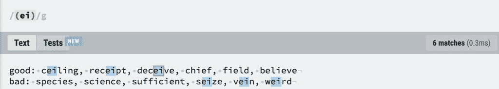

显然，搜索无法判断它是在寻找一个好的“cei”还是找到了一个真正违反规则的“ei”。

至少应用第二种模式对于捕捉包含“cie”的一半罪犯是直接的:

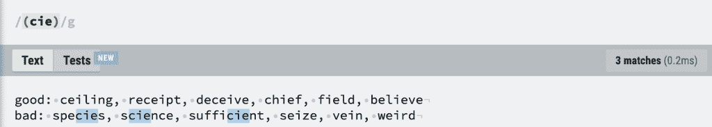

但是，我们如何通过一个查询就能正确地检测出这两组违规者呢？答案似乎是，我们可以使用一个**交替**(一个“非此即彼”的规则)来组合这两个规则，然后在检查“ei”规则时不允许使用“c ”:

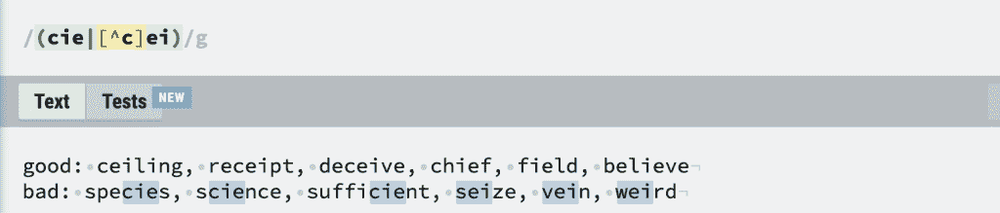

上面的解决方案起初看起来不错，但后来最后三个叛逆拼写捕获了“s”、“v”和“w”——它们本身不是问题字母，但它们与被否定的元字符匹配。

## 环顾四周而不消费

我们需要能够在不消费的情况下“四处看看”。命令食物品尝者尝一小口，看看会发生什么。当“c”出现在“ei”检查的结果前面时，下面我们使用正确的表达式来忽略它:

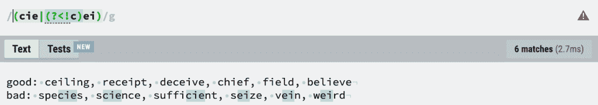

奏效了。新的大量可怕的角色是《T4》的反面教材。仔细查看上面的截图，可以发现在右边有一个小小的警告标志——它在警告我们“浏览器可能不支持负面的 look back”！

让我们一起来欣赏 lookaround 一家:

```

(?=a) positive lookahead

(?!a) negative lookahead

(?<=a)  positive lookbehind  

(?<!a)  negative lookbehind

```

## 子正则表达式

在上图中，我放了一个“a ”,你可以放一个字符或者任何正则表达式。在表达式的其余部分被处理之前，这由 lookaround 匹配。所以从技术上讲，我们可以有一种形式的“如果”..然后”——就像编程分叉一样。假设我们想为一个单词型的谜题寻找单词；例如，五个字母长，包括我们之前问题中的叛离组合。

所以我们只想看五个字母长度的单词。要做到这一点，我们需要使用下面的函数，其中大部分我已经在我以前的 regex 文章中介绍过了

```
\w A  word character
  b The boundary between  a  word and  a  non-word character  (this doesn’t  consume)
{5}  Repeat the preceding metacharacter  5  times

```

因此，长度为五个字母的单词将由表达式匹配:

把这想象成五个字母连续夹在一个非单词字符之间(如空格、标点符号或行尾)。

它适用于我们的示例单词:

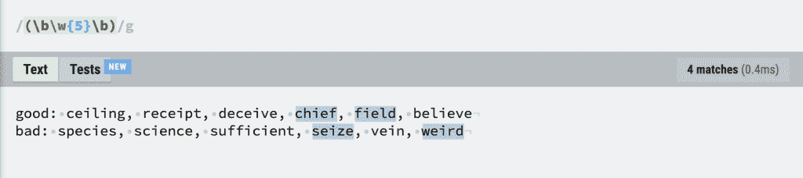

所以现在，我们可以将它与我们的“i before e”叛离检测器结合起来。

现在，在继续进行另一个“sub”计算之前，先进行一个“sub”计算对于通用编程语言来说是没问题的，但是对于 regex 来说就有点麻烦了。当然它可以工作，但是你将开始产生一些难以阅读的代码，可能很难调试。

然而，如果我们用我们的长度解决方案做一个正的前瞻子计算，然后继续我们的叛离测试:

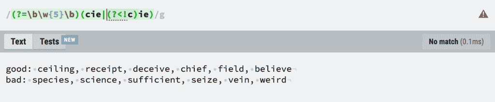

没用！但那是因为我们已经把自己定位在世界的前面，我们不仅仅是在生产线上的任何地方自由地寻找组合。我们需要代表整个世界。

因此，我们用可能出现在前后的单词字符填充检测器表达式:

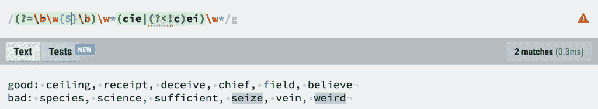

成功了！最后，让我们证明，如果我们将重复长度扩展到 4 到 10 个字母之间，我们真的捕捉到了所有的叛逆者示例(没有好人):

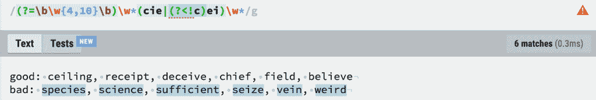

我们这样做的部分原因是我们可以在其他编辑器中使用这个工具。或者我们可以吗？让我们在两个不同的编辑器中尝试叛徒探测器。一、微软 Word:

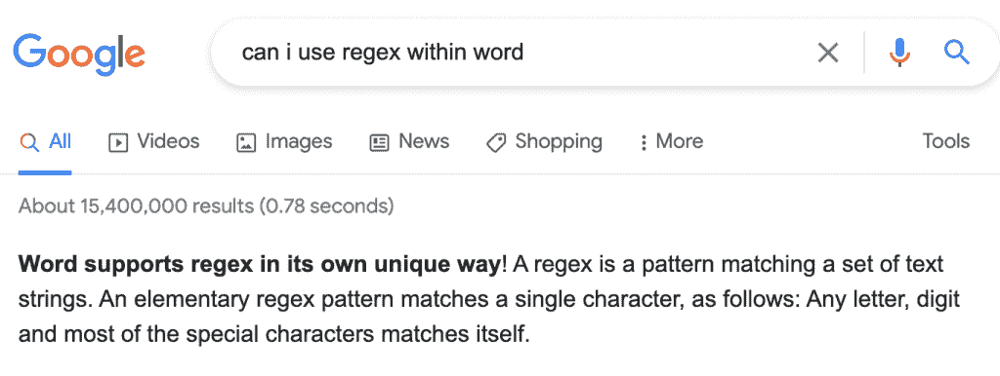

“以其独特的方式”是一面相当大的红旗。它不仅不支持 lookaround(这并不奇怪),甚至不支持交替。哭丧着脸。

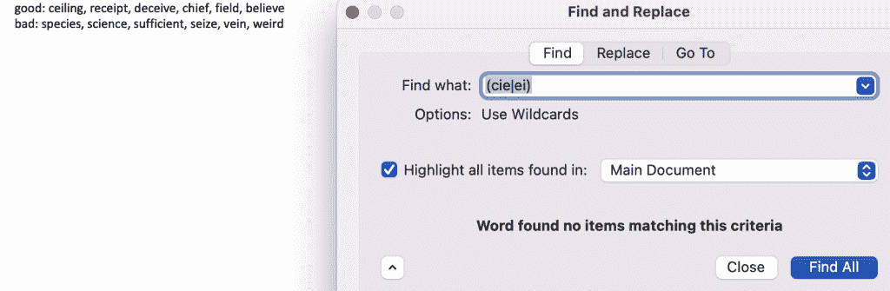

Sublime 是一个开发者友好的编辑器，使用 regex 没有问题。你只需要点击。* "按钮(这是欢迎 regex 的非正式标志)然后开始:

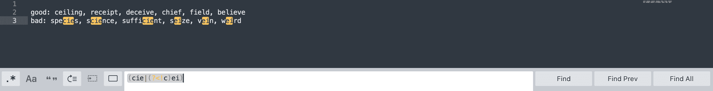

所以，至少取得了一些成功。我希望文本编辑器和搜索工具保留忠实的正则表达式，并且当您需要找到隐藏在文字森林中的文本宝藏时，还记得这个独立的解决方案。

<svg xmlns:xlink="http://www.w3.org/1999/xlink" viewBox="0 0 68 31" version="1.1"><title>Group</title> <desc>Created with Sketch.</desc></svg>