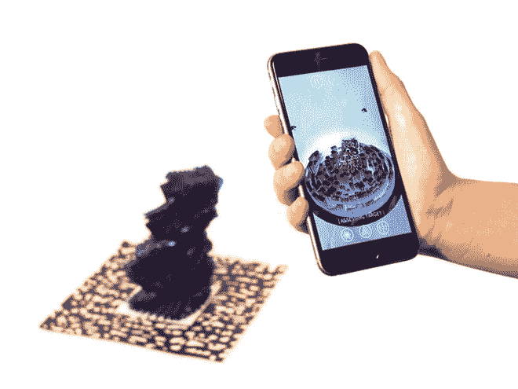

# REIFY 将音乐转化为 3D 打印的雕塑，并通过增强现实体验进行编码

> 原文：<https://thenewstack.io/reify-turns-music-into-3d-printed-sculptures-encoded-with-an-augmented-reality-experience/>

音乐的现代数字化改变了我们与音乐的关系。曾经在空气中传播的一次性声学振动已经演变成可以无限记录、传播、共享和再混合的数据，无论是以文件的形式，还是以云服务的形式。我们已经超越了可以拿在手中的黑胶唱片、盒式磁带和 CD，进入了一个拥有数千首歌曲的图书馆可以装进我们口袋的时代——曾经是物理人工制品的最终非物质化。

## 将音乐合成为一种多感官体验

但是如果我们把有形的东西带回我们的音乐会怎么样呢？这就是总部位于布鲁克林的初创公司 REIFY 正在利用其名为 Harmony 的音频到物理设计软件所做的事情，该软件将声波转换为 3D 打印的音乐雕塑，可以通过一款名为 Stylus 的增强现实移动应用程序来观看、持有、“阅读”和播放互动音乐体验。正如首席执行官艾莉森·伍德在下面的 TED 演讲中解释的那样，这个想法是让“你以声音的形式体验雕塑，以声音的形式体验雕塑。”

[https://www.youtube.com/embed/F34RsGPLg_E?feature=oembed](https://www.youtube.com/embed/F34RsGPLg_E?feature=oembed)

视频

## 新的 3D 音乐视频

这些雕塑是用解放军、青铜甚至椰壳等材料打印出来的，它们本身被称为“图腾”，被比作“3D 音乐视频”，让音乐爱好者体验更“多感官”的东西，一种“新型的[共感](https://en.wikipedia.org/wiki/Synesthesia)，它将利用技术“在模拟和数字之间架起桥梁”[伍德说:](http://thecreatorsproject.vice.com/blog/3d-printed-music-sculptures-are-the-futures-vinyl)这是关于翻译一些短暂的东西，让它变得更真实:

> 我们的目标是集体众包一种新的声音视觉语言，这种语言基于人类对声音的体验，而不仅仅是声音的科学属性。

除了提供一种潜在的体验音乐的新方式之外，这也是一种将音乐带给大众的新方式。为此，REIFY 与音乐人合作，以特别定制的图腾形式发布他们的专辑，所有设计都考虑到了艺术家的创作愿景和审美。

使用 [Unity](https://unity3d.com/) 游戏引擎和 [Vuforia](https://developer.vuforia.com/) ，一个基于视觉的增强现实软件平台，“交互式视觉体验”被编码到这些雕塑中，当装有手写笔应用程序的移动设备指向它时，它们就会播放。到目前为止，许多乐队已经与 REIFY 合作，为该公司的 Kickstarter 发布会提供数字制作雕塑形式的音乐。但是正如伍德在她的 TED 演讲中指出的，这不仅仅局限于音乐——在这种数字化制造的意义上，具体化可以应用于诗歌、深空声音，甚至时间。

那么这对音乐消费的未来意味着什么呢？在过去的几十年里，音乐行业发生了巨大的变化，数字化音乐的丰富和流动意味着艺术家更难受到关注。既然音乐已经被转化为数据，音乐的内在价值必须以不同的方式表达——无论是以珍贵的、艺术般的雕塑形式，还是以产生新用户体验的[元数据](http://www.theglobeandmail.com/technology/digital-culture/digital-music-is-the-soundtrack-and-metadata-mine-of-our-lives/article19531344/)形式。让非物质变得更加物质是未来音乐以新的堆叠方式处理的一种方式，给听众一种更全面的声音体验，可以用手触摸，用眼睛理解。更多关于 REIFY 和他们的 [Kickstarter](https://www.kickstarter.com/projects/reify/reify-music-you-can-hear-see-and-hold/description) 活动。

图像:具体化。特写图片:理查德·瓦格纳的 3D 打印雕塑《女武神之骑》。

<svg xmlns:xlink="http://www.w3.org/1999/xlink" viewBox="0 0 68 31" version="1.1"><title>Group</title> <desc>Created with Sketch.</desc></svg>