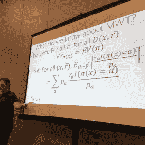

# 人工智能的下一个大步骤:强化学习

> 原文：<https://thenewstack.io/reinforcement-learning-ready-real-world/>

你听到的几乎每一个[机器学习](/category/machine-learning/)突破(以及大多数目前所谓的“人工智能”)都是监督学习；你从一个经过管理和标记的数据集开始。但是另一种技术，强化学习，刚刚开始走出研究实验室。

强化学习是代理通过与其环境交互来学习。训练者不会告诉它做什么，它会通过反复试验来学习在这种情况下采取什么行动来获得最高的奖励，即使奖励并不明显和直接。它学习如何解决问题，而不是被教导解决方案是什么样的。

强化学习就是 DeepMind 如何创造了 [AlphaGo](https://thenewstack.io/alphagos-win-human-go-champion-means-ai/) 系统，该系统击败了一名高级围棋选手(最近还匿名赢得了在线围棋比赛)。这就是[加州大学伯克利分校的 BRETT 机器人](http://news.berkeley.edu/2015/05/21/deep-learning-robot-masters-skills-via-trial-and-error/)如何在短短三个小时内学会如何移动它的手和臂来执行物理任务，如叠积木或把盖子拧到瓶子上(如果它被告知它将工作的对象在哪里，以及它们需要在哪里结束，则为 10 分钟)。黑客马拉松的开发者建造了一个名为 [AutoTrash](https://www.youtube.com/watch?v=sOGk2Y5vQdc) 的智能垃圾桶，它使用强化学习将可堆肥和可回收的垃圾分类到正确的隔间。

强化学习是微软刚刚收购 Maluuba 的原因，微软计划用它来帮助搜索和聊天机器人理解自然语言，作为实现一般智能的垫脚石。

不过，商业部署要少得多。2016 年，谷歌开始使用 DeepMind 的强化学习来节省一些数据中心的电力，学习如何优化大约 120 种不同的设置，如风扇和冷却系统的运行方式，总计提高了 15%的电力使用效率。

没有人真正注意到，早在 2016 年 1 月，微软开始使用一个非常特殊的强化学习子集，名为 contextual bottoms，为 MSN.com 挑选个性化的标题；这是多个机器学习系统未能改善的。

contextual bandit 系统将点击率提高了 25%——几个月后，微软将它变成了一个开源的[多世界测试决策服务](https://github.com/Microsoft/mwt-ds)，它建立在 [Vowpal Wabbit 机器学习](https://github.com/JohnLangford/vowpal_wabbit)系统之上，你可以在 [Azure](http://mwtds.azurewebsites.net/) 上运行。

微软的 John Langford 在去年六月的 QCon NYC 上讨论了多世界测试。

“我们有一个可部署的系统，我认为这是世界上第一个，”微软研究员约翰·兰福德声称，他在雅虎时就开始了 Vowpal Wabbit 的工作。

多世界测试同时运行多个上下文相关的实验，它可以让你回答比标准 A/B 测试更详细的问题。情境强盗是一个有多个手臂的吃角子老虎机的数学表示，每次在选择拉哪个手臂之前，代理都会看到一个显示当前情境(来自多世界测试)的特征向量，以及它过去玩过的手臂的奖励。

兰福德警告说，上下文强盗是强化学习空间中两个“易处理的岛屿”之一，“这显然更多地是一种研究努力，而不是监督学习”。“有许多问题很容易被视为强化学习问题，我们对此没有有效的解决方案。”

他解释说:“他们在回报很明显的情况下工作，你的行动会得到反馈；“在这里，你可以对少量的动作进行上下文控制，并获得关于该动作的反馈。我们想尝试驯服这些技术，使它们正常化并易于使用；这就是我们试图通过决策服务实现的目标。”

有时反馈不是即时的，所以你可能需要使用奖励塑造，它“让你制定一个长期目标，并将为此获得的奖励分解为一系列短期奖励——如果你做对了，这些奖励的总和就是你的长期目标。这是你在试图解决强化学习问题时需要解决的一个关键问题。”

坚持这些情况是该团队如何能够创建一个在现实世界中有效的强化学习解决方案，而不仅仅是一个研究问题。“这在很大程度上是一个范围限制，使其易于处理，”兰福德指出。“有一个特殊的子集，上下文强盗，我们知道事情是容易处理的，决策服务处理这个子集。”

“需要注意的重要一点是没有长期决策方面，”微软研究院的 Alekh Agarwal 进一步解释道，他也从事决策服务。“这是一个循序渐进的过程，在这个过程中，你观察到一些背景，然后采取行动，并立即获得回报；不用担心长期回报。还是有限制的。如果你采取一项行动，你只会看到该行动的回报，而不会看到如果你采取另一项行动会发生什么。你试图根据你所掌握的背景信息来优化你的行动选择。”他指出，这是强化学习不同于监督学习的另一个方面。

兰福德补充说，问题不仅仅是长期回报，而是“多项行动的信用分配”。“如果你采取 30 个行动，其中任何一个都会影响你观察到的回报，那就是不同的情况了。很容易出现所有现有算法都会严重失败的问题。”

## 正确的问题

多世界决策服务是实时的，在 Azure 上运行每小时收费 20 美分。

然而，强化学习比更广为人知的监督学习更好，这是有问题的。“现在有很多问题人们试图解决，但不适合监督学习范式，但他们习惯了监督学习，所以他们试图使用它，”兰福德解释说。"典型的是试图预测点击量并优化你投放的广告."上下文强盗是这方面的理想选择，也是进行其他个性化内容推荐的理想选择。

另一个适用领域是适应您行为的个性化用户界面。想象一下，你想用脑电图来控制电脑。“每次你把脑电图放在你的头上，它在一个稍微不同的位置，系统需要学习非常迅速地适应它在你头上的位置，”兰福德建议。“当事情出错时，使用界面的人会注意到，他们可以发出更正；那是对的，那是错的。这将是一个自然的共同学习过程。”

个性化医疗保健是一个更棘手的问题，尤其是考虑到隐私问题和支离破碎的医疗记录，但至少在理论上，上下文强盗可能会有所帮助。“并不是所有的医疗保健都是那种单个行动就能产生明确结果的，但有一部分是这样的，”他指出。“与我们今天的药物试验不同，想象一下规模大 10 倍或 20 倍的试验，学习针对个体受试者部署个性化治疗的政策，而不是我们现在采用的一刀切政策。”

Agarwal 说，资源分配——对人或计算机——远远超出了谷歌的数据中心管理试验的适用范围，它也很适合情境强盗。“当您向网站发送请求时，应该由哪个服务器来处理？操作系统解决了许多资源分配问题。在许多情况下，您必须做一些工作来定义正确的功能，但其中一些功能最终成为了强盗的合理选择。”

获得正确的回报是关键；“这往往是试图解决强化学习问题的艺术所在，”兰福德说。“有时候非常明显，就像咔嚓声一样。有时候更微妙。但弄清楚如何框定问题是解决问题的灵丹妙药。”

## 给我看看

如果这太困难，研究人员转向第二种类型的强化学习，我们目前可以做得很好:模仿学习，通过展示一种技术。“对一个人来说，提供关于该做什么的信息可能比想出一个与问题相匹配的好的奖励函数更容易。”

“你在机器人技术中看到很多这种情况，你向机器人演示你想让它做什么，它可以学习做类似的事情，有时甚至比人做得更好，”他指出。你需要做出一长串的决策才能成功，而且很难分解增量决策的价值。机器人根据感官反馈工作；他们有摄像头和传感器来检测执行器的位置，并将反馈转化为短期奖励。这一点的美妙之处在于演示让你远离局部最小值和最大值。"

Agarwal 指出，自动驾驶汽车系统以同样的方式工作，他指出，为了有效，模仿学习需要高质量的演示。“如果你大部分时间都在获得非常专业的最佳动作序列演示，你可以学习很好地模仿它们，并将它们推广到看不见的情况，而不会被卡住。”

不像语境强盗，模仿学习并不只有一种技术。没有一个像多世界决策服务这样的标准化平台可以用来解决你自己的问题。但是我们开始有平台来帮助研究人员进行实验。

## 玩游戏？

游戏是训练强化学习系统的一种常见方式，因为它们有内置的奖励。Atari 2600 游戏一直是一个流行的选择，但它们通常是相当简单的环境。2016 年底，Google 和[都开放。AI](https://openai.com/about/) 宣布，他们正在向研究人员开放他们的强化学习培训系统，让更多的人能够访问复杂的模拟环境来培训 AI 智能体，这些环境以前是为有预算建造它们的公司保留的。

谷歌的[deep mind Lab](https://deepmind.com/)——内部称为迷宫——看起来像一个简单的 3d 游戏，一个浮动的球体代表人工智能代理。这个世界包括 14 个级别和四种学习任务，如导航迷宫(静态或动态生成)、玩激光标签和收集水果，但研究人员可以从 [GitHub](https://github.com/deepmind/lab) 获得这个虚拟环境的代码，创建他们自己的级别(使用游戏编辑器或用 C 和 Python 编程)，并试验不同的奖励方案和游戏逻辑。

DeepMind 实验室中的 AI 代理是一个可以查看和导航 3D 世界的球体(图片:谷歌)。

[OpenAI 的宇宙](https://universe.openai.com/)也是一个研究人工智能代理的实验平台，这些代理试图学习像人类一样使用计算机；通过观看屏幕上的像素和操作虚拟控件。与实验室一样，Universe 的目标是开发一种人工智能代理，它不仅可以学习处理一种情况，还可以使用它开发的学习技术来处理不熟悉的环境，作为创造超越单一狭窄领域的人工智能的垫脚石——open AI 的方法是让研究人员访问许多为人类创造的环境，而不是为人工智能代理学习而专门制作的环境。这不仅把我们已经有的游戏和应用变成了一个训练场；这也意味着人工智能代理可以观察人们使用软件启动他们的学习——我们可以将人工智能与人类的表现进行比较，而不仅仅是相互比较。

Universe 允许你使用任何带有 [OpenAI 的 Gym toolkit](https://gym.openai.com/) 的程序，在 TensorFlow 和 [Theano](https://github.com/Theano/Theano) 这样的框架中构建强化学习代理。Gym 已经包括模拟机器人、围棋和一系列经典的 Atari 游戏，Universe 将这一功能扩展到了一千多个环境，包括 Flash 游戏、80 种常见的浏览器任务，如输入密码或预订机票，以及《侠盗猎车手 v》等游戏。

Universe 将它们打包成 Docker 图像，在 [VNC 远程桌面](https://www.realvnc.com/)上启动它们，并通过 Python 脚本控制它们——尽管并非所有这些都支持强化学习。OCR 运行在控制 Docker 容器的 Python 程序中，抓取游戏分数用作奖励；在 1000 款 Flash 游戏中，100 款有奖励功能，OpenAI 计划使用人类玩家向人工智能代理演示更多游戏，以便更容易分析奖励应该是什么。在未来，宇宙人工智能代理将获得像传送门和中校 III 这样的游戏，以及 [Wolfram Mathematica](http://www.wolfram.com/mathematica/?source=nav) ，也许还有 Android 和 Unity 游戏。

他们还将能够在[项目 Malmo](https://github.com/Microsoft/malmo#getting-started) 中运行，这是微软的强化学习实验平台，运行在[《我的世界》](https://minecraft.net/en-us/)之上(它于 2014 年开始工作，并于 2016 年年中开源)。

剑桥微软研究实验室的 Katja Hofmann[说:“一些几十年来纯粹在研究方面的人工智能技术正开始越来越接近现实世界的应用。“那太令人兴奋了。为了真正推动这些技术向前发展，我们需要灵活、快速地对技术进行实验。推进实验的需要是马尔默项目的动机。现在，这些平台越来越多，这很令人兴奋，对于推动研究向前发展以及将研究开放给更广泛的开发者和爱好者社区都很重要，他们可以加入并开始生产。”](https://www.microsoft.com/en-us/research/people/kahofman/)

目前，Universe 和 Project Malmo 使用略有不同的 API 来集成游戏中的机器人和代理，并运行实验。第一步是让在一个平台上训练代理变得更容易，然后在另一个平台上测试它。“将其中一些 API 标准化，让社区尽可能容易地来回切换，会有很多好处。”

从长远来看，这将让研究人员创建可移植的代理架构。“我们正在与深度强化学习代理的变体合作，这些代理不仅可以学习 2d Atari 游戏，还可以插入在 3d《我的世界》世界中导航的代理，在那里它们可以环顾四周，看看该去哪里。在这两种情况下，拥有相同类型的架构将转化为有效的学习，因此我们可以通过实验在专注于交互式学习的方面快速取得进展。”

这两个平台有不同的研究议程。马尔默项目是关于霍夫曼所说的灵活学习。

“我们的想法是开发这样一种人工智能，它不仅能处理单一任务，还能灵活地学习和积累常识知识，并利用这些知识来解决越来越复杂的问题。我们认为《我的世界》在这方面很棒，因为它创造了一个沙箱。你有一个无限的，由程序生成的整个世界。你把代理放在环境中，它以第一人称视角体验。今天，代理可以学习基本的生存——如何导航和避免熔岩。随着技术的成熟，它可以建立更复杂的技能，比如建筑，学习如何建造复杂的物品。当代理学习新任务时，他们将能够重复使用他们的知识和对《我的世界》世界的基本了解。这类似于人们以一种特定的方式了解世界，并将其用于手头的任务。”

最终，她希望这项工作将导致协作式人工智能，即代理学会与人类用户合作。“如果你想实现一个目标，我们需要一个能理解目标并能推理出需要采取哪些步骤来帮助你实现目标的代理。这是我们的主要动力之一。”

OpenAI 项目有一个相当不同的目标；他们希望创造一个具有通用问题解决策略的单一人工智能代理，这是迈向通用人工智能的第一步。

## 实验是前进的方向

像许多人工智能一样，强化学习并不新鲜；涵盖它的第一本教科书可以追溯到 1998 年(第二版将于今年出版)。现在有所不同的部分是，我们对一些问题有了经验，这些问题很好理解，特别是在语境强盗和模仿学习这两个领域。但我们也需要这些新的实验平台，如 Universe 和 Project Malmo 以及 DeepMind Lab，让更多的研究人员能够访问，并在相同的环境中比较解决方案，以衡量进展。

Agarwal 将强化学习实验平台的可用性与大型标记数据集(如 [ImageNet](http://image-net.org/) )对监督学习的影响进行了比较。“我们在监督学习方面取得许多进展的方式是，我们开始积累大型数据集和知识库，一旦我们有了这些，我们就可以可靠地在其上尝试算法，并迭代这些算法。”静态数据集对于评估更一般的强化学习是没有用的；"两个不同的代理人将在一个环境中采取两种不同的轨迹."

相反，研究人员需要一个大的、多样化的、标准化的环境，以便该领域的每个人都能与之对抗。“灵活多样的平台可以充当强化学习任务的存储库，在这里我们可以以比过去更快的速度评估和迭代研究中产生的想法，过去我们不得不将算法限制在简单的评估问题上，因为更复杂的问题不可用。现在我们可以把想法带到平台上，看看它们是否做得很好，”Agarwal 说。

强化学习通常只是解决方案中的一种机器学习策略。甚至 AlphaGo 最初也是使用深度学习和一个数据库来模拟人类下棋的，该数据库包含人类围棋大师进行的 16 万场比赛中的约 3000 万步棋。只有当它达到一定的技能水平时，它才开始与 AlphaGo 的其他实例进行比赛，并使用强化学习来提高水平。

> “从长远来看，理解人工智能代理如何能够学习这些目标以及与它一起工作的人的特性和能力是很重要的。”——卡佳·霍夫曼

霍夫曼建议，这种模式实际上可能是让强化学习更广泛使用的关键——要么通过使用深度学习来为强化学习系统准备行动和奖励，要么通过使用强化学习来减少将监督学习应用于某个领域所需的工作。

“目前，如果你把一个强化学习代理放在一个三维环境中，他们会在个体抽象的粒度上推理，向前迈出一步，而不是在更高的层次上使用走到下一个门的概念。霍夫曼解释说:“在我们能够将强化学习的下一部分应用到应用中之前，还有一些关于抽象的问题需要解决，比如理解如何在没有清晰的评分函数的情况下设定目标。”

实验平台有助于这项研究，但深度学习的最新进展也是如此。“几十年来，学习一个领域的适当表示的强化学习问题无法以系统的方式解决，因为对于你能想象到的每一个新应用，你都需要领域专家来找到(那个领域的)表示。霍夫曼解释说:“这是非常资源密集型的，没有扩展到我们希望解锁的应用的广度，”他补充说，“我们在学习表示和自动提取描述一个领域的特征方面取得了重大进展，这使我们能够将算法扩展到新的领域。”

仍然有大量的研究要做，比如如何让代理系统地探索他们的环境，给他们相当于好奇心或内在动机的探索。还有一个问题是，在这一点上很少有开发人员熟悉强化学习。Agarwal 建议，像多世界决策服务这样的系统将有助于把强化学习带给更广泛的开发者受众。

监督学习和强化学习之间的一个区别是，在监督学习的世界中，通常是机器学习人员提供算法，用户提供数据。“在强化学习中，更多的是你把你的领域带到桌面上，而代理通过在世界中行动来创建自己的数据。这造成了很大的复杂性；如果应用程序开发人员希望一个算法以正确的方式工作，他们必须构建更多的解决方案，而且有很多事情可能会出错。设计一个完整的系统往往更好，”阿加瓦尔建议道。

兰福德也很乐观。“在接下来的五年里，我预计教育将会发生，我们将会看到更多成功的应用，并看到这些类型的系统在世界上变得更加标准化。”

霍夫曼也有自己的远大抱负。“你可以想象，人工智能能够学习；它会有一些关于环境的一般知识，关于人们想要完成什么样的任务，它还能够在飞行中学习，因此它可以针对人或玩家的目标个性化其帮助和支持。”

“在现实世界中，每个人都有不同的知识、能力和欲望，”她解释道。“从长远来看，理解人工智能代理如何能够了解这些目标以及与它一起工作的人的特点和能力，并能够个性化其援助和行动，以帮助特定的人实现他们的目标，这一点很重要。”

<svg xmlns:xlink="http://www.w3.org/1999/xlink" viewBox="0 0 68 31" version="1.1"><title>Group</title> <desc>Created with Sketch.</desc></svg>