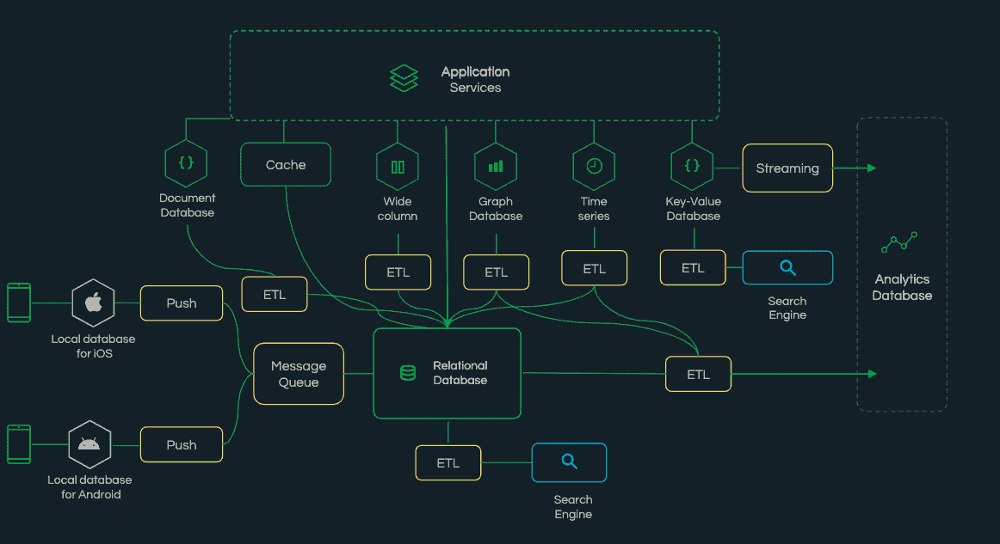

# re:Invent Notes:专用数据库与通用数据库

> 原文：<https://thenewstack.io/reinvent-notes-purpose-built-vs-general-purpose-databases/>

[Dominic Wellington](https://www.linkedin.com/in/dwellington/)

[Dominic 是 MongoDB 的一名主管，他与开发人员和客户密切合作，使他们的技术体系现代化。他在该行业拥有超过 20 年的经验，曾担任过包括工程、建筑、销售和营销在内的众多不同职位。](https://www.linkedin.com/in/dwellington/)

在过去的十年中，AWS re:Invent 已经成为一年中最大的事件，至少对于任何从事云工作甚至接近云的人来说是这样。今年，感觉更大了，因为去年我们都错过了一次面对面的活动。

今年在另一个方面也有所不同:这是第一次没有安迪·雅西主题演讲中没完没了的产品系列，而是穿插了 re:Invent House 乐队的“音乐”插曲。(Jassy 今年早些时候被提升为亚马逊总裁兼首席执行官)。

相反，AWS 新任首席执行官 Adam Selipsky 用一种非常不同的基调给这次活动打上了自己的印记，他更加关注讲故事，尤其是 AWS 的客户故事。

缺乏重磅消息意味着今年很难找到《re:Invent》的主题。可以肯定的是，有很多创新被宣布，但它们几乎都是持续的创新，是现有想法的新迭代。Graviton 3 处理器看起来将会击败其他所有处理器，但线索就在名字中:它是 Graviton 2，经过改进。

随着这一周的继续，我看到一种趋势开始出现，一个又一个主题演讲以“每个用例一个数据库”为主题，并吹嘘 AWS 拥有“最广泛的专用数据库”但这是用户真正想要的吗？

## 建筑复杂性

第一个问题是很少有用例真正适合这些狭窄的专用数据库引擎中的一个。大多数真实世界的例子，甚至 AWS 自己的参考架构，都有几个不同的数据库——通常通过一个名为 AWS Glue 的服务连接在一起。数据被存储在一个地方用于一种查询，然后部分或全部数据被复制到其他地方以支持不同类型的查询；在某些时候，汇总查询可能是必要的，具有另一个数据库引擎。潜在用户可能会因为困惑和绝望而放弃。

下面是一家财富 500 强公司面向消费者的应用程序的架构示例。看着它，您可以快速掌握学习、管理和支持所有这些不同技术以及将数据放在所有这些不同的孤岛中所面临的挑战。知道如何创建数据、备份数据和同步数据是一场运营噩梦。

财富 500 强客户的典型面向消费者的应用程序的架构示例。

## 控制和安全

过度复杂的负面后果不仅限于更高的成本，无论是就 AWS 资源本身、涉及的不同许可模型还是理解架构图中每个组件所需的各种技能集，以及它与所有其他组件的交互(期望的和不期望的)而言。

还有一个二阶后果。当数据从一个系统复制到另一个系统时，第一个系统的操作员就失去了对数据的控制。无法授予数据集副本有限的权限。一旦你有了自己的副本，你就可以对它做任何你想做的事情，包括可能超出用户或法律授权的行为。另外，需要使用每个数据库引擎固有的安全控制来单独保护每个副本。

每一次复制都增加了防御方必须担心的攻击面，无论是针对外部攻击者，还是针对偏离政策和法规界限的善意内部人员。

## 开发者疲劳

开发人员的工作在本质上是独一无二的，因为他们不需要制定战略。相反，人们期望他们开发软件来执行高管设定的策略。一旦一个用例跨越了多个数据库引擎，那么单个开发人员就很难在同一水平上理解每个引擎。

以前可能至少对整个用例有工作知识的开发人员现在发现他们被许多领域拒之门外——除非他们投入宝贵的时间来获得使用另一个专业数据存储所需的技能。正如 RedMonk 的 Stephen O'Grady 最近指出的那样，“虽然没有人愿意回到一个唯一现实的选择是关系存储的世界，但今天必须学习和与多个数据库交互的开销已经成为一种负担，而不是好处。”

这种困难扩大了开发人员和应用程序的业务线用户之间的鸿沟。这种专门化也创造了一个最低限度，低于这个限度，新的要求就不可行。建立一个全新的数据库并弄清楚如何将它与现有系统连接起来是值得的，这需要一定的期望值。低于这个级别，所请求特性的开发要么是不可行的，要么是受限于其他系统中可用的通用构造。结果是不满意的最终用户又一次被剥夺了他们工作所需的功能。

Adam Selipsky 和 AWS 显然将数据库引擎的广泛目录视为一个积极因素，其中有一个选项专门用于满足各种需求。从这个角度来看，这个层次和实际用户工作的层次之间的空间可以由寻找路径的故事来填充。我对这种情况不太有信心。

<svg xmlns:xlink="http://www.w3.org/1999/xlink" viewBox="0 0 68 31" version="1.1"><title>Group</title> <desc>Created with Sketch.</desc></svg>