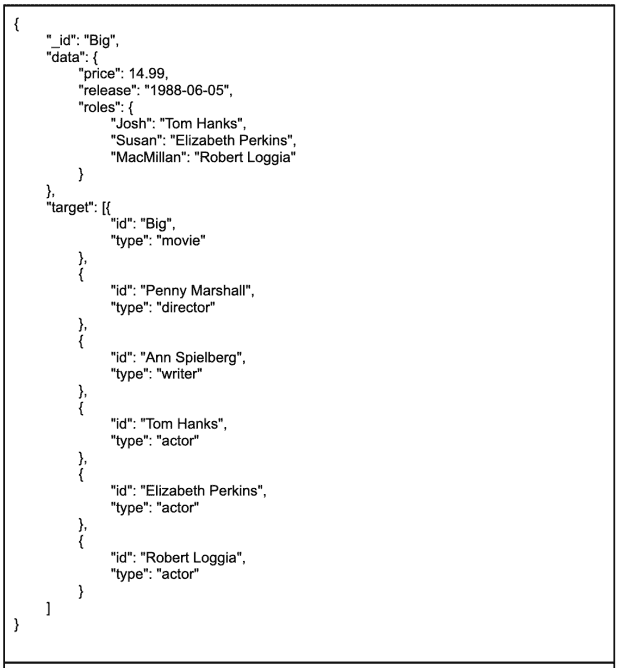
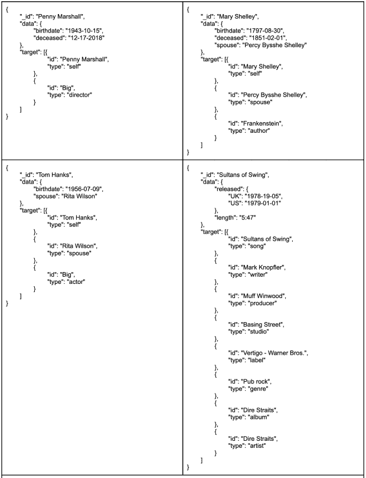

# 企业级的 NoSQL 关系:来自亚马逊的教训

> 原文：<https://thenewstack.io/relational-to-nosql-at-enterprise-scale-lessons-from-amazon/>

 [里克·霍利汉

里克在 MongoDB 领导战略客户开发人员关系团队，在这里他为公司最大的客户提供咨询，并就行业最佳实践、技术转型、分布式系统实施、云迁移等提供指导。此前，Rick 领导了亚马逊的架构和设计工作，将数千个关系型工作负载从 RDBMS 迁移到 NoSQL，并建立了卓越中心团队，负责定义数千个亚马逊内部服务团队和 AWS 客户目前使用的最佳实践和设计模式。](https://www.linkedin.com/in/rickhoulihan/) 

当大多数人想到亚马逊时，他们会想到云。但该公司成立于人们谈论云的十多年前。事实上，到 2002 年，当亚马逊创始人杰夫·贝索斯写了一封[现在著名的内部电子邮件](https://old.gigaom.com/2011/10/12/419-the-biggest-thing-amazon-got-right-the-platform/)指导所有新软件开发围绕面向服务的架构进行设计时，亚马逊已经是一家价值 50 亿美元的企业。

2017 年，亚马逊的年收入是该年收入的 50 多倍，像许多企业组织一样，该收入的核心是由构成业务主干的单一服务驱动的。

这些巨石不会在一夜之间消失，在 2017 年和 2018 年，亚马逊启动了一个名为“滚石”的大规模 RDBMS 到 NoSQL 的迁移项目，以移动约 1 万个 RDBMS 支持的微服务，并将剩余的巨石分解为 NoSQL 支持的微服务。

亚马逊选择使用自己的 NoSQL 数据库，但从这一巨大努力中获得的经验教训对于任何向 NoSQL 或文档数据库的迁移都是有价值的。在这篇文章中，我将分享一些关于何时以及如何使用 NoSQL 的见解。

## **RDBMS 成本**

在这次迁移时，我负责亚马逊零售业务的 NoSQL 黑带团队，这是该业务的卓越中心，开发了亚马逊今天用来构建 NoSQL 支持的应用服务的大多数设计模式和最佳实践。2017 年，亚马逊拥有超过 3000 个 Oracle 服务器实例，10000 个应用服务和 25000 名全球开发者，几乎整个开发团队都精通关系数据库技术。然而，推动业务发展的 IT 基础设施的成本正在失控。

当团队开始寻找根本原因时，他们很快意识到关系数据库管理系统(RDBMS)的成本是一个大项目。支持 RDBMS 工作负载所需的基础架构非常庞大，并且不能很好地扩展以满足公司高需求服务的需求。

Amazon 拥有世界上最大的 Oracle 许可证和最大的 RAC 部署，基于 RDBMS 的扩展服务的成本和复杂性对业务产生了负面影响。结果，我们开始查看我们在这些数据库中实际做了什么。一些有趣的事情发生了。

我们发现，我们针对数据运行的 70%的访问模式涉及单个表上的单行数据。另外 20%是在单个表上的一系列行上。因此，我们没有高速运行复杂的数据查询。

事实上，绝大多数只是插入和更新，但其中许多是跨不同系统“事务性地”执行的，使用[两阶段提交](https://en.wikipedia.org/wiki/Two-phase_commit_protocol)来确保数据一致性。此外，其他 10%的访问模式的成本非常高，因为大多数是需要多个表连接的复杂查询。

## **科技触发**

在该团队研究这些问题的同时，他们还注意到了行业中的一个趋势:每核心 CPU 性能趋于平缓，服务器处理器行业在 [5 纳米制造技术](https://en.wikipedia.org/wiki/5_nm_process)上的投资不足以满足[摩尔定律](https://en.wikipedia.org/wiki/Moore%27s_law)所描述的效率提升。这也是亚马逊[自建处理器](https://www.wired.com/story/new-amazon-chips-cloud-computing/)的原因之一。

如果你看看数据处理的历史，你会看到一系列的高峰和低谷，它们可以被定义为“数据压力”，或者系统在合理的时间内以合理的成本处理所需数据量的能力。

当这些维度中的一个被打破时，它定义了一个“技术触发器”，表明需要发明一些东西。在 Amazon，我们看到关系数据库的成本效率在下降，而高时间复杂度查询的 TCO 却在上升。有些事情必须改变。

关系数据平台只能在垂直方向上很好地伸缩，这意味着得到一个更大的盒子。迟早，没有更大的盒子，并且扩展 RDBMS 支持的系统的选项引入了设计复杂性或时间复杂性。分割 RDBMS 系统很难自我管理。

此外，尽管分布式 SQL 通过在 API 后面提供分布式交叉提交之类的东西来保持一致性，从而将用户从这种复杂性中隔离出来，但这种隔离也是有代价的，这可以通过跨分布式后端运行的查询的时间复杂性来衡量。

与此同时，存储成本正在下降，NoSQL 非规范化、低时间复杂度查询的前景至少是诱人的。显然，操作关系数据库不会变得更便宜；它只会越来越贵。

因此，亚马逊决定进行可能是有史以来最大规模的技术迁移，并降低 RDBMS 技术的价值，以支持所有 1 级服务的 NoSQL。

## **培养 NoSQL 技能的新方法**

滚石计划大张旗鼓地启动，并得到了所有利益相关者的认可。但一开始事情并不顺利。亚马逊的开发人员现在正在使用一个数据库，该数据库旨在消除他们一直依赖的复杂查询，并且缺乏内部 NoSQL 数据建模专业知识正在削弱迁移工作。

团队缺乏设计高效数据模型所需的技能，因此原型解决方案的早期结果比预期的要差得多。为了纠正这种情况，领导层创建了一个卓越中心来定义最佳实践，并对广泛的亚马逊技术组织进行培训；NoSQL 黑带小组是在我的领导下成立的。

我们面临的挑战是巨大的。在一个拥有 25，000 多名技术团队成员的组织中，我们在全球范围内的资源有限。建立在研讨会、棕色袋子和黑客马拉松基础上的传统技术培训方法没有交付所需的结果，因为亚马逊组织缺乏 NoSQL 技能的核心。

此外，传统的培训倾向于围绕固定的问题进行沙箱化，这些问题通常不代表开发人员实际在做什么。因此，技术团队成员在完成这些练习时，并没有深入了解如何将 NoSQL 应用于他们的特定用例。

为了纠正这种情况，我们重新设计了敬业度模型。我们没有举办研讨会和黑客马拉松，而是使用团队正在开发的实际解决方案作为学习练习。

Blackbelt 团队在 Amazon 开发中心执行了一系列有针对性的约定，在那里我们交付了技术棕色袋会议，以倡导最佳实践和设计模式。然而，我们没有举办固定的研讨会，而是安排团队进行单独的设计评审，讨论他们的具体工作负载，并构建一个他们可以迭代的数据模型原型。

结果是强有力的。团队获得了他们可以依赖的可操作的信息，而不是可能与他们的用例相关或不相关的一般知识。在接下来的三年中，Amazon 将所有第 1 层 RDBMS 工作负载迁移到 NoSQL，并将支持这些服务所需的基础架构减少了 50%以上，同时仍然保持了较高的业务增长率。

*观看 Rick Houlihan 的完整 MongoDB World 2022 演示，“从 RDBMS 到企业级 NoSQL”*

[https://www.youtube.com/embed/7jG3upDK4rY?feature=oembed](https://www.youtube.com/embed/7jG3upDK4rY?feature=oembed)

视频

## **何时使用 NoSQL —查看访问模式**

什么时候应该使用 NoSQL？在亚马逊，我不得不多次回答这个问题，但答案并不明确。关系数据库不知道访问模式。它不在乎你问什么问题。你不必了解代码，尽管有些人会认为 SQL 就是代码。理论上你可以问一个简单的问题，得到你的数据。关系系统做到这一点的方法是不知道每一种访问模式，也不为任何一种模式进行优化。

现实是我们写的代码从来不会问随机的问题。当你写代码时，你是在做一个自动化的过程——一天运行十亿次相同的查询，而不是运行一千次随机查询。

因此，如果您理解了访问模式，您就可以开始对数据做一些事情来创建更容易被系统检索的结构，同时做更少的工作。这是关键。降低数据处理成本和部署基础架构数量的唯一方法是减少工作量。

OLTP(在线事务处理)应用程序确实是 NoSQL 数据库的最佳选择。您将在这里看到最大的成本效益，因为您可以创建反映您的访问模式的数据模型和反映您的应用程序层中的对象的代表性数据结构。

我们的想法是交付一个在高速访问模式下非常快速的系统，这种模式构成了您的大部分工作负载。在最近的“问我任何问题”中，我更多地讨论了数据访问模式和数据建模。

## **让一切运转起来**

有句话说得好，“数据就像垃圾。在你收集它之前，你最好知道你要用它做什么。”这就是人际关系发挥作用的地方。对我来说，非关系数据是不存在的。我接触过 1000 多个客户和工作负载，从未见过非关系数据的例子。当我查询数据时，关系由我的查询条件定义。我们处理的每一份数据都有某种结构。它有图式，它有关系；不然我们也不会在意。

无论你在构建什么样的应用程序，你都需要某种实体关系图(ERD ),来描述你的逻辑数据图、实体以及它们之间的关系，以便理解如何建模。否则，你只是把一堆字节扔进桶里，然后随机选择东西。

这些事情之间总是存在关系的。在关系模型中，它们通常以第三范式(3NF)建模。例如，在典型的产品目录中，您会看到产品和书籍、产品和专辑、产品和视频之间的一对一关系，专辑和曲目之间的一对多关系，以及视频和演员之间的多对多关系。

这是一个非常简单的 ERD——我们甚至没有谈论任何复杂的模式。但是假设您想要获得所有产品的列表，您必须运行三个不同的查询和不同级别的连接。发生了很多事情。

在 NoSQL 数据库中，你要把所有这些行折叠成对象。如果您考虑这种工作负载的主要访问模式，它将类似于“通过该 ID 获取产品”或“获取该类别下的所有图书”每当您需要产品时，您通常需要该产品的所有数据，因为您将在产品窗口中使用它。如果将所有内容放在一个文档中，就不必再连接这些文档或行。您可以通过产品 ID 获取数据。

如果您从时间复杂性的角度考虑正在发生的事情，当您在表中拥有所有数据时，您的一对一连接不会太差，但是对于一对多，时间复杂性开始增加。

同样，这里提到的例子相当简单。当您开始使用嵌套连接、外部和内部连接以及其他更复杂的 SQL 语句时，您可以想象时间复杂度变得有多糟糕。那是你的 CPU 在燃烧，跨表组装数据。如果您运行的是关系数据模型，并且正在连接表，那么这就是一个问题。

## **索引并征服**

让我们考虑一下如何在 NoSQL 建立这些连接的模型。首先，我们对产品进行键值查找。但是我们也可以创建一个名为“target”的嵌入式文档数组，其中包含所有与产品相关的内容，如图 1 所示。它包含元数据和按产品 ID 查询时所需的任何产品信息。现在我们使用嵌入式文档，不再有时间复杂性。都是索引查找。可以是一对一、一对多、多对多——都没关系。只要目标是“获取文档”，它仍然是索引查找。

图 1:创建一个名为“target”的数组消除了连接来自不同行、列或表的数据的需要。

当然，除了索引查找之外，应用程序中还包含更多的内容。记住，我们在 Amazon 上 70%的访问模式是针对单行数据，20%是针对单个表上的一系列行。对于更复杂的访问模式，我们需要更多的维度。

例如，如果我们要查询某个作者的所有书籍或与“x”相关的所有人，这将需要向集合中添加更多的维度或文档。我们可以为电影集合中的其他演员、所有电影的导演、电影中的歌曲、这些歌曲与这个集合中的其他实体的关系、作者、制作人、演唱这些歌曲的艺术家以及这些歌曲出现的所有专辑创建文档，如图 2 所示。

图 2:通过向集合中添加文档来创建更多的维度。

现在，如果我索引“目标”数组——这是 MongoDB 和文档数据库、多键数组的一个优点——我就可以创建这些“目标”id 的 B 树查找结构，并连接所有这些文档和所有这些维度，如图 3 所示。例如，现在我可以选择目标 ID 是 Mary Shelley，并获取与她相关的所有内容—书籍、人物、对她作品的评论。如果目标 ID 是一首歌曲的标题，我就可以获得关于这首歌曲的所有信息。

图 3:多键数组创建了本质上的 B 树查找结构，连接所有相关的文档。

本质上，我们使用索引作为连接机制，这在 NoSQL 是一个关键的区别。在 AWS，许多团队找到我，告诉我 NoSQL 不起作用。但是，需要理解的关键是，如果您对存储在具有相同值的公共维上的同一个表或集合中的文档进行索引，那么您基本上消除了跨相同值和跨多个表连接相同索引的需要。

这就是关系数据库的作用。您不希望在关系数据库中连接未索引的列，因为这会产生大量开销。您希望索引这些属性，并将指针指向父对象和子表，然后在这些 id 上进行连接。使用 NoSQL，我们实际上是将所有这些项目放在一个表中，并根据 ID 进行索引。这种方法还消除了时间复杂性。如果所有这些文档共享一个公共表，并且它们在一个公共属性上被索引，那么时间复杂度是 [0(log(N))](https://stackoverflow.com/questions/2307283/what-does-olog-n-mean-exactly) 。

处理来自数据库的请求的 70%的开销不是获取数据。它管理连接，整理数据，并在 TCP/IP 堆栈之间来回移动数据。因此，如果我可以从一个事务中消除一个请求，我将减少该事务的开销。

## **结论**

一起访问的数据应该一起存储。这是我们在 MongoDB 一直信奉的信条。一旦我们开始学习如何在亚马逊使用 NoSQL，我们开始有更好的结果。我们通过定期安排的培训课程做到了这一点，在这些课程中，我们可以使用自己的工作量教授 NoSQL 的基本原理。这就是我在 MongoDB 的开发者权益团队现在对客户做的事情。我们提供如何为他们的工作负载建模数据的模板，以帮助他们自己完成。

<svg xmlns:xlink="http://www.w3.org/1999/xlink" viewBox="0 0 68 31" version="1.1"><title>Group</title> <desc>Created with Sketch.</desc></svg>