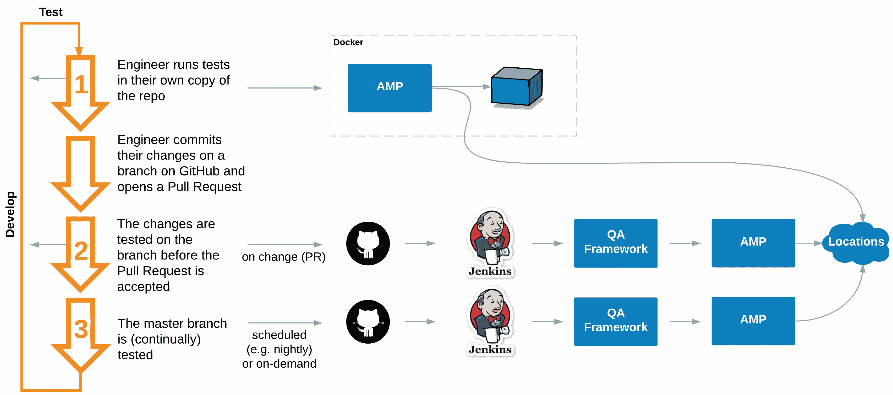
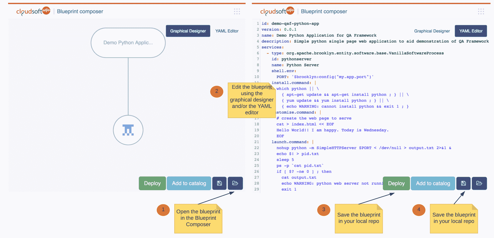

# 借助云软 AMP 蓝图实现可靠的持续交付

> 原文：<https://thenewstack.io/reliable-continuous-delivery-cloudsoft-amp-blueprints/>

 [Murdo Aird，运营副总裁

Murdo 拥有 20 年的行业经验，曾在多个岗位上成功运营。Murdo 建立并管理了中型开发和运营团队，以在对他们来说是新的市场和技术中运营，他了解适当的培训、指导和知识的重要性，这些是使团队能够快速行动并自我维持所必需的。作为 SaaS 产品服务交付的负责人，Murdo 在理解满足 SLA、可重复流程、应用程序管理和监控的重要性方面经验丰富。](http://cloudsoft.io) 

我们在 [Cloudsoft](http://cloudsoft.io) 经常被问到的一个问题是“我如何在 CI/CD 中使用蓝图？”

我们不知道。我们不知道你的环境、目标或限制，这些都很重要。在连续交付管道中，蓝图有很多很多的用处，因为它们为所有的涉众和他们的工具提供了一种共享的语言。从架构设计，到本地主机或容器上的开发/测试，到部署和推广，再到实际的动态运行时模型，Cloudsoft AMP 让每个人都可以对您的应用程序有一个清晰而权威的描述。

然而，图片胜过千言万语，所以这篇文章着眼于我们内部使用 AMP 开发和运行系统的一些方式。

AMP QA 框架是我们部署管道的基石:这是一组强大的组件，允许组织实施系统化的方法来测试应用程序。它支持蓝图的自动测试、测试结果的存储以及结果的查看。

很少看到不特定于实施它的组织的管道，但无论您使用的是 [GoCD](https://www.go.cd/) 、 [Concourse](https://concourse.ci/) 、 [Drone](https://github.com/drone/drone) 、Jenkins 和/或手工滚动的 web 挂钩和脚本、云软 AMP 模型、API 和 CLI 以及云软 QA 框架，都旨在流畅地插入需要它们的工具和组织。

## 处理复杂多变的地形

首先，让我们考虑一下为什么您需要这种能力。在这个以云为先的 IT 时代，您的环境非常复杂，并且一直在变化。这些不可或缺的组件中的任何一个或所有组件经常会发生变化，而且这些变化并不总是在您的控制之下:

*   应用程序
*   蓝图
*   云
*   安培

为一个应用程序全面测试这些可能很棘手——现在考虑为您的组织大规模地这样做。总的来说，如果你没有一个联合的、一切如代码的方法来处理你的应用程序、它们的测试和它们的部署/管理，全面的、定期的和变化的测试可能是昂贵的和容易出错的。

拥有一个允许您以最小的风险将应用程序经常部署到生产环境中的部署管道是非常重要的。

假设您欣赏 AMP 在部署和提供持续的应用生命周期管理方面所提供的优势，让我们后退一步，考虑这样一个问题:“在生产中开发、测试和运行应用蓝图的好方法是什么？”

开发和测试不是单一的活动——它应该在您的工作流程中多次发生。下图说明了在这个迭代方法中，AMP 和 QA 框架与您的源代码管理(SCM)和持续集成/持续交付(CI/CD)工具的关系。

图 1:开发-测试周期(点击放大)。

在这种情况下，他们分别是 GitHub 和 Jenkins。然而，这些可以替代，以满足您的要求。AMP QA 框架足够灵活，适合您的管道——这是特意设计的。

通过在 Docker 容器中运行 AMP 和一些计算节点，您可以加快第 1 阶段的开发-测试周期(如上面的图 1 所示)。使用现有计算节点可以节省大量时间，因为每次部署时都不需要进行配置。但是，如果您确实需要一个“干净”的位置，可以非常快速地创建一个新的容器。

AMP Blueprint Composer(如下图 2 所示)可帮助您开发蓝图。图形设计器帮助您快速查看和使用可用的实体、位置、策略等，以及每个可用的配置选项。这是建立蓝图“形状”的好方法。

YAML 编辑器允许你快速添加细节(两者是同步的)。

图 2: AMP Blueprint Composer(单击放大)。

然后，您可以将蓝图部署到 Docker 容器中，以快速测试行为——并完善您的蓝图。如果您愿意，您还可以部署到云中来测试无法在本地容器中测试的行为。

一旦你满意了，你现在就可以提交更改并在 GitHub 中打开一个 Pull Request(PR)——这样做会自动启动第二阶段(如图 1 所示)来测试你的应用程序、蓝图、AMP 和云。

https://www.youtube.com/watch?v=GNLsIdUe2xM&feature=youtu.be

一旦阶段 2 成功完成，您的 PR 被合并，测试将在主分支上运行(阶段 3——如图 1 所示),以确保您的更改与您的同事的工作兼容。

部署到生产是最后一个阶段——由于前面的阶段，它应该是一个低摩擦、低风险的活动，您可以经常这样做。

希望这已经阐明了一个有用的开发人员工作流程，并展示了 QA 框架如何成为部署管道中的一个有价值的元素。

云软和 Docker 是新堆栈的赞助商。

由[罗伯特·卢克曼](https://unsplash.com/@robertlukeman)通过 [Unsplash](https://cloudsoft.io/) 拍摄的特写图片。

<svg xmlns:xlink="http://www.w3.org/1999/xlink" viewBox="0 0 68 31" version="1.1"><title>Group</title> <desc>Created with Sketch.</desc></svg>