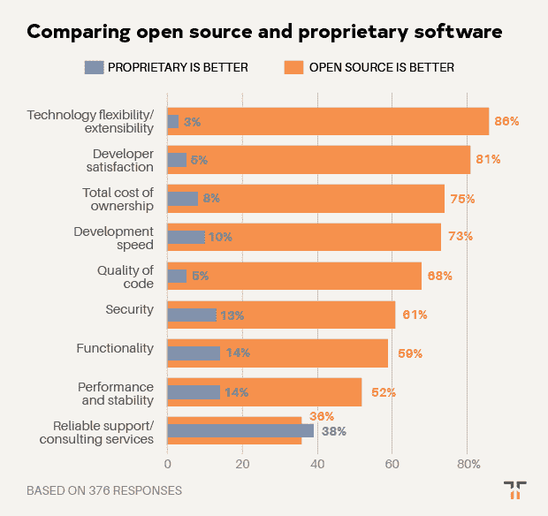
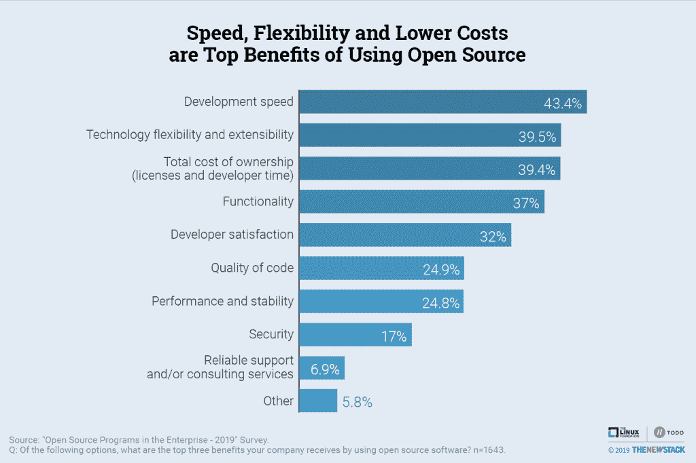

# 可靠的支持抑制了开源的增长

> 原文：<https://thenewstack.io/reliable-support-inhibits-open-source-growth/>

尽管具有压倒性的优势，但对可靠支持可用性的担忧抑制了开放源码的采用，而解决安全问题通常需要可靠的支持。这是由 [Tidelift](https://tidelift.com/) 进行的新堆栈调查的八个结论之一。

如果开源已经成为现代开发者的默认堆栈，那么就做好迎接挑战的准备，因为公司正在努力获得对最新代码的可靠支持。2019 年 6 月，Tidelift 和 New Stack 调查了 369 名在工作中使用开源软件构建应用程序的人。从一系列标准来看，受访者认为开源软件比专有软件更好。86%的人认为开源软件更加灵活和可扩展，只有 3%的人选择专有软件。当谈到开发人员的满意度和速度、总拥有成本和代码质量时，开源也是首选。专有软件被认为稍微好一点的唯一领域是可靠的支持和咨询服务的可用性。近 40%的受访者认为专有软件在这一类别中更强，相比之下，开源软件的这一比例为 36%。

来源:2019 Tidelift 托管开源调查结果。

也许这是他们的虚张声势，但 61%的受访者相信开源软件比专有软件更安全。在所有条件相同的情况下，如果开放源码容易被公众审计和测试，它可能会更安全。然而，保证开源依赖的维护和安全是一个挑战。在这方面，当发现新的安全漏洞时，开发人员需要支持。

新堆栈在 2019 年 7 月进行了另一项[调查](https://thenewstack.io/research-shows-open-source-program-offices-improve-software-practices/)，与[Linux 基金会](https://www.linuxfoundation.org/)和 [TODO 集团](https://todogroup.org/)研究了相同范围的可能好处，但要求受访者说出他们的公司从开源软件获得的三大好处。结果非常相似。只有 7%的人认为可靠的支持或咨询服务是首要优势，只有 17%的人认为安全是首要优势。因此，尽管开源的支持者可能会说它是安全的，但他们不太可能说这是一个关键的优势。

Linux 基金会和 Tidelift 是新堆栈的赞助商。

通过 Pixabay 的特色图片。

<svg xmlns:xlink="http://www.w3.org/1999/xlink" viewBox="0 0 68 31" version="1.1"><title>Group</title> <desc>Created with Sketch.</desc></svg>