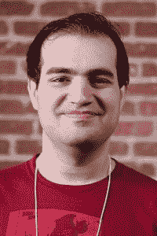

# 缅怀丹·卡明斯基

> 原文：<https://thenewstack.io/remembering-dan-kaminsky/>

广受尊敬的安全专家丹·卡明斯基于 4 月 23 日因糖尿病酮症酸中毒去世，享年 42 岁。他可观的遗产不仅仅是专业知识，还有一种罕见而难忘的仁慈。

上周六，随着黑客新闻在他们的页面顶部添加了一个黑色横幅，认识丹的人分享了他们自己的特殊记忆。

“丹总是乐于奉献他的时间和专业知识。你可以想象，他是那种很容易变得非常富有的人，但他完全不受金钱的驱使。丹着迷于了解我们都认为理所当然的事物的内部运作——比如域名系统。一个真正的黑客，”记得[一名黑客新闻评论员](https://news.ycombinator.com/item?id=26926264)。

安全[企业家](http://www.linkedin.com/in/ryanlackey) [瑞安·拉克](https://en.wikipedia.org/wiki/Ryan_Lackey) [记得](https://news.ycombinator.com/user?id=rdl)卡明斯基是“基本上是‘有感染力的热情’与真正聪明和对许多事情感兴趣相结合的最好例子……他将被世界上许多人怀念很长时间。”

## 瞎折腾

卡明斯基的母亲告诉《纽约时报》说，卡明斯基五岁时收到了一台收音机简易电脑，开始学习编码。到 11 岁时，美国西部的网络管理员打来一个愤怒的电话，抱怨有人“在他不应该胡闹的地方胡闹”(特别是军事领域)。他的母亲告诉《泰晤士报》，打电话的人威胁要切断这个家庭的互联网接入。

她对此进行了反击，承诺在报纸上刊登一则广告，宣称“你们的安全措施太差了，连 11 岁的孩子都能攻破。”

卡明斯基的继父曾在迈克菲公司担任数据工程师顾问，年轻时，卡明斯基本人在思科工作，为大规模网络监控系统设计安全基础设施——甚至在他大学毕业之前。

但是根据 2007 年黑暗阅读的采访[，20 岁时参加黑帽安全会议巩固了他对信息安全的兴趣(讽刺的是，卡明斯基没有辍学，而是回到*大学，完成了他在圣克拉拉大学的商业计算学位)。*](https://www.darkreading.com/black-ops-and-grandma/d/d-id/1128846)

22 岁时，他就在黑帽公司和世界各地的其他科技会议上发表演讲。卡明斯基告诉该网站，他很高兴能与“我一生中见过的最聪明的人”互动。2002 年，卡明斯基与人合著了《黑客保护你的网络》一书*。从 2002 年开始，18 年来，他一直致力于安全网络实用程序 OpenSSH(并且是其邮件列表的积极参与者)。*

 *卡明斯基加入了总部位于西雅图的网络安全公司 IOActive，担任渗透测试总监。根据他的在线传记，卡明斯基为微软 Windows Vista、Windows 7 和 Server 2008 操作系统提供了三年的安全建议。ZDNet [报道](https://www.zdnet.com/article/prominent-security-expert-dan-kaminsky-passes-away-at-42/)卡明斯基还为几家财富 500 强公司提供网络安全建议。

登记簿[记得](https://www.theregister.com/2021/04/25/dan_kaminsky_obituary/)卡明斯基在 2005 年卷入了一个重大的安全事件，当时[马克·鲁西诺维奇](https://twitter.com/markrussinovich/status/1386030279580549120)(现任微软 Azure 首席技术官)发现索尼 BMG 决定在电脑上秘密安装 rootkits 作为反盗版设备。正是丹·科明斯基[对 900 万台北美域名服务器进行了基于 DNS 的调查](https://www.theregister.com/2006/01/16/sony_bmg_rootkit_still_widespread/)以无可辩驳地说明入侵的严重性——确定了至少 35 万个受影响的网络，包括军事和政府网络——最终得出结论，索尼的软件“很可能是几十万到几百万受害者的问题。”这使得这个问题不容忽视。

2006 年，技术新闻网站 Hackaday 报道了卡明斯基的发现，三分之一的 SSL 盒子[共享一个私钥](https://hackaday.com/2006/10/30/dan-kaminskys-ssl-hell/)，这意味着加密的 SSL 流量可以被任何相同的盒子读取。

## 卡明斯基的 DNS 漏洞

但是在 2008 年，当卡明斯基 20 多岁的时候，他发现了互联网本身的一个主要威胁:域名系统中的一个漏洞允许劫持和假冒每个域名。

在 Duo Security 制作的动画视频中，卡明斯基记得把他的发现告诉了保罗·维谢(Paul Vixie)，他是 DNS 协议的早期贡献者之一，他非常震惊，他首先向丹强调，“我需要你永远不要再通过未加密的电话线告诉任何人。”

[https://www.youtube.com/embed/B-v_wJIJUI4?feature=oembed](https://www.youtube.com/embed/B-v_wJIJUI4?feature=oembed)

视频

两人说服微软召集了一次世界高级网络安全专家的秘密会议。在卡明斯基的转述中，维谢将这次会面描述为“我召集了一大群人。他们将登上一架飞机，他们不知道为什么。”

成功了。2016 年黑帽大会仍然[称赞它](https://www.prnewswire.com/news-releases/internationally-renowned-technologist-and-key-shareholder-of-the-internet-dan-kaminsky-to-keynote-black-hat-usa-2016-300281174.html)为“迄今为止最大的互联网基础设施同步修复”信息安全杂志[记得](https://www.infosecurity-magazine.com/news-features/gone-too-soon-dan-kaminsky-hacker/)微软、思科、Sun 和每一个主要的 Linux 发行版同时发布了大量补丁。

在接下来的几年里，它经常被简单地称为“[卡明斯基的 DNS bug](https://www.networkworld.com/article/2260639/dns-remains-vulnerable-one-year-after-kaminsky-bug.html) ”[黑客新闻上的两个](https://news.ycombinator.com/item?id=26925151) [评论者](https://news.ycombinator.com/item?id=26925303)甚至还记得大学时被教卡明斯基的 DNS 缓存中毒攻击作为练习。

不久之后，在十多年的时间里，卡明斯基也是互联网社区的“[可信代表之一](https://www.iana.org/dnssec/tcrs)”被选中参加根密钥生成仪式，以确保 DNS 系统的完整性。(卡明斯基是仅有的七名恢复密钥持有者之一。)

## 骄傲和蔑视

令人惊讶的是，这些回忆中有多少是出于卡明斯基的个人善意。《纽约时报》网络安全记者妮可·珀尔罗斯记得他是记者和有抱负的黑客的导师。“在一个以在 Twitter 上发表尖刻、有时是厌恶女性的言论而闻名的社区，卡明斯基先生因其同情心而脱颖而出。”卡明斯基甚至开发了一个移动应用程序(名为 DanKam)来帮助色盲，并帮助美国国立卫生研究院开发远程医疗工具(他后来试图在疫情期间实施)。想起自己的根，珀尔罗斯写道，“他经常为那些负担不起的人支付黑帽酒店或旅行的账单。”

甚至[Andre essen Horowitz 的普通合伙人兼 OpenDNS 的创始人兼首席执行官 David Ulevitch](https://en.wikipedia.org/wiki/David_Ulevitch) 也在[黑客新闻上的评论](https://news.ycombinator.com/item?id=26925993)中回忆道，卡明斯基“是那个让我在 Defcon 的房间里过夜的家伙，当时我还未成年，还太小，不能自己订房间。

“这开启了 20 年的友谊。他才华横溢，风趣幽默，总是讨人喜欢，惹人喜爱……他是黑客中的黑客，是你想要的那种人。”

黑帽和 Defcon 安全会议的创始人杰夫·莫斯帮助收集了一个 YouTube 播放列表，收集了丹多年来的演讲。

《纽约时报》深情地记得卡明斯基是如何生动而有力地阐述他的观点的。例如，2016 年，卡明斯基在黑帽安全会议上发表了一篇主题演讲，对网络安全行业提出了一些尖锐的批评，称“每个人看起来都很忙，但房子仍然在燃烧。”

《连线》杂志 2013 年的一篇关于比特币的文章也显示了卡明斯基愿意以乐观而振奋的怀疑态度面对世界。(“我就直说了吧:钱已经出问题了……比特币基本上可以被认为是互联网，应用于金钱。”)后来卡明斯基补充道，“毕竟，互联网运行在充满错误的技术基础上，它生存了下来。为什么不是比特币？”

在他 2016 年对 DNS 漏洞的复述中，卡明斯基认为“我们让互联网变得不那么易燃。互联网从未被设计成安全的。互联网是为了移动猫的照片而设计的…

“不知何故……全球经济已经进入了我们的世界。我们只是坐在这里，就像，'伙计，这是我们在 1983 年建造的。我们没想到你会在这件事上转移数万亿美元。“答案？”我们中的一些人得出去修理它。"

2015 年，网站 Dark Reading 用丹自己的一句典型的激励人心的话开始了它的推荐。

“我们是黑客:我们不怕了解事情的运作方式。让我们利用这些知识和无畏精神，让事情变得更好。”

<svg xmlns:xlink="http://www.w3.org/1999/xlink" viewBox="0 0 68 31" version="1.1"><title>Group</title> <desc>Created with Sketch.</desc></svg>*