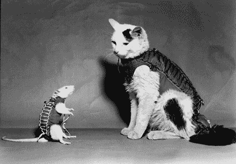

# 记住太空中的第一只猫

> 原文：<https://thenewstack.io/remembering-first-cat-space/>

这个月，一些网络作家想起了第一只太空猫 Félicette，当时的狗仔队称它为“太空猫”。她和她 1963 年的太空之旅在法国政府航天局*国家空间研究中心*的网站上占据了一个荣誉的位置[。](http://www.cnes-observatoire.net/memoire/musee_manif/12_jep11_compagnons-espace_mem/03.html)

“感谢你参与我 1963 年 10 月 18 日的成功，”Félicette 亲笔签名的宣传照片上写道。不清楚这只猫在和谁说话，也不知道她是如何学会写字的，但是她的故事已经代代相传了。

根据 Félicette 在维基百科上的[页面，Félicette 是](https://en.wikipedia.org/wiki/F%C3%A9licette)[为法国航天局接受太空任务训练的 14 只猫](http://www.nospremieresannees.fr/fusee_sonde_tout/fu07-animaux/fu075-diaporama_chat/diaporama.html)之一。他们在高 G 离心机和压缩室中忍受高加速度训练，这是一种猫版本的“正确的东西”。人们通常说，菲利塞特是在巴黎街头游荡时被发现的，然后被抓起来，开始了完全不同的命运。虽然历史悠久的网站 [Purr-n-Fur UK](http://www.purr-n-fur.org.uk/famous/felix.html) 也听说法国太空计划从一个猫贩子那里买下了 Félicette。

英国猫猫协会报道说，所有的猫“都被故意不取名字，以防止工作人员过于依赖它们，结果可能会受到影响”。显然，Félicette 的名字起源于她飞行后的某个时候。该网站报道了一个更令人兴奋的情节转折。在半个世纪前的这些事件的故事中，有一个神话出现了，Félicette 不是最初被选中参加太空任务的猫，而是一只名叫 Félix 的公猫，它在最后一刻设法逃离了实验室——所以 Félicette 可以说是默认进行了飞行。

“然而，这一说法的新信息直接来自热拉尔·查特利尔博士，他是一名熟练的外科医生，在猫科动物太空飞行时在 CERMA 从事太空计划:他说从来没有一只叫费利克斯的猫，他不知道这个故事的起源。”

该网站还报道说，第一只进入太空的猫应该是从巴西发射的。1959 年元旦，巴西陆军技术学校准备将一只名叫弗拉门戈的雄猫发射到 70 英里的高空，同时监测它的健康状况，然后打开太空舱的降落伞返回地球。但是爱猫人士抗议，相反，该项目被拆除，而负责该项目的男子，曼努埃尔多斯桑托斯拉赫上校，被转移到其他职责。

于是，在 1963 年 10 月 18 日，阿尔及利亚一个辉煌的早晨，菲丽塞特创造了历史。在撒哈拉沙漠的某个地方，当时钟敲响上午 8:09 时，菲利塞特的火箭升空了。它优雅地升到空中——整整 97 英里——然后打开降落伞。整个飞行只用了 15 分钟就结束了，但是维基百科报道勇敢的 Félicette“在太空舱降落到地球后被安全回收。”一部法语纪录片纪念了那只猫被从降落伞包中拉出的惊心动魄的一刻。

[https://www.youtube.com/embed/v-tpmvGRoyw?start=434&feature=oembed](https://www.youtube.com/embed/v-tpmvGRoyw?start=434&feature=oembed)

视频

早在 1963 年，T4 的《悉尼先驱晨报》就欢呼道:“法国成功地将一只猫送上了太空。”。

Félicette 的故事在 2017 年初引发了另一波有趣的回忆。“在落后于苏联和美国的竞争对手后，法国急于在太空竞赛中提出自己的主张——出于某种原因，与猫竞争，”[Gizmodo](https://gizmodo.com/the-secret-history-of-the-first-cat-in-space-1791663725)打趣道。他们补充说，菲利塞特的故事“已经湮没在时间的长河中；一个我们这个偏爱狗的成就高于一切的男权社会的受害者。”

“通过让她的故事流传下去，我们向这只勇敢的流浪猫致以应有的敬意，它达到了我们大多数人永远也不会达到的高度。”

尽管一个评论 Gizmodo 故事的人想象了一个不同的故事。“猫进入太空，对它所看到的完全不感兴趣，然后回到它习惯的沙发垫上。”

Félicette 并不是第一个进入太空的动物。美国国家航空航天局的一个网页解释说，对动物的研究始于 1948 年，是为了回答一个至关重要的问题，即生物是否能在失重环境中生存。美国宇航局的网页描述了 1948 年从新墨西哥白沙发射的 V-2 火箭，它载着一只狗进入太空——随后是更多的猴子、老鼠或两者结合的发射。载人航天飞行开始后，被带到太空的动物变得更加奇特——从兔子到水母，无所不包。

甚至法国的太空计划也是从训练老鼠开始的。老鼠赫克托尔于 1961 年 2 月 22 日完成了他的飞行，比第一只猫早了两年半。

但是展望未来，我们可能还需要很长时间才能在太空中看到另一只猫。太空历史网站 [collectSPACE](http://www.collectspace.com/) 的编辑上个月告诉 [Gizmodo 说:“我们已经超越了必须在动物身上进行试验，以了解人体在太空中会有什么反应。”。“我们已经把人类送上太空，而且我们已经把他们送上太空一年多了……直到我们看到家人被送上太空进行旅游或运输活动，我想那时我们可能会考虑如何运输我们的宠物。”](https://gizmodo.com/the-secret-history-of-the-first-cat-in-space-1791663725)

虽然 Gizmodo 的采访以他思考火星上的猫的前景结束。“那会很有趣……”

一位 Gizmodo 的评论者只是担心一只猫在零重力状态下的前景，因为“所有的毛都会到处都是。”

# WebReduce

专题图片: [CNES 空间天文台](http://www.cnes-observatoire.net/memoire/musee_manif/12_jep11_compagnons-espace_mem/03.html)，Pixabay。

<svg xmlns:xlink="http://www.w3.org/1999/xlink" viewBox="0 0 68 31" version="1.1"><title>Group</title> <desc>Created with Sketch.</desc></svg>