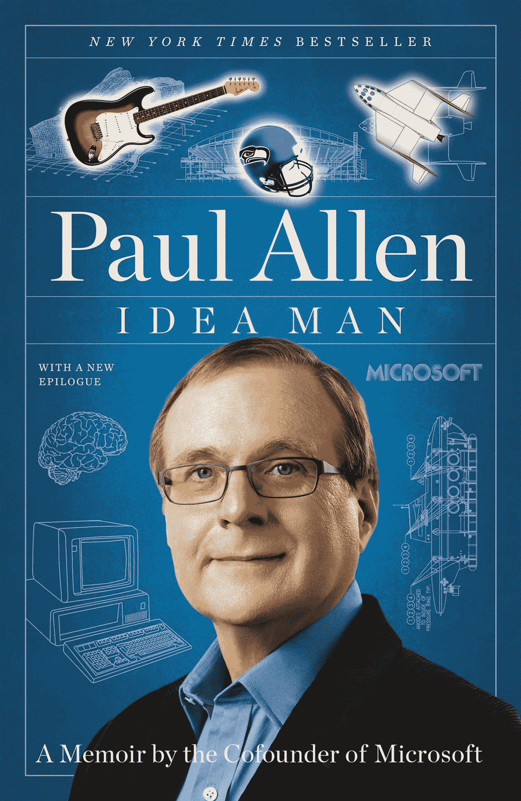

# 缅怀保罗·艾伦，技术先驱和生活冒险家

> 原文：<https://thenewstack.io/remembering-paul-allen-tech-pioneer-and-life-adventurer/>

本周，微软的创始人之一保罗·艾伦去世，享年 65 岁。艾伦在 22 岁时与比尔·盖茨一起创立了微软。仅仅 7 年后，1982 年，他被诊断出患有霍奇金淋巴瘤，并离开了公司(尽管他直到 18 年后才从董事会辞职)。但是他的微软股票使他成为亿万富翁，因此他过着惊人投资的生活——并留下了一系列引人注目的头条新闻。一个小样本:

艾伦在 2011 年接受《60 分钟》采访时表示，在他的余生中，他也追求“多种兴趣的大杂烩”:“他资助一个天线农场监听外星人。他给我们看了他收藏在庄园里的一本莎士比亚对开本。他喜欢足球——他买了一支 NFL 球队。他更喜欢篮球——他还买了一支 NBA 球队。他是个电影迷，所以他投资了好莱坞工作室梦工厂。他想去旅行，所以他给自己造了一艘比足球场还长的游艇，配备了自己的潜艇。”

[https://www.youtube.com/embed/4IM0SvIiMI4?feature=oembed](https://www.youtube.com/embed/4IM0SvIiMI4?feature=oembed)

视频

## **回到未来**

艾伦 15 岁时，13 岁的比尔·盖茨告诉他，“也许有一天我们会有自己的公司，”艾伦在 2011 年的传记中回忆道。在他高中的最后一年，艾伦形容盖茨是一个讨人喜欢的人，他“像我一样热爱电脑和小玩意……我们在一起非常合适。”艾伦估计这些年来他们一起看了 500 部电影。但是他们友谊的真正基石是对计算机的共同兴趣。

“比尔和我都同样热衷于学习我们能学到的一切，”艾伦曾经告诉《卫报》的记者。他们的私立学校提供了一个连接到远程分时系统的终端，他们的热情使这两个学生成为了一个 gig 的测试员，测试一个新安装的 PDP-10 主机，该主机计划出租远程访问。有一次，艾伦呆得太晚，以至于西雅图的公交车都停了，他不得不步行 40 个街区回家。

他们可能是 rapscallion 青少年，为了看一眼它的 TOPS-10 操作系统，他们会在机器存放的大楼外面的院子里翻垃圾，得到咖啡染色的电传打印输出，然后他们会研究几个小时。当他测试 PDP-11 时，系统的硬件主管最终给了 Allen 一本解释汇编代码的手册——和一本他们操作系统的手册。艾伦从来不确定这是鼓励还是戏弄，但“那时和现在一样，青少年经常被低估。”

## **更大的事情**

艾伦甚至和学校的一些朋友(包括盖茨)组成了一个编程团队，受雇用 COBOL 编写一个工资程序。“我们开始不再把自己视为业余爱好者，而更多的是以写代码为生的人。”毕业后的一个夏天，盖茨和艾伦用 FORTRAN 语言为他们的高中写了一个日程安排程序，经常工作到半夜，睡在帆布床上。

这项工作导致盖茨和当时 20 岁的艾伦打电话，讨论一个落后于计划的巨大软件项目——邦纳维尔电力管理局的电网。这成了盖茨高中最后一个学期的“校外高级项目”，他们都是温哥华无阳光地下设施中一个 40 人程序员团队的成员。

但即使在那里，艾伦也在兼职进行第二个项目，这个项目使他们看到了他们见过的第一个微处理器——一个价值 360 美元的 8008 芯片，这是盖茨为一家测量汽车流量的公司进行的数据处理自动化计划的一部分。作为他们努力的一部分，艾伦在他大学的主机上模拟了 8008 芯片。(近十年后，在微软早期，两人仍在使用那个模拟器。)他们曾梦想出售他们创造的硬件，以读取收集的汽车交通数据，但八年后，其总收入仅为 6631 美元(亏损 3494 美元)。

“那时，我和比尔正忙于在西雅图经营另一家公司，”艾伦回忆道。

https://twitter.com/Chess_Trader/status/1052205786800238592

从这次经历中，艾伦瞥见了未来微处理器将执行大型机的工作负载。当盖茨去哈佛的时候，艾伦在波士顿找到了一份编程的工作，希望有机会出现。几十年后，艾伦以 1974 年的传奇时刻开始了他的传记，当时他打开了一份《大众电子》杂志，并读到一家名为 MITS 的奇怪公司[计划出售世界上第一台使用强大的 8080 芯片的个人电脑套件](https://www.atariarchives.org/deli/solomons_memory.php)。“我一点也不知道我的生活将要改变。

天气寒冷多雪，我 21 岁，无所事事……我在霍尼韦尔有一份没有前途的工作，一套破旧的公寓，还有一辆烧着油的 64 年克莱斯勒纽约客，”他在自传中回忆道。但在这些卑微的出身中，他称盖茨为“那些日子里我生命中唯一不变的……自从我们在湖边学校相遇以来，我的犯罪伙伴，那时他八年级，我十年级。"

“如果我们年纪大一点，或者更了解一些，比尔和我可能会被我们面前的任务拖后腿。但我们足够年轻和年轻，相信我们可能会成功，”艾伦写道。

艾伦后来告诉《60 分钟》他们是如何给 MITS 打电话的，并坚持说他们很乐意演示他们为自己的系统编写的操作系统。他们有操作系统吗？“不，”他笑着说。“我们一无所有。”但在接下来的八周里，他们东拼西凑，“不顾一切地抓住机会。”

深夜，艾伦会在键入一行代码时打瞌睡，几个小时后醒来，“眯着眼睛看屏幕，眨两下眼睛，然后准确地从他停下的地方继续。”艾伦记得，他们甚至在无法使用尚未完成的 Altair 计算机的情况下编写了他们的操作系统，甚至无法使用为其提供动力的微处理器。但幸运的是，他们仍然有艾伦的模拟器，这是他们早期尝试交通测量设备时留下的——还有一个名叫蒙特·大卫多夫的学生，他将编写该系统的数学子程序。

将近 40 年后，艾伦记得“那个 8080 包又快又强，已经做得差不多了。直到今天，我仍然为这些代码感到自豪。”盖茨后来告诉艾伦，这是“我们做过的最好的作品”艾伦补充道，“这是一次真正的合作。我估计 45%的代码是比尔的，30%是蒙特的，25%是我的，不包括我的开发工具……”

“据我们所知，我们正在为微处理器构建第一种本地高级编程语言。”

当团队飞往位于新墨西哥州阿尔伯克基的公司总部进行决定性演示时，重要的一天到来了。[一本书](https://www.amazon.com/gp/product/B003PDMKIY/ref=dbs_a_def_rwt_hsch_vapi_tkin_p1_i0)记得对新电脑的需求如此之高，以至于有人已经在公司停车场的拖车里露营了。紧张程度令人难以置信——他们从未在实际机器上测试过——但当艾伦将他们的操作系统输入磁带阅读器，然后输入“打印 2 + 2”并收到“4”的响应时，历史性的测试出现了

“我感到一阵轻松，”艾伦后来告诉《60 分钟》，“因为我几乎不敢相信第一次就成功了。”

剩下的就是历史了。他们在牛郎星操作系统上的工作导致了微软的成立，并且在 1980 年为 IBM 提供了他们的 MS-DOS 操作系统。

不到三年，艾伦就离开了微软的运营部门，但仍拥有该公司超过三分之一的股份。亚马逊上的一位评论者后来认为，保罗·艾伦离开微软后，微软“[缺乏改变游戏规则的想法。相反，微软变得更像盖茨，一个无情、成功、技术卓越的实体。](https://www.amazon.com/gp/customer-reviews/R2ICRP9HUZD3ZH/ref=cm_cr_dp_d_rvw_ttl?ie=UTF8&ASIN=1591845378)

“然而，微软缺乏远见，主要是在追赶其他有远见的公司和想法(网景、苹果、智能手机、平板电脑、游戏机等)。我相信，如果保罗·艾伦留下来，微软可能会是一个不同的、更有远见的公司。”

艾伦将作为一名亿万富翁度过余生——同时记得他在 1982 年被诊断出患有霍奇金淋巴瘤。2009 年，保罗·艾伦第二次与疾病斗争时，53 岁的盖茨来看望了他几次。“我们进行了一些很棒的谈话，”他告诉 *60 分钟*，“我们之间有一种不可否认的纽带，我想我们都感觉到了。”

[https://www.youtube.com/embed/8JGJ6neUrmU?feature=oembed](https://www.youtube.com/embed/8JGJ6neUrmU?feature=oembed)

视频

他最令人心酸的行为之一是悄悄资助新墨西哥自然历史和科学博物馆的一个名为“启动”的展览，“以回报阿尔伯克基社区，他和盖茨在那里度过了他们早年创办微软的职业生涯。”他确保它还包括他与盖茨和华盛顿大学学生保罗·吉尔伯特一起创建的唯一一台“Traf-O-Data”机器。“我想向一个不起眼的硬件致敬，它在微处理器软件革命中发挥了关键作用。

“根据我的经验，每次失败都包含着你下一次成功的种子——如果你愿意从中吸取教训的话。”

本周，盖茨在他的个人博客上分享了他与艾伦早期的回忆。“甚至在高中时，在我们任何人都不知道什么是个人电脑之前，他就预测电脑芯片将变得超级强大，并将最终催生一个全新的产业。”盖茨承认，当他最终离开大学，以便他们可以开始微软，“这是因为保罗…他的洞察力是我们一起做的一切的基石。”

他分享了一些他们两人的照片，当时他们还是目光明亮的青少年，整个世界都在等待他们。“保罗应该得到更多的时间，”盖茨写道。“他会充分利用这一点。

“我会非常想念他。”

* * *

# WebReduce

保罗·艾伦的特写图片，作者迈尔斯·哈里斯，知识共享。

<svg xmlns:xlink="http://www.w3.org/1999/xlink" viewBox="0 0 68 31" version="1.1"><title>Group</title> <desc>Created with Sketch.</desc></svg>