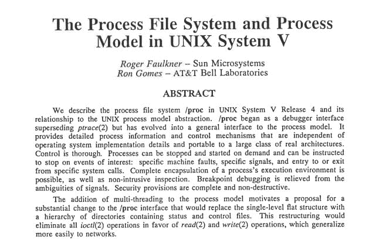

# 缅怀罗杰·福克纳:UNIX 冠军

> 原文：<https://thenewstack.io/remembering-roger-faulkner/>

随着一年的结束，回顾发生了什么变化是一种传统，我将永远记住的一件事是，当 UNIX 先驱罗杰·福克纳在 76 岁时去世时，人们对他的喜爱和尊敬与日俱增。

在[USENIX](https://www.usenix.org/memoriam-roger-faulkner)的追悼会上，Joyent 首席技术官 [Bryan Cantrill](https://twitter.com/bcantrill) 将他在 Sun Microsystems 的前同事称为“后 AT T UNIX 的教父”，并补充说“在他从事 UNIX 内核的四十年中，Faulkner 不仅是贝尔实验室火焰的守护者，也是整整一代内核工程师的灵感来源。”

Cantrill 指出，Faulkner 的“真爱”是/proc，它是 Unix 进程模型的 API(今天在 Linux 部署上实现为虚拟文件系统[):](http://tldp.org/LDP/Linux-Filesystem-Hierarchy/html/proc.html)

“罗杰认为，有时需要可怕的东西来创造美丽的抽象，他在/proc 上的开创性工作体现了这种负担:内部可能是微妙和肮脏的(罗杰可能会用他独特的卡罗莱纳口音说“卑鄙”)，但由此产生的抽象在其能力、范围和健壮性方面令人惊叹。”

瓦莱丽·芬威克现在是甲骨文公司的软件开发经理，也是 Sun 公司的前同事[，她在网上收集了关于福克纳的其他回忆](https://bubbva.blogspot.com/2016/07/remembering-roger-faulkner-unix-legend.html)。她甚至将福克纳在一些 C 代码中留下的令人难忘的评论与程序员彼得·梅米西安分享，他记得这是福克纳“在必要时不害怕说出自己的想法”的一个例子

`/*
* This is a horrible kludge. It is vile. It is swill.
* If your code has to call this function then your code is the same.
*/` 

12 月中旬，在第一次[我们热爱的系统会议](http://systemswe.love/agenda)上，软件工程师[亚当·莱文塔尔](https://twitter.com/ahl)记得福克纳是“一个伟大的系统工程师”，他说他曾在太阳微系统公司`/proc`和他一起工作。Leventhal 正在介绍大会的第一个演讲——关于/proc 文件系统——由 Joyent 软件工程师 [Ryan Zezeski](https://twitter.com/rzezeski) 主讲。Zezeski 列出了早期的一些英雄，UNIX 辉煌的过去，“全大写 UNIX”时代的“自由生存或死亡”的“老派”人。

https://youtu.be/TPe6UXMDMGM?t=28m6s

泽泽斯基讲述了很久以前的故事，讲述了福克纳如何在“阁楼”中与许多伟人(包括[肯·汤普森](http://www.linfo.org/thompson.html)和[丹尼斯·里奇](https://www.bell-labs.com/usr/dmr/www/))一起工作——阁楼是新泽西州霍尔姆德尔贝尔实验室“2 号楼”的神圣区域[，Unix 最初在这里诞生](https://en.wikipedia.org/wiki/History_of_Unix)。Unix 最终在 20 世纪 80 年代转移到 Unix 系统实验室，最后在 1990 年到达 Sun Microsystems。

在 Unix 的早期，您只能跟踪子进程——并且子进程必须选择参与跟踪。据 Zezeski 说，API 使用起来很笨拙，信号跟踪也是连续的，这真的损害了性能。Faulkner 和他的同事/proc 创建者 Ron Gomes 开始在 T.J. Killian 的工作基础上进行构建，Killian 在 20 世纪 80 年代中期为 Unix 版本 8 创建了 proc 文件系统，以取代用于进程跟踪的 **ptrace** 系统调用。

“Roger Faulkner 和 Ron Gomes 将 V8 /proc 移植到 SVR4，并于 1991 年 1 月在 USENIX 发表了一篇名为“[UNIX 系统 V 中的进程文件系统和进程模型”](https://www.usenix.org/sites/default/files/usenix_winter91_faulkner.pdf)……”在 procf 的维基百科页面上的官方历史[上写道。在 1995 年和 1996 年之间，Roger Faulkner 为 Solaris-2.6 创建了 procfs-2 接口，该接口提供了带有子目录的结构化/proc 文件系统](https://en.wikipedia.org/wiki/Procfs)

## 自由生活或者死亡

但是在成就的背后是一个非常受人钦佩和欣赏的人。“大多数人从来没有听说过罗杰，”Zezeski 告诉人群，“但他是‘不自由，毋宁死’精神的一部分，无论是从他的行为方式还是他对待自己的方式，以及他对 Unix 的贡献来看。”

福克纳传奇般的直言不讳也爬进了一些纪念馆。瓦莱丽·芬威克写道:“他是一位令人惊叹的同事，有一种扭曲的幽默感，我们会怀念他的。大多数人都记得他是一个非常聪明的人，外表坚强，内心甜美、温柔、善良。”

> “罗杰不在乎工程师(或管理层)有多资深——他不会让他们逃脱伤害 UNIX 或 Solaris 的事情。他也总是愿意回答问题，做代码审查，或者帮助调试一个有趣的内核转储。我从他那里学到了很多东西——如何成为一名优秀的工程师，如何进行出色的根本原因分析，如何知道一个 bug 何时真正得到修复。”—瓦莱丽·芬威克

内核开发人员 Sherry Q. Moore 分享了另一个鼓舞人心的记忆，她在脸书上写了她从 Faulkner 那里学到的东西。

*   你可以才华横溢，也可以善良。
*   “如果你没有时间把它做好，你什么时候有时间重新做一遍？”
*   只要你愿意，你可以一直保持创造力和生产力。
*   “当你要做一个后退的时候，如果你的心没有怦怦直跳，手心没有出汗，你就不应该再做这个了(做一个内核工程师)。”

福克纳的官方讣告暗示了他丰富多彩的生活细节:“他于 1940 年 4 月 8 日出生于鲁比·福克纳和罗杰·福克纳的家庭，在北卡罗来纳州阿什维尔的一个小农场长大……”报道称，在普林斯顿大学获得物理学博士学位后，罗杰“爱上了计算机，再也没有回头。”

福克纳的幽默感的痕迹似乎已经找到了他们的方式，甚至在这个官方声明。它记得他是一个“善良、温和、慷慨的人(是的，有时很粗暴)，是一个天才的电脑极客，也是一个杰出的爆米花机和纸飞机制造商。”

在他的追悼会上，通知提醒与会者“罗杰曾经挂了一个牌子，上面写着‘没有人相信一个穿着得体的工程师’。”

“所以，请随便穿。”

在纪念仪式上，福克纳几乎总是把自己简单地描述为“一个计算机程序员”——他的同事们说他真的很喜欢这个角色。“我很幸运在贝尔实验室工作时遇到了罗杰，也是在 UNIX 组，”[回忆起一位前同事](http://www.pedersonfuneralhome.com/obituaries/Roger-Faulkner-4/#%21/Obituary)。“我一直认为他有最好的工作时间，每天晚些时候开始工作，一直工作到深夜。

“放心吧，罗杰。”

当 USENIX 的人们听说福克纳在 7 月 4 日的周末去世时，他们扫描了罗杰 1991 年与罗恩·戈麦斯合著的描述/过程的原始论文，并在网上发布。“在这篇论文中，罗杰的声音清晰而独特，”布莱恩·坎特里尔写道。“他自称是在执行‘上帝的使命，创造一个真正的调试器’，他的专注和热情很有感染力。

“没有比阅读(或重读)这部作品更真实的方式来纪念罗杰；愿它能像罗杰激励我们这些有幸认识他的人一样，激励新一代。”

Zezeski 的演讲以描述福克纳对 Unix 和 Solaris 的热爱而结束。“他不想任何人伤害它。他不会让管理层毁了它。他想让它在工程师的控制之下，并确保它不会被破坏…而且他总是愿意帮助那些想帮助 Unix 的人…

“他可能不再和我们在一起了，但我认为他的代码和故事让他的精神非常活跃。”

<svg xmlns:xlink="http://www.w3.org/1999/xlink" viewBox="0 0 68 31" version="1.1"><title>Group</title> <desc>Created with Sketch.</desc></svg>