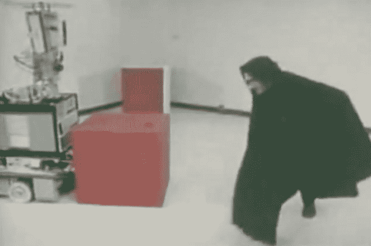
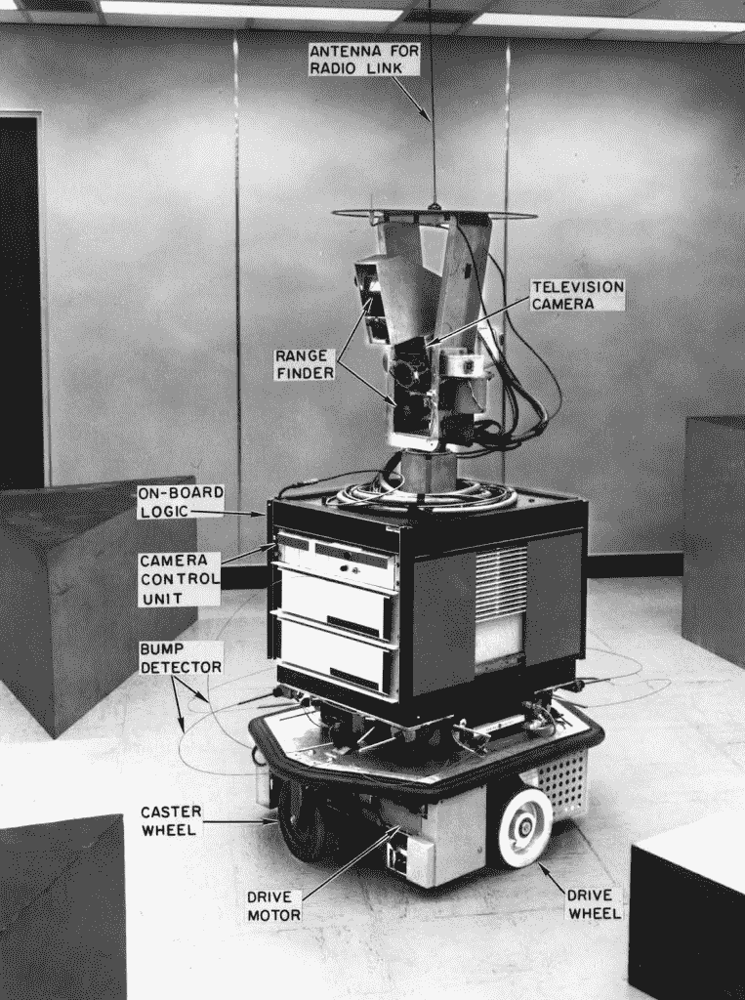
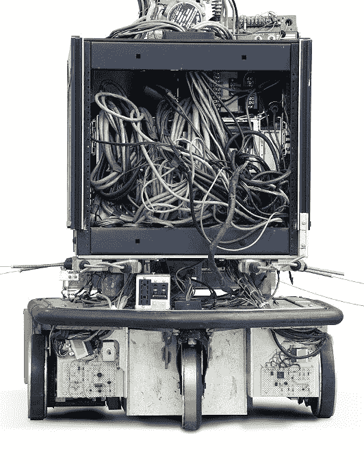

# 缅怀第一个智能机器人 Shakey

> 原文：<https://thenewstack.io/remembering-shakey-first-intelligent-robot/>

机器人 Shakey 有很多名字。维基百科称赞它是“第一个能够[推理自己行为](https://en.wikipedia.org/wiki/Shakey_the_robot)的通用移动机器人。”1969 年的一部信息电影将其描述为“机器人规划和学习的实验”发明 51 年后，Shakey 被宣布为“IEEE 里程碑”

IEEE 里程碑计划于 1983 年启动，旨在表彰“与造福人类的电气工程和计算相关的重大发明、地点或事件，”根据 IEEE Spectrum。在过去的 34 年里，这个程序已经识别了 174 段工程历史——上个月，轮到了 Shakey。Shakey 的里程碑牌匾将被安装在位于加利福尼亚州门洛帕克的研究公司和 Shakey 的创建者 [SRI International](https://www.sri.com/) 的主大厅(紧挨着纪念 1969 年 ARPANET 成立的牌匾。)

牌匾向好奇的游客解释说，Shakey“可以感知周围的环境，从显而易见的事实中推断出隐含的事实，制定计划，从计划执行中的错误中恢复，并使用普通英语进行交流。”

Shakey 项目从 1966 年持续到 1972 年，被视为将人工智能的各个领域(逻辑、制定计划和执行计划)与计算机视觉和导航相结合的一种方式。它还利用了斯坦福研究所问题求解器(或 [STRIPS](https://en.wikipedia.org/wiki/STRIPS) )，这是一个自动规划器——更重要的是，它是人工智能的早期实例。

[https://www.youtube.com/embed/GmU7SimFkpU?feature=oembed](https://www.youtube.com/embed/GmU7SimFkpU?feature=oembed)

视频

Shakey 配备了一台电视摄像机，以及“猫须”触角来探测物体。一条无线电线路将 Shakey 连接到 PDP-11 计算机，该计算机可以处理输入的数据，并向控制机器人马达的电路发送命令。有趣的是，Shakey 使用了 1958 年发明的编程语言[Lisp](http://www.gigamonkeys.com/book/introduction-why-lisp.html)—[以及 FORTRAN](http://www.ai.sri.com/shakey/) ，并响应简单的英语命令。滚动 2.1 英尺的命令如下所示:

`SHAKEY = (ROLL 2.1)`

其他命令包括 PAN、TILT，还有 GOTO 语句，这些语句不是跳到代码中的新位置，而是实际上使 Shakey 跳到现实世界中的新位置。

`SHAKEY = (GOTO D4)`

但更重要的是，机器人本身会首先*规划出*它要走的路线，甚至绘制出绕过障碍物的路线。它还可以完成其他有用的任务，比如搬箱子。

`SHAKEY = (PUSH BOX1 = (14.1, 22.7))`

该小组在 1969 年制作了一部关于沙基的 24 分钟的电影，揭示了更多的细节。Shakey 通过电传打字机和 CRT 显示器与项目团队“交流”——有时，他们还会看到它对恶作剧的反应。身穿黑色斗篷的“小淘气查理”出现在视频中的一个场景中，轻轻推了一下沙基推杆的挡块。小淘气查理“象征着变革的代理人，”视频的解说员解释道。但是 Shakey 的猫须线探测到了盒子的新位置，Shakey 只是制定了一个新的计划来继续工作。

该小组认为他们的机器人可能有军事用途。“有人想把机器人扔到中国的公路上，让它数坦克，”该项目的负责人之一尼尔斯·尼尔森回忆道。“我们在 1971 年得到了更新，然后 DARPA 说‘不再有机器人了。"

为了纪念 Shakey 的 IEEE 里程碑牌匾，有一个特殊的仪式重新召集了最初项目团队的成员——他们中的许多人现在已经 80 多岁了——IEEE Spectrum*描述了 Shakey 的重要夜晚。“达官贵人读表扬信；以前的同事回忆往事，讲述一些以前可能不会公之于众的故事；一个‘孙子’客串了一把。”孙儿是 SaviOne，一个现在在硅谷酒店使用的送货机器人。*

https://www.youtube.com/watch?v=F70He3mVrUQ

当然，也有一些关于过去美好时光的故事。“我们花了一个月的时间试图给它起一个好名字，从希腊名字到诸如此类的名字，然后我们中的一个人说，‘嘿，它摇得很厉害，还会动，我们就叫它 Shakey 吧。’"

事实上，机器人似乎已经走在了时代的前面。例如，Shakey 项目开发了搜索算法[A *](http://theory.stanford.edu/~amitp/GameProgramming/AStarComparison.html)——但起初它的到来并未受到重视。“我们无法让它被当时任何一家著名的杂志所接受，”该项目的负责人之一彼得·e·哈特回忆道。“Bert [Raphael]对此非常恼火，他创办了另一份人工智能杂志[《T2 人工智能杂志》]，这样他就可以发表它了。最终，它在 IEEE 会刊上发表了。

哈特还记得，一些“工会成员……想知道机器人和自动化是否会扰乱就业”拜访了他们。

但更重要的是它对未来机器人的影响。官方牌匾上写道:“事实证明，Shakey 的软件架构、计算机视觉以及导航和规划方法在机器人技术以及网络服务器、汽车、工厂、视频游戏和火星探测器的设计方面具有开创性意义。”事实上，工程和技术历史维基引用谷歌机器人研究负责人在过去七年中的话说，Shakey“成为未来机器人系统半个世纪的典范。”1962 年为 Shakey 设计的一种方法，用于识别图像中的点何时落入一条线，这种方法今天仍在无人驾驶汽车中使用。

自 1966 年以来，Shakey 项目已被超过 2115 项美国专利和近 5000 篇研究论文引用。

在仪式上，尼尔森抱怨说，我们的现代机器人仍然没有集成足够的人工智能。“今天的机器人可以很好地四处走动——两条腿的机器人可以站起来，它们有很好的控制系统——但它们不知道自己在做什么。”

但是硅谷送货机器人背后的公司创始人指出，现实世界的机器人面临着意想不到的障碍——并且似乎怀念机器人在无辜的实验室环境中滚动的早期时光。“我们把机器人放在酒店里，那里有喝醉的人。这是你必须处理的另一个障碍。

哈特说:“我们把机器人做得很可爱，所以即使是喝醉的人，当他们打翻它时，通常也会把它捡起来。”

来自[计算机历史博物馆](http://www.computerhistory.org/revolution/artificial-intelligence-robotics/13/289)和 SRI 国际的照片。

<svg xmlns:xlink="http://www.w3.org/1999/xlink" viewBox="0 0 68 31" version="1.1"><title>Group</title> <desc>Created with Sketch.</desc></svg>