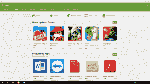

# Remix OS:对桌面 Android 未来的一瞥

> 原文：<https://thenewstack.io/remix-os-peek-future-android-desktop/>

上周，由三名前谷歌工程师成立的 Jide 公司正式发布了他们的“Android for PC”操作系统 Remix OS for PC 的 alpha 版本。

Remis OS 建立在 [Android-x86 项目](http://www.android-x86.org/)之上，这是一个开源项目，旨在将 Android 操作系统移植到由使用 x86 指令集的处理器驱动的设备上。

Remix OS for PC 扩展了原始 Remix OS 的思想。这是一种专注于生产力的 Android 体验。与运行在 ARM 移动处理器上的原始 Remix OS 不同，Remix OS for PC 通过瞄准 x86 指令集，从而能够覆盖目前 Android 基本上无法覆盖的一部分计算机。

自 2008 年首次发布以来，Android 已经发展成为世界上大多数个人计算设备的主宰。截至 2016 年，安卓在所有操作系统中拥有[最大的安装基数](http://www.statista.com/statistics/385001/smartphone-worldwide-installed-base-operating-systems/)，从电视、汽车，甚至手表，当然还有手机和平板电脑。

Google 的开放平台构建于 Linux 内核之上，并针对低功耗/有限内存设备进行了优化，对于许多需要现成的、低成本的、可定制的设备操作系统的公司来说，它已经成为显而易见的选择。

尽管 Android 无处不在且具有开放性，但谷歌直到最近才开始努力为台式机和笔记本电脑创造 Android 体验。谷歌开发的另一个基于 Linux 的操作系统 Chrome OS 专注于笔记本电脑设备，但尚未彻底改变超极本和上网本市场。

尽管 Chromebook 的销售数字一直在稳步增长，但主要来自教育部门，可能是因为大多数 chrome book 的成本较低。Chrome OS 不像 Windows 或 OS X 那样是主流桌面操作系统，但 Android 可能很快会填补这一空白。

去年 Windows 10 Mobile 的发布是微软将其平台统一到单一操作系统的计划的一部分，可能预示着移动和桌面用户体验之间更好的软件集成和一致性的更大进步。随着 Android 已经主导了计算设备市场及其庞大的应用商店，谷歌最终将合并他们的两个操作系统似乎是显而易见的。事实上，一份由华尔街日报的 T4 报告暗示了这一点。

去年,*《华尔街日报》*报道称，谷歌计划将其 Chrome 操作系统并入 Android，实际上结束了 Chrome OS 项目。Android、Chrome OS 和 Chromecast 的高级副总裁 Hiroshi Lockheimer 后来[反驳了这一说法](http://chrome.blogspot.ca/2015/11/chrome-os-is-here-to-stay.html)，他说“虽然我们一直在努力融合两个操作系统的优点，但没有计划淘汰 Chrome OS。”

谷歌首款 Android 平板电脑和笔记本电脑混合设备 [Pixel C](https://pixel.google.com/) 的发布也表明了谷歌调整 Android 以更好地适应台式机和笔记本电脑设备的计划。

# 进入混音操作系统

作为一家成立于 2014 年的中国初创公司，济德科技旨在“释放 Android 的潜力，以加速新的计算时代的到来。”

该公司进入美国市场的第一次冒险是成功的 Remix ultra table t Kickstarter 活动，这是一款 11.6 英寸 1080p 平板电脑，由 NVIDIA Tegra 4+1 驱动，内存为 2GB，运行 Android KitKat。

Remix 平板电脑已经在中国销售，非常受欢迎，在一天内就达到了 10 万美元的 Kickstarter 目标。尽管一些批评者对其与微软 Surface 平板电脑的明显相似性有所质疑，但其专注于生产力的多窗口 Android 体验让许多人对 Android 桌面体验的想法产生了兴趣。

去年晚些时候，Jide 还发布了一款 124 x 88 x 26 mm 的“迷你 PC”，以及基于 Android Lollipop 的 Remix OS 版本，为该平台带来了许多新功能和更新。然而，Jide 最令人兴奋的发布是今年的 Remix OS 2.0 for PC。在 Android-x86 项目的帮助下，Jide 针对英特尔和 AMD 设备的 PC Remix 帮助 Android 进入了更大的桌面计算世界。

https://www.youtube.com/watch?v=a6VUnH_LGGw

# 安卓遇上 PC

当 PC alpha ISO 的混音上周在 Jide 网站上免费发布时，我立即下载了它，以检查 Jide 实际兑现了多少承诺。在我的 Windows 10 电脑上安装 USB 操作系统非常简单。Jide 包括一个用于 Windows 的 USB 安装工具，其存档包含操作系统 ISO 文件。

在运行 OS X 和 Linux 的系统上安装操作系统并不容易，尽管 Remix OS 的目标是在任何 64 位 x86 系统上运行，但没有提供这些操作系统的安装程序。不过，在你的 Linux 或 Mac 系统上安装 Remix OS for PC 还是有可能的。我可以将它安装在我的 Arch Linux 笔记本电脑上(但这应该适用于任何 Linux 发行版)，通过调整安装 Android x86 的步骤:

1.  首先从 Windows 安装到我的 FAT32 格式的 USB 上。
2.  从闪存驱动器启动操作系统，以驻留模式启动操作系统以初始化其 data.img 用户数据文件。
3.  在我的 Linux 设备上创建 FAT32 分区。我创建了一个 8 GB 的分区，与 Jide 推荐的至少 8GB 的 USB 保持一致，使用 GParted 作为我选择的工具。
4.  给这个分区一个卷标，我用 GParted 标记了 mine REMIXOS。
5.  将所有文件从 USB 设备复制到新创建的分区。
6.  使用 GRUB Customizer 创建新的 GRUB 条目，打开“Sources”选项卡并输入以下内容:

`set root=(hd0,#)
linux /kernel initrd=/initrd.img boot=LABEL=REMIXOS disk=LABEL=REMIXOS quiet root=/dev/ram0 androidboot.hardware=remix_x86_64 androidboot.selinux=permissive quiet SRC= DATA= CREATE_DATA_IMG=1
initrd /initrd.img` 
其中#是您安装了 Remix OS 的分区的分区号。如果没有在 sda 驱动器中创建分区，请更改 hd0 以反映正确的驱动器(/dev/fd0 = fd0，/dev/sda = hd0，/dev/sdb = hd1，依此类推)。如果您将您的分区标记为其他东西，那么也要修改 REMIXOS 来反映这一点。

保存条目并重启系统，在启动时选择 Remix OS，瞧！

# 安卓的未来

在使用 Remix OS for PC 一周后，我不能说我会把它作为我的主要操作系统使用，但在其开发的这个阶段，这很好。在 alpha/beta 阶段使用任何软件可能意味着你会成为第一批体验新事物的用户之一，但是你也应该期望找到 bug(并且像我一样找到 bug)。

我无法将操作系统加载到我的一台旧设备上，可能是因为显示驱动程序的问题，有时由于通过 u 盘使用操作系统的传输速度问题，操作系统无法在我的桌面上直接启动。但是那些操作系统工作的时刻是一种享受。

虽然我从未将我的 PC 用作 Android 设备，但 Jide 提供的桌面界面非常直观，感觉非常熟悉。在某些方面，真的没有学习曲线，只是另一个 Android 设备。默认情况下，该操作系统只配备了少数安卓应用，包括 AOSP 浏览器、文件管理器和 MX 播放器；没有谷歌 Play 商店。

谷歌 Play 服务和 Chrome、Gmail 和 Play Store 等其他谷歌应用的排除可能会让一些人感到惊讶，因为 Jide 此前曾承诺在发布中包括 Play 服务。这可能是由于目前的许可问题，可能会在 Remix 的未来版本中得到解决。

尽管没有开箱即用，但我可以通过 Play Store 下载 Play 服务并安装一些我最喜欢的应用程序。Remix 的窗口系统在调整应用程序窗口大小方面表现得相当好。并非所有的应用程序在我的 23 英寸 1080p 显示器上都看起来不错，但那些主要是没有为大屏幕设备优化的应用程序。

随着 Android 继续发展并在更多设备上运行，它将继续发展，以覆盖不同的市场和不同的设备。面向 PC 的混合操作系统似乎是这一过程中的重要一步。虽然只是在 alpha 阶段(目前状态下还存在很多问题)，没有官方消息表明何时会发布完整版本，但它的存在证明了谷歌开源操作系统的可塑性。

尽管 Android 最初是为在触摸屏移动设备上运行而设计的(最近也在电视、汽车和可穿戴设备上运行)，但 Android x86、Remix OS 和其他面向桌面体验的 Android 项目表明，Android 有可能做得更多。

即使 Remix OS 未能成为领先的 Android 桌面版本，它推进 Android 平台的大胆尝试至少是令人钦佩的。谷歌已经承认 Android 有潜力通过 Pixel C 进入笔记本电脑和混合设备，或许 Android N 将继续这种趋势，在不同类别的计算设备之间实现统一的用户体验。

<svg xmlns:xlink="http://www.w3.org/1999/xlink" viewBox="0 0 68 31" version="1.1"><title>Group</title> <desc>Created with Sketch.</desc></svg>