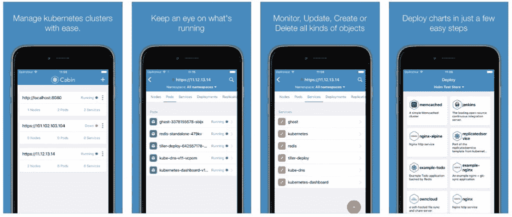

# 使用 Bitnami 的移动仪表盘 Cabin 管理 Kubernetes

> 原文：<https://thenewstack.io/remote-kubernetes-cluster-management-cabin-bitnami/>

自 2003 年以来， [Bitnami](https://bitnami.com/) 一直是一家不断发展的大型供应商，为软件供应链提供现成的服务器应用和自动化。这家公司一看就知道是好东西。2017 年 3 月，Bitnami 通过[收购 Skippbox](https://thenewstack.io/skippbox-enterprise-building-kubernetes-bitnami/)加强了其云软件包管理组合，skip box 是一家总部位于伦敦的初创公司，专注于管理 Kubernetes 容器编排引擎的应用程序。

收购 Skippbox 为 Bitnami 的公文包贡献了多个 Kubernetes 项目，包括 Cabin——第一个用于管理 Kubernetes 移动应用程序的移动应用程序。上周，Bitnami 宣布，最初由 Skippbox 于 2016 年发布的 Cabin 将成为一个开源项目。

“Cabin 是我们收购 skip box 后剩下的唯一一个没有开源的项目，”skip box 创始人、 [Sebastien Goasguen](https://www.linkedin.com/in/sebastien-goasguen-382b7b21/?ppe=1) 说，他现在是 Bitnami 的云技术高级主管。“开源小屋使我们能够与 Kubernetes 的其他产品保持一致，并使合作伙伴能够为他们的平台提供支持，如 Azure Container Service 和 [BlueMix Container Service。](https://www.ibm.com/cloud-computing/bluemix/containers)

根据 Goasguen 的说法，Cabin 充当远程管理 Kubernetes 集群的移动仪表板，用户的兴趣越来越大。“自从收购 Cabin 以来，我们一直在继续开发它，并将其作为我们 Kubernetes 解决方案组合的一部分向合作伙伴和客户展示，Cabin 一直在吸引人们的兴趣，特别是来自微软和 IBM 的兴趣，”他说。

随着工作的移动性越来越强，Cabin 对 Kubernetes 工程师的吸引力是可以理解的。通过 Cabin，用户可以快速管理 Kubernetes 应用程序，轻松扩展部署，在容器中执行命令，访问日志，甚至添加或删除标签。它允许快速添加多个集群，并管理构成微服务应用程序的 Kubernetes 资源。

主要特性包括:

*   创建基本部署扩展部署和复制控制器
*   通过服务公开部署
*   移除和添加标签
*   访问多个容器中的日志
*   在容器中执行命令
*   切换服务类型
*   在浏览器中打开节点端口服务
*   与 GKE 集成，实现一键式集群配置

“与其说这是一个开发工具，不如说它更适合 k8s 集群的运营商和在其上运行的应用程序，”Goasguen 解释道。“Cabin 让您可以方便地访问您的应用和集群，以便在发生事故时快速采取补救措施。比如缩放、标记、检查 pod 日志、停止节点上的计划。”

举例来说，考虑这些时候客舱可能会派上用场。

*   您的一个 pod 正在为您的应用程序制造错误。使用 Cabin，您可以动态地重新标记该 pod，阻止网络流量到达它，然后检查它的日志。
*   或者说，当您在路上时，您的一个集群节点遇到了硬件故障——无法装载磁盘。在你的智能手机上，你可以使用 Cabin 来封锁节点，以停止对 pod 的调度并排空它。
*   轮到你周末值班了，你的应用程序出现了负载高峰。在机舱界面中简单拖动一个滑块就可以很好地缩放它。

Skippbox 构建 Cabin 的愿景是一个利用 k8s 的高级功能及其强大的 API 的操作系统。该项目的开放开发环境只会加速 Cabin 的发展。“随着 Bitnami 领导单目和其他 Kubernetes 项目的开发，我们显然需要开源 Cabin，” Goasguen 说。“既让社区增加更多的功能，又为在 Kubernetes 上启动应用程序提供统一的体验。”

当与警报系统和事故响应场景相结合时，这是一个显示其全部潜力的系统。“我们希望将它与移动通知、对所有 k8s 云服务的支持等结合起来。，”Goasguen 说。“此外，由于 Cabin 是基于 [React native](http://www.reactnative.com/) 构建的，它甚至有可能作为传统的企业应用程序运行。”

Goasguen 发现，当他将 Skippbox 与 Bitnami 合并时，他的新公司同样对 Cabin 为 Kubernetes 用户提供的便利和灵活性感到兴奋。Bitnami 计划继续扩展 app launcher 功能——随着 Cabin 开源，这一增长曲线只会加速。“由于 Cabin 包含图表浏览器和头盔连接，我们希望与头盔用户的大型社区公开合作，并在我们的单筒望远镜和 Cabin 使用之间开发一致的体验，”他解释道。

其他 Kubernetes 用户也很热情。[微软](https://www.microsoft.com/)是对“我很高兴看到 Bitnami 开源项目小屋”最感兴趣的组织之一。Kubernetes 生态系统的优势在于开放、协作的社区。很高兴看到 Bitnami 为这个社区做出贡献，”[微软 Azure 容器服务](https://azure.microsoft.com/en-us/services/container-service/)的工程总监 Brendan Burns 说。“随着 DevOps 走向移动化，像 Cabin 这样用于在旅途中管理集群的工具变得至关重要。我很期待看到社区将小屋项目带向何方！”

“随着我们继续扩大我们的 Kubernetes 项目组合，并与这些项目的战略合作伙伴合作，我们看到了兴趣和贡献的非凡增长，”Bitnami 营销副总裁 [Tom McCafferty 说。](https://www.linkedin.com/in/tom-mccafferty-2bb8584/)

他补充说:“Bitnami 的其他开源项目是我们的 Kubernetes 本地无服务器框架、Kubernetes 应用部署管理工具 Kubecfg 和 Kubeapps.com Kubernetes-ready 应用目录。”

现在是小屋。麦卡弗蒂说，IBM 和微软都“渴望为 now-OS 应用程序中的 ACS 和 BlueMix 容器服务做出贡献和增加支持”。[IBM 研究员、公司云平台 CTO Jason McGee](https://www.linkedin.com/in/jrmcgee/)热情地表示同意。

“作为一个真正痴迷于容器并总是在旅途中的人，我真的很喜欢使用 Cabin 并从任何地方管理我的集群，”McGee 说。“像 Cabin 这样的工具将加快 Kubernetes 的采用速度。我们期待为这个项目做出贡献，并实现与 IBM Cloud 的无缝集成。”

在 [Cabin 的 GitHub repo](https://github.com/bitnami/cabin) 中，你可以自己在引擎盖下一窥究竟。或者去获得免费下载的即时满足感:Cabin 可在 iTunes 应用商店上用于 iOS，或在 Google Play 上用于 Android。

<svg xmlns:xlink="http://www.w3.org/1999/xlink" viewBox="0 0 68 31" version="1.1"><title>Group</title> <desc>Created with Sketch.</desc></svg>