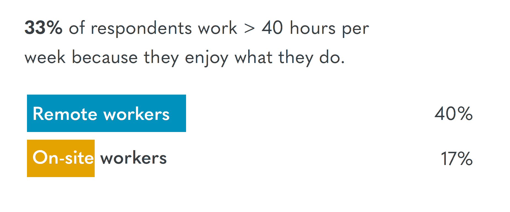

# 远程工作很棒，但远未普及

> 原文：<https://thenewstack.io/remote-work-is-great-but-far-from-universal/>

作为对新冠肺炎全球疫情的回应，全球大部分地区暂时被要求避免旅行、通勤和在办公室工作。远程办公和远程工作的倡导者得到了全世界的关注，数据描述了在家工作的利弊。许多调查结果显示，人们希望工作与生活平衡。他们认为工作地点的灵活性提供了工作与生活的平衡，但并不是全体*寻求 100%的远程工作。*

现实核查:根据美国人口普查局的数据，美国只有 5%的工人主要在家工作[。如果我们更广泛地考虑商务旅行、共同工作设施和员工与同事分开的其他原因，这个数字会飙升。根据 2016 年盖洛普民意测验，43%的员工至少有一段时间远离他们的团队成员工作。](https://www.census.gov/programs-surveys/acs)

2019 年，销售视频会议设备的 [Owl Labs、](https://www.owllabs.com)对 1000 多名美国工人进行的调查显示，62%的人至少有一部分时间远程工作。该研究发现，提供远程工作机会会影响换工作的决定，但只是在一定程度上。虽然 45%的现场员工愿意接受 5%的减薪以远程工作，但如果提议的减薪幅度达到 10%或以上，这一数字将降至仅 13%。

资料来源:《骰子 2020 年科技薪酬报告》。

更狭义地关注 IT 行业，科技求职网站 Dice 的 12，000+ [调查](https://insights.dice.com/2020-technology-jobs-salaries/)中有 60%的人每月至少有几天远程工作。如果他们的公司允许远程工作，79%的人愿意每周至少远程工作一天；然而，想要 100%远程办公的人要少得多(22%)。事实上，工作-生活平衡和远程工作选择被认为是雇主提供的两大“激励因素”。事实上，51%对雇主不满的技术人员从不远程工作，而只有 33%满意的技术人员从不远程工作。

现在，让我们来看看 GitLab 的[远程工作报告](https://about.gitlab.com/remote-work-report/)，该报告基于 3，000 名成年专业人士，他们或者远程工作，或者可以选择这样做，并且他们的工作角色具有“数字输出”尽管 36%的雇主制定了允许 100%远程工作的政策，但只有 16%的雇主真的这么做了。

如果远程工作的能力被剥夺，36%的 GitLab 受访者会积极寻找新工作或寻求自营职业。此外，43%的远程员工认为在所有员工都远程工作的公司工作很重要。由于这项研究的赞助商将自己标榜为 100%远程公司，我们对过度解读这一发现持谨慎态度。它有多重要，这种政策会如何影响雇佣决策？

总的来说，这项研究证实了我们已经分析过的其他研究的发现，并验证了远程工作受欢迎的原因。数据显示了为什么远程工作是积极的，但报告花了太多时间试图打倒夸夸其谈的稻草人。

来源:GitLab 的远程工作报告。

## 附加外卖

许多远程员工愉快地长时间工作。40%的远程员工每周工作超过 40 小时，因为他们喜欢自己的工作，71%的远程员工对自己的工作感到满意。与之形成鲜明对比的是，只有 38%的现场工作人员每周工作 40 小时以上，55%的人对自己的工作感到满意。来源:Owl Labs 的《2019 年远程工作状态》。

远程和灵活选项被认为是重要的，但是许多员工没有这种好处。然而，培训和教育可能是更大的未满足需求，因为 43%的技术员工认为这很重要，但目前没有获得这一福利。来源:《骰子 2020 年科技薪资报告》

将联合办公作为一项新的福利来推广可能不会显著增加使用联合办公地点的人数。尽管 28%的受访者的雇主至少部分涵盖了合作成员，但 19%的受访者认为这是两大最佳工作场所之一。根据本图表中未包括的一个问题，只有 7%的人主要在共同工作空间办公，另有 12%的人表示这是他们第二常用的办公地点。资料来源: [Buffer](http://www.buffer.com) 和 AngelList **'** s " [2020 年远程工作状态](https://lp.buffer.com/state-of-remote-work-2020)"调查了 3500 名远程工作者，其中 57%的人一直这样做。

根据 [Flexera 的《2020 年数字化转型规划报告》](https://info.flexera.com/SLO-REPORT-CIO-Priorities-2020)，54%的企业 IT 员工全职在办公室工作，而 14%的全职在远程工作，该报告调查了 302 名首席信息官和拥有 2000 多名员工的公司的高级 IT 管理人员。虽然这项研究是在新冠肺炎疫情爆发前进行的，但 55%的人仍然预计会增加远程工作的人力投资，只有 8%的人预计会下降。

## 作者说明

我们面临的明显的经济放缓凸显了白领和蓝领职业之间，以及可以通过电子方式提供的服务与经济其他部分之间的明显数字鸿沟。关于本文涉及的主题，有大量的学术和其他高质量的研究。然而，我们也遇到了太多不那么可信的文章，其中许多引用了类似的统计数据，经进一步审查，这些数据已超过 15 年。

来自 Pixabay 的 Screamenteagle 的特征图像。

<svg xmlns:xlink="http://www.w3.org/1999/xlink" viewBox="0 0 68 31" version="1.1"><title>Group</title> <desc>Created with Sketch.</desc></svg>