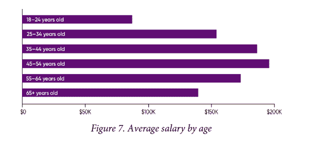

# 云薪酬调查显示，远程员工收入更高

> 原文：<https://thenewstack.io/remote-workers-make-more-money-cloud-salary-survey-says/>

根据科技出版商 O'Reilly 的一项新的薪酬调查，在他们的组织中现场工作的人比云计算专业的其他人平均每年少获得 51，000 美元。

根据[“2022 年云工资调查”，全职现场工作人员仅占调查对象的 6%，相比之下，63%的人一直远程工作，31%的人每周工作一到四天](https://get.oreilly.com/ind_2022-cloud-salary-survey.html)远程员工也更有可能报告获得更大的加薪。

这一点尤其值得注意，因为在新冠肺炎疫情期间，随着工人搬迁到更便宜的地方，并开始要求所有远程角色，[出现了关于他们的薪酬是否应该下调的公开辩论](https://www.shrm.org/hr-today/news/hr-magazine/fall2021/pages/should-remote-workers-who-relocate-be-paid-less.aspx)，以反映他们当地的生活成本和通勤费用的缺乏。这一观点似乎在劳动力市场上没有获得多少支持。

根据该报告，云计算领域的平均工资为 18.2 万美元。

本报告的回复是在 4 月份从 778 名合格的受访者那里收集的，他们都是[奥赖利的基础设施&运营简讯](https://www.oreilly.com/emails/newsletters/)的订户。

## 平均工资增长没有战胜通货膨胀

尽管报告中提到了丰厚的薪酬，但年薪增幅仅为 4%，低于通胀率。5 月份，美国未经调整的年化消费者价格指数通胀率为 8.6%。那么，为什么加薪幅度较低呢？

也许是因为即使是 IT 专业人士也不会得到大幅加薪，除非他们真的换了工作，只有 20%的受访者在过去的一年里换了工作。

云计算薪资在过去一年没有飙升的另一个原因是，一旦你开始赚这么多钱，雇主竞相雇佣或留住你的方式就是通过非货币薪酬。换句话说，生活质量问题。

样本偏向年龄较大的参与者。下图显示了不同年龄的工资差异。

来源:奥莱利，“2022 年云薪酬调查”

## 2021 年，1/2 的云专业人员接受了培训

关于认证和培训的其他调查结果包括:

*   近一半的调查对象在过去一年中参加过一些技术培训，但只有 18%的人真正获得了某种认证。
*   工人年龄越大，他们越不可能重视获得认证。事实上，在最近发布的[“开源工作报告”](https://www.linuxfoundation.org/tools/the-10th-annual-open-source-jobs-report/)中，76%的 25 至 34 岁的人认为证书对他们的职业非常或非常有用。在 45 岁及以上的人群中，这一比例为 55%。
*   薪酬最高的是那些获得谷歌云认证的专业云架构师(231，000 美元)。
*   并不是所有的认证都会导致工资大幅上涨。例如，那些成为微软认证 Azure 管理员助理的人平均获得了 2%的加薪。然而，这可能是因为他们报告说，该认证是他们计划获得的一系列认证中的第一个。

<svg xmlns:xlink="http://www.w3.org/1999/xlink" viewBox="0 0 68 31" version="1.1"><title>Group</title> <desc>Created with Sketch.</desc></svg>