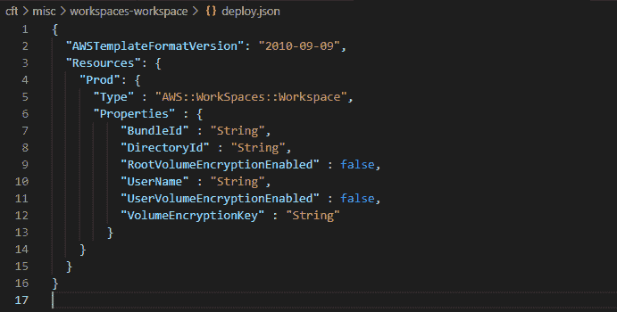
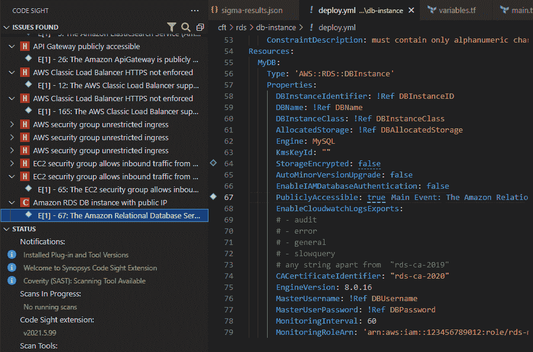
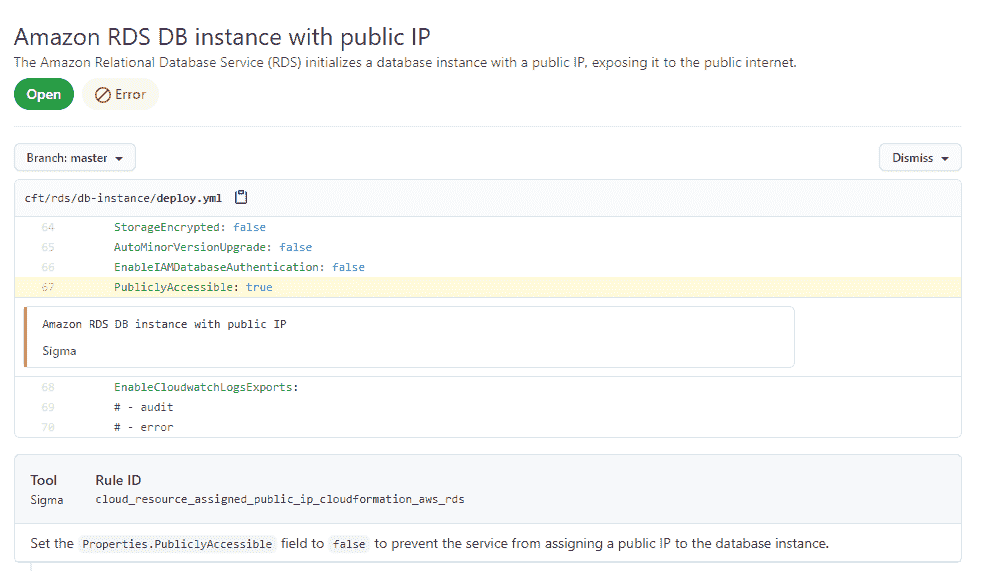

# 通过快速和自动化的安全测试消除开发摩擦

> 原文：<https://thenewstack.io/remove-dev-friction-with-fast-and-automated-security-testing/>

[Ashutosh Kumar](https://www.linkedin.com/in/ashutoshkumar001/)

[Ashutosh 是一名 EC-Council 认证的道德黑客，在 Synopsys 公司担任产品营销经理。他作为一名研发工程师开始了他的 Synopsys 之旅，在那里他从事尖端半导体工艺技术模拟工作。在日常工作中使用 Coverity SAST 工具时，他对应用程序安全性产生了兴趣。在目前的职位上，他利用自己作为开发人员使用 Coverity 的经验和 MBA 培训，为 Synopsys 软件完整性小组解决方案创造了引人注目的故事。](https://www.linkedin.com/in/ashutoshkumar001/)

现代云原生应用程序为应用程序部署带来了重大的范式转变。以基础设施即服务(IaaS)为中心，云原生应用程序将无服务器架构、容器和基础设施即代码(IaC)等技术引入主流应用程序开发和开发人员桌面。

现代应用程序堆栈包括四个相互作用的主要元素:应用程序代码；开源库和框架；将所有东西打包在一起的容器；和基础设施来部署应用程序。基础设施可以定义为使用现代 IaC 概念和工具(如 AWS CloudFormation、Terraform 等)的代码。开源库、框架和其他资源可以包含在容器映像中。例如，还可以使用 Docker 封装应用程序代码，并使用 Kubernetes 编排容器 pods 来启动应用程序。通过将应用程序的各个部分解耦到微服务架构中，并通过 API 网关将它们连接起来，应用程序开发灵活性和部署可伸缩性得到了进一步提高。除了使您能够扩展单个组件或服务之外，这种类型的体系结构还允许您在 CI/CD 管道中快速部署应用程序并管理整个应用程序堆栈，包括基础架构配置和版本更新。

这提高了开发人员的工作效率，并提供了对基础设施更好的可见性。但是，这也增加了将安全问题引入应用程序堆栈的可能性。通过 CI/CD 管道中的 DevOps 流程管理整个应用程序堆栈(包括应用程序和基础架构代码)的优势之一是，您可以在整个应用程序堆栈的管道中嵌入自动化安全测试。将安全测试嵌入到开发运维流程(DevSecOps)中，可以在不中断工作流程的情况下，在软件开发生命周期(SDLC)的早期更容易地发现和修复安全问题，从而提高开发人员的工作效率。它还确保遵循和执行安全最佳实践。

## 现代应用程序堆栈的安全最佳实践

有大量研究表明，自动化安全测试解决方案通过快速识别可行的安全问题并提供补救指导来修复这些问题，有助于确保成功的开发安全流程。这些测试解决方案不仅有助于识别应用程序代码中的安全问题，也有助于识别整个应用程序堆栈中的安全问题，从开放源代码中的已知漏洞到容器和基础架构配置中的安全问题。这种实践可以采用静态应用安全测试(SAST)、软件组合分析(SCA)、IaC 扫描能力等来帮助开发者在生命周期的早期发现并修复这些安全问题。

## 生命周期早期的安全性测试

问题是，在开发人员的工作流程中，哪里是识别安全问题并在它们进入生产之前修复它们的最佳位置？

向开发人员提供早期反馈的两个最佳位置是:

*   在他们写代码的时候。分析和反馈需要快速，并提供可操作的补救建议。
*   在 CI/CD 渠道中，通过实施政策作为质量关或提供持续的反馈。当开发人员提交合并请求时，代码评审已经在进行了。快速提供来自自动化安全测试工具的额外反馈将有助于开发人员立即修复它们。

不过，有个问题。执行深度分析的静态分析工具等传统安全测试解决方案可能需要很长时间，并且更适合在 SDLC 的后期运行深度扫描，例如每晚运行一次。对于开发人员来说，这些解决方案对于尽早快速地发现和修复问题可能并不理想。开发人员不希望也不会接受在他们的开发管道中增加摩擦。摩擦可能是假阳性或长扫描时间的形式，不符合软件开发管道的那个阶段的典型时间约束。因此，这个阶段的安全扫描需要很快，并且结果需要是可操作的，这样开发人员就可以有效地修复任何潜在的安全问题。

让我们看几个例子，看看合适的工具如何帮助开发人员在软件开发生命周期的早期发现并修复安全问题。

## 在 IDE 中查找并修复问题

图 1 显示了一个非常简单的代码片段，它用 AWS CloudFormation 模板和 JSON 格式编写，创建了一个 AWS 工作区并关闭了工作区的卷加密。这是一个明显的缺陷，可能会在已定义的基础架构配置中导致安全问题。

一个简单的解决方法是将 RootVolumeEncryptionEnabled 和 UserVolumeEncryptionEnabled 变量设置为 true。这看起来很容易处理，但是这种错误是很常见的，经常发生，要么是因为意外，要么是因为粗心。事实上，有时这些缺陷只有在被利用并对组织造成财务和公共关系损害后才被发现。

图 1:禁用卷加密的 AWS CloudFormation 代码

像 linter 一样，插入 IDE 的 IaC 扫描工具会在编写代码时标记潜在的安全问题，并提供补救建议以将这些变量更改为真。

图 2:带有由 Synopsys 的快速扫描 SAST 标记的可公开访问的 AWS 关系数据库实例的代码

图 2 显示了 Synopsys 的快速扫描 SAST 如何在 Visual Studio 代码 IDE 的 Code SightTM IDE 插件中发现这个问题。该代码示例来自开源且设计脆弱的 KaiMonkey 项目，快速扫描标记了正在部署的可公开访问的数据库实例。该工具突出显示发现问题的行号，并提供内联描述和补救建议来快速修复此类问题。

类似地，应用程序代码的静态分析工具将标记漏洞并提供修复建议，以帮助开发人员在将代码推入开发或主分支之前修复这些问题。

## CI/CD 渠道中的早期反馈

无论你用的是什么 CI 系统(Jenkins，GitHub，GitLab 等。)，在每次提交期间为可操作的缺陷提供即时反馈有助于开发人员快速修复缺陷。下面的图 3 显示了图 2 中显示的相同缺陷，但是是在构建期间通过 GitHub 操作运行快速扫描之后的 GitHub 安全仪表板中。在这一阶段，您可以通过发现问题来提供反馈，如果发现特定类型、严重性级别或业务关键型漏洞，还可以通过使构建失败来实施策略。

图 3:图 2 所示的缺陷显示在 GitHub 仪表板中，由快速扫描 SAST 通过 GitHub 操作运行来标记

快速扫描 SAST 目前可以通过命令行界面使用或集成到 CI 管道中，它将在本月晚些时候通过 Code Sight IDE 插件用于 IDE 用例。

*点击此处了解有关快速扫描 SAST [的更多信息。](https://www.synopsys.com/blogs/software-security/rapid-scan-sast/)*

<svg xmlns:xlink="http://www.w3.org/1999/xlink" viewBox="0 0 68 31" version="1.1"><title>Group</title> <desc>Created with Sketch.</desc></svg>