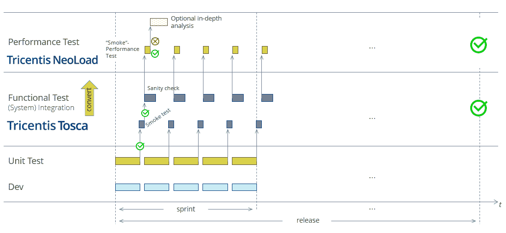

# 清除持续性能测试的障碍

> 原文：<https://thenewstack.io/removing-the-roadblock-to-continuous-performance-testing/>

 [沃尔夫冈·普拉茨

沃尔夫冈是 Tricentis 的创始人兼首席产品官。他是软件测试创新的幕后推手，例如基于模型的测试自动化和线性扩展测试设计方法。](https://www.tricentis.com/team/wolfgang-platz/) 

你不能让一个新的特性、更新或错误修复带给你两步和三步的后退。新功能必须完美运行，并且不能破坏用户已经依赖的原有功能。这就是为什么您需要持续的性能测试。

不幸的是，当不同的团队以不同的速度并行地开发基于许多不同架构的不同组件时，就太容易出问题了。但是用户和利益相关者并不关心交付好的软件有多难。现在，软件故障就是业务故障，任何类型的问题都会影响运营效率、客户或员工满意度、收入和竞争优势。

## 持续测试，部分

大多数组织通过将基本测试集成到持续集成/持续交付(CI/CD)管道中，在暴露最明显的功能问题方面做得相当好。他们依靠“冒烟测试”来检查应用程序在交付过程中是否不会崩溃。这包括单元测试和一组精选的功能测试，这些测试从最终用户的角度逐步通过关键用例。冒烟测试通常由一组更广泛的测试来补充，让核心功能仍能产生预期的结果。这些健全性测试在每个构建中都执行并不实际，但是它们通常可以通宵运行。

通过持续冒烟测试和常规健全性测试的结合，如果功能从根本上被破坏，您通常会得到足够的警告。但是性能问题呢？为什么不也检查一下呢？毕竟，如果用户对延迟感到沮丧，并在完成一个过程之前就离开了你的应用程序，那么这个过程最终是否能产生正确的结果并不重要。它没有，因为用户从来没有做到这一点。

然而，尽管功能测试已经被广泛接受为 CI/CD 过程的核心部分，但性能测试往往会落后。这是一个周期后期的活动，自从瀑布开发周期以来，已经持续了很多年。从质量角度来看，这没有任何意义。功能正确性和性能特征(如可伸缩性、响应性和可用性)都是至关重要的标志。这就像连续监测 ICU 医院病人的脉搏，但每周只检查一次他的呼吸频率。

为什么我们在一个测试领域取得的进展没有被带到另一个领域？

## 性能测试和功能测试

问题的根源在于，功能测试和性能测试是根本不同的。即使您想要测试您的冒烟测试所覆盖的相同的核心用例集，您通常也需要为性能测试创建和维护一个完全不同的测试集。这些测试是以完全不同的方式编写的，通常由不同的人使用不同的工具，以完全不同的方式访问应用程序。

基于 UI 的冒烟测试就像人一样测试应用程序，模拟与屏幕上的控件的交互。从用户角度来说是 100%的。这些测试可以用 UI 测试工具来创建，这些工具允许直观地创建测试自动化。然而，性能测试通常是通过网络层访问应用程序来执行的。这个过程不太直观。此外，网络层非常不稳定，这种不稳定意味着性能测试需要关注和调整几乎每一次测试运行。

仅仅开发一套单独的专门用于性能测试的测试并不容易。但是让它们与不断发展的应用程序保持同步是一项永无止境的工作。大多数团队都很难找到维护一套严密的功能测试所需的时间和资源。保持性能测试的更新更加困难。它们甚至比 UI 测试更不稳定，UI 测试因其不稳定性而臭名昭著。它们的更新也更加繁琐，因为你是在技术协议层“引擎盖下”工作，而不是在直观的 UI 层。这就是为什么性能测试通常是专门的性能测试工程师的领域，他们经常将性能测试作为共享服务来操作。大多数位于跨职能敏捷团队之外，不容易进行日常的性能测试维护。

对于绝大多数团队来说，在每个 sprint 结束时更新核心性能测试脚本已经是一个挑战。实际上是为了在冲刺阶段执行而更新它们吗？那很少发生。

## 一个测试定义，无限可能

但是想象一下，如果您的性能测试没有落后太多，您会取得什么样的成就。

开发人员签入增量变更，然后运行功能测试。如果测试成功，你可以假设两件事。第一，相应的应用程序功能按单个用户的预期工作。第二，功能测试已经被适当地维护，这意味着它可以在负载下运行以进行性能测试，只要功能测试可以被重用以进行性能测试。

然后执行相应的性能测试。团队立即知道最新的变化是否在功能性*或*性能方面对用户体验有负面影响。他们不需要等待几周甚至几个月，性能测试工程师就会提醒他们，成百上千个潜在的变化中的一个会导致性能问题。他们不必浪费各种时间去寻找问题的根源，并在问题出现几天、几周甚至几个月后试图解决问题。另外，他们可以立即阻止构建在交付管道上进行。

好消息。这完全可以用一种叫做 NeoLoad 的产品来实现。NeoLoad 是由 Neotys 创建的，我非常兴奋地[欢迎该产品和公司加入 Tricentis 大家庭](https://www.tricentis.com/blog/announcing-tricentis-neotys-acquisition/)。

NeoLoad 只需点击一下鼠标，就可以进行功能测试并将其转换为性能测试。这包括使用 Selenium、Tricentis Tosca 和其他功能测试工具构建的测试。这意味着您不需要为性能测试和功能测试维护两套独立的测试。只要保持你的功能测试是最新的，你就已经得到了你所需要的。不需要额外的测试创建或维护。由于节省了所有的时间和精力，CI/CD 中的性能测试突然变得可行了。

使用这种方法，性能专家可以从创建基本的性能测试中解脱出来。相反，他们可以专注于检查发现的任何问题，完成更高级的性能工程，创建复杂的工作负载模型，分析以微调应用程序等。

从现有的功能测试中获得性能测试是很有价值的。这很像一个亲密的朋友访问他的祖国时跟着去。你不需要担心额外的计划和准备。你甚至不需要学习一门新的语言。你可以从随波逐流中获益。

<svg xmlns:xlink="http://www.w3.org/1999/xlink" viewBox="0 0 68 31" version="1.1"><title>Group</title> <desc>Created with Sketch.</desc></svg>