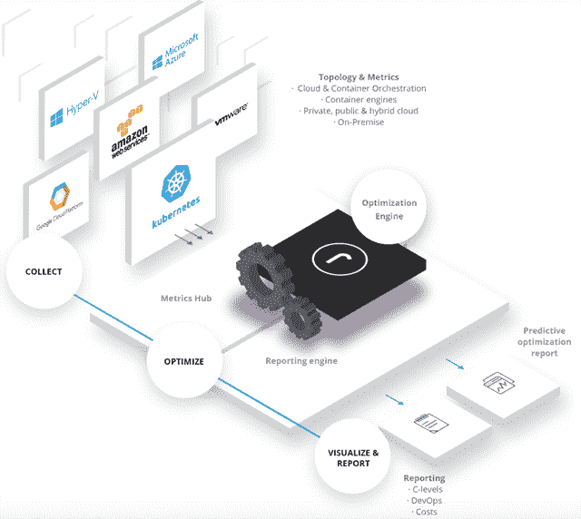

# Replex 揭示了 Kubernetes 的成本

> 原文：<https://thenewstack.io/replex-sheds-light-on-kubernetes-costs/>

云原生架构带来了无数的挑战，其中包括了解这一切的成本。

“我不认为任何人会用金钱数字来解释这一硬科学，”迄今为止，Kubernetes 容器集成供应商、 [Heptio](https://heptio.com/) 的首席技术官和联合创始人 [Joe Beda](https://twitter.com/jbeda) ，先前在[参考微服务](https://thenewstack.io/microservices-pricing-whats-it-all-going-to-cost/)中告诉新堆栈。

然而，初创公司 Replex 专注于降低 Kubernetes 的成本。

“随着 Kubernetes 的采用，人们正在涉及数百个、有时数千个系统的大型系统上使用它。大型企业尝试使用多云提供商来部署他们的工作负载。Kubernetes 的好处是，它可以在多个云提供商之间传输，他们可以开始利用云提供商相互竞争。但与此同时，他们失去了成本和成本分配的透明度，”首席执行官兼联合创始人 Patrick Kirchhoff 说。

有了 Kubernetes，在基础设施和实际工作负载(容器)之间有了一个新的抽象层。

“假设您在 Amazon 上有 100 个 EC2 实例，在其上有一个大型 Kubernetes 集群，并且您的组织中有五六个软件团队部署在该集群上，很难确切说出谁花了多少钱。要分配团队和应用程序的成本，很难进行优化，因为谁在消耗什么并不明显，”他说。

他认为 IT 的分散化是一件好事，因为现在开发者更加自主，这意味着他们可以自己部署基础设施。但他们总是超额指定产能，因为他们不想在生产中遇到麻烦。所以他们总是要求比需要更多的 CPU、RAM 和其他资源，所以他们浪费了大量的容量，甚至比他们之前的运营商还要多，他说。

首席技术官和联合创始人[科斯坦蒂诺·拉塔鲁洛](https://www.linkedin.com/in/clattarulo/)说，集装箱尺寸的配置带来了特殊的挑战。

“在传统基础架构或云中，您可能有一个实例的规模可能不合适。…现在有更多的容器可以指定大小，因此会出现更多的浪费资源或闲置资源，”他说。

“开发人员要求豆荚和容器的大小，容器的限制，还有很多闲置资源。他们不知道实际上有多少资源闲置，这就是我们试图让他们使用仪表板的地方，他们可以实际看到他们有多少资源闲置，以及他们如何调整，”他说。

## 吸引开发人员

德国联合创始人在旧金山建立了公司总部。它的客户包括像营销技术公司 Exactag T1 和移动广告公司 T2 Vungle T3 这样的初创公司，以及一家全球鞋类公司和一家总部位于美国的大型零售商。该公司表示，使用 Replex，客户已经能够节省多达 30%的云成本。

It 方法包括从系统中收集数据、优化引擎、可视化和报告。您可以使用自己的脚本从物理服务器、云实例、虚拟机等收集数据。您还可以通过 REST API 连接到其他第三方数据源。

“我们通过 API 连接到所有云提供商，以获取关于云实例的信息。我们也连接到 Kubernetes 星团。我们从 Prometheus 以及其他数据源中提取历史指标，如果它们包含时间序列信息，如历史 CPU 和利用率。然后我们把它联系起来。我们分析吊舱配置是否是正确的大小，并提供如何缩小或增加吊舱大小的信息，”基尔霍夫说。

仪表板除了显示每日和每月的总成本之外，还按各个名称空间和团队进行细分。它描述了每个单独资源的利用率:CPU、RAM 和磁盘。

Kirchhoff 说，由此产生的信息使领导层能够看到哪些团队和开发人员效率更高，哪些过度配置，这在开发人员中不一定受欢迎。

从那以后，它开始试图招募开发者来寻求更高的效率。

他说:“我们试图让开发商参与进来，而不仅仅是用财务管理或成本管理工具指指点点。

“我们的软件中有机器人，你可以在那里看到最有效率的团队。我们的客户给最高效的团队发奖金，每个人都在优化，因为他们想得到团队奖金。我们认为，这比仅仅将它们作为一种[成本计算]工具出售要好，因为这不是开发人员所说的语言。”

## 规划援助

谷歌开发者关系工程师 Seth Vargo 在[之前的一篇文章](https://thenewstack.io/a-google-engineer-on-when-an-sre-and-kubernetes-are-and-not-worth-it/)中说，Kubernetes 对小公司来说可能不是最划算的选择。Replex 可以帮助指出这一点。

“当我们进入横向组织时，企业组织处于其旅程的早期，可能他们正在一些测试环境中使用 Kubernetes，他们正在为他们的未来平台创建一个计划。然后，我们开始建立云原生成本模型。基尔霍夫说:“这是在内部分配成本和进行收费的好方法。

该技术使客户能够优化性能，以及管理和实施治理策略。

该公司还专注于合规性，并将在今年晚些时候推出一些功能，使组织能够根据合规性框架进行检查。

上个月，Kubecon + CloudNativeCon EU 展示了 Kubernetes 的巨大采用曲线，市场上正在解决安全等主题。Kirchhoff 说，合规和成本管理是下一个主题。

“这对企业很重要。他们需要在将它推广到整个组织之前解决它，”他说。

据 Replex 董事会成员、Mesosphere 的联合创始人兼首席执行官[弗洛里安·莱伯特](https://twitter.com/flo?lang=en)称，Replex 满足了市场需求。

“我们已经达到了一个临界点，大多数公司都知道他们需要利用 Kubernetes 和混合云环境来实现基础设施的现代化，但他们中的许多人仍在试图理解敏捷性和便携性等优势与管理蔓延、成本、运营效率和治理等新挑战之间的权衡，”他说。

“有些人担心这些新方法会失去控制和可见性，同时增加相当多的复杂性。这在许多方面都是正确的，但 Replex 通过为成本中心和 IT 经理提供跨其组织的基础架构和开发团队的可见性来解决这些差距，同时通过将更多成本和资源利用责任转移给开发团队来支持 DevOps 和 CI/CD 管道。"

Kubecon + CloudNativeCon EU 是新堆栈的赞助商。

通过 Pixabay 的特征图像。

<svg xmlns:xlink="http://www.w3.org/1999/xlink" viewBox="0 0 68 31" version="1.1"><title>Group</title> <desc>Created with Sketch.</desc></svg>