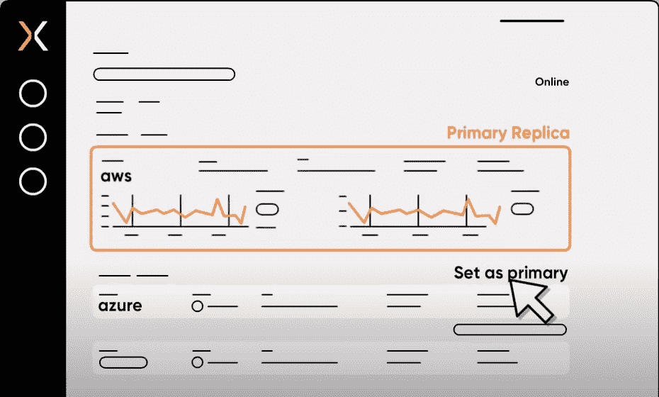

# Replix 使得有状态应用程序可以跨云移植

> 原文：<https://thenewstack.io/replix-makes-stateful-apps-portable-across-clouds/>

在一个多云世界中，管理跨云的有状态应用程序仍然很困难，尤其是对于调用大量数据集的应用程序。这是以色列初创公司 Replix 正在解决的问题。

它提供了一个名为 Replix Global Data Fabric 的多云存储平台，使用户能够跨区域和云提供商使用实时同步数据创建即时副本，而无需设置专用硬件或网络配置。

据该公司称，这是一种按需付费的托管服务，可以在 10 分钟内设置多云副本，旨在在云端重现高端本地存储解决方案的体验。

Replix 产品负责人迈克尔·格林伯格(Michael Greenberg)表示:“我们一起解决了围绕数据移动的问题，能够出于任何目的在不同地点之间自由移动数据，无论是云提供商还是您的本地位置。"基本上，如果你能移动你的数据，那么你就能移动你的应用程序，对吗？"

该服务与 Kubernetes 进行了本机集成，能够在跨区域和跨云的集群之间切换工作负载。除了灾难恢复影响之外，它还提供了根据业务需求移动应用程序的自由。

“我们已经看到，这一挑战在行业中基本上没有得到解决——致力于如何让您的应用程序更接近数据。我们看到了一个机会，可以稍微改变一下模式，为客户提供另一种自由度，即他们可以在哪里运行他们的应用程序，而不必进行为期六个月的迁移项目，”他说。

使用存储卷，托管 Replix 全局数据结构采用数据中继网状网络，在云位置之间实时传输数据。用户不必在不同的云之间设置网络、配置甚至身份策略。

这家总部位于特拉维夫的公司由连续创业者阿维·希洛、西里尔·普利斯科和萨姆·根泽尔于 2017 年创立。

https://www.youtube.com/watch?v=1Rx-FYVT0-g&feature=youtu.be

该公司承诺，无论距离远近，在复制过程中不会丢失任何数据，或者零 RPO(恢复点目标)。它指出，用户将能够在云提供商和地区之间无缝复制数据，就像他们是一个整体一样，并且使用单个仪表板，用户可以通过单个 API 调用轻松切换云提供商。

它解释了从指定时间点(或故障点)开始的复制在被认为成功写入之前得到了保证。然后，它将该卷中继到新站点，而不会影响应用程序性能。

在切换的情况下，HAProxy 后面的应用服务器会将客户指引到活动的位置。如果它的自定义监控解决方案检测到没有可用的活动位置，它会调用一个脚本来切换位置，并在新位置启动数据库和应用服务器。然后 HAProxy 可以将流量导向新站点。

据该公司称，它可以处理复杂的拓扑结构，跨多个位置进行复制。

“构建多云网络或多区域网络非常昂贵，维护成本也很高。你可能需要几个星期到几个月的时间来设置。所以我们已经提前做了，我们已经在云区外租用了非常快速的通信线路，”格林伯格说。

“我们能够为您提供网络层，并在此基础上无缝复制存储本身。
因此，每个数据库都内置了自己的复制技术。”

他指出，如果你有 60 个应用程序，每个应用程序都有自己的数据库，那么设置所有这些程序进行复制将是一个巨大的痛苦。

https://www.youtube.com/watch?v=5R-8iD_Kem8&feature=youtu.be

尤其是金融行业——银行、保险公司、信用卡公司——害怕云中断，这让他们对迁移到云犹豫不决。他们的应用程序绑定到拥有大量数据的数据库中。他说，复制和移动这些数据需要他们设置网络、基础设施安全、VPN、路由器，然后配置每个应用程序单独复制。Replix 旨在减轻这种痛苦。

在接下来的几个月里，它将增加对 GCP(谷歌云平台)的支持。它已经支持亚马逊网络服务和微软 Azure。它还计划支持对象存储和基于文件的产品。

专题图片:旗鱼的“双彩虹”。经 CC BY-SA 2.0 许可。

<svg xmlns:xlink="http://www.w3.org/1999/xlink" viewBox="0 0 68 31" version="1.1"><title>Group</title> <desc>Created with Sketch.</desc></svg>