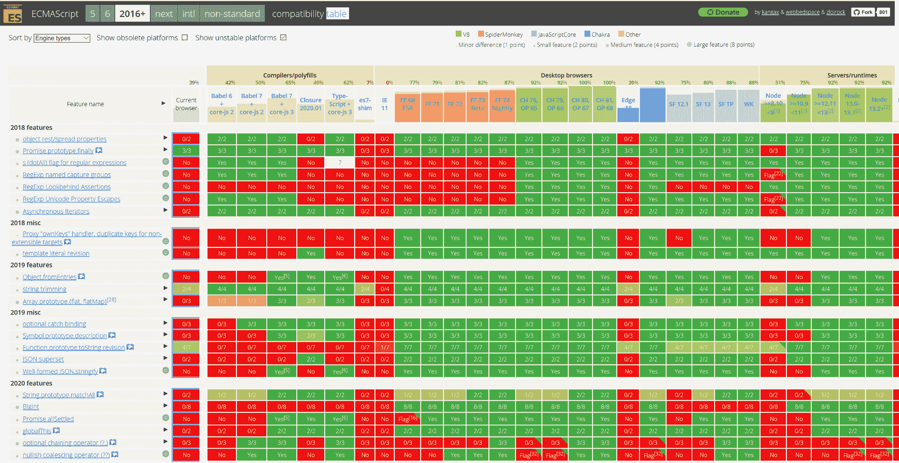

# 报告:2020 年 ECMAScript 和 JavaScript 的新特性

> 原文：<https://thenewstack.io/report-whats-new-in-ecmascript-and-javascript-for-2020/>

编者按:为了更加清晰，这篇文章已经被修改。

自 [2015](/whats-new-es2016/) 以来，ECMAScript——JavaScript 语言的正式规范——每年 6 月都会更新。这些更新包括所有已经到达第 4 阶段的提案:[完成提案](https://github.com/tc39/proposals/blob/master/finished-proposals.md)已经被所有 ECMAScript 编辑器签署，在至少两个兼容的实现中发布并通过验收测试。

在 ECMAScript 2015 内处理了积压的提案后，年度更新往往较小，新功能、语法改进和更新的组合覆盖了标准中的细微遗漏。

ECMAScript 2019 对语言进行了一些内部清理，包括小的语法调整，使其成为一个关于语言正确性的版本，并对开发人员的生产力进行了一些改进。

## ECMAScript 2019 中的常识和稳定性

这包括通过添加行和段落分隔符 JSON 字符串文字，并让 **JSON.stringify** [返回格式良好的 UTF-8](https://v8.dev/features/well-formed-json-stringify) (在某些情况下，它会返回一些 UTF-16 字符)，使 JSON 成为 ECMAScript 的真正子集。很少有开发人员会手工输入这些内容，但是它简化了嵌入 JSON 和从元编程工具发出 JavaScript。

有新的 **trimStart** 和 **trimEnd** 方法来移除字符串前后的空白:如果你已经为此使用了 **trimLeft** 和 **trimRight** ，那么新的方法对于从右到左语言来说就不会那么混乱了。有一种新的内置方法可以将一组键-值对更改为一个对象， **Object.fromEntries** ，而不必编写额外的代码来完成这项工作。

ECMAScript 规范现在要求 **Array.prototype.sort** 是稳定排序:给定相同的输入数组，排序将总是产生相同的输出数组，即使集合中有两个相同的项目具有相同的排序位置。

TC39 联席主席 [Brian Terlson](https://github.com/bterlson) 向我们解释道:“以前，该规范对实际排序更加宽松，因此开发人员必须确保他们不依赖于来自 **Array.prototype.sort** 的精确排序，因为这在不同的 ECMAScript 实现中会有所不同，甚至会因数组大小和许多其他因素而有所不同。”。这意味着 JavaScript 引擎可以根据列表的长度改变排序算法，这可以提高效率，但也意味着根据你在程序中的位置，你会得到不同的排序顺序:V8 过去对超过 10 个元素的数组使用不稳定的快速排序，现在所有的 V8 数组排序都使用稳定的 TimSort。

这使得新代码更容易编写，但会影响旧代码；大多数情况下，这意味着您将不再需要您放入的逻辑来保持排序不变，并且您可能需要更新您的测试。

在编写 try/catch 语句时，可选的 catch 绑定是一个小的、常识性的语法变化，这将消除许多开发人员的挫折感，因为以前你不得不包含你并不真正需要的代码，只是为了避免来自 [ESLint](https://eslint.org) 和 TypeScript 的错误。“以前，即使你不关心它，你也不能省略(错误参数的)catch 绑定，所以你必须处理林挺问题，因为你声明了一个 catch 变量，但你后来没有使用它——因为你不关心它。”

新的 **flat** 和 **flatMap** 方法可能是 ECMAScript 2019 中最有用的变化。Flat 最初被建议为“flatten ”,因为它展平了一个数组(如果数组中的任何值本身是数组，则它们中的值被提取到顶级数组中),但这与广泛使用的 [MoTools 库](https://mootools.net/)相冲突。 **flatMap** 首先遍历数组(Map)，然后在 map 操作创建了嵌套数组的情况下将其展平(flat)(Terlson 告诉我们，这个名称更有意义，因为它是从函数式语言中借用的，在函数式语言中它可以写成 flat(map(…))。

“这是一种非常常见的模式，存在于许多不同的语言生态系统中，也存在于许多 JavaScript 库实现中，”Terlson 指出；效率也高很多。“如果你能在一个操作中完成展平和映射，你就能分配更少的中间数组，而且你只需迭代数组一次而不是两次。所以，当你想同时使用平面和贴图时，使用**平面贴图**要有效得多——事实证明这是一件很常见的事情！”

## ECMAScript 2020 在数字上更胜一筹

ECMAScript 2020 中也有一些规范清理，比如使 for (x in y)的枚举顺序固定，而不是依赖于实现。“这是递归地得到一个对象的所有属性，以及它的所有原型对象的属性，”特尔森解释说。一般来说，JavaScript 引擎很不愿意修改这些代码，因为这是 JavaScript 开发人员经常做的事情，而且对性能非常敏感。“尽管 ECMAScript 没有指定枚举顺序来让引擎优化性能，但事实证明大多数引擎已经按照相同的顺序排列，所以规范现在反映了这一点。

在功能方面，他称 ECMAScript 2020 是比 2019 大得多的更新。“我们有更多的语法建议，我们有像 **BigInt** 这样的大东西。”

JavaScript 一直需要一种更好的方法来处理大数而不使用特定的库，而 **BigInt** 是第一步:一种表示任意精度整数的新原语。目前，如果在 JavaScript 中有一个大于 2 ^(53) 的整数，那么你就开始失去精度，这意味着你不能表示非常大的数字或高精度的时间戳；这导致了一些长期存在的错误，如 Node.js 删除了[错误文件](https://github.com/nodejs/node/issues/12115)，因为它认为它们具有相同的 Inode 编号(在 Windows 中存储为 64 位整数)。

Terlson 说，64 位整数非常有用，ECMAScript 社区考虑直接添加它们。“它们在很多不同的环境中都非常非常有用。当您与各种平台 API 对话时，您需要 64 位整数。 **BigInt** 使得 JavaScript 开发人员可以更轻松地与需要 64 位整数的平台中的函数进行互操作，这些函数用于加密、本机 API 以及与其他语言的绑定，例如与调用需要 64 位整数的系统 API 的节点本机模块进行对话。密码学尤其是一个经常传递 64 位整数的领域。WebAssembly 互操作是使用大整数的一个重要原因。拥有大整数为 JavaScript 开辟了一个全新的用例，你可以对巨大的整数进行数学和运算，而不会损失整数运算的精度。”

Decimal 和 rational 可能是 ECMAScript 未来的下一个数字类型。“JavaScript 缺少某种十进制类型:任意长度的十进制数，所以我们可能会看到 **BigDecimal** 。有理数是表示任意精度数的另一种方式:它们很好，因为它们允许您进行通常会损失精度的运算，而不会损失任何精度。rational 通过分别存储分子和分母来处理这个问题。”

泰尔森认为，添加这些基本类型是 JavaScript 进化的一部分。“JavaScript 现在是一种非常好的通用语言，我们正在做的很多事情，比如大整数，都在扩展 JavaScript 的优势。随着时间的推移，JavaScript 被推向更多的方向，既有高层次的，也有低层次的，比如在硬件上工作，我们将会有一些新的约束出现。这也激发了像新号码类型这样的提案，因为我们必须与更多不同的系统进行互操作。”

另一个帮助 JavaScript 运行的地方越来越多的是 [globalThis](https://github.com/tc39/proposal-global) 。编写引用全局对象的可移植的、跨平台的 ECMAScript 代码很困难，因为它在不同的平台上有不同的名称；在浏览器中，它可以是“window”或“self”或“this”，在 Node.js 中，它是“global”或“this”，而“this”在 shell 中可用，但在“未定义”的模块中不可用。

Terlson 说:“当你编写同时针对 Node.js 和浏览器的库时，这真的很令人沮丧。

事实证明[很难](https://github.com/tc39/proposal-global/blob/master/NAMING.md)找到一个不与已经使用的代码冲突的名字，这就是为什么这个名字是 **globalThis** 而不仅仅是 global。

### 链接和合并

ECMAScript 2020 还增加了一些功能强大的运算符，这些运算符已经包含在 Swift 和 C#等语言中，其语法简化了一些常见任务。

“可选链接让你说，‘如果这个对象存在，那么我想访问这个属性，否则只给我 undefined’并且它防止你得到‘undefined 不是一个对象’错误。它把多行意大利面条式的代码变成了一行？, ?, ?.'这种情况时有发生，尤其是当你处理来自服务的 JSON 响应时，记录可能存在也可能不存在:你只想得到它，如果它不存在，你就想不定义它。这是一个开发人员已经叫嚣了很多年的特性，我们最终交付了它，”Terlson 建议道。

[Nullish 合并](https://github.com/tc39/proposal-nullish-coalescing)是一个类似的运算符，表示为“？？，，用于处理非 null 或未定义的值(已经由||运算符处理过了)，但这些值是其他形式的“nullish”或“falsey”值，如零。“这基本上是 JavaScript 开发人员今天使用逻辑 OR 设置默认值的更好版本。你会说 const NaN = NaN 或 default，”泰尔森说。“问题是，如果有人将 NaN 作为零或字符串或布尔 false 或其他非未定义或 null 的假值传递，他们将获得默认值——用户会感到惊讶和沮丧，这是错误的一大来源。”

加入 nullish 合并操作符，只有当返回的内容未定义或为空时，您才能获得默认值，这为您提供了一种更好的应用默认值的方式。

### 做出更多承诺

ECMAScript 2021 可能包括在程序根中使用 await 的能力，而不是必须编写一个 **async** 函数来放入它，但 ECMAScript 2020 将[扩展 import()](https://github.com/tc39/proposal-dynamic-import) 以便您可以异步加载模块，这意味着您可以通过获得模块的承诺来进行条件加载或延迟加载，而不加载任何实际上不需要的模块。这非常有用，主流浏览器已经支持它了。

“动态导入对于聚合填充很有用，因为有时您需要检查环境以确定是否需要聚合填充，如果需要，您可以继续导入它。您还可以做一些类似本地化模块的事情，如英语的' foo module-en '和西班牙语的' foo module-sp '，您可以获取用户区域设置，然后使用动态导入来加载适当的模块。”

[Promise.allSettled](https://github.com/tc39/proposal-promise-allSettled) 是 ECMAScript 6 中增加的两个承诺组合子的有用补充。如果您传递给它的所有承诺都成功完成，则 Promise.all 解析，并在第一个承诺被拒绝时立即拒绝。 **Promise.race** 返回第一个实现的承诺，不管它成功与否(赢得比赛)。但是假设你想得到你传进去的所有承诺的结果，哪怕其中一个失败了？ **Promise.allSettled** 等待所有的承诺被解决，但不管它们是被解决还是被拒绝:它返回一个包含所有结果的数组。

在许多 Promise 库中还有第四个选项， **Promise.any** ，它是 **Promise.all** 的逆选项，返回第一个成功的 promise 或所有失败的错误代码列表；如果任何承诺都可以的话，这很有用——但是如果没有一个成功，你需要知道哪里出了问题。这是目前的第三阶段提案，因此它可能会为 ECMAScript 2021 做好准备。

ECMAScript 2020 的最后一个特性解决了多年来困扰开发人员的一个问题[,这是另一个小的语言改进，应该可以消除使用正则表达式时的大量挫折。](https://stackoverflow.com/questions/432493/how-do-you-access-the-matched-groups-in-a-javascript-regular-expression)

当您调用当前的 **String.prototype.match** 时，结果取决于您传入的正则表达式是否具有 **-g** 全局标志。开发人员已经发现这让 Plus 感到困惑，如果你传入一个你想要匹配的字符串，它将只遍历该字符串的一个实例，但是查找一个字符串的所有出现是一个非常常见的用例(并且在没有全局标志的情况下运行代码来这样做可能会产生一个无限循环)。

Telson 解释说，match 使用全局标志的方式没有改变，但[**string . prototype . match all**](https://github.com/tc39/proposal-string-matchall)使这个过程更加明确。“如果你传入一个没有全局标志的正则表达式，它会立刻给出一个错误。这没有意义:您告诉我匹配所有内容，但您给我的正则表达式只匹配一个内容。这有助于用户正确使用 API，但最大的好处是，如果你传入一个字符串，它将匹配该字符串的所有出现，你会得到一个所有结果的数组。"

一些接近完成但似乎不太可能包含在 ECMAScript 2020 中的提议可能会为 2021 规范做好准备，如期待已久的私有类字段(刚刚在 TypeScript 中发布)。关于这些应该如何工作的讨论一直在进行中(事实上从 2017 年开始)，但似乎已经就 JavaScript 在不久的将来会成为另一个主要功能达成了共识。

<svg xmlns:xlink="http://www.w3.org/1999/xlink" viewBox="0 0 68 31" version="1.1"><title>Group</title> <desc>Created with Sketch.</desc></svg>