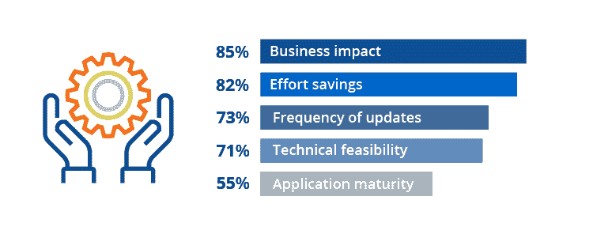
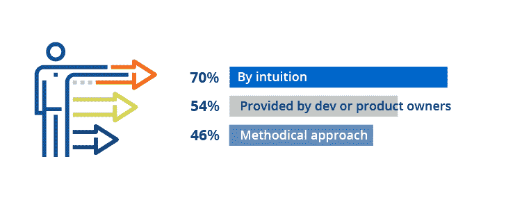
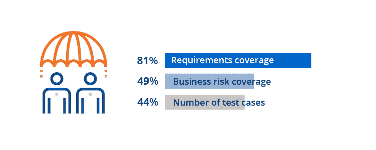
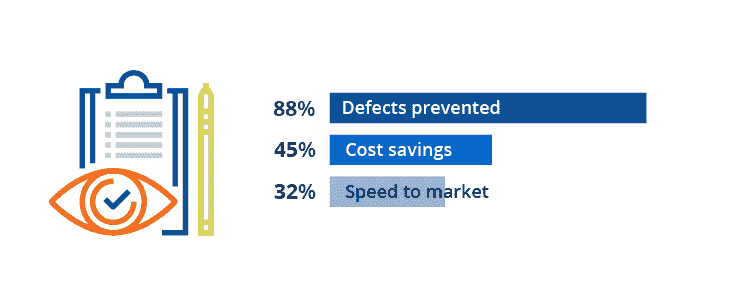
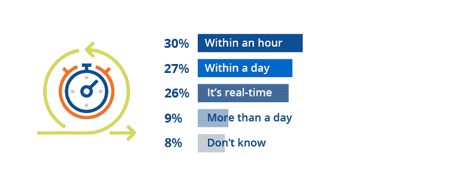
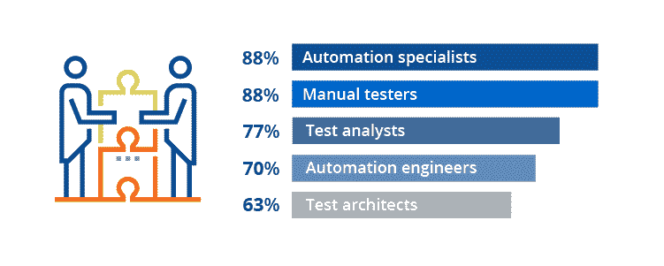

# 研究发现:顶级组织测试软件的 6 种方式

> 原文：<https://thenewstack.io/research-findings-6-ways-top-organizations-test-software/>

 [辛西娅邓洛普

辛西娅撰写软件开发、测试和企业自动化方面的文章的时间比她愿意承认的要长得多。她目前是 Tricentis 的内容和客户营销总监。](https://www.linkedin.com/in/cynthiadunlop/) 

Tricentis 刚刚发布了其第一份[世界顶级组织如何测试](http://tricentis.com/resources/how-the-worlds-top-organizations-test/)报告，该报告分析了行业领导者如何测试他们的业务和世界所依赖的软件。在这份首个同类报告中，我们采访了 100 位来自财富 500 强或全球同等组织以及美洲、欧洲和亚太地区主要政府机构的质量领导者。

尽管不缺少关于总体软件测试趋势的报告，但是组织级别的测试状态，尤其是在“家喻户晓”的品牌中，历史上一直是一个黑箱。一方面，大型组织通常可以获得小型企业无法获得的资源，如商业软件和开放源码软件、顾问和服务等。但另一方面，他们也面临着严峻的挑战，例如:

*   平均涉及 900 个应用程序的复杂应用程序堆栈。单笔交易平均涉及 82 种不同的技术，从大型机和传统定制应用到微服务和云原生应用。
*   根深蒂固的手工测试过程是为瀑布式交付节奏和外包测试而设计的，而不是敏捷、开发和向“持续一切”的驱动
*   对极高可靠性的要求。根据 IDC 的数据，企业环境中一小时的停机时间可能会造成 50 万到 100 万美元的损失。“快速行动，打破常规”在很多行业都不是一个选项。

这些压力如何影响当地的质量流程？以下六个数据点揭示了企业质量领导者如何应对与测试用例设计、自动化、测量和报告相关的核心挑战。

## 6 个关键数据点

**1。您如何决定在哪里应用测试自动化？**

自动化每个测试场景通常是不可行的，甚至是不可取的。组织如何确定从哪里开始以及关注什么？常见的方法包括:

*   **业务影响:**确定对业务最重要的应用程序的优先级。
*   **努力节省:**优先考虑消耗最多测试资源的东西。
*   **更新频率:**对发布最频繁的应用程序进行优先级排序。
*   技术可行性:考虑到可用的工具、人员和流程，优先考虑最简单的自动化。
*   **应用程序成熟度:**优先考虑更稳定的应用程序，而不是那些仍在显著发展的应用程序。

**2。你是如何设计和创建测试的？**

设计正确的测试对于尽可能有效地实现最大的影响是很重要的。它还有助于调试和减少测试维护的负担。常见的测试设计方法包括:

*   **凭直觉:**测试人员依靠自己的直觉和经验。他们利用他们对应用程序和业务流程的理解来创建一个全面的测试套件，该套件涵盖了“快乐路径”、负面路径和边缘案例。
*   **由开发人员或产品所有者提供:**定义需求的开发人员或产品所有者告诉测试团队要测试的功能，甚至可能定义步骤。
*   **系统方法:**测试人员使用行业标准的测试用例设计方法——像成对的、正交的或者线性扩展——来确保高需求覆盖率。

**3。你如何测量测试套件的覆盖率？**

测试覆盖率通常用于确定何时已经完成了足够的测试。测量覆盖率的方法千差万别，使用不同的测量方法会产生显著不同的置信度。测试覆盖率通常通过以下方式来衡量:

*   需求覆盖:测试与需求相关联，所有的需求都被同等对待。覆盖一半的需求将产生 50%的需求覆盖率，无论这些需求是业务关键的还是琐碎的。
*   **业务风险覆盖率:**需求根据它们所代表的业务风险进行加权，然后根据它们所达到的风险覆盖率来度量测试。您可以通过测试 15%的需求来实现 75%的业务风险覆盖率，或者最终测试 90%的需求，但是只实现 50%的业务风险覆盖率。
*   **测试用例的数量:**一些团队基于创建一定数量的测试而受到激励。关注数量而不是质量会导致冗余测试和难以维护的测试套件。

**4。您跟踪并报告以下哪些关于测试业务影响的指标？**

组织倾向于根据所谓的质量、成本和速度铁三角来衡量业务影响。在测试方面，他们跟踪并报告以下内容:

*   **防止的缺陷:**测试优化如何在发布前暴露更多问题。
*   **成本节约:**测试优化如何释放可分配给其他任务的资源，以及避免在发布前暴露问题的成本。
*   **上市速度:**测试优化如何让团队自信地更快发布。

**5。生成您需要的质量报告需要多长时间？**

此问题评估 QA 领导需要多长时间来生成他们需要了解其应用程序的运行状况和质量的报告。这不一定是任何给定工具的输出，通常需要一些手动工作来关联来自多个工具的结果。

6。你在你的团队中担任什么样的 QA 角色(或者可以为你的团队提供支持)？

大多数成熟组织中的关键测试角色包括:

*   自动化专家根据团队设定的测试策略来自动化测试。
*   手动测试人员创建、维护和执行手动测试，包括探索性测试。
*   测试分析师，他们确保创建了正确的测试用例，并确定了应该覆盖的额外缺口。
*   **自动化工程师**，他们通常通过构建框架或扩展工具来支持自动化专家，以简化自动化工作。
*   **测试架构师**，他们理解整个测试策略，并负责确保团队遵循工具和过程的最佳实践。

## 关于顶级组织如何测试的更多发现

要了解更多关于行业领导者如何测试他们的软件的信息，[阅读完整的基准测试报告](https://www.tricentis.com/resources/how-the-worlds-top-organizations-test/?utm_source=thenewstack&utm_medium=website&utm_campaign=platform)。您将了解到:

*   领先者和落后者在关键软件测试和质量度量上的差异。
*   大多数组织在 CI/CD 集成、测试环境策略和其他关键流程元素方面的立场。
*   什么样的测试设计、自动化、管理和报告方法是现在的趋势。
*   组织在接下来的六个月中改进测试的首要任务。

<svg xmlns:xlink="http://www.w3.org/1999/xlink" viewBox="0 0 68 31" version="1.1"><title>Group</title> <desc>Created with Sketch.</desc></svg>