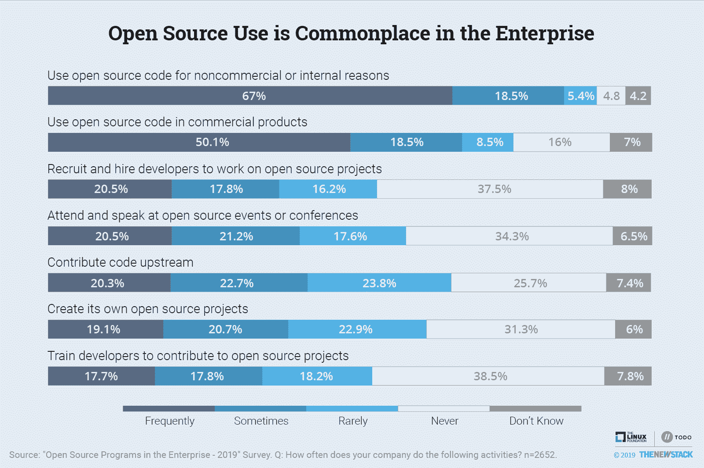
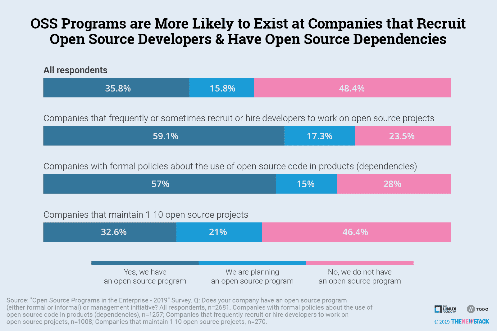
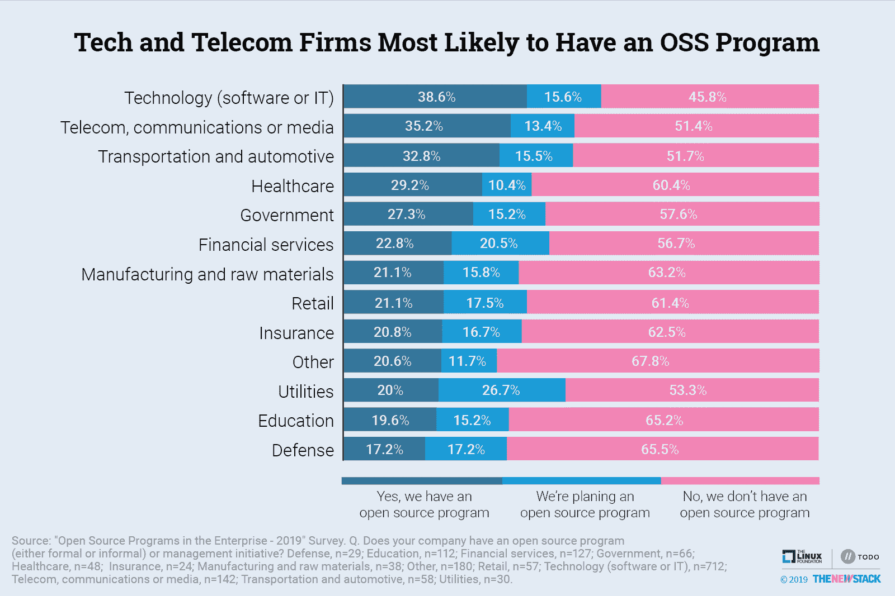
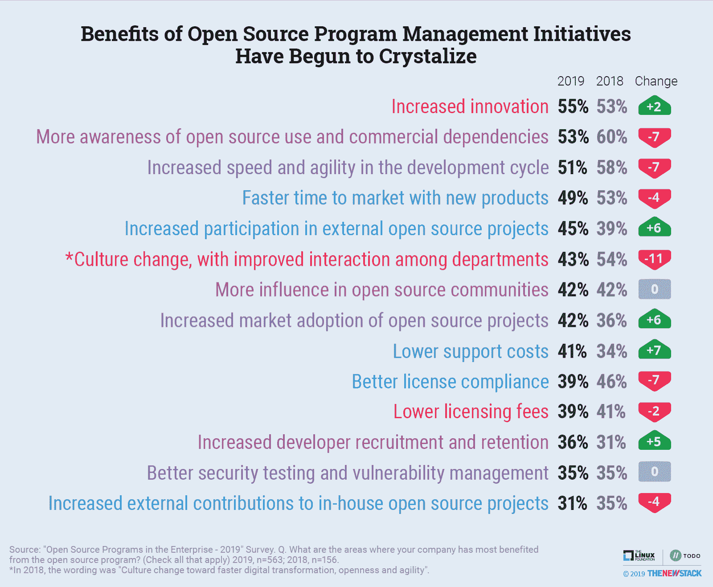
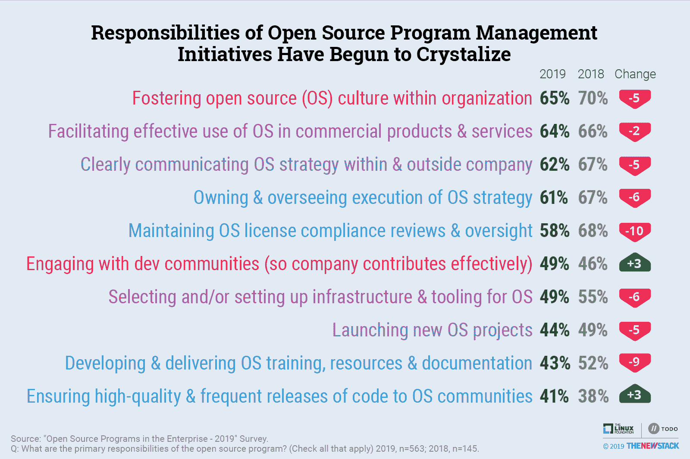
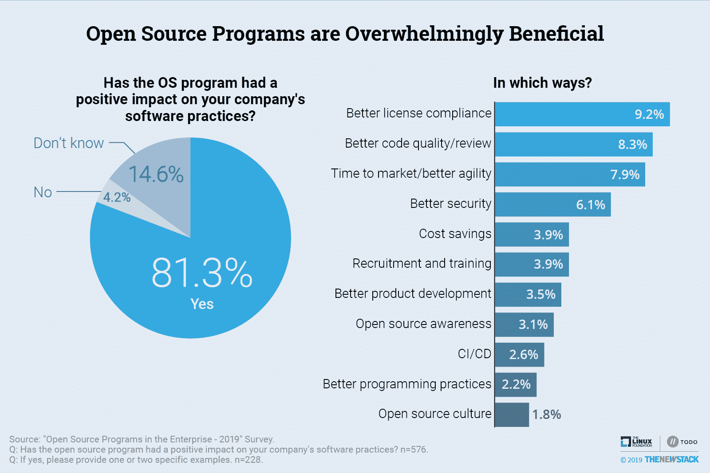
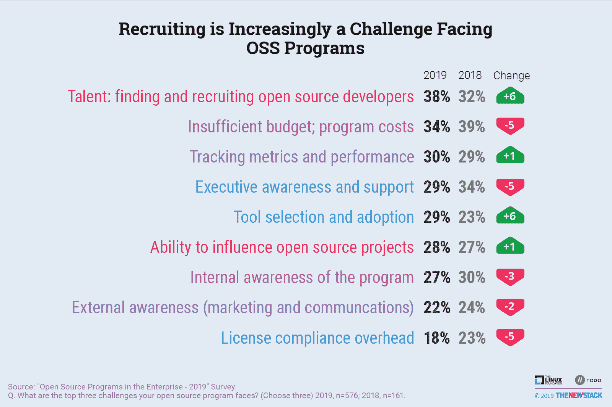
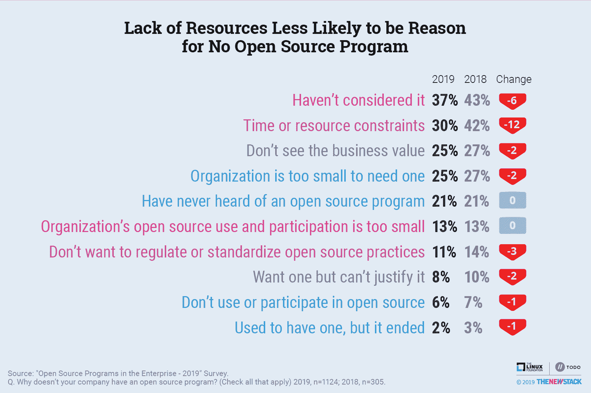
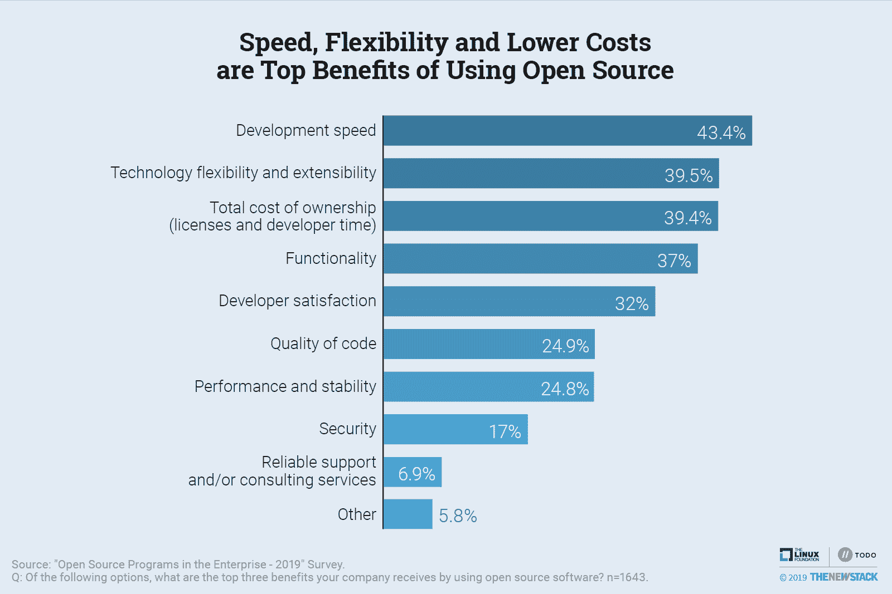
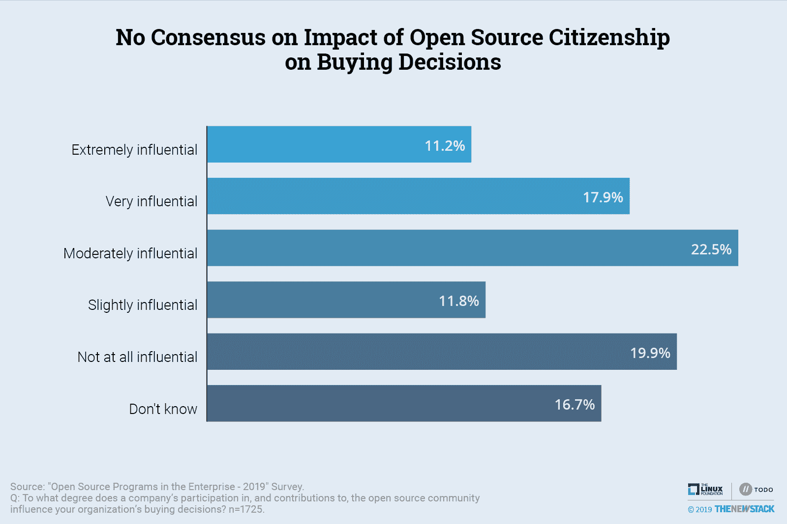

# 研究表明开源项目办公室改善了软件实践

> 原文：<https://thenewstack.io/research-shows-open-source-program-offices-improve-software-practices/>

使用开源软件是司空见惯的，只有少数公司倾向于专利优先的软件政策。自由和开放源码软件(FOSS)的支持者已经进入了采用开放源码的下一个阶段，在企业中扩大了 FOSS 的使用，并获得了与开放源码和云原生最佳实践相关的“数字化转型”好处。

各公司以及自由和开放源码软件的倡导者正在确定促进这些商业目标的最佳方式，同时保持多年来体现开放源码运动的非商业社区的精神和精神。

正如我们去年在[关于这个主题的第一次调查](/survey-open-source-programs-are-a-best-practice-among-large-companies/)中所了解到的，专门构建的项目办公室和不太正式的计划在帮助公司制定政策方面发挥着重要作用，这些政策将增加商业软件产品对开源组件的采用，促进[开源文化](https://thenewstack.io/open-source-culture-starts-with-programs-and-policies/)，并在开源社区中引导企业公民意识。

在 VMware 的共同赞助下，New Stack 与 Linux Foundation 的 [TODO Group](https://todogroup.org/) 合作进行了第二次年度“企业中的开源程序”调查，以调查这些开源程序如何以及是否成功。我们发现一个关于如何最好地管理和促进开源项目的共识正在形成。

超过 2，700 人参加了调查。公司规模具有广泛的代表性，21%的受访者在员工超过 10，000 人的大公司工作，39%的受访者来自员工不超过 250 人的中小型公司。开发人员和软件工程师占受访者的 43%，至少另有 36%的人从事 IT 相关的工作。

本文从研究的主要发现开始，接着是图表和分析，最后是对研究方法的讨论。

## 主要发现

*   **开源项目和计划的采用非常普遍，不仅限于早期采用者。在 2，700 名研究参与者中，超过一半(52%)的人有正式或非正式的项目，或者他们的公司正计划创建一个项目，这比去年减少了一个百分点。尽管该研究的样本量增加了两倍，但与去年相比，该研究的许多发现及其人口统计学特征仍然非常相似。我们认为这是对去年报告的确认。**
*   对开源项目管理的期望已经开始具体化。培养开源文化仍然是这些项目的首要责任。然而，结果显示，当定义为部门之间的互动而不是一般的数字化转型和敏捷性时，文化不太可能被视为一种好处。与去年相比，促进开源在商业产品和服务中的有效使用从第五位上升到第二位。
*   **雇佣开源开发者是一个更突出的问题。**在最新的研究中，开发者招募和保留作为开源计划的主要好处的提及率从 2018 年的 31%上升到 36%。42%计划开展项目的公司表示，他们至少有时会雇佣开发人员从事开源项目，高于 2018 年的 33%。
*   **代码质量与开源软件实践相关。**41%的 OSS 管理计划参与者表示，这些计划负责确保高质量和频繁地发布给开源社区。在开放式问题中，许多回答者讨论了 OSS 计划制定的代码审查过程如何对代码质量产生积极影响。
*   关于开源公民身份对购买决策的影响，目前还没有一致的意见。29%的人说他们对公司开源参与的看法对他们组织的购买决策有很大影响，但 32%的人说影响很小或根本没有影响。

## 开源在企业中仍然很常见

与去年相比，参加 2019 年调查的人数是去年的三倍多，但许多调查结果仍然保持一致。这表明，2018 年的结果没有被 Linux 基金会 TODO 组中早期采用者的显著过度代表所扭曲。换句话说，这项调查代表了广泛的跨部门企业，而不仅仅是那些已经被认为是志同道合的开源爱好者的紧密团体的一部分的企业。总的来说，数据的一致性提供了信心，认为这些发现不是自我选择偏差的结果。

超过 85%的受访者表示，他们的公司至少有时出于非商业或内部原因使用开源组件，这比去年的 88%有所下降。这种高水平的采用与许多其他研究的发现是一致的，即使那些不是开源的调查也是如此。69%的人至少有时在商业产品中使用开源代码，这一数字在科技公司中跃升至 83%。就像非商业用途一样，商业产品中开源的采用率实际上从前一年的 72%下降了。这些数字的稳定性表明，企业内部开放源码的下一个重大变化将是关于其使用范围和企业强调给予社区的程度。

科技公司对开源社区的参与度要高得多。例如，56%的科技公司受访者表示，他们的组织有时或经常向上游贡献代码，而在全部样本中，这一比例为 43%。

公司的规模也与其开源足迹相关。尽管大公司经常被指责不回馈开源社区，但数据却表明并非如此。拥有超过 10，000 名员工的组织经常在 41%的时间里向上游贡献代码，而只有 14%拥有 2 到 50 名员工的公司这样做。

最大的公司，其中许多是互联网规模的技术公司，有资源致力于可能不会直接产生收入的项目。尽管较小的公司经常在他们的商业产品中使用开源代码，但他们有时更关注自己公司的项目，而不是他们所依赖的项目。

## 对开源项目和计划的需求

总体而言，与去年相比，使用开源程序的调查比例(36%)保持不变。拥有开源程序或计划的调查受访者数量从 280 上升到 960，这表明去年的调查( [*开源程序是大公司的最佳实践*](https://thenewstack.io/survey-open-source-programs-are-a-best-practice-among-large-companies/) )并没有因为对早期采用者的过度抽样而出现偏差。

一般来说，拥有开源程序的公司在开源之旅中走得更远，通常会看到公司从仅仅消费开源代码转向实际贡献上游代码，然后最终启动和创建自己的项目。按照这种逻辑，毫不奇怪，就像去年一样，开源程序更有可能存在于那些也招募开源开发人员并在商业项目中包含开源依赖项的公司。

拥有 1 到 10 个开源项目的公司更有可能正在计划一个项目——21%的公司正在计划项目，而研究的平均值为 16%。展望未来，我们相信维护开源项目的公司将越来越认为开源项目是必不可少的。

随着今年样本量的增加，我们能够更加自信地评估开源项目在不同行业中的受欢迎程度。该研究中代表性最大的行业与技术和电信相关公司相比变化不大，与 2018 年相比下降了 1 个百分点和 2 个百分点。此外，大多数(79%)拥有超过 10，000 名员工的互联网规模的技术公司已经有了开源管理计划，与去年相比略有增加。

通常不试图将开源软件货币化的行业是最不可能拥有开源软件的行业，在国防、教育、保险、零售和制造业中，只有不到 22%的受访者表示有这些软件。

## 
拥有现有开源程序的公司

随着现有开源程序的成熟，人们对它们应该做什么越来越有共识。这种对程序在公司中角色的日益确定性导致许多答案选项中提到它们的用户百分比下降。这主要是因为对于几个“选择所有适用的”问题，勾选的复选框减少了约 10%。

越来越多的创新成为开源项目被引用最多的好处。较低的支持成本也更有可能被视为一种好处。然而，人们对该计划对开发速度和公司快速将新产品推向市场的能力的影响变得不那么乐观了。

由于开源项目的好处，文化变化急剧下降，但这主要是因为去年我们要求人们从数字化转型、开放和敏捷的角度来考虑文化变化。由于这些变化中的许多都包括在其他福利类别中，最新的研究只是询问文化变化如何改善部门之间的互动。

尽管越来越少的人认为这是一个好处，但是在一个组织中培养开源文化仍然是开源项目或计划的首要责任。促进开放源码在商业产品中的使用下降了，但实际上相对重要性上升了，从第五位上升到第二位。总的来说，开源项目正朝着开发人员社区的参与方向发展，并将参与外部项目视为对自身的一种益处。

维护操作系统许可证合规性审查和监督不太可能是开源项目的主要责任，从清单上的第 2 位上升到第 5 位。这并不意味着许可证合规性不那么重要。相反，越来越少的公司要求开源团队每天与法律和合规部门一起工作。

开源程序正在改善软件开发的处理方式。在回答我们的一个新问题时，81%的受访者表示他们的计划对他们公司的软件实践产生了积极的影响。在一个开放式的后续问题中，代码审查和许可证合规性流程被反复引用为作为该计划的直接结果而得到改进的具体实践。此外，代码质量和降低成本经常被认为是改进软件实践带来的具体好处。

虽然这些项目有许多积极因素，但也存在挑战。其中最大的挑战是寻找和招募开源开发者，这一挑战变得越来越困难，38%的人认为这是他们面临的最大挑战，高于去年的 32%。随着招聘越来越被视为一项计划的好处，在这一领域的执行也变得势在必行。

工具选择也成为一个挑战，尽管很少有人认为建立基础设施和工具是主要的责任。这可能是因为开源项目被要求决定公司应该投资哪些项目。

## 没有现有开源项目的公司

如前所述，计划创建 OSS 管理程序的公司越来越多地雇佣开发人员从事开源项目。此外，他们更可能将开发人员招聘和入职视为衡量成功的一种方式。他们看到期望值下降的一个领域是上市时间，他们认为这是开源项目的一个很好的关键绩效指标(KPI ),从 32%下降到 20%。那些拥有现有程序和人员规划程序的人越来越不希望开发速度本身就是开源程序的一个好处。

即使没有开源计划的人也很少反对创建一个。对开源项目的认知度有所提高，而与此同时，认为他们的公司将从开源项目中受益的人从 70%下降到 63%。然而，这也意味着没有计划的剩余公司更有可能接受开源程序。因此，那些甚至没有考虑这个选项的人从 2018 年的 43%下降到 2019 年的 37%。更重要的是，时间或资源限制是这一群体中 30%的人没有计划的原因，低于一年前的 42%。这些发现表明创建开源程序的障碍更少。

当被问及假设他们将如何创建一个程序时，许多人怀疑商业文化是否会支持开源，更不用说开源程序了。总的来说，有一个共识，即获得管理层的认可是至关重要的，可以通过进行成本效益分析或创建概念证明来实现。一个回答者建议这需要“首先在我的组织中开始一个开源项目，一旦完成，我们可以使用从这个项目中学到的最佳实践在我的组织中创建一个开源项目办公室。”

因此，前进的道路通常意味着从一个非正式的开源团队开始，然后在管理层接受后创建一个更正式的项目。

## 对开放源码的总体看法

我们要求参与者对开源的主要好处进行总体评价，并发现一些(但不是全部)与运营开源项目办公室的预期好处有关。开发速度、技术灵活性和总拥有成本是使用开源代码的三大好处，不管一个公司有没有开源项目办公室的计划。安全性和支持仍然不太可能被视为使用开源软件的最大好处。

安全和软件合规性是开源项目办公室正在帮助减轻与开源相关的一些棘手问题的领域。

我们预计越来越多的人会将代码质量视为开源的好处。41%的 OSS 管理计划参与者表示，这些计划负责确保高质量和频繁地发布给开源社区。虽然“质量”通常很难定义，但许多受访者表示，新制定的代码审查对他们公司的软件实践产生了具体的积极影响。

这项研究还提出了一系列关于开源企业公民的问题。尽管专家们大谈回报社区的重要性，但大多数人认为开源观念不会影响商业的成败。具体来说，32%的人说公司对开源社区的参与和贡献对他们组织的购买决策几乎没有影响，而 29%的人说这是一个非常有影响的因素。

一篇即将发表的后续文章将更详细地介绍我们对 11 家公司的开源公民身份的看法，包括在开源生态系统中对开源项目和计划的贡献、合作和领导。

## 接下来要找什么

除了深入了解对特定公司的看法之外，未来的文章将提供关于旨在支持开源贡献者的政策流行的细节。此外，我们将展示软件组合分析工具(如 GitLab、Sonatype)、代码库(如 GitHub、Bitbucket)和 FOSSology 和 ClearlyDefined 等组织推广的合规性方法的采用情况。

## 结论

开源软件的好处不可能一蹴而就，但是积极倡导开源的公司绝大多数都表示这些努力正在改善他们公司的软件实践。新的堆栈及其合作伙伴将继续评估这些和其他政策在促进开源项目的可持续发展及其独特的做事方式方面的有效性。希望我们的研究将使企业能够证明增加对软件维护者、贡献者和最终用户的健康社区的贡献是合理的。

## 方法学

收到了 2，700 多份答复，1，600 多人完成了调查。130 份回复被排除，因为它们似乎来自同一家公司(基于电子邮件地址、公司名称或 IP 地址)。数据清理使我们能够更自信地将数据解释为来自单个公司，而不仅仅是单个受访者。

该调查于 2019 年 7 月 8 日至 29 日进行。通过社交媒体和发送给 Linux 基金会、TODO Group 和新堆栈电子邮件列表的电子邮件向受访者征集意见。

完整的数据集[可以在这里](https://github.com/todogroup/survey/tree/master/2019)找到。

<svg xmlns:xlink="http://www.w3.org/1999/xlink" viewBox="0 0 68 31" version="1.1"><title>Group</title> <desc>Created with Sketch.</desc></svg>